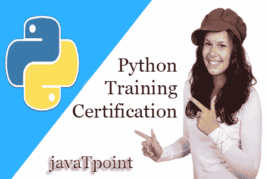

# Python 简介

> 原文：<https://www.javatpoint.com/python-tutorial>



Python 教程提供了 Python 的基本和高级概念。我们的 Python 教程是为初学者和专业人士设计的。

Python 是一种简单、通用、高级和面向对象的编程语言。

Python 也是一种解释脚本语言。 *Guido Van Rossum* 被称为 Python 编程的创始人。

我们的 Python 教程包括 Python 编程的所有主题，如安装、控制语句、[字符串](python-strings)、[列表](python-lists)、[元组](python-tuples)、[字典](python-dictionary)、[模块](python-modules)、[异常](python-exception-handling)、日期和时间、文件 I/O、程序等。还提供了 Python 面试问题，帮助您更好地理解 Python 编程。

## 什么是 Python

**Python** 是一种通用的、动态的、[高级的](classification-of-programming-languages)，并且经过解释的编程语言。它支持面向对象编程方法来开发应用。它简单易学，提供了大量的高级数据结构。

Python 是*易于学习*但功能强大且用途广泛的脚本语言，这使得它对应用开发很有吸引力。

Python 的语法和带有解释性质的*动态类型*使其成为脚本和快速应用开发的理想语言。

Python 支持*多种编程模式*，包括面向对象、命令式和函数式或过程式编程风格。

Python 不打算在特定的领域工作，比如 web 编程。这就是为什么它被称为*多用途*编程语言的原因，因为它可以与 web、企业、3D CAD 等一起使用。

我们不需要用数据类型来声明变量，因为它是*动态类型的*，所以我们可以写一个=10 来赋一个整型变量中的整数值。

Python 让开发调试*变快*是因为 Python 开发中没有包含编译步骤，编辑-测试-调试周期非常快。

## Python 2 对 Python 3

在大多数编程语言中，每当新版本发布时，它都支持该语言现有版本的功能和语法，因此，项目更容易在新版本中切换。但是，就 Python 而言，Python 2 和 Python 3 这两个版本彼此有很大的不同。

下面列出了 Python 2 和 Python 3 之间的差异:

1.  Python 2 使用**打印**作为语句，并用作打印“某物”在控制台上打印一些字符串。另一方面，Python 3 使用**打印**作为功能，并用作打印(“某物”)在控制台上打印某物。
2.  Python 2 使用函数 raw_input()接受用户的输入。它返回表示用户键入的值的字符串。要将其转换为整数，我们需要使用 Python 中的 int()函数。另一方面，Python 3 使用 input()函数，该函数自动解释用户输入的输入类型。但是，我们可以通过使用基元函数(int()，str()，等)将该值转换为任何类型。).
3.  在 Python 2 中，隐式字符串类型是 ASCII，而在 Python 3 中，隐式字符串类型是 Unicode。
4.  Python 3 不包含 Python 2 的 xrange()函数。xrange()是 range()函数的变体，它返回一个 xrange 对象，其工作方式类似于 Java 迭代器。range()返回一个列表，例如函数 range(0，3)包含 0，1，2。
5.  Python 3 中的异常处理也有一个小变化。它将一个关键字**定义为**，这是必须使用的。我们将在 Python 编程教程的异常处理部分讨论它。

## Python 历史

蟒蛇是由吉多·范·罗苏姆于 1991 年在荷兰 CWI 发明的。Python 编程语言的思想取自于 ABC 编程语言或者我们可以说 ABC 是 Python 语言的前身。

选择 Python 这个名字背后也有一个事实。吉多·范·罗苏姆是当时英国广播公司热门喜剧节目《巨蟒飞行马戏团》的粉丝。所以他决定为他新创建的编程语言选择名称 **Python** 。

Python 在世界各地拥有广泛的社区，并在短时间内发布其版本。

## 为什么要学 Python？

Python 为程序员提供了许多有用的特性。这些特点使它成为最受欢迎和广泛使用的语言。我们在下面列出了 Python 的几个基本特性。

*   易于使用和学习
*   表达性语言
*   解释语言
*   面向对象语言
*   开源语言
*   可扩张的
*   学习标准库
*   图形用户界面编程支持
*   完整的
*   可嵌入
*   动态存储分配
*   广泛的库和框架

## Python 在哪里使用？

Python 是一种通用的、流行的编程语言，它被用于几乎每个技术领域。下面给出了 Python 使用的各个领域。

*   数据科学
*   数据挖掘技术
*   桌面应用
*   基于控制台的应用
*   移动应用
*   软件开发
*   人工智能
*   网络应用
*   企业应用
*   三维计算机辅助设计应用
*   机器学习
*   计算机视觉或图像处理应用。
*   语音识别

## Python 基本语法

Python 编程语言中没有使用花括号或分号。这是一种类似英语的语言。但是 Python 使用缩进来定义一个代码块。缩进只不过是在需要时在语句前添加空白。**例如-**

```py
def func():
       statement 1
       statement 2
       …………………
       …………………
         statement N

```

在上面的例子中，从右到左的语句属于函数。通常，我们可以用四个空格来定义缩进。

## Python 第一程序

与其他编程语言不同，Python 提供了使用几行代码来执行代码的工具。**例如** -假设我们要用 Java 打印**《你好世界》**程序；打印它需要三行。

```py
public class HelloWorld {
 public static void main(String[] args){
// Prints "Hello, World" to the terminal window.
  System.out.println("Hello World");
 }
 }

```

另一方面，我们可以使用 Python 中的一条语句来实现这一点。

```py
print("Hello World")

```

这两个程序将打印相同的结果，但它只需要一条语句，而不使用 Python 中的分号或大括号。

## Python 流行框架和库

Python 拥有广泛的库和框架，广泛应用于机器学习、人工智能、web 应用等各个领域。我们定义一些流行的 Python 框架和库如下。

*   **Web 开发(服务器端)-** Django Flask，金字塔，CherryPy
*   **基于 GUI 的应用-** Tk、PyGTK、PyQt、PyJs 等。
*   **机器学习-** 张量洛、PyTorch、 **Scikit-learn** 、Matplotlib、Scipy 等。
*   **数学-** Numpy，熊猫等。

## Python 打印()函数

**print()** 功能向标准输出设备(屏幕)或文本流文件显示给定对象。

与其他编程语言不同，Python **print()** 函数是最独特、最通用的函数。

**print()** 函数的语法如下。

```py
print(*objects, sep=' ', end='\n', file=sys.stdout, flush=False)

```

让我们一个一个解释它的参数。

*   **对象-** 对象只不过是需要打印的语句。*符号表示可以有多个语句。
*   **sep-****sep**参数分隔打印值。默认值为“”。
*   **end -** 语句中最后打印 **end** 。
*   **文件-** 必须是写(字符串)方法的对象。
*   **刷新-** 如果为真，则强制刷新流或文件。默认情况下，它的值为 false。

让我们理解下面的例子。

### 示例- 1:返回值

```py
print("Welcome to javaTpoint.")

a = 10
# Two objects are passed in print() function
print("a =", a)

b = a
# Three objects are passed in print function
print('a =', a, '= b')

```

**输出:**

```py
Welcome to javaTpoint.
a = 10
a = 10 = b

```

从上面的输出中我们可以看到，可以在单个 **print()** 语句中打印多个对象。我们只需要用逗号(，)来分隔彼此。

### 示例- 2:使用 sep 和 end 参数

```py
a = 10
print("a =", a, sep='dddd', end='\n\n\n')
print("a =", a, sep='0', end='$$$$$')

```

**输出:**

```py
a =dddd10

a =010$$$$$

```

在第一个 **print()** 语句中，我们使用了 **sep** 和 **end** 参数。给定对象刚好在**9**值之后打印。打印在给定对象最后的结束参数值。我们可以看到，第二个 **print()** 函数打印了三条黑线后的结果。

## 向用户输入

Python 提供了**输入()**功能，用于接受用户的输入。让我们理解下面的例子。

**示例-**

```py
name = input("Enter a name of student:")
print("The student name is: ", name)

```

**输出:**

```py
Enter a name of student: Devansh
The student name is:   Devansh

```

默认情况下， **input()** 函数接受字符串输入，但是如果我们想接受其他数据类型作为输入呢？

如果我们想把输入当成一个整数，我们需要把 **input()** 函数打造成一个整数。

**例如-**

**示例-**

```py
a  = int(input("Enter first number: "))
b = int(input("Enter second number: "))

print(a+b)

```

**输出:**

```py
Enter first number: 50
Enter second number: 100
150

```

我们可以使用**输入()**函数获取任何类型的值。

## Python 运算符

运算符是对 Python 对象执行各种操作的符号。Python 操作符是处理 Python 数据类型的最基本要素。此外，Python 还提供了标识成员和按位运算符。我们将在下面的教程中通过合适的例子学习所有这些操作符。

*   **Python 运算符**

## Python 条件语句

条件语句帮助我们为特定的条件执行特定的块。在本教程中，我们将学习如何使用条件表达式来执行不同的语句块。Python 提供了 if 和 else 关键字来设置逻辑条件。elif 关键字也用作条件语句。

*   **蟒若..else 语句**

## Python 循环

有时我们可能需要改变程序的流程。特定代码的执行可能需要重复几次。为此，编程语言提供了各种类型的循环，能够多次重复某些特定的代码。考虑下面的教程来详细理解这些语句。

*   **Python 循环**
*   **Python For Loop**
*   **Python While Loop**

## Python 数据结构

数据结构是指可以将一些数据保存在一起的结构，或者我们说它们是用来以有组织的方式存储数据的。Python 提供了内置的数据结构，如**列表、元组、字典和集合**。我们可以使用数据结构执行复杂的任务。

### Python 列表

Python 列表保存有序的项目集合。我们可以在列表中存储一系列项目。Python 列表是可变的，这意味着它可以在创建后进行修改。列表项目包含在方括号[]内，用逗号分隔。让我们看看列表的例子。

```py
L1 = ["John", 102, "USA"]    
L2 = [1, 2, 3, 4, 5, 6]   

```

如果我们尝试使用 **type()** 函数打印 L1、L2 和 L3 的类型，那么它将显示为一个列表。

```py
print(type(L1))  
print(type(L2))  

```

**输出:**

```py
<class 'list'>
<class 'list'>

```

要了解有关 list 的更多信息，请访问以下教程。

*   **Python 列表**
*   **Python 列表函数**

### Python 元组

Python Tuple 用于存储不可变 Python 对象的序列。元组类似于列表，因为存储在列表中的项目的值可以改变，而元组是不可变的，并且存储在元组中的项目的值不能改变。

元组可以定义如下

**示例-**

```py
tup = ("Apple", "Mango" , "Orange" , "Banana")
print(type(tup))
print(tup)

```

**输出:**

```py
<class 'tuple'>
('Apple', 'Mango', 'Orange', 'Banana')

```

如果我们试图向元组中添加新的，它将抛出一个错误。

**示例-**

```py
tup = ("Apple", "Mango" , "Orange" , "Banana")

tup[2] = "Papaya"
print(tup)

```

**输出:**

```py
Traceback (most recent call last):
  File "C:/Users/DEVANSH SHARMA/PycharmProjects/Hello/gamewithturtle.py", line 3, in tup[2] = "Papaya"
TypeError: 'tuple' object does not support item assignment 
```

上面的程序抛出了一个错误，因为元组是不可变的类型。要了解更多关于元组的信息，请访问 Python 元组。

*   **Python 元组**

### Python 字符串

Python 字符串是一个字符序列。它是由单引号、双引号或三引号括起来的字符的集合。它也可以定义为 Unicode 字符的集合。我们可以如下创建一个字符串。

**示例-**

```py
# Creating string using double quotes
str1 = "Hi Python"
print(str1)
# Creating string using single quotes
str1 = 'Hi Python'
print(str1)
# Creating string using triple quotes
str1 = '''Hi Python'''
print(str1)

```

**输出:**

```py
Hi Python
Hi Python
Hi Python

```

Python 不支持字符数据类型。写为“p”的单个字符被视为长度为 1 的字符串。

刺痛也是不可改变的。声明后我们不能改变。要了解有关字符串的更多信息，请访问以下教程。

*   **蟒蛇串**
*   **蟒蛇串法**

### 字典

Python 字典是一种最高效的数据结构，用于存储大量数据。它以键值对格式存储数据。每个值都与其键相对应地存储。

键必须是唯一的，值可以是任何类型，如整数、列表、元组等。

它是一个可变类型；我们可以在它创建后重新分配。下面是用 Python 创建字典的例子。

**示例-**

```py
employee = {"Name": "John", "Age": 29, "salary":250000,"Company":"GOOGLE"}    
print(type(employee))    
print("printing Employee data .... ")    
print(employee)

```

**输出:**

```py
<class 'dict'>
Printing Employee data .... 
{'Name': 'John', 'Age': 29, 'salary': 250000, 'Company': 'GOOGLE'}

```

空花括号{}用于创建空字典。要了解更多信息，请访问字典的完整教程。

*   **Python 字典**
*   **Python 字典方法**

### Python 集

Python 集是无序元素的集合。集合中的每个元素必须是唯一且不可变的。集合是可变的，这意味着我们可以在整个程序中随时修改。让我们了解一下用 Python 创建集合的例子。

**示例-**

```py
# Creating Set
Month = {"January", "February", "March", "April", "May", "June", "July"}
print(Month)
print(type(Month))

```

**输出:**

```py
{'March', 'July', 'April', 'May', 'June', 'February', 'January'}
<class 'set'>

```

要获得关于器械包的更多信息，请访问以下资源。

*   **蟒蛇套装**
*   **Python 设置方法**

## Python 函数式编程

Python 教程的这一部分定义了一些与函数式编程相关的重要工具，比如 **lambda 和递归函数**。这些功能在完成复杂任务时非常有效。我们定义了几个重要的功能，比如**减少、映射、**和**过滤。** Python 提供了包含各种**功能编程工具**的**功能工具**模块。请访问下面的教程，了解更多关于函数式编程的知识。

*   Python 函数
*   Python 映射()函数
*   Python 过滤器()函数
*   Python reduce()函数
*   python functools 模块
*   Python 函数

## Python 文件输入/输出

文件用于在计算机磁盘中存储数据。在本教程中，我们将解释 Python 的内置文件对象。我们可以使用 Python 脚本打开一个文件，并执行各种操作，如写入、读取和追加。打开文件有多种方法。我们用相关的例子来解释。我们还将学习对二进制文件执行读/写操作。

*   **Python 文件输入输出**

## Python 模块

Python 模块是包含 Python 代码或函数的程序文件。Python 中有两种类型的模块——用户定义模块和内置模块。用户定义的模块，或者我们可以说我们的 Python 代码是用**保存的。py** 扩展，被视为用户自定义模块。

内置模块是 Python 的预定义模块。为了使用模块的功能，我们需要将它们导入到我们当前的工作程序中。

*   **Python 模块**

## Python 异常

异常可以定义为程序中导致程序流程中断的异常情况。

每当出现异常时，程序就会停止执行，因此不会执行下一个代码。因此，一个例外是无法处理 Python 脚本的运行时错误。异常是表示错误的 Python 对象。

*   **Python 异常**

## Python CSV 文件

A **csv** 代表“逗号分隔值”，它被定义为一种简单的文件格式，使用特定的结构来排列表格数据。它以纯文本形式存储表格数据，如电子表格或数据库，并具有通用的数据交换格式。一个 **csv** 文件打开到 excel 表中，行和列数据定义了标准格式。请访问以下教程，详细了解 CSV 模块。

*   **Python 读取 CSV 文件**
*   **Python 编写 CSV 文件**

## Python 发送邮件

我们可以使用 Python 脚本发送或阅读邮件。Python 的标准库模块对于处理各种协议很有用，比如 PoP3 和 IMAP。我们将从 Python 脚本中学习如何使用流行的电子邮件服务 SMTP 发送邮件。

*   **Python 发送邮件**

## Python 魔术方法

Python 魔法方法被定义为给类增加“魔法”的特殊方法。它以双下划线开始和结束，例如， **_init_** 或 **_str_。**

内置类定义了许多神奇的方法。 **dir()** 函数可以用来查看一个类继承的魔法方法的数量。它在方法名中有两个前缀和后缀下划线。

*   **蟒蛇魔法**

## Python 糟糕的概念

Python 中的一切都被视为一个对象，包括整数值、浮点、函数、类和无。除此之外，Python 支持所有面向概念。下面是 Python 的 oops 概念的简要介绍。

*   **类和对象-** Python 类是对象的蓝图。对象是数据和作用于数据的方法的集合。
*   **继承-** 继承是一种技术，其中一个类继承其他类的属性。
*   **构造函数-** Python 提供了一种特殊的方法 **__init__()** ，被称为构造函数。当对象实例化时，会自动调用此方法。
*   **数据成员-** 保存与类及其对象相关联的数据的变量。

要详细阅读 oops 概念，请访问以下资源。

*   **Python 哎呀概念**
*   **Python 对象和类**
*   **Python 构造器**
*   **Python 继承**
*   **Python 多态性**

## Python 高级主题

Python 包含许多先进而有用的概念，可以帮助程序员解决复杂的任务。这些概念在下面给出。

### Python 迭代器

迭代器只是一个可以迭代的对象。它一次返回一个对象。可以使用两种特殊的方法来实现， **__iter__()和 __next__()** 。

要了解更多关于迭代器的信息，请访问我们的 **Python 迭代器**教程。

### Python 生成器

生成器是创建迭代器最简单的方法。要了解更多信息，请访问我们的 **Python 生成器**教程。

### Python 装饰器

这些用于修改函数的行为。装饰者提供了包装另一个函数的灵活性，以扩展包装函数的工作，而无需永久修改它。

要了解更多信息，请访问 **Python 装饰器**教程。

## Python 数据库连接

我们可以使用各种数据库和 Python。您可以通过访问下面的资源来学习完整的教程。Python DBI-API 认可标准功能集，这些功能集将包含在各个关系数据库管理系统产品的数据库连接模块中。我们使用 Python DBI 应用编程接口解释所有重要的数据库连接。

### python 语言

环境设置

数据库连接

创建新数据库

创建表格

插入操作

读取操作

更新操作

加入操作

执行交易

### Python MongoDB

Python MongoDB

### Python SQLite

Python SQLite

## Python CGI

Python CGI 代表**“公共网关接口”，**，用于定义如何在网络服务器和自定义 Python 脚本之间交换信息。**通用网关接口**是外部网关程序与服务器接口的标准，如 HTTP 服务器。要了解更多关于 Python CGI 的信息，请访问下面的教程。

*   **Python CGI**

## 先决条件

在学习 Python 之前，您必须具备编程概念的基本知识。

## 观众

我们的 Python 教程旨在帮助初学者和专业人士。

## 问题

我们保证您在本 Python 教程中不会发现任何问题。但是如果有任何错误，请在联系表格中发布问题。

* * *