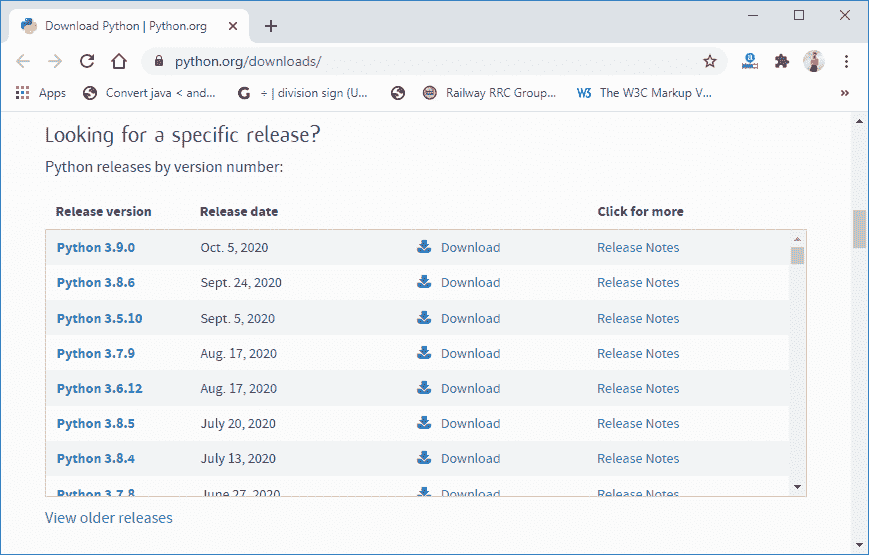
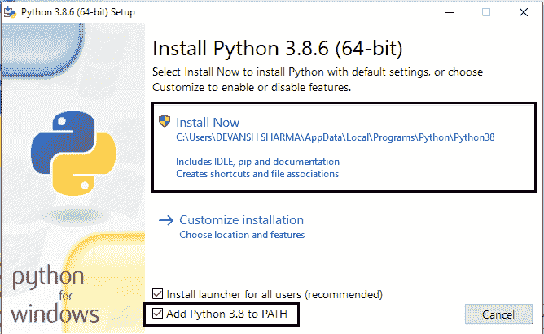
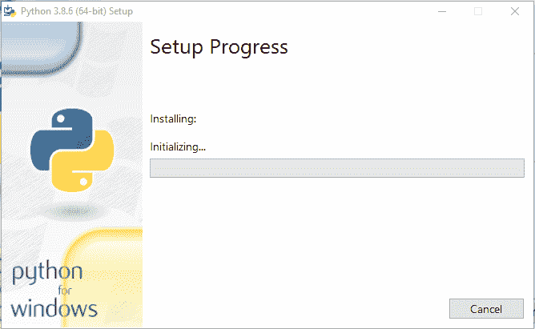
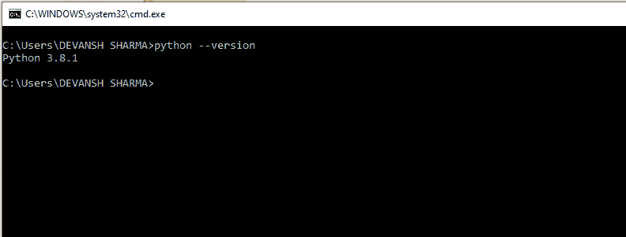

# 如何安装 Python（环境设置）

> 原文：<https://www.javatpoint.com/how-to-install-python>

要成为 Python 开发人员，第一步是学习如何在本地机器或计算机上安装或更新 Python。在本教程中，我们将讨论 Python 在各种操作系统上的安装。

## 在 Windows 上安装

访问链接[*【https://www.python.org/downloads/】*](https://www.python.org/downloads/)下载最新发布的 [Python](https://www.javatpoint.com/python-tutorial) 。在这个过程中，我们将在我们的 [Windows 操作系统](https://www.javatpoint.com/windows)上安装 Python 3.8.6。当我们点击上面的链接，它会给我们带来下面的页面。

**第一步:选择要下载的 Python 版本。**

点击下载按钮。

**第 2 步:点击立即安装**

双击下载的可执行文件；将打开以下窗口。选择自定义安装并继续。点击添加路径复选框，将自动设置 Python 路径。

我们还可以点击定制安装来选择所需的位置和功能。其他重要的事情是安装启动器，所有用户必须检查。

**步骤 3 安装过程中**

现在，尝试在命令提示符下运行 python。如果是 python3，请键入命令 python -version。

我们已经准备好使用 Python 了。

## 在苹果电脑上安装

要在 MacOS 上安装 python3，请访问链接[*【https://www.javatpoint.com/how-to-install-python-on-mac】*](how-to-install-python-on-mac)，并按照教程中给出的说明进行操作。

* * *

## 在 CentOS 上安装

要在 CentOS 上安装 Python3，请访问链接[*【https://www.javatpoint.com/how-to-install-python-on-centos】*](how-to-install-python-on-centos)，并按照教程中给出的说明进行操作。

* * *

## Ubuntu 上的安装

要在 Ubuntu 上安装 Python3，请访问链接[*【https://www.javatpoint.com/how-to-install-python-in-ubuntu】*](how-to-install-python-in-ubuntu)，并按照教程中给出的说明进行操作。

* * *