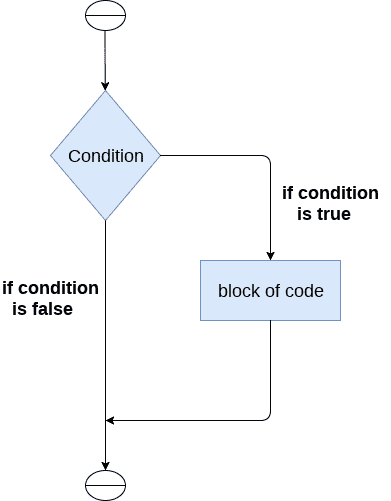
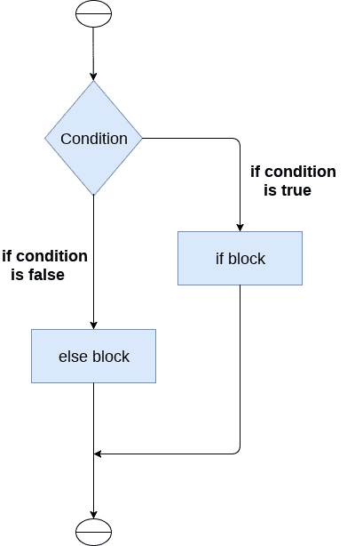
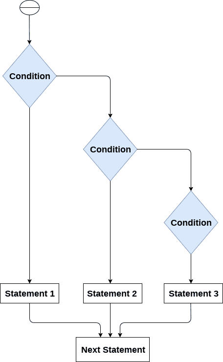

# Python `If-else`语句

> 原文：<https://www.javatpoint.com/python-if-else>

决策是几乎所有编程语言中最重要的方面。顾名思义，决策允许我们为特定的决策运行特定的代码块。在这里，决策是根据特定条件的有效性做出的。条件检查是决策的支柱。

在 python 中，决策由以下语句执行。

| 声明 | 描述 |
| 如果语句 | `if`语句用于测试特定条件。如果条件为真，将执行一个代码块(if-block)。 |
| If - else 语句 | `If-else`语句类似于 `if`语句，除了它还为要检查的条件的 false 情况提供代码块。如果 `if`语句中提供的条件为 false，则将执行 else 语句。 |
| 嵌套 `if`语句 | 嵌套的 `if`语句使我们能够使用 if。外部 `if`语句中的 else 语句。 |

## Python 中的缩进

为了便于编程和实现简单性，python 不允许在块级代码中使用括号。在 Python 中，缩进用于声明一个块。如果两个语句处于相同的缩进级别，那么它们就是同一个块的一部分。

一般来说，四个空格用来缩进语句，这是 python 中典型的缩进量。

缩进是 python 语言中最常用的部分，因为它声明了代码块。一个块的所有语句都位于同一缩进级别。我们将在 python 中看到实际的缩进是如何在决策和其他事情中发生的。

## `if`语句

`if`语句用于测试特定条件，如果条件为真，它将执行一个称为 if-block 的代码块。`if`语句的条件可以是任何有效的逻辑表达式，可以计算为真或假。



`if`语句的语法如下。

```py
if expression:
	statement

```

### 例 1

```py
num = int(input("enter the number?"))
if num%2 == 0:
    print("Number is even")

```

**输出:**

```py
enter the number?10
Number is even

```

### 示例 2:打印三个数字中最大的一个的程序。

```py
a = int(input("Enter a? "));
b = int(input("Enter b? "));
c = int(input("Enter c? "));
if a>b and a>c:
    print("a is largest");
if b>a and b>c:
    print("b is largest");
if c>a and c>b:
    print("c is largest");

```

**输出:**

```py
Enter a? 100
Enter b? 120
Enter c? 130
c is largest

```

* * *

## `If-else`语句

`If-else`语句提供了一个与 `if`语句相结合的 else 块，它在条件为 false 的情况下执行。

如果条件为真，则执行 If 块。否则，执行 else 块。



`If-else`语句的语法如下。

```py
if condition:
	#block of statements 
else: 
	#another block of statements (else-block) 

```

### 例 1:检查一个人是否有资格投票的程序。

```py
age = int (input("Enter your age? "))
if age>=18:
    print("You are eligible to vote !!");
else:
    print("Sorry! you have to wait !!");

```

**输出:**

```py
Enter your age? 90
You are eligible to vote !!

```

### 例 2:检查一个数是否为偶数的程序。

```py
num = int(input("enter the number?"))
if num%2 == 0:
    print("Number is even...")
else:
    print("Number is odd...")

```

**输出:**

```py
enter the number?10
Number is even

```

* * *

## elif 声明

`elif`语句使我们能够检查多个条件，并根据其中的真实条件执行特定的语句块。根据我们的需要，我们的程序中可以有任意数量的 `elif`语句。但是，使用 elif 是可选的。

`elif`语句的工作方式类似于 c 语言中的 if-else-if 梯形语句。它必须由 `if`语句继承。

`elif`语句的语法如下。

```py
if expression 1: 
	# block of statements 

elif expression 2: 
	# block of statements 

elif expression 3: 
	# block of statements 

else: 
	# block of statements

```



### 例 1

```py
number = int(input("Enter the number?"))
if number==10:
    print("number is equals to 10")
elif number==50:
    print("number is equal to 50");
elif number==100:
    print("number is equal to 100");
else:
    print("number is not equal to 10, 50 or 100");

```

**输出:**

```py
Enter the number?15
number is not equal to 10, 50 or 100

```

### 例 2

```py
 marks = int(input("Enter the marks? "))
if marks > 85 and marks <= 100:
    print("Congrats ! you scored grade A ...")
elif marks > 60 and marks <= 85:
    print("You scored grade B + ...")
elif marks > 40 and marks <= 60:
    print("You scored grade B ...")
elif (marks > 30 and marks <= 40):
    print("You scored grade C ...")
else:
    print("Sorry you are fail ?")

```