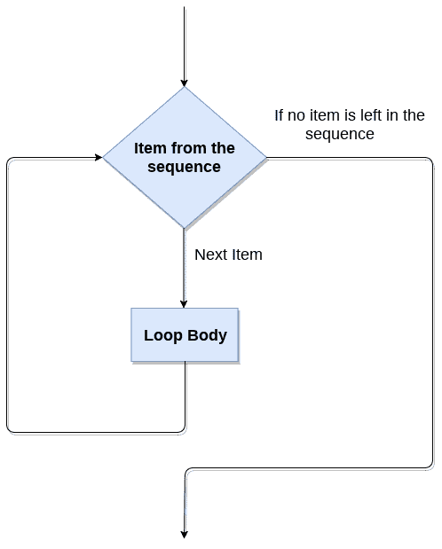

# Python `for`循环

> 原文：<https://www.javatpoint.com/python-for-loop>

Python 中的 for **循环**用于多次迭代语句或程序的一部分。它经常用于遍历数据结构，如列表、元组或字典。

下面给出了 python 中 `for`循环的语法。

```py

for iterating_var in sequence:  
    statement(s)  

```

### `for`循环流程图



### 对于使用序列的循环

**示例-1:迭代用于循环的字符串**

```py

str = "Python"
for i in str:
    print(i)

```

**输出:**

```py
P
y
t
h
o
n

```

**例- 2:打印给定编号表格的程序。**

```py

list = [1,2,3,4,5,6,7,8,9,10]
n = 5
for i in list:
    c = n*i
    print(c)

```

**输出:**

```py
5
10
15
20
25
30
35
40
45
50s

```

**例-4:打印给定列表总和的程序。**

```py

list = [10,30,23,43,65,12]
sum = 0
for i in list:
    sum = sum+i
print("The sum is:",sum)

```

**输出:**

```py
The sum is: 183

```

### 对于使用范围()函数的循环

**范围()功能**

**范围()**功能用于生成数字序列。如果我们通过范围(10)，它将生成从 0 到 9 的数字。range()函数的语法如下。

**语法:**

```py

range(start,stop,step size)

```

*   开始代表迭代的开始。
*   stop 表示循环将迭代到 stop-1。**范围(1，5)** 将生成 1 到 4 次迭代。它是可选的。
*   步长用于跳过迭代中的特定数字。可以选择使用。默认情况下，步长为 1。它是可选的。

请考虑以下示例:

**示例-1:按顺序打印数字的程序。**

```py

for i in range(10):
    print(i,end = ' ')

```

**输出:**

```py
0 1 2 3 4 5 6 7 8 9 

```

**例- 2:打印给定编号表格的程序。**

```py

n = int(input("Enter the number "))
for i in range(1,11):
    c = n*i
    print(n,"*",i,"=",c)

```

**输出:**

```py
Enter the number 10
10 * 1 = 10
10 * 2 = 20
10 * 3 = 30
10 * 4 = 40
10 * 5 = 50
10 * 6 = 60
10 * 7 = 70
10 * 8 = 80
10 * 9 = 90
10 * 10 = 100

```

**示例-3:使用步长范围()打印偶数的程序。**

```py

n = int(input("Enter the number "))
for i in range(2,n,2):
    print(i)

```

**输出:**

```py
Enter the number 20
2
4
6
8
10
12
14
16
18

```

我们也可以使用带有数字序列的 **range()** 函数。 **len()** 函数与 range()函数相结合，后者使用索引遍历序列。考虑下面的例子。

```py

list = ['Peter','Joseph','Ricky','Devansh']
for i in range(len(list)):
    print("Hello",list[i])

```

**输出:**

```py
Hello Peter
Hello Joseph
Hello Ricky
Hello Devansh

```

## python 中的嵌套 `for`循环

Python 允许我们将任意数量的 `for`循环嵌套在 **for** 循环中。对于外部循环的每次迭代，内部循环被执行 n 次。语法如下。

**语法**

```py

for iterating_var1 in sequence:  #outer loop
    for iterating_var2 in sequence:  #inner loop
        #block of statements   
#Other statements  

```

## 示例- 1:循环嵌套

```py

# User input for number of rows
rows = int(input("Enter the rows:"))
# Outer loop will print number of rows
for i in range(0,rows+1):
# Inner loop will print number of Astrisk
    for j in range(i):
        print("*",end = '')
    print()

```

**输出:**

```py
Enter the rows:5
*
**
***
****
*****

```

### 示例-2:数字金字塔程序。

```py

rows = int(input("Enter the rows"))
for i in range(0,rows+1):
    for j in range(i):
        print(i,end = '')
    print()

```

**输出:**

```py
1
22
333
4444
55555

```

## 将 else 语句与 `for`循环一起使用

与 C、C++或 Java 等其他语言不同，Python 允许我们将 else 语句与 `for`循环一起使用，该循环只能在所有迭代都用尽时执行。这里，我们必须注意到，如果循环包含任何 `break`语句，那么 else 语句将不会被执行。

## 例 1

```py

for i in range(0,5):  
    print(i)  
else:
    print("for loop completely exhausted, since there is no break.")

```

**输出:**

```py
0
1
2
3
4
for loop completely exhausted, since there is no break.

```

`for`循环完全耗尽，因为没有中断。

## 例 2

```py

for i in range(0,5):  
    print(i)  
    break;  
else:print("for loop is exhausted");  
print("The loop is broken due to break statement...came out of the loop")  

```

在上面的例子中，循环由于 `break`语句而中断；因此，else 语句不会被执行。将执行紧挨着 else 块的语句。

**输出:**

```py
0

```

由于 `break`语句，循环中断...脱离了循环。我们将在下一个教程中了解更多关于 `break`语句的信息。

* * *