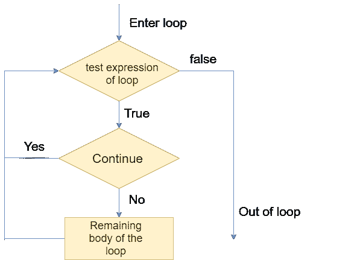

# Python `continue`语句

> 原文：<https://www.javatpoint.com/python-continue>

Python 中的 `continue`语句用于将程序控制带到循环的开始。`continue`语句跳过循环中剩余的代码行，并从下一次迭代开始。它主要用于循环中的特定条件，以便我们可以跳过特定条件的某些特定代码。Python 中的 `continue`语句用于将程序控制带到循环的开始。`continue`语句跳过循环中剩余的代码行，并从下一次迭代开始。它主要用于循环中的特定条件，以便我们可以跳过特定条件的某些特定代码。

### 句法

```py
#loop statements  
continue
#the code to be skipped   

```

### 流程图



考虑下面的例子。

### 例 1

```py
i = 0                   
while(i < 10):              
   i = i+1
   if(i == 5):
      continue
   print(i)

```

**输出:**

```py
1
2
3
4
6
7
8
9
10

```

观察上述代码的输出，值 5 被跳过，因为我们在 `While`循环中提供了使用 **`continue`语句**的 **if 条件**。当它与给定的条件匹配时，控制转移到 `While`循环的开始，并跳过代码中的值 5。

让我们看另一个例子:

### 例 2

```py
str = "JavaTpoint"
for i in str:
    if(i == 'T'):
        continue
    print(i)

```

**输出:**

```py
J
a
v
a
p
o
i
n
t

```

## 通过声明

pass 语句是一个空操作，因为当它被执行时什么都不会发生。它用于在语法上需要一条语句，但我们不想在它的位置使用任何可执行语句的情况。

例如，它可以在子类中重写父类方法时使用，但不想在子类中给出它的具体实现。

Pass 也用于代码将被写入某处但尚未写入程序文件的地方。考虑下面的例子。

### 例子

```py
list = [1,2,3,4,5]  
flag = 0  
for i in list:  
    print("Current element:",i,end=" ");  
    if i==3:  
        pass  
        print("\nWe are inside pass block\n");  
        flag = 1  
    if flag==1:  
        print("\nCame out of pass\n");  
        flag=0 

```

**输出:**

```py
Current element: 1 Current element: 2 Current element: 3 
We are inside pass block

Came out of pass

Current element: 4 Current element: 5 

```

我们将在下一个教程中了解有关 pass 语句的更多信息。

* * *