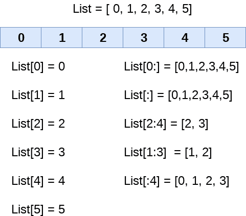

# Python 列表

> 原文：<https://www.javatpoint.com/python-lists>

Python 中的列表用于存储各种类型数据的序列。Python 列表是可变类型的，这意味着我们可以在它创建后修改它的元素。然而，Python 由六种能够存储序列的数据类型组成，但最常见和最可靠的类型是列表。

列表可以定义为不同类型的值或项的集合。列表中的项目用逗号(，)分隔，并用方括号[]括起来。

列表可以定义如下

```py

L1 = ["John", 102, "USA"]  
L2 = [1, 2, 3, 4, 5, 6] 

```

如果我们尝试使用 type()函数打印 L1、L2 和 L3 的类型，那么它将显示为一个列表。

```py

print(type(L1))
print(type(L2))

```

**输出:**

```py
<class 'list'>
<class 'list'>

```

### 列表的特征

该列表具有以下特征:

*   名单是有序的。
*   列表的元素可以通过索引来访问。
*   列表是可变类型的。
*   列表是可变类型。
*   列表可以存储各种元素的数量。

让我们检查第一个陈述，列表是有序的。

```py

a = [1,2,"Peter",4.50,"Ricky",5,6]
b = [1,2,5,"Peter",4.50,"Ricky",6]
a ==b

```

**输出:**

```py
False

```

两个列表都由相同的元素组成，但是第二个列表改变了第五个元素的索引位置，这违反了列表的顺序。当比较两个列表时，它返回 false。

列表在生存期内保持元素的顺序。这就是为什么它是有序的对象集合。

```py

a = [1, 2,"Peter", 4.50,"Ricky",5, 6]
b = [1, 2,"Peter", 4.50,"Ricky",5, 6]
a == b

```

**输出:**

```py
True

```

让我们详细看一下列表示例。

```py

emp = ["John", 102, "USA"]   
Dep1 = ["CS",10]
Dep2 = ["IT",11]  
HOD_CS = [10,"Mr. Holding"]  
HOD_IT = [11, "Mr. Bewon"]  
print("printing employee data...")  
print("Name : %s, ID: %d, Country: %s"%(emp[0],emp[1],emp[2]))  
print("printing departments...") 
print("Department 1:\nName: %s, ID: %d\nDepartment 2:\nName: %s, ID: %s"%(Dep1[0],Dep2[1],Dep2[0],Dep2[1]))  
print("HOD Details ....")  
print("CS HOD Name: %s, Id: %d"%(HOD_CS[1],HOD_CS[0]))  
print("IT HOD Name: %s, Id: %d"%(HOD_IT[1],HOD_IT[0]))  
print(type(emp),type(Dep1),type(Dep2),type(HOD_CS),type(HOD_IT))

```

**输出:**

```py
printing employee data...
Name : John, ID: 102, Country: USA
printing departments...
Department 1:
Name: CS, ID: 11
Department 2:
Name: IT, ID: 11
HOD Details ....
CS HOD Name: Mr. Holding, Id: 10
IT HOD Name: Mr. Bewon, Id: 11
<class 'list'> <class 'list'> <class 'list'> <class 'list'> <class 'list'>

```

在上面的例子中，我们创建了包含员工和部门详细信息的列表，并打印了相应的详细信息。观察上面的代码，更好地理解列表的概念。

## 列表索引和拆分

索引的处理方式与字符串的处理方式相同。可以使用 slice 运算符[]访问列表的元素。

索引从 0 开始，长度为- 1。列表的第一个元素存储在第 0 个索引处，列表的第二个元素存储在第 1 个索引处，依此类推。



我们可以使用以下语法获取列表的子列表。

```py

list_varible(start:stop:step)

```

*   **开始**表示列表的开始索引位置。
*   **停止**表示列表的最后一个索引位置。
*   **步骤**用于跳过**开始:停止**内的第`n`个元素

考虑以下示例:

```py

list = [1,2,3,4,5,6,7]
print(list[0])
print(list[1])
print(list[2])
print(list[3])
# Slicing the elements
print(list[0:6])
# By default the index value is 0 so its starts from the 0th element and go for index -1.
print(list[:])
print(list[2:5])
print(list[1:6:2])

```

**输出:**

```py
1
2
3
4
[1, 2, 3, 4, 5, 6]
[1, 2, 3, 4, 5, 6, 7]
[3, 4, 5]
[2, 4, 6]

```

与其他语言不同，Python 还提供了使用负索引的灵活性。负指数从右边算起。列表的最后一个元素(最右边)的索引为-1；其相邻的左边元素出现在索引-2 处，以此类推，直到遇到最左边的元素。


让我们看看下面的例子，我们将使用负索引来访问列表的元素。

```py

list = [1,2,3,4,5]
print(list[-1])
print(list[-3:])
print(list[:-1])
print(list[-3:-1])

```

**输出:**

```py
5
[3, 4, 5]
[1, 2, 3, 4]
[3, 4]

```

如上所述，我们可以通过使用负索引来获取元素。在上面的代码中，第一个 print 语句返回列表中最右边的元素。第二个 print 语句返回子列表，依此类推。

## 更新列表值

列表是 Python 中最通用的数据结构，因为它们是可变的，并且它们的值可以通过使用切片和赋值操作符来更新。

Python 还提供了 append()和 insert()方法，可用于向列表中添加值。

考虑以下示例来更新列表中的值。

```py

list = [1, 2, 3, 4, 5, 6]   
print(list)   
# It will assign value to the value to the second index 
list[2] = 10 
print(list)  
# Adding multiple-element 
list[1:3] = [89, 78]   
print(list) 
# It will add value at the end of the list
list[-1] = 25
print(list)

```

**输出:**

```py
[1, 2, 3, 4, 5, 6]
[1, 2, 10, 4, 5, 6]
[1, 89, 78, 4, 5, 6]
[1, 89, 78, 4, 5, 25]

```

也可以使用 **del** 关键字删除列表元素。如果我们不知道要从列表中删除哪个元素，Python 还为我们提供了 **remove()** 方法。

考虑以下示例来删除列表元素。

```py

list = [1, 2, 3, 4, 5, 6]   
print(list)   
# It will assign value to the value to second index 
list[2] = 10 
print(list)  
# Adding multiple element 
list[1:3] = [89, 78]   
print(list) 
# It will add value at the end of the list
list[-1] = 25
print(list)

```

**输出:**

```py
[1, 2, 3, 4, 5, 6]
[1, 2, 10, 4, 5, 6]
[1, 89, 78, 4, 5, 6]
[1, 89, 78, 4, 5, 25]

```

## Python 列表操作

串联(+)和重复(*)运算符的工作方式与它们处理字符串的方式相同。

让我们看看列表如何响应各种操作符。

```py

Consider a Lists l1 = [1, 2, 3, 4], and l2 = [5, 6, 7, 8] to perform operation.

```

| 操作员 | 描述 | 例子 |
| 重复 | 重复操作符使列表元素能够重复多次。 | 

```py
L1*2 = [1, 2, 3, 4, 1, 2, 3, 4]
```

 |
| 串联 | 它将运算符两边提到的列表连接起来。 | 

```py
l1+l2 = [1, 2, 3, 4, 5, 6, 7, 8]
```

 |
| 成员资格 | 如果特定列表中存在特定项目，则返回 true，否则返回 false。 | 

```py
print(2 in l1) prints True.
```

 |
| 循环 | `for`循环用于迭代列表元素。 | 

```py
for i in l1: 
    print(i)
```

**输出**

```py
1
2
3
4
```

 |
| 长度 | 它用于获取列表的长度 | 

```py
len(l1) = 4 
```

 |

## 迭代列表

可以通过使用 for - in 循环来迭代列表。包含四个字符串的简单列表，可以如下迭代。

```py

list = ["John", "David", "James", "Jonathan"]  
for i in list: 
    # The i variable will iterate over the elements of the List and contains each element in each iteration.   
    print(i)

```

**输出:**

```py
John
David
James
Jonathan

```

## 向列表中添加元素

Python 提供了 append()函数，用于将元素添加到列表中。但是，append()函数只能在列表的末尾添加值。

考虑下面的例子，我们从用户那里获取列表的元素，并在控制台上打印该列表。

```py

#Declaring the empty list
l =[]
#Number of elements will be entered by the user  
n = int(input("Enter the number of elements in the list:"))
# for loop to take the input
for i in range(0,n):   
    # The input is taken from the user and added to the list as the item
    l.append(input("Enter the item:"))   
print("printing the list items..") 
# traversal loop to print the list items  
for i in l: 
    print(i, end = "  ")   

```

**输出:**

```py
Enter the number of elements in the list:5
Enter the item:25
Enter the item:46
Enter the item:12
Enter the item:75
Enter the item:42
printing the list items
25  46  12  75  42  

```

## 从列表中删除元素

Python 提供了 **remove()** 函数，用于从列表中移除元素。考虑下面的例子来理解这个概念。

**示例-**

```py

list = [0,1,2,3,4]   
print("printing original list: ");  
for i in list:  
    print(i,end=" ")  
list.remove(2)  
print("\nprinting the list after the removal of first element...")  
for i in list:  
    print(i,end=" ")

```

**输出:**

```py
printing original list: 
0 1 2 3 4 
printing the list after the removal of first element...
0 1 3 4 

```

## Python 列表内置函数

Python 提供了以下内置函数，可以与列表一起使用。

| 塞内加尔 | 功能 | 描述 | 例子 |
| one | 《议定书》/《公约》缔约方会议(清单 1、清单 2) | 它比较了两个列表的元素。 | Python 3 和以上版本中不使用此方法。 |
| Two | len(列表) | 它用于计算列表的长度。 | 

```py
L1 = [1,2,3,4,5,6,7,8]
print(len(L1))
    8
```

 |
| three | 最大值(列表) | 它返回列表的最大元素。 | 

```py
L1 = [12,34,26,48,72]
print(max(L1))
72
```

 |
| four | 最小值(列表) | 它返回列表的最小元素。 | 

```py
L1 = [12,34,26,48,72]
print(min(L1))
12
```

 |
| five | 列表(序列) | 它将任何序列转换为列表。 | 

```py
str = "Johnson"
s = list(str)
print(type(s))
<class list>
```

 |

让我们来看看几个列表示例。

**示例:1-** 编写程序删除列表的重复元素。

```py

list1 = [1,2,2,3,55,98,65,65,13,29]
# Declare an empty list that will store unique values
list2 = []
for i in list1:
    if i not in list2:
        list2.append(i)
print(list2)

```

**输出:**

```py
[1, 2, 3, 55, 98, 65, 13, 29]

```

**例:2-** 写一个程序，求列表中元素的和。

```py

list1 = [3,4,5,9,10,12,24]
sum = 0
for i in list1:
    sum = sum+i    
print("The sum is:",sum)

```

**输出:**

```py
The sum is: 67

```

**示例:3-** 编写程序，找出至少包含一个公共元素的列表。

```py

list1 = [1,2,3,4,5,6]
list2 = [7,8,9,2,10]
for x in list1:
    for y in list2:
        if x == y:
            print("The common element is:",x)

```

**输出:**

```py
The common element is: 2

```

* * *