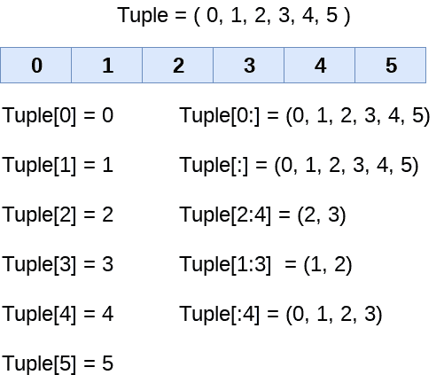

# Python 元组

> 原文：<https://www.javatpoint.com/python-tuples>

Python Tuple 用于存储不可变 Python 对象的序列。元组类似于列表，因为存储在列表中的项目的值可以改变，而元组是不可变的，并且存储在元组中的项目的值不能改变。

## 创建元组

元组可以写成逗号分隔(，)值的集合，用小括号()括起来。圆括号是可选的，但使用它是一种好的做法。元组可以定义如下。

```py
T1 = (101, "Peter", 22)  
T2 = ("Apple", "Banana", "Orange")   
T3 = 10,20,30,40,50

print(type(T1))
print(type(T2))
print(type(T3))

```

**输出:**

```py
<class 'tuple'>
<class 'tuple'>
<class 'tuple'>

```

#### 注意:不用括号创建的元组也称为元组打包。

可以如下创建一个空元组。

T4 = ()

用单个元素创建元组略有不同。我们需要在元素后面放一个逗号来声明元组。

```py
tup1 = ("JavaTpoint")
print(type(tup1))
#Creating a tuple with single element 
tup2 = ("JavaTpoint",)
print(type(tup2))

```

**输出:**

```py
<class 'str'>
<class 'tuple'>

```

元组的索引方式与列表相同。元组中的项可以通过使用它们特定的索引值来访问。

考虑以下元组示例:

### 示例- 1

```py
tuple1 = (10, 20, 30, 40, 50, 60)  
print(tuple1)  
count = 0  
for i in tuple1:  
    print("tuple1[%d] = %d"%(count, i)) 
    count = count+1

```

**输出:**

```py
(10, 20, 30, 40, 50, 60)
tuple1[0] = 10
tuple1[1] = 20
tuple1[2] = 30
tuple1[3] = 40
tuple1[4] = 50
tuple1[5] = 60

```

### 示例- 2

```py
tuple1 = tuple(input("Enter the tuple elements ..."))
print(tuple1)  
count = 0  
for i in tuple1:  
    print("tuple1[%d] = %s"%(count, i)) 
    count = count+1

```

**输出:**

```py
Enter the tuple elements ...123456
('1', '2', '3', '4', '5', '6')
tuple1[0] = 1
tuple1[1] = 2
tuple1[2] = 3
tuple1[3] = 4
tuple1[4] = 5
tuple1[5] = 6

```

元组的索引方式与列表相同。元组中的项可以通过使用它们特定的索引值来访问。

我们将在教程的这一部分看到 tuple 的所有这些方面。

## 元组索引和切片

元组中的索引和切片类似于列表。元组中的索引从 0 开始，到长度(元组)- 1。

元组中的项可以通过使用 index []运算符来访问。Python 还允许我们使用冒号运算符来访问元组中的多个项目。

请参考下图，详细了解索引和切片。



考虑以下示例:

```py
tup = (1,2,3,4,5,6,7)
print(tup[0])
print(tup[1])
print(tup[2])
# It will give the IndexError
print(tup[8])

```

**输出:**

```py
1
2
3
tuple index out of range

```

在上面的代码中，元组有 7 个元素，表示 0 到 6。我们试图访问元组外部的一个元素，该元素引发了**索引错误**。

```py
tuple = (1,2,3,4,5,6,7)
#element 1 to end
print(tuple[1:])
#element 0 to 3 element 
print(tuple[:4])
#element 1 to 4 element
print(tuple[1:5]) 
# element 0 to 6 and take step of 2
print(tuple[0:6:2])

```

**输出:**

```py
(2, 3, 4, 5, 6, 7)
(1, 2, 3, 4)
(1, 2, 3, 4)
(1, 3, 5)

```

## 负索引

元组元素也可以通过使用负索引来访问。索引-1 表示最右边的元素，索引-2 表示倒数第二个元素，依此类推。

使用负索引从左到右遍历元素。考虑以下示例:

```py
tuple1 = (1, 2, 3, 4, 5)  
print(tuple1[-1])  
print(tuple1[-4])  
print(tuple1[-3:-1])
print(tuple1[:-1])
print(tuple1[-2:])

```

**输出:**

```py
5
2
(3, 4)
(1, 2, 3, 4)
(4, 5)

```

## 删除元组

与列表不同，元组项不能通过使用 **del** 关键字删除，因为元组是不可变的。要删除整个元组，我们可以在元组名称中使用 **del** 关键字。

考虑下面的例子。

```py
tuple1 = (1, 2, 3, 4, 5, 6)  
print(tuple1)  
del tuple1[0]  
print(tuple1)  
del tuple1  
print(tuple1)  

```

**输出:**

```py
(1, 2, 3, 4, 5, 6)
Traceback (most recent call last):
  File "tuple.py", line 4, in <module>
    print(tuple1)
NameError: name 'tuple1' is not defined

```

## 基本元组操作

像连接(+)、重复(*)、成员资格(in)这样的运算符的工作方式与它们处理列表的方式相同。有关更多详细信息，请参考下表。

假设声明了 Tuple t = (1，2，3，4，5)和 Tuple t1 = (6，7，8，9)。

| 操作员 | 描述 | 例子 |
| 重复 | 重复运算符使元组元素能够重复多次。 | 

```py
T1*2 = (1, 2, 3, 4, 5, 1, 2, 3, 4, 5)
```

 |
| 串联 | 它将运算符两侧提到的元组连接起来。 | 

```py
T1+T2 = (1, 2, 3, 4, 5, 6, 7, 8, 9)
```

 |
| 成员资格 | 如果元组中存在特定项，则返回 true，否则返回 false | 

```py
print (2 in T1) prints True.
```

 |
| 循环 | for 循环用于迭代元组元素。 | 

```py
for i in T1: 
    print(i)
```

**输出**

```py
1
2
3
4
5
```

 |
| 长度 | 它用于获取元组的长度。 | 

```py
len(T1) = 5
```

 |

## Python 元组内置函数

| 塞内加尔 | 功能 | 描述 |
| one | cmp(元组 1、元组 2) | 它比较两个元组，如果 tuple1 大于 tuple2，则返回 true，否则返回 false。 |
| Two | 透镜(元组) | 它计算元组的长度。 |
| three | 最大值(元组) | 它返回元组的最大元素 |
| four | 最小值(元组) | 它返回元组的最小元素。 |
| five | 元组(序列) | 它将指定的序列转换为元组。 |

## 在哪里使用元组？

在以下场景中使用元组代替列表。

1.使用 tuple 代替 list 让我们清楚地知道 tuple 数据是不变的，不能改变。

2.Tuple 可以模拟没有键的字典。考虑下面的嵌套结构，它可以用作字典。

```py
[(101, "John", 22), (102, "Mike", 28),  (103, "Dustin", 30)]

```

## 列表与元组

| 塞内加尔 | 目录 | 元组 |
| one | 列表的字面值语法由[]显示。 | 元组的字面语法由()表示。 | Two | 列表是可变的。 | 元组是不可变的。 | three | 列表的长度是可变的。 | 元组具有固定长度。 | four | 该列表提供了比元组更多的功能。 | 元组提供的功能比列表少。 | five | 该列表用于我们需要存储没有约束的简单集合的场景，其中项目的值可以更改。 | 元组用于我们需要存储只读集合的情况，即项目的值不能更改。它可以作为字典里面的钥匙。 | six | 列表的内存效率不如元组。 | 元组因其不变性而更具内存效率。 |

* * *