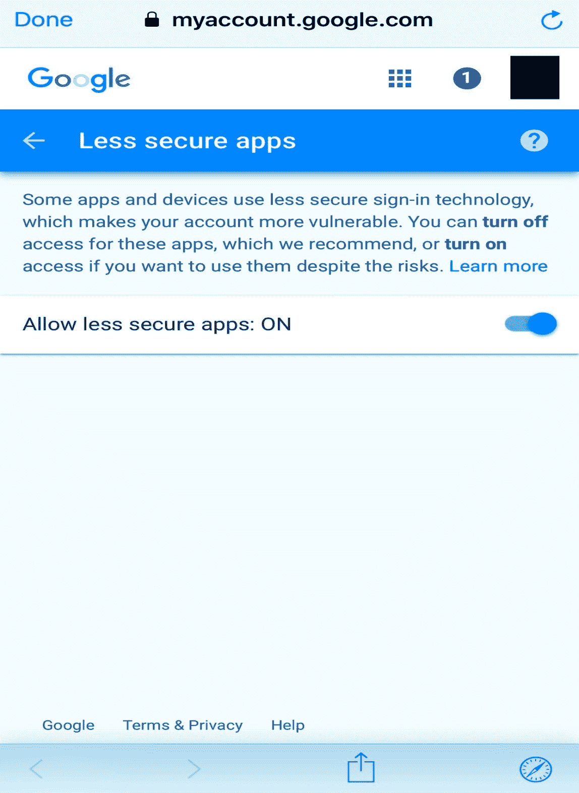

# Python 使用 SMTP 发送电子邮件

> 原文：<https://www.javatpoint.com/python-sending-email>

简单邮件传输协议(SMTP)被用作使用 Python 处理电子邮件传输的协议。它用于在电子邮件服务器之间路由电子邮件。它是一个应用层协议，允许用户向另一个用户发送邮件。接收者使用协议 **POP(邮局协议)**和 **IMAP(互联网消息访问协议)**检索电子邮件。


当服务器侦听来自客户端的 TCP 连接时，它会在端口 587 上启动连接。

Python 提供了一个 **smtplib** 模块，该模块定义了一个用于向互联网机器发送电子邮件的 SMTP 客户端会话对象。为此，我们必须使用 import 语句导入 **smtplib** 模块。

```py

$ import smtplib

```

SMTP 对象用于电子邮件传输。以下语法用于创建 smtplib 对象。

```py

import smtplib   
smtpObj = smtplib.SMTP(host, port, local_hostname)    

```

它接受以下参数。

*   **主机:**是运行您的 SMTP 服务器的机器的主机名。在这里，我们可以指定服务器的 IP 地址，如([https://www.javatpoint.com](https://www.javatpoint.com/))或本地主机。这是一个可选参数。
*   **端口:**是主机监听 SMTP 连接的端口号。默认为 25。
*   **local_hostname:** 如果 SMTP 服务器在你的本地机器上运行，我们可以提到本地机器的主机名。

SMTP 对象的 sendmail()方法用于将邮件发送到所需的计算机。语法如下。

```py

smtpObj.sendmail(sender, receiver, message)  

```

**例**

```py

#!/usr/bin/python3  
import smtplib  
sender_mail = 'sender@fromdomain.com'  
receivers_mail = ['reciever@todomain.com']  
message = """From: From Person %s 
To: To Person %s 
Subject: Sending SMTP e-mail  
This is a test e-mail message. 
"""%(sender_mail,receivers_mail)  
try:  
   smtpObj = smtplib.SMTP('localhost')  
   smtpObj.sendmail(sender_mail, receivers_mail, message)  
   print("Successfully sent email")  
except Exception:  
   print("Error: unable to send email")  

```

## 从 gmail 发送电子邮件

有些情况下，电子邮件是使用 Gmail SMTP 服务器发送的。在这种情况下，我们可以将 Gmail 作为 SMTP 服务器传递，而不是使用端口为 587 的 localhost。

使用以下语法。

```py

$ smtpObj = smtplib.SMTP("gmail.com", 587)   

```

在这里，我们需要使用 Gmail 用户名和密码登录 Gmail 账户。为此，smtplib 提供了 login()方法，该方法接受发送者的用户名和密码。

如果你正在使用 Gmail，这可能会让你的 Gmail 要求你访问不太安全的应用。您需要暂时打开此功能才能正常工作。



考虑下面的例子。

**例**

```py

#!/usr/bin/python3  
import smtplib  
sender_mail = 'sender@gmail.com'  
receivers_mail = ['reciever@gmail.com']  
message = """From: From Person %s 
To: To Person %s 
Subject: Sending SMTP e-mail  
This is a test e-mail message. 
"""%(sender_mail,receivers_mail)  
try:  
   password = input('Enter the password');  
   smtpObj = smtplib.SMTP('gmail.com',587)  
   smtpobj.login(sender_mail,password)  
   smtpObj.sendmail(sender_mail, receivers_mail, message)  
   print("Successfully sent email")  
except Exception:  
   print("Error: unable to send email")  

```

## 通过电子邮件发送 HTML

我们可以通过指定发送 HTML 的 MIME 版本、内容类型和字符集来格式化消息中的 HTML。

考虑下面的例子。

**例**

```py

#!/usr/bin/python3  
import smtplib  
sender_mail = 'sender@fromdomain.com'  
receivers_mail = ['reciever@todomain.com']  
message = """From: From Person %s 
To: To Person %s 

MIME-Version:1.0 
Content-type:text/html 

Subject: Sending SMTP e-mail  

<h3>Python SMTP</h3> 
<strong>This is a test e-mail message.</strong> 
"""%(sender_mail,receivers_mail)  
try:  
   smtpObj = smtplib.SMTP('localhost')  
   smtpObj.sendmail(sender_mail, receivers_mail, message)  
   print("Successfully sent email")  
except Exception:  
   print("Error: unable to send email")  

```

* * *