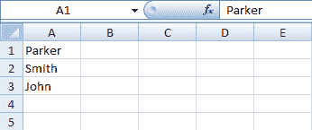

# Python 编写 Excel 文件

> 原文：<https://www.javatpoint.com/python-write-excel-file>

Python write excel 文件用于使用 **xlwt** 模块对电子表格执行多个操作。这是用将数据和格式信息写入文件的理想方式。xls 扩展。

如果您想将数据写入任何文件，并且不想经历自己做所有事情的麻烦，那么您可以使用 `for`循环来稍微自动化整个过程。

## 使用 xlsxwriter 模块编写 Excel 文件

我们也可以使用 **xlsxwriter** 模块编写 excel 文件。它被定义为一个 Python 模块，用于以 XLSX 文件格式编写文件。它还可以用于将文本、数字和公式写入多个工作表。此外，它还支持图表、格式、图像、页面设置、自动过滤器、条件格式等功能。

我们需要使用以下命令来安装 xlsxwriter 模块:

```py

pip install xlsxwriter   

```

#### 注意-在整个 XlsxWriter 中，行和列都是零索引的。工作表中的第一个单元格列为，A1 是(0，0)，B1 是(0，1)，A2 是(1，0)，B2 是(1，1)......，等等。

## 用 openpyxl 模块编写 Excel 文件

它被定义为一个包，如果您想要读写，通常会推荐它。xlsx、xlsm、xltx 和 xltm 文件。可以通过运行**类型(wb)** 进行检查。

load_workbook()函数接受一个参数并返回一个代表文件的 workbook 对象。确保您在电子表格所在的同一目录中。否则，导入时会出现错误。

在 range()函数的帮助下，您可以很容易地使用 `for`循环来帮助您打印出第 2 列中有值的行的值。如果这些特定的单元格是空的，您将获得无。

## 用 xlwt 将数据写入 Excel 文件

除了 XlsxWriter 包之外，您还可以使用 xlwt 包来创建包含您的数据的电子表格。它是用于写入数据、格式化信息等的替代包。非常适合用将数据和格式信息写入文件。xls 扩展。它可以对电子表格执行多种操作。

它支持诸如格式、图像、图表、页面设置、自动过滤器、条件格式等功能。

Pandas有很好的方法从 excel 文件中读取各种数据。我们也可以把结果导入回Pandas。

## 用 pyexcel 写文件

您可以使用 save_as()函数轻松地将数组导出回电子表格，并将目标文件的数组和名称传递给 dest_file_name 参数。

它允许我们指定分隔符并添加 dest_delimiter 参数。您可以传递要用作中间分隔符的符号" "。

**代码**

```py

# import xlsxwriter module   
import xlsxwriter   

book = xlsxwriter.Book('Example2.xlsx')   
sheet = book.add_sheet()   

# Rows and columns are zero indexed.   
row = 0  
column = 0  

content = ["Parker", "Smith", "John"]   

# iterating through the content list   
for item in content :   

    # write operation perform   
    sheet.write(row, column, item)   

    # incrementing the value of row by one with each iterations.   
    row += 1  

book.close()   

```

**输出:**



* * *