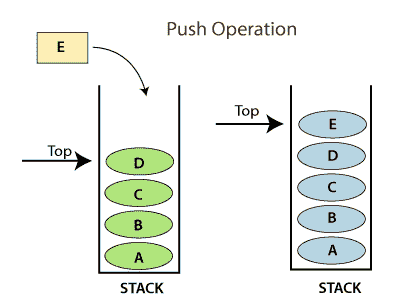
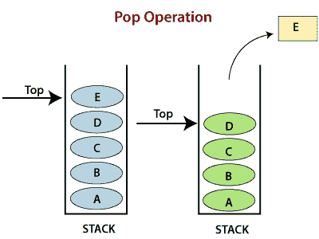
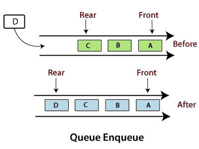
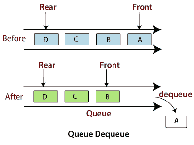

# Python 堆栈和队列

> 原文：<https://www.javatpoint.com/python-stack-and-queue>

数据结构组织计算机中的存储，以便我们可以轻松地访问和更改数据。栈和队列是计算机科学中最早定义的数据结构。一个简单的 Python 列表也可以充当队列和堆栈。队列遵循先进先出规则，用于编程排序。栈和队列通常用数组或链表来实现。

## 堆

堆栈是遵循后进先出原则的数据结构。要实现堆栈，我们需要两个简单的操作:

*   **push -** 它在栈顶增加一个元素。
*   **pop -** 它从堆栈顶部移除一个元素。

 

**操作:**

*   **添加-** 增加堆栈中的项目，增加堆栈大小。加法发生在堆栈的顶部。
*   **删除-** 它由两个条件组成，第一，如果堆栈中没有元素，那么堆栈中会发生下溢，第二，如果堆栈包含一些元素，那么最顶层的元素会被移除。它减小了堆栈大小。
*   **遍历-** 它涉及访问堆栈的每个元素。

**特征:**

*   堆栈的插入顺序被保留。
*   对解析操作很有用。
*   允许双重。

**代码**

```py

# Code to demonstrate Implementation of 
# stack using list 
x = ["Python", "C", "Android"] 
x.push("Java") 
x.push("C++") 
print(x) 
print(x.pop()) 
print(x) 
print(x.pop()) 
print(x) 

```

**输出:**

```py
['Python', 'C', 'Android', 'Java', 'C++']
C++
['Python', 'C', 'Android', 'Java']
Java
['Python', 'C', 'Android']

```

## 长队

队列遵循先进先出原则。它是从两端打开的，因此我们可以很容易地在后面添加元素，也可以从前面移除元素。

为了实现队列，我们需要两个简单的操作:

*   **入队-** 它在队列末尾添加一个元素。
*   **出列-** 它从队列的开头移除元素。

 

**队列上的操作**

*   **加法-** 它将队列中的元素相加，并发生在后端，即队列的后面。
*   **删除-** 它由两个条件组成——如果队列中没有元素，则队列中出现下溢，或者如果堆栈包含一些元素，则位于前面的元素被删除。
*   **遍历-** 它包括访问队列的每个元素。

**特征**

*   队列的插入顺序被保留。
*   允许双重。
*   对解析 CPU 任务操作很有用。

#### 注意:队列的实现有点不一样。队列遵循“先进先出”。时间在这里起着重要的作用。堆栈很快，因为我们从列表的末尾插入和弹出元素，而在队列中，插入和弹出是从列表的开头开始的，所以它变得很慢。这种时间差的原因是由于列表的属性，列表在结束操作时很快，但在开始操作时很慢，因为所有其他元素都必须一个接一个地移动。

### 密码

```py

import queue 
# Queue is created as an object 'L'
L = queue.Queue(maxsize=10) 

# Data is inserted in 'L' at the end using put() 
L.put(9) 
L.put(6) 
L.put(7) 
L.put(4) 
# get() takes data from 
# from the head  
# of the Queue 
print(L.get()) 
print(L.get()) 
print(L.get()) 
print(L.get()) 

```

**输出:**

```py
9
6
7
4

```

* * *