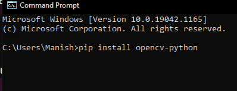
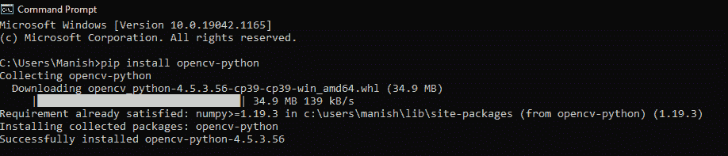
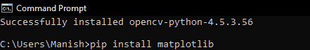
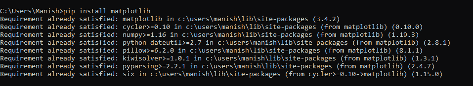
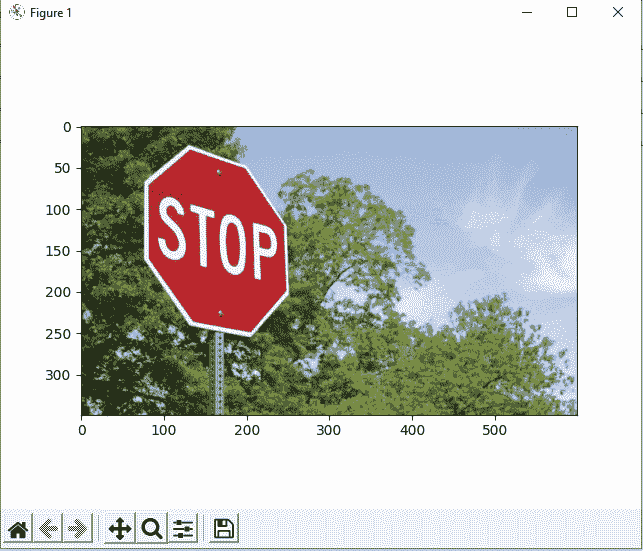
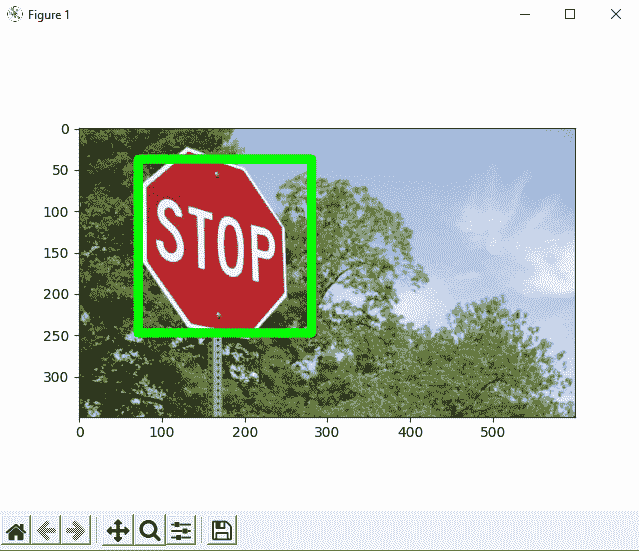

# Python OpenCV 对象检测

> 原文：<https://www.javatpoint.com/python-opencv-object-detection>

OpenCV 是用于图像处理、机器学习和计算机视觉的巨大开源库。它在实时操作中也发挥着重要作用。在 OpenCV 库的帮助下，我们可以轻松地处理图像和视频，以识别文件中的对象、人脸甚至笔迹。在本教程中，我们将只关注使用 OpenCV 从图像中检测对象。我们将学习如何使用 Python 程序使用 OpenCV 从给定的图像中进行对象检测。

## 目标检测

基本上，对象检测是与图像处理、深度学习和计算机视觉相关的现代计算机技术，以检测图像文件中存在的对象。对象检测技术中使用的所有技术(正如我们前面提到的)都处理检测图像或视频中对象的实例。

## 基于 OpenCV 的目标检测

我们在上一节中已经学习了对象检测，在这一节中，我们将学习如何使用 OpenCV 库在图像或视频中进行对象检测。我们将首先在 Python 程序中导入 OpenCV 库，然后我们将使用函数对给我们的图像文件执行对象检测。但是，在使用和导入库函数之前，让我们先安装使用对象检测技术的要求。

在本教程中，我们将使用哈尔级联技术来进行对象检测。让我们先简单了解一下哈尔级联技术。

### 头发重叠:

基本上，哈尔级联技术是一种基于机器学习的方法，其中我们使用大量正图像和负图像来训练分类器以在图像之间进行分类。哈尔级联分类器被认为是利用 OpenCV 库进行目标检测的有效方法。现在，让我们理解前面讨论过的正面和负面形象的概念:

*   **正面图像:**这些图像包含我们希望从分类器中识别的对象。
*   **负像:**这些是不包含任何我们希望被分类器检测到的物体的图像，这些可以是其他一切的图像。

### 使用 Python OpenCV 进行对象检测的要求:

我们必须首先在系统中安装一些重要的库，因为这是执行对象检测任务的重要要求。作为执行对象检测的要求，我们必须在系统中安装以下库:

### 1.OpenCV 库的安装:

首先，使用 OpenCV 库执行对象检测的要求是 OpenCV 库应该存在于我们的设备中，以便我们可以将其导入 Python 程序并使用其对象检测功能。如果这个库不在我们的系统中，我们可以使用命令提示符终端中的以下命令来安装它:

```py

pip install opencv-python

```



当我们在终端写完这个命令后按回车键，命令提示符下的 pip 安装程序会开始将 OpenCV 库安装到我们的系统中。



我们可以看到，OpenCV 库已经成功安装在我们的系统中，现在我们可以将其导入到 Python 程序中使用它的功能。

### 2.matplotlib 库的安装:

Matplotlib 在开篇、结尾、阅读等方面很有帮助。，Python 程序中的图像，这就是为什么安装这个用于对象检测的库成为一项重要要求的原因。如果 matplotlib 库不在我们的系统中，我们必须在命令提示符终端中使用以下命令来安装它:

```py

pip install matplotlib

```



当我们在终端中写完这个命令后按回车键，命令提示符中的 pip 安装程序将开始将其安装到我们的系统中。



我们可以看到，matplotlib 库已经成功安装在我们的系统中，现在我们可以将其导入到 Python 程序中，使用其功能进行打开、读取等。，图像。

我们已经安装了执行对象检测所需的所有库，现在我们可以继续这个任务的实现部分了。

### 对象检测在 Python 中的实现；

在这一部分，我们将编写 Python 程序来进行对象检测，并了解它的实现。我们将在 Python 程序中使用以下图像对其执行对象检测:


### 打开图像

我们将首先打开上面给出的图像，并创建图片的环境以在输出中显示它。我们先看一个示例程序来了解实现，然后再看解释部分。

**示例 1:** 在 Python 程序中使用 OpenCV 和 matplotlib 库打开图像:

```py

# Import OpenCV module
import cv2
# Import pyplot from matplotlib as pltd
from matplotlib import pyplot as pltd
# Opening the image from files
imaging = cv2.imread("opencv-od.png")
# Altering properties of image with cv2
img_gray = cv2.cvtColor(imaging, cv2.COLOR_BGR2GRAY)
imaging_rgb = cv2.cvtColor(imaging, cv2.COLOR_BGR2RGB)
# Plotting image with subplot() from plt
pltd.subplot(1, 1, 1)
# Displaying image in the output
pltd.imshow(imaging_rgb)
pltd.show()

```

**输出:**



**说明:**

首先，我们将 OpenCV(作为 cv2)和 matplotlib(作为 plt)库导入到程序中，以便在代码中使用它们的功能。之后，我们使用 cv2 的 imread()函数打开了图像文件。

然后，我们使用 cv2 函数定义了在程序中打开的图像的属性。然后，我们使用 plt 的子图()函数对图像进行子图，并在其中给出参数。最后，我们使用了 plt 模块的 imshow()和 show()函数来显示输出中的图像。

正如我们在输出中看到的，图像是作为程序的结果显示的，并且它的边界已经被细分。

### 图像中的识别或物体检测

现在，我们将使用程序中的检测多尺度()来检测图像中存在的对象。下面是在代码中使用 detectMultiScale()函数的语法:

```py

found = xml_data.detectMultiScale(img_gray, 
                                   minSize = (30, 30))

```

我们将在程序中使用带有此功能的条件语句来检查是否检测到图像中的任何对象，并突出显示检测到的部分。让我们通过一个示例程序来了解图像中对象检测的实现。

**示例 2:** 使用以下 Python 程序中的检测多尺度()在图像中检测对象:

```py

# Import OpenCV module
import cv2
# Import pyplot from matplotlib as plt
from matplotlib import pyplot as pltd
# Opening the image from files
imaging = cv2.imread("opencv-od.png")
# Altering properties of image with cv2
imaging_gray = cv2.cvtColor(imaging, cv2.COLOR_BGR2GRAY)
imaging_rgb = cv2.cvtColor(imaging, cv2.COLOR_BGR2RGB)
# Importing Haar cascade classifier xml data
xml_data = cv2.CascadeClassifier('XML-data.xml')
# Detecting object in the image with Haar cascade classifier 
detecting = xml_data.detectMultiScale(imaging_gray, 
                                   minSize = (30, 30))
# Amount of object detected
amountDetecting = len(detecting)
# Using if condition to highlight the object detected
if amountDetecting != 0:
    for (a, b, width, height) in detecting:
        cv2.rectangle(imaging_rgb, (a, b), # Highlighting detected object with rectangle
                      (a + height, b + width), 
                      (0, 275, 0), 9)
# Plotting image with subplot() from plt
pltd.subplot(1, 1, 1)
# Displaying image in the output
pltd.imshow(imaging_rgb)
pltd.show()

```

**输出:**



**说明:**

在程序中打开图像后，我们已经将级联分类器 XML 文件导入到程序中。然后，我们使用导入的级联文件的**检测多尺度()**功能来检测图像中是否存在对象。

我们在程序中使用 if 条件来检查对象是否被检测到，如果对象被检测到，我们已经使用 `for`循环和 cv2 函数高亮显示了检测到的对象部分。高亮显示图像中检测到的物体部分后，我们使用 plt **show()** 和 **imshow()** 功能显示处理后的图像。

正如我们在输出中所看到的，当我们运行程序时，带有突出显示的对象检测部分的图像会显示给我们。

* * *