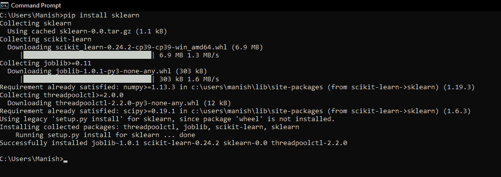

# Python `sklearn.impute`模块


在本教程中，我们将学习 Sklearn 库的 simple Current 模块，它以前被称为 Current 模块，但在 Sklearn 库的最新版本中进行了更新。我们将讨论 SimpleImputer 类，以及如何使用它来处理数据集中缺失的数据，并使用 Python 程序替换数据集中缺失的值。

## simpleinputer 类

我们可以用来处理预测模型数据集中缺失值的 scikit-learn 类称为 simple Current 类。在这个类的帮助下，我们可以用指定的占位符替换数据集中的 NaN(缺失值)值。我们可以通过在程序中使用 simpleCurrent()方法来实现和使用这个模块类。

### SimpleImputer()方法的语法:

要在 Python 程序中实现 SimpleCurrent()类方法，我们必须使用以下语法:

```py

SimpleImputer(missingValues, strategy)

```

**参数:**以下是使用简单估算()方法时必须定义的参数:

1.  **missingValues:** 是 SimpleImputer()方法中的缺失值占位符，必须在执行过程中进行估算，缺省情况下，缺失值占位符的值为 NaN。
2.  **策略**:是要替换数据集中缺失值(NaN 值)的数据，默认情况下，这个参数的取值方法是‘Mean’。简单估算()方法的策略参数可以采用“平均值”、“模式”、“中位数”(中心趋势测量方法)和“常数”值输入。
3.  **fillValue:** 如果我们给出‘常量’作为替代值的方法，这个参数只在策略参数中使用。我们必须为策略参数定义常数值，它将替换数据集中的 NaN 值。

SimpleImputer 类是 Sklearn 库的模块类，要使用这个类，首先我们必须在系统中安装 Sklearn 库，如果它还不存在的话。

### Sklearn 库的安装:

我们可以通过在系统的命令终端提示符下使用以下命令来安装 Sklearn:

```py

pip install sklearn

```

按下回车键后，sklearn 模块将开始在我们的设备中安装，如下所示:



现在，我们的系统中安装了 Sklearn 模块，我们可以继续使用 simple Current 类函数。

### 用 simple Current 类处理数据集中的 NaN 值

现在，我们将在 Python 程序中使用 SimpleImputer 类来处理数据集中缺少的值(我们将在程序中使用)。我们将在示例程序中定义一个数据集，同时给出其中一些缺失的值，然后我们使用 SimpleImputer 类方法通过定义数据集的参数来处理这些值。让我们通过一个示例 Python 程序来理解这一点的实现。

**示例 1:** 看看下面的 Python 程序，其中定义了一个数据集，其中定义了 NaN 值:

```py

# Import numpy module as nmp
import numpy as nmp
# Importing SimpleImputer class from sklearn impute module
from sklearn.impute import SimpleImputer
# Setting up imputer function variable
imputerFunc = SimpleImputer(missing_values = nmp.nan, strategy ='mean')
# Defining a dataset
dataSet = [[32, nmp.nan, 34, 47], [17, nmp.nan, 71, 53], [19, 29, nmp.nan, 79], [nmp.nan, 31, 23, 37], [19, nmp.nan, 79, 53]]
# Print original dataset
print("The Original Dataset we defined in the program: \n", dataSet)
# Imputing dataset by replacing missing values
imputerFunc = imputerFunc.fit(dataSet)
dataSet2 = imputerFunc.transform(dataSet)
# Printing imputed dataset
print("The imputed dataset after replacing missing values from it: \n", dataSet2)

```

**输出:**

```py
The Original Dataset we defined in the program: 
 [[32, nan, 34, 47], [17, nan, 71, 53], [19, 29, nan, 79], [nan, 31, 23, 37], [19, nan, 79, 53]]
The imputed dataset after replacing missing values from it: 
 [[32\.   30\.   34\.   47\.  ]
 [17\.   30\.   71\.   53\.  ]
 [19\.   29\.   51.75 79\.  ]
 [21.75 31\.   23\.   37\.  ]
 [19\.   30\.   79\.   53\.  ]]

```

**说明:**

我们首先将 numpy 模块(用于定义数据集)和 sklearn 模块(用于使用 SimpleImputer 类方法)导入到程序中。然后，我们使用简单估算器类方法定义估算器来处理缺失值，并使用“平均”策略来替换数据集中的缺失值。之后，我们在程序中使用 numpy 模块函数定义了一个数据集，并给出了数据集中的一些缺失值(NaN 值)。然后，我们在输出中打印原始数据集。之后，我们对数据集中缺失的值进行了估算，并用我们之前在简单估算类的程序中定义的估算值进行了替换。在输入数据集并替换其中缺失的值后，我们打印了新的数据集。

正如我们在输出中所看到的，估算值数据集在缺少值的地方有平均值，这就是我们如何使用 simple Current 模块类来处理数据集中的 NaN 值。

## 结论

我们已经阅读了该方法中的 simple Current 类方法，并了解了如何使用它来处理数据集中存在的 NaN 值。我们了解了策略值参数，我们使用它来定义替换数据集的 NaN 值的方法。我们还了解了 Sklearn 库的安装，最后，我们在一个示例中使用了 simple Current 类方法来估算数据集。

* * *