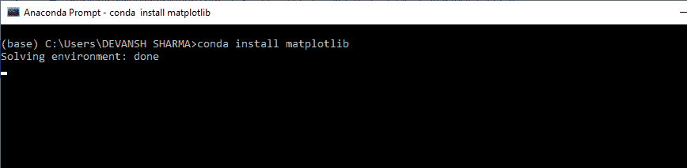

# 如何在 Python 中安装 matplotlib

> 原文：<https://www.javatpoint.com/how-to-install-matplotlib-in-python>

matplotlib 是一个用于绘制图形的开源 Python 库。它最初是由约翰·d·亨特在 2002 年的《T2》中构思的。该版本于 2003 年发布，最新版本于 2019 年 7 月 1 日发布 3.1.1。

它通过图形形式表示数据。图形形式可以是散点图、条形图、直方图、面积图、饼图等。 [matplotlib](https://www.javatpoint.com/matplotlib) 库一般用于数据可视化。数据可视化使我们能够为组织做出有效的决策。

让我们看看 matplotlib 的安装。

### 安装 matplotlib

在使用 matplotlib 库之前，我们需要将其安装在 out [Python](https://www.javatpoint.com/python-tutorial) 环境中。让我们看看下面安装 matplotlib 库的方法。

**使用Python分布的Python**

Anaconda 发行版是安装 matplotlib 库最简单的方法，因为 matplotlib 是预先安装在其中的。所以我们不需要进一步安装。

*   转到它的官方网站，点击下载按钮。


*   根据您的 Python 解释器配置选择下载版本。


**使用 Matplotlib 安装 Matplotlib**

我们也可以使用 conda 提示符安装 matplotlib。打开 conda 提示符并键入以下命令。

```py

conda install matplotlib  

```



### 使用 pip 命令

pip 也可以用来安装 matplotlib 库。打开命令提示符，键入以下命令。

```py

pip install matplotlib  

```

### 确认安装

要验证 matplotlib 是否安装正确，请键入以下命令，包括调用。__ 版本 _ _ 在终端。

```py

import matplotlib  
matplotlib.__version__  
'3.1.1'  

```

现在，我们准备与 matplotlib 合作。

* * *