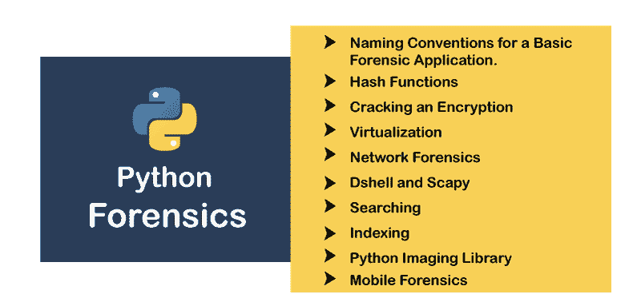
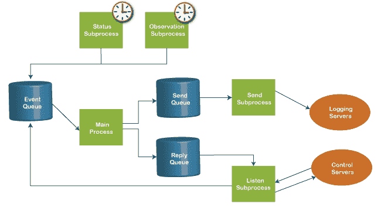

# Python 取证和虚拟化|散列函数

> 原文：<https://www.javatpoint.com/python-forensics-and-virtualization>

在本教程中，我们将学习使用 Python 的取证科学、基本的 Python 取证应用、哈希函数、破解加密、可视化、命名约定、Dshell 和 Scapy、网络取证及其详细说明。

## 介绍

收集和保存证据对于计算机设备上的网络取证调查和分析至关重要。它在法庭上对罪犯起着重要的作用。如今，技术使我们只需在浏览器上输入查询就能获得信息。但这也招致了网络骗子。网络骗子是那些利用他们的系统和互联网进行恶意活动的人。他们可以从坐在别的地方得到你所有的信息。

由于其广泛的应用，Python 还提供了与数字取证合作的工具。通过使用它，我们可以收集数据，提取证据，还可以加密密码。它将支持我们恢复证据的可靠性。

在进一步深入之前，您必须熟悉 [Python](https://www.javatpoint.com/python-tutorial) 及其高级概念。

## 计算取证导论

计算取证是用来解决各种取证学科中的问题的研究的一部分。它使用基于计算机的建模、分析、计算机模拟和识别。Python 取证是由切特·霍姆斯特发明的。还有图案证据，如指纹、鞋印、工具痕迹和任何文件。它利用程序、对象的范围和物质。还有生理和行为模式，如数字证据、 [DNA](https://www.javatpoint.com/dna-full-form) 和犯罪现场。



我们也可以使用各种算法来处理信号和图像处理。通过使用算法，我们还可以处理、[数据挖掘](https://www.javatpoint.com/data-mining)、[计算机图形学](https://www.javatpoint.com/computer-graphics-tutorial)、[机器学习](https://www.javatpoint.com/machine-learning)、计算机视觉数据可视化和统计模式识别。

总之，计算取证是用来研究数字证据的，计算取证处理的是各种类型的证据。

## Python 取证应用的命名约定

我们必须熟悉命名约定和模式，以遵循 Python 取证准则。请考虑下表。

|  | 命名约定 | 例子 |
| 局部变量 | 带可选下划线的 camelCase | 学生姓名 |
| 常数 | 大写，由下划线分隔的单词 | 学生姓名 |
| 全局变量 | 带可选下划线的 camelCase 前缀 | my_studentName |
| 功能 | 带可选下划线的 PascalCase 主动态 | 我的学生姓名 |
| 组件 | 以驼色为前缀 | _studentname |
| 班级 | 用 Pascalcase 给类加前缀；保持分类 | class_MyStudentName |
| 目标 | 前缀 ob _ 带 camelcase | ob_studentName |

哈希算法是将二进制数据流作为输入的最佳方式之一。在现实生活中，我们可以加密我们的密码、文件，甚至任何类型的数字文件或数据。该算法接受输入并生成加密消息。让我们看看给定的例子。

### 例子

```py

import sys,string,md5
print("Enter the name")
line=sys.stdin.readline()
line=line.rstrip()
md5_object=md5.new()
md5_object.update(line)
print(md5_object.hexdigest())

```

## Python 哈希函数

Python 哈希函数用于将大量数据映射到一个固定值。输入返回相同的输出。它是一个散列和，存储具有精确信息的特征。一旦我们将数据映射到一个固定值，就无法恢复。这就是为什么我们也称它为单向密码算法。

让我们理解下面的例子-

**示例-**

```py

import hashlib
import uuid

def hash_pass(password):
    s = uuid.uuid4().hex
    return hashlib.sha256(s.encode() + password.encode()).hexdigest() + ':' + s
def verify_password(hashed_password, user_password):
    password, s = hashed_password.split(':')
    return password == hashlib.sha256(s.encode() + user_password.encode()).hexdigest()
new_password = input('Enter your password :')

hashed_password = hash_pass(new_password)
print('The hash string to store in the db is: ' + hashed_password)

```

**输出:**

```py
Enter your password: sharma
The hash string to store in the db is: 947782bdb0c7a5ad642f1f26179b6aef2d9857427b45a09af4fce3b8f1346e91:8a8371941513482487e5ab8af2ae6466

```

现在，我们将重新输入密码。

```py

old_password = input('Enter new password ')
if verify_password(hashed_password, old_password):
    print(' Entered password is correct')
else:
    print('Passwords do not match')

```

**输出:**

```py
Enter your password devansh 
The hash string to store in the db is: 4762866edd3b49c7736163ef3d981e42629a09a9ca7e081f56d116e137d77b9c:ebbf5b16bd9f4b989505a495bf7ae9b9
Enter new password sharma
Passwords do not match

```

哈希函数具有以下属性。

*   我们可以简单地将任何哈希值转换为任何输入值。
*   它不能产生与给定哈希值相同的输出。
*   不移动哈希值就转换输入是不现实的。

## 破解 Python 中的一个加密

我们必须知道如何加密我们在分析和取证过程中获取的文本数据。首先，了解基本的密码。

一般来说，秘密信息是由军方人员发送的，以传达他们的计划，而不会被他们的敌人看到。这些消息不是人类可读的格式。纯文本使用加密算法加密，这些文本称为密文。

假设一个总指挥官给高级指挥官发了一条信息，从他们的敌人那里保存文本。在这里，我们把字母表中的纯文本字母移动四位。现在，A 是 E，每个 B 是 F，所以没有

让我们理解下面这个破解矢量数据的例子。

**示例-**

```py

import sys
def decryption(text,cipher):
    simple_text=''
    for each in cipher:
        x = (ord(each)-text) % 126
        if x < 32:
            x+=95
            simple_text += chr(x)
            print(simple_text)
cipher_text = input('Enter the message: ')
for i in range(1,95,1):
    decryption(i,cipher_text)

```

**输出:**

```py
Enter message: Yes
~
}
|
{
z
y
x
w
v
u
t
s
r
r~
q
q}
p
p|
o
o{
n
nz
m
my
l
lx
k
kw
j
jv
i
iu
h
ht
g
gs
f
fr
e
eq
d
dp
dp~
c
co
co}
b
bn
bn|
a
am
am{
`
`l
`lz
_
_k
_ky
j
jx
i
iw
h
hv
g
gu
f
ft

```

## 虚拟化

虚拟化是模拟诸如工作站、网络和存储等信息技术系统行为。我们制作这样一个资源的虚拟实例。这可以在虚拟机管理程序的帮助下完成。



硬件虚拟化在计算机取证中起着非常重要的作用。通过使用虚拟化，我们可以获得以下优势。

*   我们可以在验证状态下使用工作站进行每次调查。
*   我们可以通过在虚拟机上包含驱动器的 **dd** 映像来恢复删除的数据。
*   虚拟机可以变成有助于收集证据的恢复设备。

我们定义了以下使用 Python 创建虚拟机的步骤

**步骤- 1:** 假设我们将本地机器视为**“假人”**。每个虚拟机至少有 512 兆内存。

```py

virmach_memory = 512 * 1024 * 1024

```

**步骤- 2:** 现在，我们将该虚拟机连接到默认集群。

```py

virmach_cluster = api.clusters.get(name = "Default")

```

**步骤- 3:** 接下来，从虚拟硬盘引导虚拟机。

```py

vm_os = params.OperatingSystem(boot = [params.Boot(dev = "hd")])

```

现在，我们将把上述步骤组合成一个虚拟机参数对象。让我们理解下面的例子。

**示例-**

```py

from ovirtsdk.xml import params
from ovirtsdk.api import API  

try:  
# We need to provide Api credentials for virtual machine
    api = API(url="https://HOST",
              username="Example",
              password="example123",
              ca_file="ca.crt")

    virmach_name = "dummy"
    virmach_memory = 512 * 1024 * 1024  # calculating the memory in bytes
    virmach_cluster = api.clusters.get(name="Default")
    virmach_template = api.templates.get(name="Blank")

    # here we are assigning the parameters to operating system
    virmach_os = params.OperatingSystem(boot=[params.Boot(dev="hd")])

    virmach_params = params.VM(name=virmach_name,
                          memory=virmach_memory,
                          cluster=virmach_cluster,
                          template=virmach_template,
                           os = virmach_os)

    try:
        api.vms.add(vm=virmach_params)
        print("Virtual machine '%s' added successfully." % virmach_name) 
    except Exception as ex:
        print("Adding virtual machine '%s' failed: %s" % (virmach_name, ex))
        api.disconnect()

except Exception as ex:

```

**输出:**

```py
Virtual Machine dummy added successfully.

```

## Python 中的网络取证

Python 还提供了与网络取证合作的工具。在现代，Python 网络取证环境投资会遇到很多困难。这些问题可能是对违规报告的响应、执行与敏感性相关的评估或验证合规性。让我们了解一下网络取证的基本术语。

**客户端-** 客户端运行个人电脑和工作站。

**服务器-** 服务器执行客户端的请求。

**协议-** 协议是数据传输时必须遵循的一组规则。

**网络套接字-** 网络套接字是一种提供全双工通信并通过 TCP 连接运行的协议。我们可以使用 websockets 发送双向消息。

在这些协议的帮助下，我们可以验证第三方用户发送或接收的信息。但是，加密对于保护通道是必要的。

让我们理解下面的网络示例

**示例-**

```py

import socket
# creating a socket object
sock = socket.socket(socket.AF_INET, socket.SOCK_STREAM)
# getting local machine name
host = socket.gethostname()
port = 8080
# connection to hostname on the port.
sock.connect((host, port))
# Receive no more than 1024 bytes
temp = sock.recv(1024)
print("The client waits for connection")
sock.close()

```

**输出:**

```py
The client waits for connection

```

## Python Scapy 和 Dshell

让我们了解一下 Python Scapy 和 Dshell 的简介。

### python scapy(python scapy)

一个基于 Python 的工具，用于分析和处理网络流量。借助 scapy，我们可以分析包操作。我们还可以捕获和解码大量协议的数据包。使用 scapy 的好处是向调查人员提供有关网络流量的详细报告。OS 指纹 app 等第三方工具也可以在 Scapy 中使用。让我们理解下面的例子。

**示例-**

```py

#Imports scapy and GeoIP toolkit
import scapy, GeoIP 
from scapy import *

geoIp = GeoIP.new(GeoIP.GEOIP_MEMORY_CACHE) 
def locatePackage(pkg):
    # extracts the source IP address
    source = pkg.getlayer(IP).src
    # extracts the destination IP address
    destination = pkg.getlayer(IP).dst
    # gets Country details of source
    srcCountry = geoIp.country_code_by_addr(source) 
    dstCountry = geoIp.country_code_by_addr(destination)
    # gets country details of destination
    print src+"("+sourceCountry+") >> "+destination+"("+destinationcountry+")\n"

```

**输出:**

```py
source INDIA >> destination USA

```

### python shell

Dshell 是一个基于 Python 的网络取证分析工具包。它由美国陆军研究实验室开发，并于 2014 年开源发布。这使得取证调查变得非常容易。Dshell 提供以下解码器。

*   **reservedips -** 用于确定域名系统问题的解决方案。
*   **rip-http -** 它从 http 流量中提取文件。
*   **大流量-** 是表示列表净流量的解码器。
*   **协议-** 标识非标准协议。
*   **dns -** 它提取 dns 相关的查询。

## Python 搜索

搜查是取证调查中最重要的部分。如今，好的搜索是在负责证据的调查员身上。从消息中搜索关键词是调查的支柱。我们可以借助一个关键词找到有力的证据。

从删除的消息中获取信息需要经验和知识。

Python 提供了各种内置模块来支持搜索操作。研究者可以使用诸如“谁”、“什么”、“哪里”、“何时”、“哪个”等关键词来找到结果。让我们理解下面的例子。

**示例-**

```py

# Searching a particular word from a message
str1 = "This is an example for Computational forensics of gathering evidence!"
str2 = "string"

print(str1.find(str2))
print(str1.find(str2, 10))
print(str1.find(str2, 40))

```

**输出:**

```py
11
11
-1

```

## Python 索引

索引是调查员可以用来从文件中收集潜在证据的功能。证据可以限制在内存快照、磁盘映像、文件或网络跟踪中。对于像关键词搜索这样耗时的任务来说，减少时间是非常有帮助的。索引还用于在交互式搜索阶段定位关键词。在下面的例子中，我们已经用 Python 解释了索引。

**示例-**

```py

list1 = [123, 'example', 'creative', 'indexing']

print("Index example : ", list1.index('example'))
print("Index for indexing : ", list1.index('indexing'))

str1 = "This is a message for forensic investigation indexing"
str2 = "message"

print("Index of the character keyword found is ")
print(str1.index(str2))

```

**输出:**

```py
Index example :  1
Index for indexing :  3
Index of the character keyword found is 
10

```

## Python 图像库

取证调查的真正意义是从现有资源中提取有价值的信息。从资源中获取所有相关信息对于报告至关重要。它帮助我们得出适当的结果。


资源数据可以是简单的数据结构，如数据库，也可以是复杂的数据结构，如 JPEG 图像。

调查人员可以很容易地从简单的数据结构中获取信息，但从复杂的数据结构中提取信息是一项繁琐的任务。

Python 提供了名为 PIL 的图像库。它用于为 Python 解释器添加图像处理功能。它还支持文件格式、图形功能，并提供强大的图像处理。让我们理解下面的图像，从图像中提取数据。

我们定义编程示例来解释它实际上是如何工作的。

**步骤- 1:** 假设我们有一个下面的图像，我们需要提取细节。


**步骤 2:** 图像由各种像素值组成。PIL 图书馆使用提取图像细节来收集证据。让我们理解下面的例子。

**示例-**

```py

from PIL import Image
im = Image.open('penguin.jpeg', 'r')
pix_val = list(im.getdata())
pix_val_flat = [x for sets in pix_val for x in sets]
print(pix_val_flat)

```

**输出:**

```py
[255, 255, 255, 255, 255, 255, 255, 255, 255, 255, 255, 255, 255, 255, 255, 255, 255, 255, 255, 255, 255, 255, 255, 255, 255, 255, 255, 255, 255, 255, 255, 255, 255, 255, 255, 255, 255, 255, 255, 255, 255, 255, 255, 255, 255, 255, 255, 255, 255, 255, 255, 255, 255, 255, 255, 255, 255, 255, 255, 255, 255, 255, 255, 255, 255, 255, 255, 255, 255, 255, 255, 255, 255, 255, 255, 255, 255, 255, 255, 255, 255, 255, 255, 255, 255, 255, 255, 255, 255, 255, 255, 255, 255, 255, 255, 255, 255, 255, 255, 255, 255, 255, 255, 255, 255, 255, 255, 255, 255, 255, 255, 255, 255, 255, 255, 255, 255, 255, 255, 255, 255, 255, 255, 255, 255, 255, 255, 255, 255, 255, 255, 255, 255, 255, 255, 255, 255, 255, 255, 255, 255, 255, 255, 255, 255, 255, 255, 255, 255, 255, 255, 255, 255, 255, 255, 255, 255, 255, 255, 255, 255, 255, 255, 255, 255, 255, 255, 255, 255, 255, 255, 255, 255, 255, 255, 255, 255, 255, 255, 255, 255, 255]

```

输出以列表的形式返回。RGB 组合的像素值可以更好地描述需要哪些数据。

## Python 多进程支持

取证专家发现将数字解决方案应用于常见犯罪的大型数字证据存在困难。大多数数字证据都是单线程的，这意味着我们一次只能执行一个命令。让我们看看多进程的简要[介绍。](https://www.javatpoint.com/python-multiprocessing)

### 多进程

多进程是系统支持多个进程的一种能力。它使几个程序能够同时运行。多进程有两种类型- **对称处理和非对称处理**。

让我们理解以下多进程的例子。

**示例-**

```py

import random
import multiprocessing

def list_append(count, id, out_list):
    # count number of process at a time
    for i in range(count):
        out_list.append(random.random())

    if __name__ == "__main__":
        size = 810
        procs = 2
        jobs = []

    for i in range(0, procs):
        out_list = list()  # list of processes
        process1 = multiprocessing.Process(
            target=list_append, args=(size, i, out_list))

        # appends the list of processes
        jobs.append(process1)

    # Calculate the random number of processes
    for j in jobs:
        j.start()  # initiate the process

    # After the processes have finished execution
    for j in jobs:
        j.join()
        print("List processing complete.")

```

**输出:**

```py
List processing complete

```

## Python 中的移动取证

取证投资不仅仅局限于硬盘、CPU 等标准计算机硬件。借助分析非标准硬件或瞬时证据的技术来跟踪硬件。

如今，智能手机被广泛用于数字调查，但它们仍然意味着不标准。通过对智能手机的适当研究，我们可以提取照片、智能手机和信息。

安卓智能手机使用个人识别码或字母数字密码。密码可以是 4 到 16 位数字/字符。

在下面的例子中，我们将通过一个锁屏来提取数据。智能手机密码一般存储在**/数据/系统**中的文件 **password.key** 中。

安卓存储了这个密码的加盐 SHA1 哈希和 MD5 哈希。让我们看看下面的例子。

**示例-**

```py

public byte[] passwordToHash(String password) {
  if (password == null) {
     return null;
  }
  String algo = null;
  byte[] hashed = null;
  try {
     byte[] saltedPassword = (password + getSalt()).getBytes();
     byte[] sha1 = MessageDigest.getInstance(algo = "SHA-1").digest(saltedPassword);
     byte[] md5 = MessageDigest.getInstance(algo = "MD5").digest(saltedPassword);
     hashed = (toHex(sha1) + toHex(md5)).getBytes();
  } catch (NoSuchAlgorithmException e) {
     Log.w(TAG, "Failed to encode string because of missing algorithm: " + algo);
  }
  return hashed;
}

```

以上代码是破解智能手机密码的示例代码。由于哈希密码存储在**盐文件**中，因此破解密码不会影响字典攻击。salt 文件是 64 位随机整数的十六进制表示字符串。根智能手机或 JTAG 适配器可以访问**盐**文件。

## 扎根智能手机

文件的转储/数据/系统/密码. key 存储在锁**屏幕下的 SQLite 数据库中。**密码存储在**设置数据库**下。

## JTAG 适配器

JTAG 代表联合试验行动小组，可用于获取盐。类似地，一个重复框或一个跳汰机适配器可以用来访问销售文件。我们可以利用从 Riff-box 获得的信息找到加密数据的位置。规则如下。

*   找到关联字符串“ **password_salt** ”。
*   salt 文件的宽度以字节表示。这是它的长度。
*   这是实际搜索以获得存储的智能手机密码/pin 码的长度。

## 内存和取证

Python 取证主要关注易失性内存，并借助于基于 Python 的框架 Volatility。

### 易失存储器

易失性存储器是一种当系统电源关闭或中断时被擦除的存储器。简而言之，如果我们正在处理一个没有保存到硬盘上的文档，突然断电，我们将丢失数据。

易失性存储器遵循与其他取证调查相同的模式。

*   首先，需要选择投资的对象。
*   获取取证数据。
*   法医分析

[内存](https://www.javatpoint.com/ram-full-form)转储是用于分析从[内存](https://www.javatpoint.com/ram)收集的数据的工具。

### YARA 规则

YARA 是一个用来检查可疑文件/目录和匹配字符串的工具。它基于模式匹配实现。它在取证分析中起着重要的作用。

**示例-**

```py

import operator
import os
import sys

sys.path.insert(0, os.getcwd())
import plyara.interp as interp

# Plyara is a script that lexes and parses a file consisting of one more Yara

if __name__ == '__main__':
    file_to_analyze = sys.argv[1]
Dictrules = interp.parseString(open(file_to_analyze).read())
authors = {}
imps = {}
meta_keys = {}
max_strings = []
max_string_len = 0
tags = {}
rule_count = 0

for rule in Dictrules:
    rule_count += 1

# Imports 
if 'imports' in rule:
    for imp in rule['imports']:
        imp = imp.replace('"', '')

if imp in imps:
    imps[imp] += 1
else:
    imps[imp] = 1
# Tags 
if 'tags' in rule:
    for tag in rule['tags']:
        if tag in tags:
           tags[tag] += 1
        else:
           tags[tag] = 1

# Metadata 
if 'metadata' in rule:
    for key in rule['metadata']:
       if key in meta_keys:
         meta_keys[key] += 1
       else:
         meta_keys[key] = 1

if key in ['Author', 'author']:
    if rule['metadata'][key] in authors:
         authors[rule['metadata'][key]] += 1
else:
authors[rule['metadata'][key]] = 1

# Strings 
if 'strings' in rule:
    for strr in rule['strings']:
if len(strr['value']) > max_string_len:
    max_string_len = len(strr['value'])
max_strings = [(rule['rule_name'], strr['name'], strr['value'])]
elif len(strr['value']) == max_string_len:
max_strings.append((rule['rule_name'], strr['key'], strr['value']))

print("\nThe number of rules implemented" + str(rule_count))
ordered_meta_keys = sorted(meta_keys.items(), key=operator.itemgetter(1),
reverse = True)
ordered_authors = sorted(authors.items(), key=operator.itemgetter(1),
reverse = True)
ordered_imps = sorted(imps.items(), key=operator.itemgetter(1), reverse=True)
ordered_tags = sorted(tags.items(), key=operator.itemgetter(1), reverse=True)

```

* * *