# 学习 Python 的最佳书籍

> 原文：<https://www.javatpoint.com/best-books-to-learn-python>

在本文中，我们将重点介绍一些学习 Python 的最佳书籍集。我们将为您提供书籍的完整回顾、涵盖的主题以及用于演示这些主题的上下文。

影响书籍质量的因素有很多，如风格、书籍的呈现方式、读者背景、主题解释等。

## 介绍

Python 是最通用、最神奇的编程语言。它可以用在每一个可能的技术领域，如快速开发和调试、数据科学、web 开发和庞大的社区。

最初也是最重要的一步是找到合适的资源来学习任何新技能。学习 Python 就像学习一项新技能。好的资源使学习过程变得更容易。幸运的是，有很多书有助于学习 [Python 编程语言](https://www.javatpoint.com/python-tutorial)的基本概念和先进性。有大量的资源，很难在其中找到最好的书。

我们根据以下类别定义了书籍。

*   **Python 入门书籍**适合刚学或初学者。
*   儿童最好的 Python 书籍。
*   如果有人有 Python 的基础知识，想深入挖掘提高代码效率，那就查一下**最好的中级和高级 Python 书籍**。

以下是适合儿童、绝对初学者和专业程序员的最佳 Python 书籍。Python 社区推荐这些书。

## 初学者最佳 Python 书籍

在这一节中，我们为初学者找出了最好的书。如果你是 Python 的新手，那么你可以选择这些书。

### 1.Python 速成班

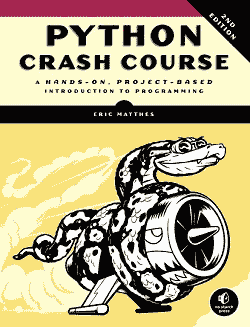

**亚马逊-** [巨蟒速成班](https://www.amazon.com/Python-Crash-Course-2nd-Edition/dp/1593279280/ref=sr_1_1?crid=3TI5PO0GU6QFL&dchild=1&keywords=python+crash+course+3rd+edition&qid=1605436908&s=books&sprefix=Python+Crash+%2Cstripbooks-intl-ship%2C435&sr=1-1)

**Flipkart -** [巨蟒速成班](https://www.flipkart.com/python-crash-course-2nd-edition/p/itmfcysk8dnuweg6?pid=9781593279288&lid=LSTBOK9781593279288P6JTO6&marketplace=FLIPKART&srno=s_1_1&otracker=AS_QueryStore_OrganicAutoSuggest_1_13_na_na_na&otracker1=AS_QueryStore_OrganicAutoSuggest_1_13_na_na_na&fm=SEARCH&iid=e3a590bb-d7d0-4fb5-ad6e-e6999d062496.9781593279288.SEARCH&ppt=sp&ppn=sp&ssid=a3j2oi3r8w0000001605437071589&qH=d116fb03b79b25df)

Python 速成课程由 **Eric Matthews** 编写。这本书包括了对 Python 的快速而完整的介绍。对于希望学习 Python 并编写有用程序的初学者来说，这是一本最好的书。

这本书有 560 页(可以变化)，分为两部分。

第一部分主要关注 Python 最基本的概念，例如数据类型、运算符，通过合适的例子处理变量、字符串、数字、列表和元组。

在另一部分中，像条件语句和逻辑测试这样的主题被 Python 循环语句所隐藏。

这本书还定义了函数、类和文件处理、oops 概念以及测试和调试。我们学习 Python 程序的工作原理，并学习如何编写简短、干净和有效的代码。在另一部分，您可以学习使用库或工具，如 Numpy 和 matplotlib，并创建一个宏伟的可视化。

在本书的第二部分，三个主要项目将增强实践知识。读者还将了解 **2D 游戏开发**和网络应用以及如何创建它们。这本书为**安装姜戈**、建立项目、**设计模型**以及更多与网络开发相关的东西提供了完整的指导。

这本书组织得很好，写得很好。有各种各样的练习和富有挑战性的项目。它是 Python 程序员推荐给初学者的最佳书籍之一。

* * *

### 2.首款蟒蛇，2 第 2版

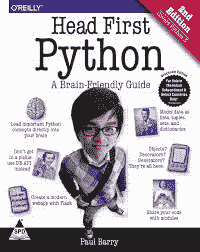

**亚马逊-** [头先蟒](https://www.amazon.com/Head-First-Python-Brain-Friendly-Guide/dp/1491919531/ref=sr_1_1?dchild=1&keywords=Head+First+Python&qid=1605437299&s=books&sr=1-1)

**Flipkart-**[Head-First Python](https://www.flipkart.com/head-first-python-2nd-brain-friendly-guide/p/itmery7vevg4ehsv?pid=9789352134823&lid=LSTBOK9789352134823U5AEHI&marketplace=FLIPKART&srno=s_1_1&otracker=AS_QueryStore_OrganicAutoSuggest_1_16_na_na_ps&otracker1=AS_QueryStore_OrganicAutoSuggest_1_16_na_na_ps&fm=SEARCH&iid=ed02e067-5f75-4f95-8166-941f0e70fe74.9789352134823.SEARCH&ppt=sp&ppn=sp&ssid=xzwmqa6olc0000001605437187733&qH=5bf0114ca2bd7e1e)

第一条巨蟒是保罗·巴里写的。这是初学者最好的书。它提供了一种快速而非正式的方法来学习 Python 的基础知识，而不必通过适得其反的教程和书籍来努力。如果你想以小块的方式学习一件事，一次相当完整，并且想通过例子学习。那么，这是最适合你的书。本书解释了 [Python 变量](https://www.javatpoint.com/python-variables)、[数据类型](https://www.javatpoint.com/python-data-types)、[运算符](https://www.javatpoint.com/python-operators)、[列表](https://www.javatpoint.com/python-lists)以及如何操作它们。

然后，转到文件处理、异常处理和模块。每个主题都包括练习。一个组合项目是通过一个 [CGI(公共网关接口)](https://www.javatpoint.com/python-cgi-programming)使用 Python 为一个学校运动员教练建立一个网站。

保罗·巴里是爱尔兰卡罗理工学院的讲师。他在信息技术行业有多年的经验。他写了许多书，如《第一个头编程》、《第一个头 Python》和《用 Perl 编程网络》。Head First 是一本优秀的书，包含了有趣的主题和恰当的例子。

* * *

### 3.Python 编程:计算机科学导论(第三版)

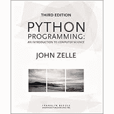

**亚马逊-** [Python 编程](https://www.amazon.com/Python-Programming-Introduction-Computer-Science/dp/1590282752/ref=sr_1_1?crid=D5USAJRUEUU2&dchild=1&keywords=python+programming+an+introduction+to+computer+science&qid=1605437580&s=books&sprefix=python+programming+an+%2Cstripbooks-intl-ship%2C506&sr=1-1)

**Flipkart -** [Python 编程](https://www.flipkart.com/python-programming-introduction-computer-science/p/itme3agvhmvzfaz2?pid=9781887902991&lid=LSTBOK9781887902991VRCBJU&marketplace=FLIPKART&srno=s_1_3&otracker=search&otracker1=search&fm=SEARCH&iid=2a4d39ed-4125-4621-b982-023724279e84.9781887902991.SEARCH&ppt=sp&ppn=sp&ssid=fdxqwm8kzk0000001605437513211&qH=401454402fb0c8b8)

Python 编程是由 **John Zelle** 编写的，这是原 Python 编程书的第三版。这本书定义了中级水平的整个 Python 主题介绍。还包括计算机科学、编程等与 Python 相关的高级概念。这本书最适合初学者。

这本书非常刺激和吸引人。没有人会在看的时候觉得无聊。这些书的第三版非常成功，遵循了第一版所隐藏的路径。

这本书遵循久经考验的方法来解释计算机科学相关的概念。作者修改了第三版，删除了 Python **eval()** 函数的使用和讨论其缺点的部分。

但是它包括许多有用的例子。

* * *

### 4.艰难地学习 Python

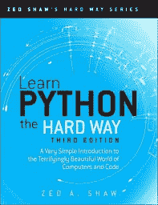

**亚马逊-** [苦学巨蟒](https://www.amazon.com/Learn-Python-Hard-Way-Introduction/dp/0134692888/ref=sr_1_1?crid=29REPSZZX54L2&dchild=1&keywords=learn+python+the+hard+way+3rd+edition&qid=1605437667&s=books&sprefix=Learn+Python+the+%2Cstripbooks-intl-ship%2C424&sr=1-1)

**Flipkart -** [艰难地学习 Python](https://www.flipkart.com/learn-python-hard-way-1-disc/p/itmfbdkb3suh2etu?pid=9789332582101&lid=LSTBOK9789332582101UP8M9H&marketplace=FLIPKART&srno=s_1_1&otracker=AS_QueryStore_OrganicAutoSuggest_1_22_na_na_ps&otracker1=AS_QueryStore_OrganicAutoSuggest_1_22_na_na_ps&fm=SEARCH&iid=d6c7727a-12ec-4aa4-a297-f625541089f1.9789332582101.SEARCH&ppt=sp&ppn=sp&ssid=35zu9ukmds0000001605437699054&qH=cd14787cb091fde8)

这本书是泽德·肖写的。标题中的“努力”一词对初学者来说似乎很难，但事实并非如此。这是一位作者使用指令的方式，让我们彻底地看完章节并练习到目前为止所学的内容。

这本书非常有效地向初学者介绍了 Python 的基本概念。它为复杂的主题设定了一个基本的层次。这本书还包括许多增强 Python 知识的说明和练习。保留标题；这本书对初学者非常有效。

* * *

### 5.Python 的一个字节

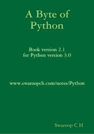

**亚马逊-** [一字节 Python](https://www.amazon.com/s?k=a+byte+of+python&crid=3KLSYLCJL7HFK&sprefix=A+Byte+%2Cstripbooks-intl-ship%2C517&ref=nb_sb_ss_fb_1_7) (Kindle 版)

《Python 的一个字节》是由 C.H. Swaroop 编写的。这是初学者了解 Python 语言的最佳书籍。这本书是最新的 Python 版本，但它也有助于改编 Python 的旧版本。

除英语外，本书还有 25 种语言版本，包括**瑞典语、土耳其语、德语、乌克兰语、法语、西班牙语、俄语、葡萄牙语和韩语**。我们可以根据这本书有几种语言版本来推测它的受欢迎程度。

这本书是由充满活力的社区成员翻译的，他们随着书的更新而动态地工作以保持编辑的进行。

这本书从 Python 的介绍章节开始，包括安装指南、变量、数据类型、运算符和数据结构。它还描述了 Python 是如何成为编程世界中最流行和最有用的编程语言之一的。然后，它转向 Python 高级概念，并结合示例进行了详细描述。

* * *

### 6.用 Python 学习:如何像计算机科学家一样思考

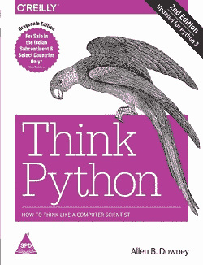

**亚马逊-** [用 Python 学习](https://www.amazon.com/Learning-Python-5th-Mark-Lutz/dp/1449355730/ref=sr_1_1?crid=1G4ZM1PDHUZIF&dchild=1&keywords=learning+with+python&qid=1605437926&sprefix=Learning+with+Python%2Caps%2C412&sr=8-1)

**Flipkart -** [用 Python 学习](https://www.flipkart.com/learning-python/p/itmfbxzffrguf6k2?pid=9789351102014&lid=LSTBOK97893511020149PMRFC&marketplace=FLIPKART&srno=s_1_1&otracker=search&otracker1=search&fm=SEARCH&iid=d58ddb0c-cd96-4a59-b27b-2e90aa0e81c4.9789351102014.SEARCH&ppt=sp&ppn=sp&ssid=dugtnh4ffk0000001605437968009&qH=3764178f844fdbfc)

**《用 Python 学习》**由艾伦·唐尼、杰夫·埃尔克纳和克里斯·迈耶斯共同撰写。这本书包括对 Python 编程的介绍，以及创建真实单词程序的实用方法。这本书分为 20 个部分，包含一个贡献列表。首先说明 Python 的基本概念；然后，它继续讨论 oops 概念、列表、堆栈、队列、树和调试。这本书以各种格式免费提供，包括 PDF、Postscript、HTML 和 Gzipped Rar。它还被翻译成各种语言，如德语、意大利语、西班牙语和捷克语。

如果我们将它与类似的书进行比较，它不会深入一些更先进的领域。它以清晰、直接和广泛的方式关注基本的 Python 编程。

* * *

### 7.用 Python 自动化无聊的事情

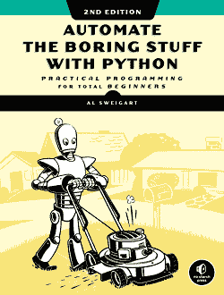

**亚马逊-** [用 Python 自动钻孔](https://www.amazon.com/Automate-Boring-Stuff-Python-2nd/dp/1593279922/ref=sr_1_1?crid=3BQ3AMHWHH5OI&dchild=1&keywords=automate+boring+stuff+with+python&qid=1605438086&sprefix=Automative+boring+stuff+with+Pyth%2Caps%2C428&sr=8-1)

**Flipkart -** [用 Python 自动钻孔](https://www.flipkart.com/automate-boring-stuff-python-2nd/p/itm5d7ffb1f34617?pid=9781593279929&lid=LSTBOK9781593279929FKEXPY&marketplace=FLIPKART&srno=s_1_1&otracker=AS_QueryStore_OrganicAutoSuggest_1_21_na_pm_na&otracker1=AS_QueryStore_OrganicAutoSuggest_1_21_na_pm_na&fm=SEARCH&iid=e7a297f2-0f26-40db-b85e-5ba6bf57022a.9781593279929.SEARCH&ppt=sp&ppn=sp&ssid=5w9335hei80000001605438115219&qH=9ee3fbdea596a8df)

这本书是阿尔·斯威加特写的。作者说- **“不要把时间花在训练有素的猴子能做的工作上。即使你从来没有写过一行代码，你也可以让你的电脑完成繁重的工作。”**

这本书的动机是为了切断重复的任务或者说，**“不要再这样了。”**本书主要关注消除重复性任务。它涵盖了 Python 语言所有必要的基础知识。这本书包括一些漂亮的 Python 片段。这些片段有助于在几秒钟而不是几小时内自动完成一项简单但枯燥的任务。这是一本适合初学者的理想书籍。

* * *

## 高级程序员最佳 Python 编程书籍

在这一节中，我们列出了以下适合高级程序员的最佳 Python 书籍。

### 8.Python 机器学习入门:数据科学家指南

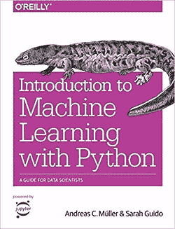

**亚马逊-** [机器学习入门](https://www.amazon.com/Introduction-Machine-Learning-Python-Scientists/dp/1449369413/ref=sr_1_1?crid=S6F8M7US11NW&dchild=1&keywords=introduction+to+machine+learning+with+python&qid=1605438294&sprefix=Introduction+to+Machine+%2Caps%2C480&sr=8-1)

**Flipkart -** [机器学习入门](https://www.flipkart.com/introduction-machine-learning-python-guide-data-scientists/p/itmezh7mxenzjh5h?pid=9789352134571&lid=LSTBOK9789352134571ASGNKJ&marketplace=FLIPKART&srno=s_1_1&otracker=AS_QueryStore_OrganicAutoSuggest_1_27_na_na_ps&otracker1=AS_QueryStore_OrganicAutoSuggest_1_27_na_na_ps&fm=SEARCH&iid=1b687902-249c-4055-9fc9-69a80c225041.9789352134571.SEARCH&ppt=sp&ppn=sp&ssid=blv9b3txhc0000001605438257015&qH=f891991f3135cbd9)

这本书是萨拉·吉多和安德烈亚斯·c·穆勒写的。Python 是最适合机器学习的语言。如今，随着人工智能的兴起，机器学习越来越受欢迎。这本书精确地定义了如何使用 Python 编程语言构建机器学习项目。[机器学习](https://www.javatpoint.com/machine-learning)是许多商业应用和项目不可或缺的组成部分，应用数量逐年上升。

我们学习使用 Python 开发一个丰富的机器学习应用，并有一步一步的指导。这本书解释了机器学习库，如 sci-kit-learn，scipy。它还定义了机器学习的基本概念和用途。之后，我们学习机器学习算法、管道的概念以及模型评估的高级概念。

如果我们总结一下，这本书对增强数据科学和机器学习技能很有帮助。

* * *

### 9.流畅的 Python:清晰、简洁、高效的编程

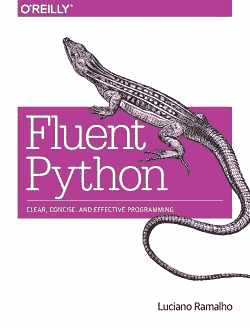

**亚马逊-**T2】流利的蟒蛇

**Flipkart -** [流利的蟒蛇](https://www.flipkart.com/fluent-python-clear-concise-effective-programming/p/itmfbz8qt2kwmsjb?pid=9789352132058&lid=LSTBOK9789352132058MGDBGL&marketplace=FLIPKART&srno=s_1_1&otracker=AS_Query_OrganicAutoSuggest_1_12_na_na_ps&otracker1=AS_Query_OrganicAutoSuggest_1_12_na_na_ps&fm=SEARCH&iid=6b9a4fc3-98e3-47a9-a165-b756259db4fe.9789352132058.SEARCH&ppt=sp&ppn=sp&ssid=29tkbot8tc0000001605438409444&qH=7a03b114f9d0e0e4)

《流利的蟒蛇》是卢西亚诺·拉马尔霍写的。本书最适合对 Python 基础知识有扎实基础，想把技能提升一个层次的人。这本书也是指有经验的程序员。它组织得很好，写得很好，所以每个主题都可以独立阅读。读完*流利的 Python，*我们就能写出清晰更短更快更易读的代码。

这本书涵盖了数据结构、作为对象的函数、面向对象的习惯用法、Python 数据模型和元编程等高级主题。下面是 Python 语言的特性。

*   **前言-** 非常高效地介绍了 Python 面向对象的本质。
*   **函数作为对象-** 它描述了函数作为一级对象的关注点。
*   **控制流-** 它涵盖了生成器、上下文管理器、产出语句和并发使用的概念
*   **元编程-** 它还发现类、属性的未知方面，讨论动态属性、类装饰器和属性描述。
*   **数据结构-** 它涵盖了 Python 语言中的集合、映射、可变性和序列。

这本书通过用例子定义代码并将代码的调用行编号为有用的描述，为自己设定了一种最苛刻的语言。这本书的作者卢西亚诺·拉马尔霍是一名网络开发人员，他也曾与巴西大多数大型新闻门户网站合作。现在，他有了自己的 Python 培训公司。

* * *

### 10.编程 Python:强大的面向对象编程

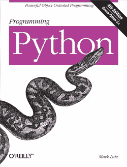

**亚马逊-** [编程 Python](https://www.amazon.com/Programming-Python-Powerful-Object-Oriented/dp/0596158106/ref=sr_1_1?crid=FBSUP938QX9D&dchild=1&keywords=programming+python&qid=1605438485&sprefix=Programming+Python%2Caps%2C435&sr=8-1)

Python 编程是马克·卢茨写的。这本书非常适合那些有 Python 编程基础知识并愿意学习 Python 高级概念的人。这本书包括对各种领域的深入讨论，如图形用户界面、网络和系统管理。本书还涵盖了文本处理、网络、使用 Python 的数据库、前端脚本层等等。

它遵循特定的方法来解释常用的工具和编程技术。在这里，我们找到了许多有用的例子，展示了精确的用法和常见的解决方案。

* * *

### 11.Python 食谱:掌握 Python 的食谱 3

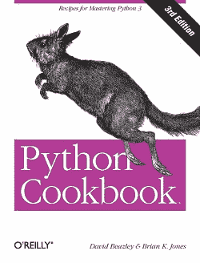

**亚马逊-**T2】巨蟒食谱

**Flipkart -** [蟒蛇食谱](https://www.flipkart.com/python-cookbook-3/p/itmegmt2tfttbxxk?pid=9789351101406&lid=LSTBOK97893511014066VSELA&marketplace=FLIPKART&srno=s_1_1&otracker=AS_QueryStore_OrganicAutoSuggest_1_12_na_na_ps&otracker1=AS_QueryStore_OrganicAutoSuggest_1_12_na_na_ps&fm=SEARCH&iid=5c5e967b-16aa-4666-b815-4c19c10194f7.9789351101406.SEARCH&ppt=sp&ppn=sp&ssid=mmgbvw09b40000001605438610513&qH=93d62b1e824e1123)

《蟒蛇食谱》是由大卫·比兹利和 k·琼斯写的。这本书帮助我们掌握 Python 编程技巧。这本书包括经验丰富的程序员将他们的技能发挥到极致的方法。它由现代工具和习惯用法组成，而不仅仅是标准编码。这本书涵盖了各种各样的主题，用法，以及大量的应用领域。

本书涵盖了许多主题，如字符串、数据结构、函数、迭代、模块、类、并发、测试和调试。每个食谱都有合适的例子，这有助于读者更有效地适应主题。

正如我们所知，Python 在世界各地拥有庞大的社区。Python Cookbook 是基于食谱的，它解决了社区面临的许多问题。作者瞄准了有经验的 Python 开发人员，希望加强他们对 Python 中各种现代技术的理解。这本书也涵盖了绝对初学者的入门主题。

* * *

### 12.有效的 Python:编写更好的 Python 的 59 种方法

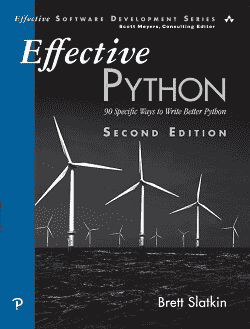

**亚马逊-**T2】有效蟒

**Flipkart -** [有效蟒蛇](https://www.flipkart.com/effective-python-59-specific-ways-write-better-1st/p/itme8hfr38y5sapq?pid=9789332552364&lid=LSTBOK9789332552364TXDYLN&marketplace=FLIPKART&srno=s_1_1&otracker=search&otracker1=search&fm=SEARCH&iid=a6752cfd-8d28-42b1-9bfa-2c7afe5372c3.9789332552364.SEARCH&ppt=sp&ppn=sp&ssid=7dqjpfqc1c0000001605440486598&qH=a6a4b0411fa65731)

这本书是布雷特·斯莱特金写的。有 59 篇独立的文章用来发展对 Python 核心概念的理解。它包括实践、鲜为人知的功能和内置工具。它从简单的主题开始，以更复杂且通常被忽略的分类内存泄漏的概念结束。

每篇文章都用适当的编码示例、讨论和要记住的事情列表来定义。

它的独立文章为关注最适用和最有趣的主题提供了便利。我们需要一次读一篇文章。每篇文章都有两到四页长。

文章分为以下几章。

*   **Python 思维-** 它提供了关于执行常见任务以及如何实现 Python 的信息。
*   **函数-** 它定义了我们如何使用函数来阐明意图，减少 bug，以及如何重用函数。
*   **类和继承-** 它包括 Python 类的最佳文章。
*   **元类和属性-** 本书定义了元类，如何使用它们编写多线程功能。
*   **并发和并行-** 本章帮助在 Python 中创建多线程应用。
*   **内置模块-** 提供 Python 内置库的基本介绍。
*   **协作-** 本章讨论正确的文档、打包和依赖关系。
*   **Production -** 它涵盖了优化、测试和内存利用等更高级的主题。

* * *

## 儿童最佳 Python 书籍

我们为孩子们列出了以下 Python 书籍。

### 13.面向儿童的 Python:有趣的编程入门

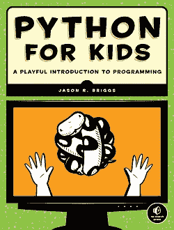

**亚马逊-** [儿童巨蟒](https://www.amazon.com/Python-Kids-Playful-Introduction-Programming/dp/1593274076/ref=sr_1_2?dchild=1&keywords=python+for+kids&qid=1605438697&sr=8-2)

**Flipkart -** [儿童巨蟒](https://www.flipkart.com/python-for-kids/p/itmfc39q6xewqgfu?pid=9781593274078&lid=LSTBOK9781593274078G1A6FV&marketplace=FLIPKART&srno=s_1_18&otracker=search&otracker1=search&fm=SEARCH&iid=4dfc6dfd-31e4-4108-ac11-4b7f8521eb13.9781593274078.SEARCH&ppt=sp&ppn=sp&ssid=mf3qztdpmo0000001605438724474&qH=ef764e270142fbfe)

《孩子的 Python》是杰森·布里格斯写的。这本书主要是以有趣的方式向孩子们教授 Python。尽管书名如此，这本书还是老少皆宜。它包括清晰、简单和全面的 Python 介绍。这本书是简单明了的例子。对于那些想在 Python 基础上获得良好基础的人来说，这是一个可靠的指南。

首先，我们了解 Python 在各种操作系统上的安装，如 Windows、Ubuntu Linux、OS X 等。然后，它继续解释 Python 外壳的引入和使用。在这里，我们找到了一些基本话题的介绍，如变量和算术运算。

在本书的第一部分，有两个有趣的应用项目。第一个项目是打造单人版 **Pong，**名为 **Bounce。**在构建本项目时，读者将了解函数式编程、类和控制流。它还涉及使用 Tkinter 创建接口的任务。

第二个项目是构建侧滚视频游戏。这本书应用了许多与**弹跳相同的概念和任务，深度更深，复杂性更高。**我们还遇到了开源图像处理程序 GIMP。如果你正在寻找一个有趣的 Python 编程入门，这本书是完美的。

* * *

### 14.教你的孩子编码:Python 编程家长友好指南

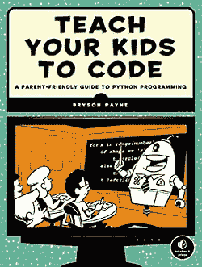

**亚马逊-** [教你的孩子编码](https://www.amazon.com/Teach-Your-Kids-Code-Parent-Friendly/dp/1593276141/ref=sr_1_1?dchild=1&keywords=Teach+your+kids+to+code&qid=1605438848&sr=8-1)

**Flipkart -** [教你的孩子编码](https://www.flipkart.com/teach-your-kids-code/p/itmf3jqmpcsf7ygx?pid=9781593276140&lid=LSTBOK9781593276140TNUOG6&marketplace=FLIPKART&srno=s_1_1&otracker=search&otracker1=search&fm=SEARCH&iid=e325338e-8367-4954-ad41-3568f733fe96.9781593276140.SEARCH&ppt=sp&ppn=sp&ssid=z8zvu0fav40000001605438811913&qH=ae0bd80435ef67ff)

这本书是由布莱森·佩恩写的。它类似于面向儿童的*Python*，但旨在与儿童(或多个儿童)一起学习代码。这本书写得很好，是教孩子解决问题技巧的有效方法。这本书还包括两个项目。

第一个活动是一个**龟**图片库。**龟**库有许多基本设计，如绘制旋转的正方形、圆形、矩形等。本节改进了与 Python 图形模块相关的一般概念。

在下一节中，定义了 Python 中的变量、计算和数学。代码解释非常清楚，有明确的逐行细节。在使用海龟库时，读者可以改进类、函数编程等概念。它之所以成为最好的书，是因为它有大量的编程挑战和每章结尾的精彩总结。

* * *

### 15.简单步骤中的 Python

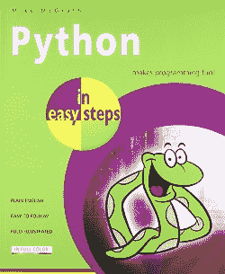

**亚马逊-**T2】易步巨蟒

**Flipkart -** [易步蟒](https://www.flipkart.com/python-makes-programming-fun/p/itmdx929wqpzhnaz?pid=9789351343080&lid=LSTBOK9789351343080MMGLI1&marketplace=FLIPKART&srno=s_1_1&otracker=search&otracker1=search&fm=SEARCH&iid=c535ba48-2498-4791-8ce5-d6ae6e053979.9789351343080.SEARCH&ppt=sp&ppn=sp&ssid=tth16wx2ps0000001605439003968&qH=47bd5cac12639fbb)

这本书是迈克·麦格拉思写的。不仅适合儿童，也适合中学生及以上学生。这本书写得很好，作者用小的、可理解的组块定义了编码概念。这本书主要涵盖以下主题。

*   变量
*   算术运算符
*   线
*   列表
*   元组
*   字典
*   海龟图书馆
*   条件语句
*   环
*   功能
*   模块和更多

这本书奠定了 Python 编程语言的坚实基础。

* * *

## 结论

我们已经为所有类型的读者定义了一些优秀的 Python 书籍。很难在他们中间选择哪本书最适合他们，但这取决于他们的选择。我们根据三类读者来定义这些书。如果有人是初学者，请查看适合初学者的最佳 Python 书籍，如果您有 Python 的基本知识，请尝试适合高级学习者的最佳书籍。希望，这篇文章能帮你找到最好的 Python 书。

* * *