# 初学者和高级程序员学习 Django 的最佳书籍

> 原文：<https://www.javatpoint.com/best-books-to-learn-django-for-beginners-and-advance-programmers>

在本文中，我们将为所有读者讨论几本学习 Django 的优秀书籍。我们将探索它们的特点、书籍写作风格、示例说明、涵盖的主题以及书中定义的项目数量。在探索这本书之前，让我们简单介绍一下 Django。

## Django 是什么？

[Django](https://www.javatpoint.com/django-tutorial) 是一个开源的 [Python 框架](https://www.javatpoint.com/python-tutorial)用来开发丰富的 web 应用。它是最流行的网络开发框架之一。它提供了许多内置特性，因此开发人员只需要关注业务逻辑，而不是重复的功能。让我们看看 Django 的一些令人敬畏的特征。让我们看看 Django 的一些令人敬畏的特征。

*   伟大的文献，遍布世界的庞大社区。
*   它快速、安全、可靠且用途广泛。
*   用 Python 写的。
*   遵循 MVT 方法，即模型视图模板。
*   它自动处理站点地图、RSS 源、内容管理、用户认证等。
*   它提供了一个内置的管理面板。
*   其版本的快速发布。
*   它消除了使用 Python 对象编写 SQL 查询的需要。SQLite 数据库也随之而来。

学习 Django 可能需要稍长的时间，但是一旦我们正确理解了概念。我们将在应用中探索更多的 Django 概念。

## 适合初学者的最佳 Django 书籍

下面我们列出了适合初学者的最佳 Python Django 书籍。

### 1.Django for APIs:用 Python 和 Django 构建网络 APIs

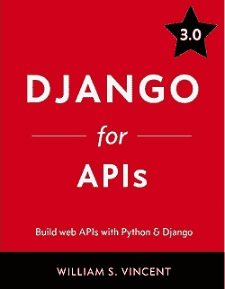

**亚马逊-** [Django 寻找原料药](https://www.amazon.in/Django-APIs-Build-web-Python-ebook/dp/B08FMVYVFR/ref=sr_1_1?dchild=1&keywords=Django+for+APIs&qid=1606894976&sr=8-1)

这本书是威廉·文森特写的。作者在本书中已经解释了如何使用 Django 和 Django REST 框架从头开始创建**[【RESTful】](https://www.javatpoint.com/restful-web-services-tutorial)**API。这本书没有解释“什么是 Django”；相反，它教我们如何编写可以重用的代码 API。

这本书重点介绍了构建 API 的最佳编码实践，并解释了 Django REST 框架和 React (JS 库)。如果你从官方文档中学到了很多，这本书提供了很多信息，只涵盖了最重要的概念。作者为初学者写了这本书，但也为高级程序员写了许多复杂的题目。

* * *

### 2.Django 被释放了

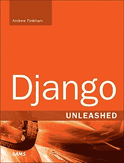

**亚马逊-**T2】Django 释放

这是初学者以及有经验的 Django 程序员的最佳书籍。这本书有详细的解释，从零开始在 Django 构建一个应用。它包括解决同一个问题的不同问题，我们可以确定哪种解决方案是合适的。作者将话题解释从基本话题转移到复杂话题。有些先行主题最初很难理解，但是当我们练习时，我们会感激作者为解释它们所做的努力。这本书涵盖了许多主题，如通用视图、创建自定义、安全性、性能、用户和管理人员等。，都解释得非常有效。

* * *

### 3 .科特迪瓦电子商务

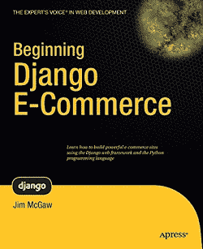

[初学者 Django 电子商务](https://www.flipkart.com/beginning-django-e-commerce/p/itmetj6p2hkcuyyh?pid=9781430225355&lid=LSTBOK9781430225355M2T4KL&marketplace=FLIPKART&srno=s_1_1&otracker=search&otracker1=search&fm=SEARCH&iid=3e84be39-c1c8-4ce4-9f95-5ea92d4ad80a.9781430225355.SEARCH&ppt=sp&ppn=sp&ssid=6t0noy93hc0000001606895151476&qH=2cf8b06abded96f7)

这本书是金·麦格劳写的。它不是一本纯粹的技术书，但也描述了一些实用的框架概念。作者没有详细解释内置的库。它着重于如何在项目和场景中使用这些。如果有人对 Django 有基本的了解，那么这将有助于提高技能。但是除了 Python 之外，我们应该对 [HTML](https://www.javatpoint.com/html-tutorial) 、 [CSS](https://www.javatpoint.com/css-tutorial) 、 [XML](https://www.javatpoint.com/xml-tutorial) 、 [SQL](https://www.javatpoint.com/sql-tutorial) 有一个像样的了解。这本书也包括电子商务网站，然而作者给出了关于该项目的小细节，但没有充分描述。我们必须找出如何做我们应该做的事情。了解 Django 的基本概念是最好的书。

* * *

### 4.轻量级 Django 1 st 版

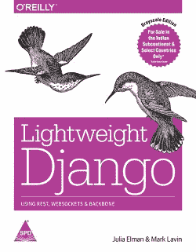

**亚马逊-**T2】轻量级 Django

这本书是由**朱拉·埃尔曼** & **马克·拉文**写的。这是另一本不错的互动书，有学习 Django 的实践方法。这本书从基本概念开始，深入涵盖了大部分主题。它适合初学者和高级开发人员。这本书最大的优点是将主题分解成更小的组成部分，并解释每个组成部分，这使得每一个阅读，并帮助读者理解低层次的细节和整体图片。作者小心翼翼地解释了每个人都能非常容易理解的每一行代码。我们可以说这本书的细节简直令人惊叹。

在切入主题之前，我们必须有一个基本的**知识[jQuery](https://www.javatpoint.com/jquery-tutorial)[Bootstrap](https://www.javatpoint.com/bootstrap-tutorial)和 HTML** 。如果我们有这些话题的知识，它会增加优势，我们可以学得很快。这本书足以理解基本概念，但我们可能需要额外的资源，如文档/博客，以了解为什么做了一些事情。

* * *

### 5.Django 设计模式和最佳实践

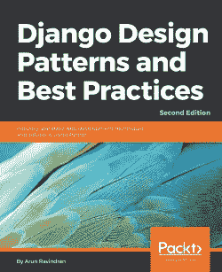

**亚马逊-** [Django 设计图案](https://www.amazon.in/Django-Design-Patterns-Practices-Industry-standard/dp/1788831349/ref=sr_1_1?dchild=1&keywords=5.+Django+Design+Pattern+and+Best+Practices&qid=1606895233&sr=8-1)

这本书是由**阿伦·拉维尚德兰**写的。这本书涵盖了一些我们在许多其他资源或在线资源中找不到的独特而重要的概念。除此之外，这本书还讨论了很多关于 Django 的基础知识，从 Django 为什么会存在开始。作者还讨论了许多问题，并给出了各种解决方案。它也解释了我们如何使发展更快。各种模式有助于减少编码时间和提高代码性能。作者还解释了如何通过给出例子和解决方案来确定何时何地使用模式。这本书也谈到了测试和安全性，这使得它成为一个非常有效和有用的书。

* * *

### 6.Django 2 例

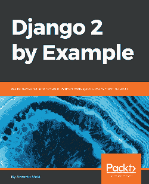

**亚马逊-** [Django 2 例](https://www.amazon.in/Django-Example-powerful-reliable-applications/dp/1788472489/ref=sr_1_1?dchild=1&keywords=Django+2+by+Example&qid=1606895299&sr=8-1)

这本书是安东尼奥·梅莱写的。这本书对初学者和中级水平的学习者都有好处。如果有人对 [JavaScript](https://www.javatpoint.com/javascript-tutorial) 、HTML 和 Python 有基本的了解，这本书将是最好的选择。它深入涵盖了基本和高级概念，包括与 Celery 和萝卜等其他技术的集成。作者解释了许多编码示例，涵盖了广泛的主题。我们可能需要 Django 官方文档来学习了解更多方法。我们可以认为这本书是关于 Django 的基础读物。作者假设你事先不知道 Django。

* * *

### 7.Django 1.11 的两个独家报道:Django 网络框架的最佳实践

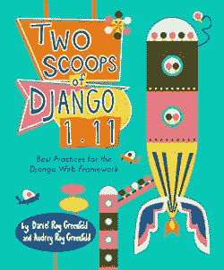

**亚马逊-** [两勺 Django](https://www.amazon.in/Two-Scoops-Django-1-11-Practices/dp/0692915729/ref=sr_1_2?dchild=1&keywords=Two+Scoop+of+Django&qid=1606895360&sr=8-2)

这本书是丹尼尔·罗伊·格林菲尔德写的。如果有人在 Django 项目中工作过，并且对 Django 有基本的了解，这本书是最好的。这本书是为初学者和专业人士写的。它包括最佳实践的提示和有价值的建议。这本书包括大量信息图表，让我们对这本书着迷。这本书的写作风格能够保持友好的语气。每一章都比另一章独立，所以我们可以随意跳过章节。我们还将学习将我们的应用部署到**云(PaaS)。**作者以提示、代码、示例、技巧和技巧的形式分享了他们的经验。

* * *

### 8.面向专业人士的 Django:Python 和 Django 制作网站

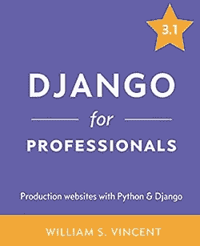

**亚马逊-** [Django 专业版](https://www.amazon.in/Two-Scoops-Django-1-11-Practices/dp/0692915729/ref=sr_1_2?dchild=1&keywords=Two+Scoop+of+Django&qid=1606895360&sr=8-2)

这本书是威廉·文森特写的。这是 Django 初学者用书的扩展。我们将用实际的方法学习概念。在基本版本中，我们将构建简单的网站。在这本书里，我们会找到许多有用的技巧和诀窍来构建生产应用。我们将在每章中获得许多其他有用的工具。作者的选择非常明智。我们需要具备 Python 语言的基本知识。作者假设读者不知道任何其他的——Bootstrap、PostgreSQL、Docker 等。这本书还包括一个完整的指南，以建立一个网站，涵盖所有的概念，我们将需要成为一个亲在 Django。

* * *

### 9.面向初学者的 Django:用 Python 和 Django 构建网站

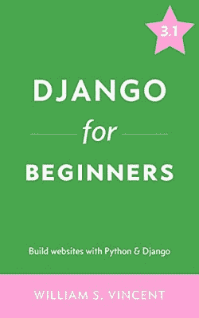

**亚马逊-** [Django 适合初学者](https://www.amazon.in/Django-Beginners-Build-websites-Python-ebook/dp/B079ZZLRRL/ref=sr_1_fkmr1_1?dchild=1&keywords=Django+for+Beginners%3A+Build+Websites+with+Python+and+DjangoTwo+Scoop+of+Django&qid=1606895427&sr=8-1-fkmr1)

这本书也是威廉·文森特写的。这是开始学习 Django 最简单的方法。作者确保读者在阅读这本书时不会感到无聊。这本书节奏很快，解释主题很容易。概念从容易到困难的过渡是从一章到另一章的顺利过渡。我们不需要有 Python 和 Django 的先验知识就可以从这本书中学习。作者详细解释了鼓励我们创建基本应用的每个主题。买了这本书后，我们就不需要阅读其他资料了。这本书包括你好应用到复杂网站教程，它遵循一个迷人的结构和我们寻求更多。

* * *

### 10.练习 Django 2 和 2 频道

**亚马逊-** [练习 Django 2 和渠道 2](https://www.amazon.in/Practical-Django-Channels-Applications-Capabilities/dp/1484247043/ref=sr_1_1?dchild=1&keywords=practical+django+2+and+channels+2&qid=1606895546&sr=8-1)

这本书是由费德里科·马拉尼写的。这本书最好的部分是给所有学习者的。这本书包括我们可以用来开发网络应用的步骤和步骤指南。作者专注于使枯燥的技术主题变得有趣，并包含大量信息。这本书完全理解这种心态。我们可能对这本书有疑问，但它将作为这本书的下一篇文章被清除。作者探讨了各个方面，如电子商务、银行和金融。他还提供了每个领域的用例，开发人员可以在他们的项目中使用这些用例。在这本书里，我们找到了 Django 频道，它使用 **Redis、WebSocket 和 Bootstrap 帮助解决与事件驱动编程相关的问题。**做代码时有错误，但调试是最好的自学方式。我们可以在 [Github](https://www.javatpoint.com/what-is-github) 上找到完整的工作代码，所以错误没那么大。是很好的金钱投资；我们将获得与 Django 相关的完整信息。

* * *

## Django 高级程序员书籍

我们已经为初学者和有经验的读者列出了以上几本优秀的 Django 书籍。以上书籍对学习**Django 的**核心概念相当有效。然而，我们正在为程序员定义一些高级书籍，或者对 Django 有基本的了解。这些书如下。

### 1.用 Python 和 Django 1 第一版构建你的第一个网站

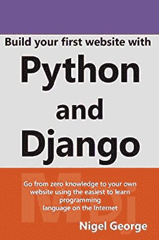

**亚马逊-** [打造你的第一个网站](https://www.amazon.in/Build-First-Website-Django-Fully-Functioning/dp/0994616864/ref=sr_1_1?dchild=1&&keywords=build+your+first+website+with+python+and+django+1st+edition&&qid=1606894731&&sr=8-1)

这本书是奈杰尔·乔治写的。对于从事 Python 和 Django 工作的程序员来说，这是一本最好的书。这本书值得用 Python 建立坚实的基础。我们将需要许多其他资源，因为它没有太多关于主题的细节。对于那些想要打开 Python 和 Django 的人来说，这是最好的书之一。每个主题都解释得很好，并包括许多实际例子。在这本书里，我们找到了一步一步建立一个简单网站的指南。

* * *

### 2.用 Python 学习网络开发

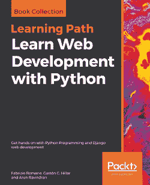

**亚马逊-** [学习网页开发](https://www.amazon.in/Learn-Web-Development-Python-hands/dp/1789953294/ref=sr_1_2?crid=11TB57EF82MV9&&dchild=1&&keywords=learn+web+development+with+python&&qid=1606894879&&sprefix=Learn+Web+Development+with+%2Caps%2C344&&sr=8-2)

这本书是一本同时学习 Python 和 Django 的综合性书籍。作者首先讨论简单的主题，然后讨论 Django 的复杂主题。在这本书里，我们学习了如何构建一个 REST APIs，也学习了如何使用 Django 构建 web 应用。这本书遵循实用的方法来描述主题。作者包括一个开发制作网站的步骤指南。如果读者属于非程序员背景，他可以参加一个简短的教程，开始与 Django 合作。

* * *

## 结论

本文涵盖了所有优秀的、有效的和有用的用 Python 学习 Django 的书籍。Django 在世界各地拥有广泛的社区，可以解决许多问题。Django 也有优秀的文档，但有时很难理解。好书是增加 Django 知识的好选择。我们为各种类型的学习者找到了一些优秀的书籍。有些书对主题有非常详细的解释，很少有完全实用的方法来描述主题。你可以选择上面提到的任何一本书来开始学习 Django。

* * *