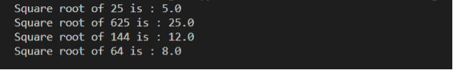
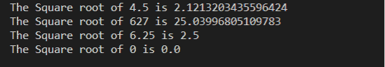
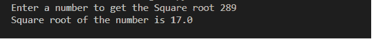
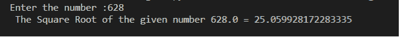
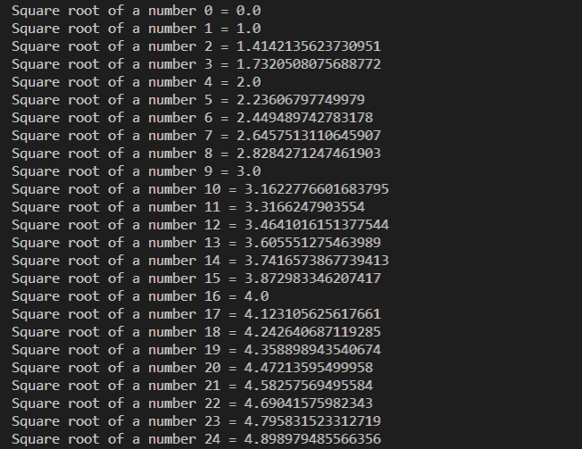

# 如何用 Python 写平方根？

> 原文：<https://www.javatpoint.com/how-to-write-square-root-in-python>

Python 有一个预定义的 **sqrt()** 函数，返回一个数字的平方根。它定义了一个值的平方根，这个值将自身相乘得到一个数。 **sqrt()** 函数不是直接用来求给定数的平方根的，所以我们需要使用一个**数学**模块来调用 [Python](https://www.javatpoint.com/python-tutorial) 中的 **sqrt()** 函数。

例如，144 的平方根是 12。


## 使用 math.sqrt()方法

sqrt()函数是一个内置函数，它返回任何数字的平方根。以下是求一个数的平方根的步骤。

1.  启动程序
2.  定义任何要求平方根的数。
3.  调用 **sqrt()** 函数，传递您在步骤 2 中定义的值，并将结果存储在变量中。
4.  打印平方根。
5.  终止程序。

让我们创建一个 Python 程序来查找一个数字的平方根。

**sqro ot . py**

```py

import math # import math module
N = 25 # define the value to the variable N 
result = math.sqrt(N) # use math.sqrt() function and pass the variable.
print(" Square root of 25 is :", result) # prints the square root of a given number 
M = 625 # define the value
result = math.sqrt(M) # use math.sqrt() function and pass the variable
print(" Square root of 625 is :", result) # prints the square root of a given number 

P = 144 # define the value
result = math.sqrt(P) # use math.sqrt() function and pass the variable
print(" Square root of 144 is :", result) # prints the square root of a given number 

S = 64 # define the value
result = math.sqrt(S) # use math.sqrt() function and pass the variable
print(" Square root of 64 is :", result) # prints the square root of a given number

```

**输出:**



让我们创建一个 python 程序来查找十进制数的平方根。

**sqro ot . py**

```py

import math
print(" The Square root of 4.5 is", math.sqrt(4.5)) # Pass the decimal number
print(" The Square root of 627 is", math.sqrt(627)) # Pass the decimal number
print(" The Square root of 6.25 is", math.sqrt(6.25)) # Pass the decimal number

print(" The Square root of 0 is", math.sqrt(0)) # Pass number as 0

```

**输出:**



在下面的程序中，我们已经从用户那里读取了一个数字，并找到了平方根。

**SqRoot_Usr.py**

```py

import math # import math module
a = int(input("Enter a number to get the Square root")) # take an input 
res = math.sqrt(a) # Use math.sqrt() function and pass the variable a.
print("Square root of the number is", res) # print the Square Root

```

**输出:**



## 使用 math.pow()函数

**幂()**是 Python 中用来返回一个数的幂的内置函数。它有两个参数。第一个参数定义了数字，第二个参数定义了该数字的功率提升。

**Pow_Sqrt.py**

```py

import math # import the math module
num = float(input("Enter the number :")) # take an input
SquareRoot = math.pow(num, 0.5) # Use the math.pow() function and pass the value and 0.5 (which is equal to √) as an parameters
print(" The Square Root of the given number {0} = {1}" .format(num, SquareRoot)) # print the Square Root.

```

**输出:**



## 使用**运算符

我们也可以用指数算符来求这个数的平方根。运算符可以应用于两个操作数之间。例如，x**y .表示左操作数升到右的幂。

以下是求一个数的平方根的步骤。

**第一步**。定义一个函数，并将该值作为参数传递。

**第二步**。如果定义的数字小于 0 或为负数，则不返回任何内容。

**第三步**。用指数**符号求一个数的幂。

**第四步**。从用户处获取数值。

**第五步**。调用函数并将其输出存储到变量中。

**第六步**。在 Python 中显示数字的平方根。

**第七步**。退出程序。

让我们在 Python 程序中实现上述步骤，并计算一个数字的平方根。

**SqrtFun.py**

```py

import math # import the math package or module
def sqrt_fun(num): # define the sqrt_fun() and pass the num as an argument
    if num < 0:  # if num is less than 0 or negative, it returns nothing
        return
    else:
        return num ** 0.5 # Use the exponent operator 
num = int(input (" Enter a numeric value: ") ) # take an input from the user

res = sqrt_fun(num) # call the sqrt_fun() to find the result
print("  Square Root of the {0} = {1}".format(num, res)) # print the Square Root of the variable

```

**输出:**


正如我们在上面的例子中所看到的，首先我们从用户那里获取一个输入(数字)，然后使用指数**运算符找出一个数字的幂。其中 0.5 等于√(根符号)以提高给定数字的幂。

让我们创建一个 Python 程序，它可以找到指定范围之间的平方根。在下面的程序中，我们已经找到了 0 到 50 之间所有数字的平方根。

**sqrlop . py**

```py

import math
for i in range(50):
    print("Square root of a number {0} = {1}".format(i,math.sqrt(i)))

```

**输出:**



* * *