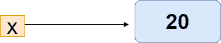
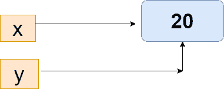
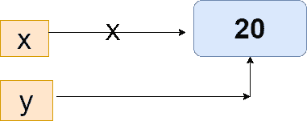

# Python 内存管理

> 原文：<https://www.javatpoint.com/python-memory-management>

在本教程中，我们将学习 Python 如何管理内存，或者 Python 如何在内部处理我们的日期。我们将深入这个主题来理解 Python 的内部工作以及它如何处理内存。

本教程将深入了解 Python 内存管理。当我们执行 Python 脚本时，Python 内存中会有很多逻辑运行，以提高代码的效率。

## 介绍

内存管理对于软件开发人员高效地使用任何编程语言非常重要。众所周知，Python 是一种著名且广泛使用的编程语言。它几乎被用于每个技术领域。与编程语言相反，内存管理与编写内存高效的代码相关。在实现大量数据时，我们不能忽视内存管理的重要性。内存管理不当会导致应用和服务器端组件运行缓慢。也成为工作不当的原因。如果内存处理不好，在对数据进行预处理时会花费很多时间。

在 [Python](https://www.javatpoint.com/python-tutorial) 中，内存由 Python 管理器管理，它决定了应用数据在内存中的位置。所以，我们必须具备 Python 内存管理器的知识，才能写出高效的代码和可维护的代码。

让我们假设记忆看起来像一本空书，我们想在书的页面上写任何东西。然后，我们编写数据管理器在书中找到空闲空间的任何数据，并将其提供给应用。向对象提供内存的过程称为**分配。**

另一方面，当数据不再使用时，可以通过 Python 内存管理器将其删除。但问题是，怎么做？这种记忆从何而来？

## Python 内存分配

对于开发人员来说，内存分配是内存管理的一个重要部分。这个过程基本上是在计算机的虚拟内存中分配空闲空间，有两种类型的虚拟内存在执行程序时工作。

*   静态内存分配
*   动态存储分配

### 静态内存分配-

静态内存分配发生在编译时。例如——在 [C](https://www.javatpoint.com/c-programming-language-tutorial) / [C++](https://www.javatpoint.com/cpp-tutorial) 中，我们声明了一个固定大小的静态数组。内存在编译时分配。然而，我们不能在进一步的程序中再次使用内存。

```py

static int a=10;

```

**栈分配**

栈数据结构用于存储静态内存。它只在特定的函数或方法调用中需要。每当我们调用该函数时，它都会被添加到程序的调用栈中。函数内部的变量赋值暂时存储在函数调用栈中；函数返回该值，调用栈移动到文本任务。编译器处理所有这些过程，所以我们不需要担心它。

调用栈(栈数据结构)按照调用顺序保存程序的操作数据，如子程序或函数调用。这些函数是在我们调用时从栈中弹出的。

### 动态存储分配

与静态内存分配不同，动态内存在运行时将内存分配给程序。例如，在 C/C++中，浮点数据类型的整数有预定义的大小，但数据类型没有预定义的大小。内存在运行时分配给对象。我们使用 **[堆](https://www.javatpoint.com/heap-sort-in-python)** 来实现动态内存管理。我们可以在整个程序中使用内存。

```py

int *a;
p = new int;

```

众所周知，Python 中的一切都是对象，这意味着动态内存分配激发了 Python 的内存管理。当对象不再使用时，Python 内存管理器会自动消失。

**堆内存分配**

堆数据结构用于动态内存，与命名对象无关。这是一种在程序外部全局空间使用的内存类型。堆内存的一个最大优点是，如果对象不再使用或者节点被删除，它会释放内存空间。

在下面的例子中，我们定义了函数的变量如何存储在栈和堆中。

## 默认 Python 实现

Python 是一种开源的、面向对象的编程语言，默认情况下用 C 编程语言实现。这是一个非常有趣的事实——一种用另一种语言写的最受欢迎的语言？但这并不是一个完全的事实，而是某种程度上。

基本上，Python 语言是用英语编写的。然而，它是在参考手册中定义的，本身并没有什么用处。因此，我们需要一个基于手册规则的解释器。

默认实现的好处是，它在计算机中执行 Python 代码，并且还将我们的 Python 代码转换为指令。因此，我们可以说 Python 的默认实现满足了这两个要求。

#### 注意-虚拟机不是物理计算机，但它们是由软件驱动的。

我们用 Python 语言编写的程序首先转换成与计算机相关的指令**字节码**。虚拟机解释这个字节码。

## Python 垃圾收集器

正如我们前面解释的，Python 删除了那些不再使用的对象，或者可以说它释放了内存空间。这个消除不必要的对象内存空间的过程叫做垃圾收集器。Python 垃圾收集器启动程序的执行，如果引用计数下降到零，它就会被激活。

当我们分配新名称或将其放入容器(如字典或元组)中时，引用计数会增加其值。如果我们将引用重新分配给一个对象，则引用计数会减少其值。当对象的引用超出范围或对象被删除时，它也会降低其值。

正如我们所知，Python 使用由堆数据结构管理的动态内存分配。内存堆保存将在程序中使用的对象和其他数据结构。Python 内存管理器通过 API 函数管理堆内存空间的分配或取消分配。

## 内存中的 Python 对象

我们知道，Python 中的一切都是对象。对象可以是简单的(包含数字、字符串等)。)或容器(字典、列表或用户定义的类)。在 Python 中，在程序中使用变量或变量的类型之前，我们不需要声明它们。

让我们理解下面的例子。

**示例-**

```py

a= 10
print(a)
 del a
print(a)

```

**输出:**

```py
10
Traceback (most recent call last):
  File "", line 1, in <module>print(x)
NameError : name 'a' is not defined</module> 
```

正如我们在上面的输出中所看到的，我们给对象 x 赋值并打印它。当我们移除对象 x 并尝试在进一步的代码中访问时，会出现一个错误，声称变量 x 没有被定义。

因此，Python 垃圾收集器是自动工作的，程序员不需要担心，这一点与 c 不同

## Python 中的引用计数

引用计数表示其他对象引用一个对象的次数。当对象的引用被赋值时，对象的计数增加 1。当对象的引用被移除或删除时，对象的计数将减少。当引用计数变为零时，Python 内存管理器执行取消分配。让我们让它变得简单易懂。

**示例-**

假设有两个或多个变量包含相同的值，那么 Python 虚拟机宁愿在私有堆中创建另一个相同值的对象。它实际上使第二个变量指向私有堆中原来存在的值。

这非常有利于保存内存，内存可以由另一个变量使用。

```py

x = 20

```



当我们给 x 赋值时，整数对象 10 在堆内存中创建，它的引用被赋给 x。

```py

x = 20
y = x 
if id(x) == id(y): 
	print("The variables x and y are referring  to the same object")

```



在上面的代码中，我们分配了 y = x，这意味着 y 对象将引用同一个对象，因为如果对象已经以相同的值存在，Python 会为新变量分配相同的对象引用。

现在，看另一个例子。



**示例-**

```py

x = 20
y = x
x += 1
If id(x) == id(y):
      print("x and y do not refer to  the same object")

```

**输出:**

```py
x and y do not refer to the same object

```

变量 x 和 y 引用的不是同一个对象，因为 x 加 1，x 创建新的引用对象，y 仍然引用 10。

## 改造垃圾收集器

Python 垃圾收集器已经使用其生成对对象进行了分类。Python 垃圾收集器有三代。当我们在程序中定义新对象时，它的生命周期由垃圾收集器的第一代来处理。如果该对象在不同的程序中使用，它将被激发到下一代。每一代人都有一个门槛。

如果超过分配数减去取消分配数的阈值，垃圾收集器将开始工作。

我们可以使用 **GC** 模块手动修改阈值。该模块提供了 **get_threshold()** 方法来检查不同代垃圾收集器的阈值。让我们理解下面的例子。

**示例-**

```py

Import GC
print(GC.get_threshold())

```

**输出:**

```py
(700, 10, 10)

```

在上述输出中，阈值 700 用于第一代，其他值用于第二代和第三代。

可以使用 **set_threshold()** 方法修改触发垃圾收集器的阈值。

**示例- 2**

```py

import gc
gc.set_threshold(800, 20, 20)

```

在上面的例子中，阈值的值对于所有三代都增加了。会影响垃圾收集器的运行频率。程序员不需要担心垃圾收集器，但它在为目标系统优化 Python 运行时方面起着至关重要的作用。

Python 垃圾收集器为开发人员处理低级细节。

## 执行手动垃圾收集的重要性

正如我们前面讨论的，Python 解释器处理对程序中使用的对象的引用。当引用计数为零时，它会自动释放内存。这是一种经典的引用计数方法，如果在程序有引用周期时无法工作。当一个或多个对象相互引用时，就会出现引用周期。因此，参考计数永远不会变为零。

让我们理解下面的例子-

```py

def cycle_create():
    list1 = [18, 29, 15]
    list1.append(list1)
    return list1

cycle_create()
[18, 29, 15, [...]]

```

我们已经创建了参考周期。list1 对象引用了对象 list1 本身。当函数返回对象列表 1 时，对象列表 1 的内存不会被释放。所以参考计数不适合求解参考周期。但是，我们可以通过改变垃圾收集器或垃圾收集器的性能来解决这个问题。

为此，我们将使用 gc 模块的 **gc.collect()** 函数。

```py

import gc
n = gc.collect()
print("Number of object:", n)

```

上面的代码将给出收集和取消分配的对象的数量。

我们可以使用两种方法来执行手动垃圾收集器——基于时间或基于事件的垃圾收集。

**gc.collect()** 方法用于执行基于时间的垃圾收集。在固定时间间隔后调用此方法，以执行基于时间的垃圾收集。

在基于偶数的垃圾收集中， **gc.collect()** 函数在事件发生后调用。让我们理解下面的例子。

**示例-**

```py

import sys, gc

def cycle_create():
    list1 = [18, 29, 15]
    list1.append(list1)

def main():
    print("Here we are creating garbage...")
    for i in range(10):
        cycle_create()

    print("Collecting the object...")
    num = gc.collect()
    print("Number of unreachable objects collected by GC:", num)
    print("Uncollectable garbage:", gc.garbage)

if __name__ == "__main__":
    main()
    sys.exit()

```

**输出:**

```py
Here, we are creating garbage... 
Collecting the object... 
Number of unreachable objects collected by GC: 10 
Uncollectable garbage: []

```

在上面的代码中，我们创建了由 list 变量引用的 list1 对象。列表对象的第一个元素引用自身。列表对象的引用计数总是大于零，即使它在程序中被删除或超出范围。

## Python 内存管理

在本节中，我们将详细讨论 C Python 内存架构。

正如我们之前讨论的，从物理硬件到 Python 有一个抽象层。各种应用或 Python 访问由操作系统创建的虚拟内存。

Python 将一部分内存用于内部使用和非对象内存。内存的另一部分用于 Python 对象，如 int、dict、list 等。

CPython 包含在对象区域内分配内存的对象分配器。每当新对象需要空间时，对象分配器就会得到一个调用。分配器主要为少量数据设计，因为 Python 一次不会涉及太多数据。它在绝对需要的时候分配内存。

CPython 内存分配策略有三个主要组成部分。

**Arena -** 它是内存中最大的区块，并且在内存中的页面边界上对齐。操作系统使用页面边界，即固定长度的连续内存卡盘的边缘。Python 假设系统的页面大小为 256 千字节。

**池-** 由单个大小类组成。相同大小的池管理一个双链表。池必须是已用的、已满的或空的。一个**使用的**池由用于存储数据的内存块组成。一个完整的**池**拥有所有分配的和包含的数据。空池没有任何数据，可以在需要时为数据块分配任何大小的类。

**块-** 池包含指向其“空闲”内存块的指针。在池中，有一个指针，指示可用的内存块。分配器直到实际需要时才接触这些块。

## 降低空间复杂度的常用方法

我们可以遵循一些最佳实践来降低空间复杂性。这些技术被认为可以节省大量空间并使程序高效。下面是 Python 中内存分配器的一些实践。

*   **避免列表切片**

我们用 Python 定义了一个列表；内存分配器分别根据列表索引分配堆的内存。假设我们需要给定列表的子列表，那么我们执行列表切片。从原始列表中获取子列表是一种简单的方法。不知何故，它适用于少量数据，但不适用于大数据。

因此，列表切片生成列表中对象的副本。它只是复制了对它们的引用。结果，Python 内存分配器创建了一个对象的副本并分配它。所以我们需要避免列表切片。

避免这种情况的最好方法是开发人员尝试使用单独的变量来跟踪索引，而不是对列表进行切片。

*   **小心使用列表索引**

开发者应尽量使用 ***【数组中的项目】*** 代替**【范围内的索引(len(数组))】**以节省空间和时间。如果我们的程序不需要列表元素的索引，那么就不要使用它。

*   **字符串连接**

字符串串联不适合节省空间和时间复杂度。在可能的情况下，我们应该避免使用“+”进行字符串连接，因为字符串是不可变的。当我们将新字符串添加到现有字符串中时，Python 会创建新字符串并将其分配给新地址。

根据字符及其长度，每个字符串需要固定大小的内存。当我们更改字符串时，它需要不同的内存量，并且需要重新分配。

让我们运行以下示例。

```py

a = Mango
print(a)
a = a + " Ice-cream"
print (a)

```

**输出:**

```py
Mango
Mango Ice-cream

```

它将创建变量 **a** 来引用字符串对象，这是字符串值信息。

然后我们使用‘+’运算符在其中添加新的 sting。Python 根据新字符串的大小和长度在内存中重新分配它。假设原始字符串的内存大小是 n 字节，那么新字符串将是 m 字节。

我们可以使用“**”来代替使用字符串串联。join(iterable_object)”或 format 或%。**这对于节省内存和时间产生了巨大的影响。

*   **使用迭代器和生成器**

当处理大量数据时，迭代器对时间和内存都很有帮助。处理大数据集时，我们需要立即进行数据处理，可以等待程序先处理整个数据集。

生成器是用于创建迭代器函数的特殊函数。

在下面的例子中，我们实现了一个调用特殊生成器函数的迭代器。 **yield** 关键字返回当前值，仅在循环的下一次迭代中移动到下一个值。

**示例-**

```py

def __iter__(self):
	''' This function allows are set to be iterable. Element can be looped over using the for loop'''
	return self. _generator()

def _generator(self):
	""" This function is used to implement the iterable. It stores the data we are currently on and gives the                      next item at each iteration of the loop."""
	for i in self.items():
		yield i

```

*   **尽可能使用内置库**

如果我们使用已经在 Python 库中预定义的方法，那么就导入相应的库。这会节省很多空间和时间。我们还可以创建一个模块来定义函数，并将其导入到当前的工作程序中。

### 结论

在本教程中，我们讨论了 Python 中内存的内部工作。我们已经学习了 Python 如何管理内存，也讨论了默认的 Python 实现。CPython 是用 C 编程语言编写的。Python 是一种动态类型的语言，它使用堆数据结构来存储内存。

* * *