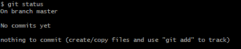
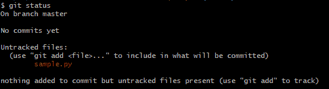
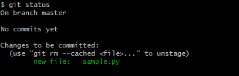
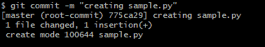
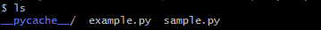
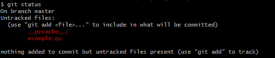
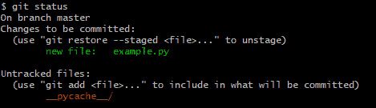
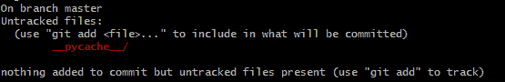
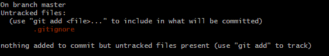
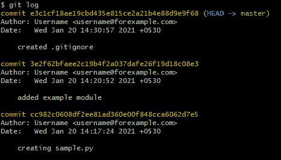

# Python 中的 Git 模块

> 原文：<https://www.javatpoint.com/git-modules-in-python>

在本文中，我们将讨论 Python 编程语言中的 **Git 模块，**用户如何在 Python 的项目中使用它。我们还将讨论用户如何结合 GitHub 使用 git 模块，以便我们可以与其他用户一起处理大型项目。我们还将学习如何创建 git 存储库，如何查看所有项目文件的历史，如何回到项目的初始阶段，以及如何在存储库中添加和修改新文件。

## 什么是 Git？

[T2】Python 语言](https://www.javatpoint.com/git)的 Git 模块是一个分布式版本控制系统。版本控制系统是一组工具，用于跟踪项目的一组文件的过去。用户可以通过指示 Git 版本控制系统在任何时候轻松保存文件的状态。之后，用户可以继续编辑项目的文件，并在任何状态下保存项目。以任何当前状态保存项目就像保留项目目录的备份一样。在 Git 模块中，保存状态被称为提交。

每当用户在 Git 模块中进行提交时，用户都会添加一条提交消息，解释在项目状态中所做的所有更改。Git 模块可以显示用户在项目中所做的所有更改和提交的历史。git 模块的这一特性确实帮助用户弄清楚他们做了什么工作，并专门寻找所有潜入系统的 bug。

通过使用 git 模块，用户还可以比较不同**提交的项目的文件。** Git 模块还允许用户用很少的努力将任何一个或多个文件返回到项目的早期状态。

分布式版本控制系统与版本控制系统略有不同。早期版本控制系统的工作原理是将所有提交保存在用户的硬盘上。用户本地硬盘上的提交集合被称为**存储库**。但是由于这个原因，用户不能和团队在同一个代码库中工作。在同一个项目中与团队一起工作时，用户需要将他们的存储库保存在平台上，所有其他团队成员都可以访问它。分布式版本控制系统将存储库保存在主服务器上，供许多用户和开发人员共享。这也有文件锁定的特点。

对于 Git 模块，大多数用户和开发人员使用 GitHub 作为中央存储库，任何人都可以访问该文件。GitHub 就像一个中心位置，任何人都可以共享代码，每个人都可以访问它。即使在使用 GitHub 后，完整的存储库仍然保存在所有的本地转帖中。

### Git 模块的基本用法

到目前为止，我们一般都知道 Git 模块。本主题将讨论用户如何在本地计算机系统上开始使用 Git 模块。

**步骤 1:创建新的存储库**

要开始使用 Git 模块，用户首先需要输入他们的信息。他们必须用 git 配置命令设置用户名。

```py

$ git config -- global user.name " name of the user goes here "
$ git config - global user.email "username@forexample.com"

```

设置用户名后，用户将需要一个存储库来工作。创建存储库非常容易。用户可以在目录中使用 git 初始化命令:

```py

$ mkdir sample
$ cd sample
$ git init

```

用户可以在/ home / tmp / sample /中初始化空的 Git 存储库。git /

创建存储库后，用户可以在 Git 模块上搜索它。用户最常使用的 Git 模块命令是 Git 状态:

```py

$ git status

```



这个输出向用户显示了一些信息，比如他们在哪个分支上，以及他们没有什么要提交的。不提交意味着目录中没有 Git 模块不知道的文件。

这就是我们创建存储库的方式。

**第二步。向存储库添加新文件**

在存储库中创建一个 Git 不知道的文件。使用编辑器创建文件 sample.py，其中只有一个 print 语句。

```py

#Sample.py
print ( ' Adding a New File ! ' ) 

```

此后，如果用户再次运行 Git status 命令，他们将看到不同的结果:

```py

$ git status

```



检查完新文件后，Git 模块将告诉用户该文件未被跟踪。这意味着 Git 说特定的文件不是存储库的一部分，不在版本控制之下。用户可以通过向 Git 添加新文件来解决这个问题。使用 git add 命令将文件添加到 git 模块。

```py

$ git add sample.py
$ git status

```



现在 Git 知道了新的文件 sample.py，它将在要提交的更改下列出该文件。将文件添加到 Git 模块会将其转移到暂存区。这意味着用户现在可以将文件提交到存储库。

**进行提交更改**

每当用户提交更改时，他们都告诉 Git 模块将文件的这个级别的状态保存在存储库中。用户可以通过使用 git 模块的 commit 命令来实现。命令中的-m 选项通知 git 模块提交以下消息。如果用户在运行命令时没有使用-m，Git 模块将为用户打开编辑器来创建提交消息。要提交消息，用户应该编写如下命令:

```py

$ git commit -m " creating sample.py "

```



```py

$ git status

```


用户现在可以看到 commit 命令返回了一些信息，其中大部分并没有多大用处，但是它确实告诉用户只有一个文件发生了变化，因为用户在存储库中只添加了一个文件。提交命令还通知提交的简单哈希算法(775ca29)。

再次运行 git status 命令后，它显示用户现在有了一个干净的工作目录，这意味着文件中的所有更改都不会提交给 git。

**Git 模块的中转区**

Git 模块有一个暂存区，通常称为索引。暂存区是 Git 模块跟踪用户在下一次提交中想要做的更改的地方。每当用户运行 Git Add 命令时，如上所示，新文件 **sample.py** 被移动到暂存区，这种变化以 Git 状态显示。项目文件从 git 模块的未跟踪部分移动到输出的待提交部分。

当用户运行 git add 命令时，Git 模块的暂存区显示了文件的确切内容。如果用户再次修改它，文件将在 git 状态输出的区域、暂存区和非暂存区都可见。

在文件上使用 git 模块的任何阶段(已经提交过一次)，都有三个版本的文件可供用户使用:

*   一个版本在用户正在编辑的用户硬盘上。
*   另一个版本由 Git 模块存储在用户的暂存区中。
*   第三个版本存在于文件的存储库中。

该文件的所有三个版本可能互不相同。通过将更改移动到用户的临时区域，然后提交文件，他们可以将文件的所有这些版本恢复同步。

## 。吉蒂尔

git 模块中的 git status 命令非常容易访问，用户最常使用。但是有时候，用户可能会发现 git 模块的未跟踪部分显示了几对文件，他们不希望 git 模块看到它们。为此，用户可以使用. gitignore 文件。

例如:

```py

#Let's create a new Python file of the project in the same directory called example.py:
#example.py
Def get_example ( ) :
return " cow "

```

之后，修改 sample.py 文件以包含示例. py 并调用其函数:

```py

#sample.py
import example 
 example = example.get_example ( )
print ( " Animal { } " .format (example) )

```

每当用户导入一个本地模块时，Python 就开始将该模块编译成字节码，并将该文件保存在他们的文件系统中。在 Python2 中，将模块编译成字节码后，它会以**示例. pyc.** 的形式保存文件，但在 python3 的情况下，它会生成一个 _pycache_ directory 并存储。pyc 文件在里面。

**例如:**




这样做之后，如果用户运行 git status 命令，他们将会在未跟踪部分看到该特定目录。用户还可以看到他们的**示例. py 文件**在未跟踪的部分，但是他们对 sample.py 所做的更改在新的部分，这被称为**“未提交的更改”。**这一部分意味着用户之前所做的更改没有被添加到 git 模块的暂存区。

例如:

```py

$ git status

```



要将 example.py sample.py 文件添加到存储库中，用户需要执行与之前相同的操作。

**例如:**

```py

$ git add example.py sample.py
$ git status

```



现在，用户应该提交更改并完成清理:

```py

$ git commit -m " add example module " 

```



每当用户运行 git status 命令时，他们都会看到 _pycache_ directory，如下所示:

```py

$ git status

```


如果用户希望所有的 _pycache_ directory 及其内容都被忽略，那么他们必须在他们的存储库中添加一个. gitignore 文件。这是一个非常简单的过程。用户必须在他们选择的编辑器中编辑文件。

```py

# .gitignore
__pycache__

```

然后，用户必须运行 git status 命令，他们不再看到 _pycache_ directory 及其内容。虽然用户会看到新的。gitignore！文件。

例如:

```py

$ git status

```



文件。gitignore 只是一个普通的文本文件，它可以像其他普通文件一样添加到存储库中。

例如:

```py

$ git add .gitignore
$ git commit - add " create .gitignore " 

```


大厅里还有一个入口。gitignore file，这是用户在虚拟环境中存储的目录。这个目录叫做 virtualenvs。virtualenvs 目录通常称为 env 或 venv。

用户可以将这些添加到他们的。gitignore 项目的文件。通过这样做，存储库中项目的目录或文件将被忽略。如果没有文件或目录存在，则不会执行任何操作。

用户还可以存储一个全局。gitignore 文件。如果用户的编辑器使用来保存临时文件或者在计算机系统的本地目录中制作备份文件，那么这个过程非常简单。

例如:

```py

# .gitignore 
__pycache__
Venv
Venv /
Venv.bak /
env /
env.bak /
.pytest_cache
.cover /
.coverage

```

## 什么用户不应该添加到 Git 存储库中？

当用户处于使用任何版本控制工具的初始阶段时，最有可能的是使用 Git 模块。用户会希望将各种文件存储在 Git 的存储库中，但这是一个错误。Git 模块确实有限制，也有安全问题，因为用户在他们可以添加到 [git 存储库](https://www.javatpoint.com/git-repository)的文件和数据类型上面临一些限制。

所有版本控制系统的基本规则是，用户只应该在版本控制系统中添加源文件，而不应该将生成的文件添加到版本控制系统中。

源文件是用户在编辑器中键入时创建的任何文件。生成的文件是计算机在处理源文件时创建的文件。

例如:

Sample.py 是源文件，而

Sample.pyc 是生成的文件。

Git 存储库中不包含生成文件的原因:

*   将生成的文件存储在存储库中是对空间和时间的浪费。可以再次创建生成的文件，并且可能需要以不同的格式重新创建。如果用户 1 使用的是 IronPython 或 Cython，而用户 2 使用的是 Jython 解释器，那么。pyc 文件会彼此不同。并提交。pyc 文件可能会在存储库中产生冲突。
*   生成的文件相对比项目的源文件大。将生成的文件添加到 Git 存储库中意味着特定项目的所有其他用户和开发人员也必须下载并存储这些文件，即使他们不需要这些文件。
*   Git 存储库的另一个规则是，用户应该谨慎提交二进制文件，并且应该避免提交大文件。

Git 模块存储库不保存用户提交的项目的每个文件的完整副本。相反，存储库使用复杂的算法，该算法基于文件的不同后续版本。这减少了存储文件需求的数量。但是该算法不适用于二进制文件，因为二进制文件如 MP3 或 JPG 文件没有很好的区别工具。对于二进制文件，每当用户提交时，Git 模块存储库必须保存项目的完整文件。

当用户在 Git 模块上工作，或者在 GitHub 存储库中存储文件时，不要将机密信息保存在存储库中，而要公开共享。

## Git 日志

Git 日志是 Git 模块的命令。Git 日志用于查看用户提交的历史记录。

例如:

```py

$ git log 

```



用户可以在 git 存储库中看到用户提交的历史记录。所有提交消息都将按照它们被创建的顺序出现。提交的开始将由单词“commit”标识，并位于提交的简单哈希区域之后。 [Git log](https://www.javatpoint.com/git-log) 命令将提供每个简单哈希区域的历史。

## 结论

本文讨论了 Git 模块、版本控制系统、如何在 Git 中提交及其存储库功能、在 Git 模块和 [GitHub](https://www.javatpoint.com/what-is-github) 的存储库中添加文件和信息的规则。不同类型的 Git 命令像。 [gitignore](https://www.javatpoint.com/git-ignore) 、git log、 [git add](https://www.javatpoint.com/git-add) 、 [git status](https://www.javatpoint.com/git-status) 等。，以及它们在项目和目录文件中的使用。

* * *