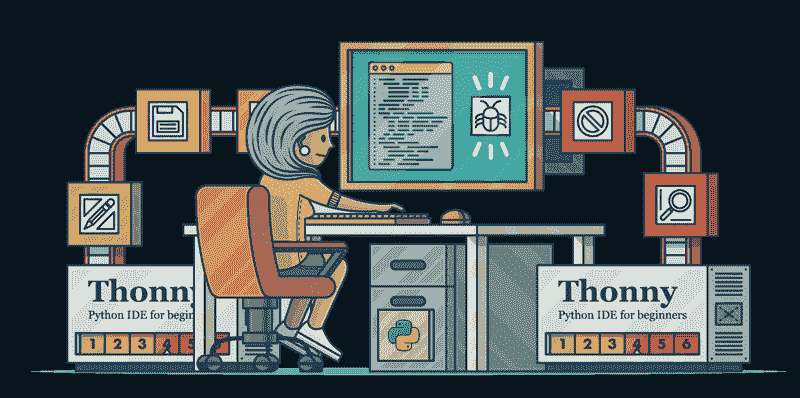
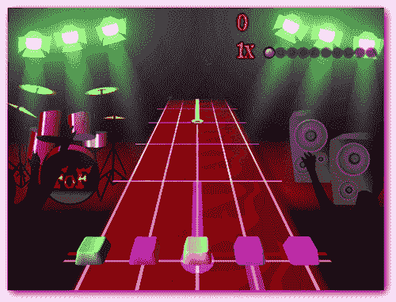
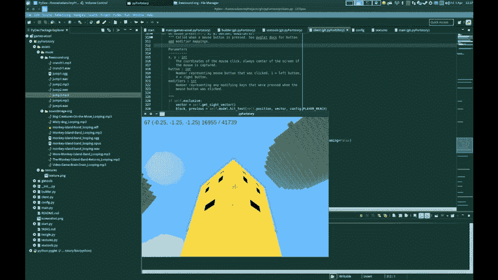
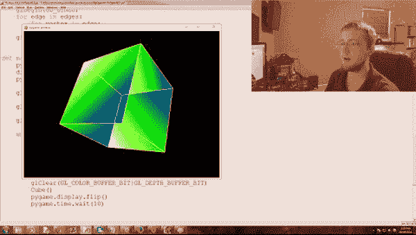
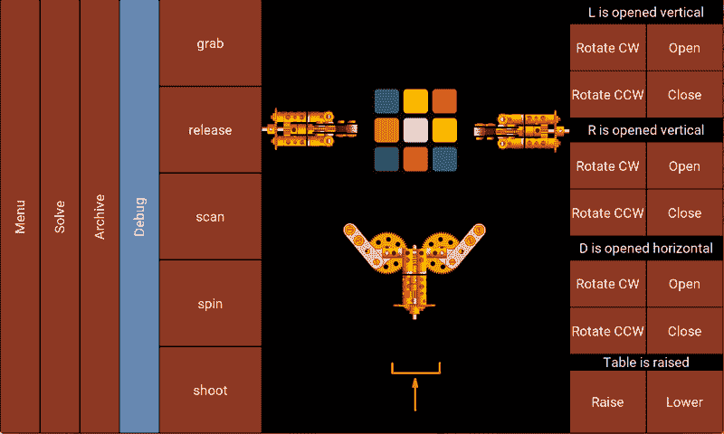
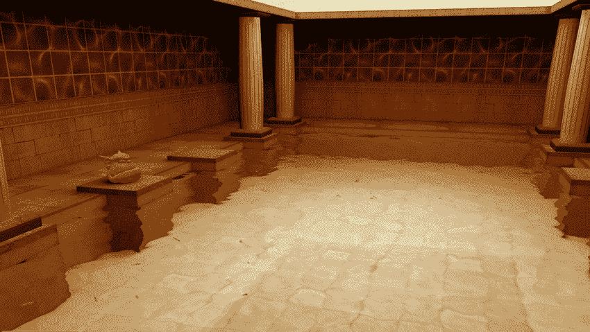
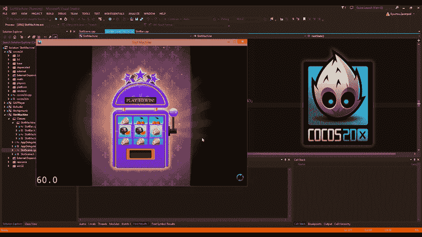

# 顶级 Python 游戏框架

> 原文：<https://www.javatpoint.com/top-python-frameworks-for-gaming>

游戏世界中有许多流行的游戏是使用 Python 框架及其库开发的，例如《战地 2》、《加勒比海盗》等。由于 python 语言的功能和附加功能，大多数开发人员使用 python 语言而不是其他编程语言。随着游戏开发行业的进步，Python 编程是开发人员快速制作视频游戏原型的绝佳选择。

在本文中，我们将讨论用于游戏开发的前 10 个 Python 框架:

*   皮尤游戏
*   PyKyra
*   皮格莱特
*   pyopengl(OpenGL)
*   令人 沮丧
*   Panda3D
*   Python-食人魔
*   任氏
*   Cocos2d
*   Soya3D

## 1.皮尤游戏

[PyGame](https://www.javatpoint.com/pygame) 是一个 Python 开源库，用于制作应用和软件，例如使用一个特殊的 SDL 库开发的游戏。该库是基于 [C 语言](https://www.javatpoint.com/c-programming-language-tutorial)、 [Python 语言](https://www.javatpoint.com/python-tutorial)、Native 和 OpenGL 开发的。Pygame 允许用户开发全功能的游戏和多媒体程序。这个库是高度可移植的，可以在任何操作系统和每个平台上运行。

python pygame 库的特性:

*   多核处理器可以很容易地在这个库中找到。
*   它使用优化的 C 和汇编代码来实现核心功能。
*   这个库非常简单和便携。
*   在这个库中，只有很少几行代码可以工作。

## 2.PyKyra

Python 语言最快的框架是 PyKyra，用于游戏开发。PyKyra 框架基于软件和文档本地化(SDL)以及 Kyra 引擎。除了具有这样的标准特性，Python 语言的这个框架还支持 MPEG 视频和声音，如 MP3、WAV、Ogg Vorbis、直接图像读取等等。

*   Pykyra 框架是为支持侧对称和自顶向下翻译而开发的。
*   在 Pykyra 中，用户可以将屏幕划分为子窗口视图，子窗口的每个视图都有自己的对象转换。
*   基拉引擎速度快，能力强，有专门的编码算法用于呈现更新。
*   这个框架包括像 sprite 编辑器和编码器这样的高级工具链。
*   kyra 引擎还支持合并 alpha 值和颜色变换。
*   这个框架中的所有对象都被嵌入到一个规范的层次结构中。
*   Pykyra 还有一个功能，通过该功能，无论何时以预先缓存的形式绘制或映射复杂对象，都可以上下指向它们。

## 3.皮格莱特

Pyglet 是一个强大的 Python 库，它是一个开源的、跨平台的窗口和多媒体框架。这个库用于游戏开发和许多其他视觉丰富的应用和软件在视窗，Linux 和苹果 OS X 操作系统。Pyglet 是一个 python 语言库，支持用于处理事件、OpenGL 图形、Joysticks、加载视频和图像、开窗、播放声音和音乐的用户界面。Pyglet 库只在 python 3.5 或更高版本的 python 下运行。它也适用于其他 Python 解释器，如 Pypy。Pyglet 允许用户将它用于开源和商业项目和开发，只有很少的限制，

皮格莱特图书馆的特点是:

*   它有可移植的本地窗口。
*   该库还内置了对图像和音频的支持。
*   Pyglet 库不需要任何安装要求，也没有任何外部依赖。

## 4.pyopengl(OpenGL)

Python 最常见的跨平台是 PyOpenGL。这个框架是 Python 到 OpenGL 和相关 API 的绑定。在 PyOpenGL 框架中，绑定是使用标准 c 类型库开发的。这是一个可互操作的 Python 标准化框架，有大量的外部图形用户界面、Python 的音频库，如 PyGame、Raw XLib、PyQt 等。

## 5\. 令人沮丧

[Kivy](https://www.javatpoint.com/kivy) 库是使用新颖的用户界面开发的，例如多点触控应用。Kivy 库用于应用和软件的快速开发。这个框架运行在视窗、安卓、树莓皮、Linux、OS X 和 iOS 上。它自然可以使用很多输入、设备和协议，比如 Mac OS X 触控板和魔术鼠标、Mtdev、WM_Touch、WM_Pen、Linux 内核 HID 和 TUIO。Kivy 库是图形处理单元的快速通道。它还有 20 多个小部件，这些部件都具有很高的可扩展性。

Kivy library 从 1.7.2 版开始可以在麻省理工学院的许可下免费使用，LGPL 3 版是以前的版本。这个库的工具包是官方开发的，用户可以在适销对路的产品中使用。这个框架使用起来非常稳定，并且有一个完整的 API 文档，还有一个编程指南来帮助用户开始使用它。

## 6.Panda3D

[Pandas](https://www.javatpoint.com/python-pandas) 3d 是 Python 语言的框架，用 Python 和 [C++](https://www.javatpoint.com/cpp-tutorial) 编写。这是一个开源和免费使用的引擎，用于开发实时 3d 游戏、模拟、实验可视化等。这个框架有命令行工具来优化和处理源代码。

## 7.Python-食人魔

Python - Orge 是一个用于游戏开发的框架，也被称为 PyOrge。它是通过 C++语言库绑定 Python 为 Orge 3d 引擎编写的。该框架是跨平台的，具有灵活性和快速性。它支持一个显著的特性集，这个特性集已经被用来开发令人兴奋的游戏。PyOrge 框架实际上由两个库组成，分别叫做 Orge3D 和 CEGUi。Orge3s 是 3D 渲染引擎，CEGUi 是嵌入式图形用户界面(GUi)系统。

Orge 用于开发场景并创建用户想要导入游戏的所有图形。PyOrge 框架用于 Orge v1.05 版本之前开发的版本。之后，还有许多其他模块可用。Orge 软件还包含 Python 脚本，用于将数据从 Blender 导入 Orge。这个框架使得用户可以很容易地在 Blender 中为他们的游戏创建资源，并且可以将数据导入 Orge。其他形式的出口商也可以在这个框架内使用。

## 8.任氏

任比是一个可以自由使用和跨平台的 Python 框架。这个框架是用 Python 和 Cython 编写的。任氏 Py 用于数字讲故事，用户可以轻松地将文字、图像和声音组合在一起，开发图文小说和生活复制游戏。由于 Ren 的 Py 引擎支持 Python 脚本语言，这使得用户可以处理复杂的游戏逻辑。这个框架最大的优点是可以在计算机的任何操作系统上使用。

## 9.Cocos2d

Cocos 2D 是一个 Python 框架，用于开发游戏、应用、软件和许多其他基于跨平台图形用户界面(GUI)的交互程序。这个框架是基于软件的开源。Cocos 2d 是一个包含 cocos 2d-x、Cocos2D - XNA 和 Ccos2D - JS 的大家族。这个框架是用 C++编程语言编写的。它有一个薄薄的平台依赖层，可以用来构建游戏、应用和软件。Cocos2D-JS 是一个支持 Cocos2D - x 全部功能的引擎的 [JavaScript](https://www.javatpoint.com/javascript-tutorial) 版本，包括一组简化的 API。

## 10.Soya3d

大豆 3D 是 Python 的高级框架，用于开发 3D 视频游戏。该框架是免费使用的，是根据通用公共许可证(GPL)许可的。该框架是一个多平台游戏开发引擎，可以在 Linux、微软视窗和苹果 OS X 操作系统上运行。这个框架的创建者将大豆 2D 描述为一个完全专注于快速发展的游戏引擎。使用起来非常简单。这个框架的基本目标是让业余用户完全用 Python 编程语言开发复杂的 3D 游戏。

## 结论

如今，游戏已经成为我们日常生活的一个活跃部分，游戏世界的进步已经导致开发人员开发高质量、令人印象深刻的游戏。在本文中，我们讨论了可用于游戏开发的前 10 个 Python 框架及其特定功能，这些功能对于开发特定功能和视频游戏非常有用。

* * *