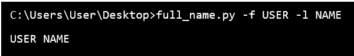
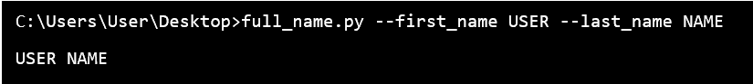

# Python 中的`getopt`模块

> 原文：<https://www.javatpoint.com/getopt-module-in-python>

getopt modules 是用于命令行选项的分析器，这些选项基于 UNIX **getopt()** 函数组织的约定。它基本上用于分析像 **sys.argv** 这样的论证序列。我们也可以理解这个模块，因为它帮助脚本分析 **sys.argv.** 中的命令行参数。这个模块的工作方式类似于 C 编程语言 **getotp()** 函数，用于分析命令行参数。

## Python getopt 函数

这些模块提供了一些主要功能，即 **getopt()。**该功能的功能是分析命令行选项和参数列表。

**语法:**

```py

getopt.getopt ( args , options , [ long_options ] )

```

**参数:**

getopt.getopt()模块采用以下参数。

**参数:**参数是要传递的参数列表

**选项:**选项是脚本想要识别的一串选项字母。需要参数的选项应该用冒号( :)书写。

**长选项:**这是长选项名称的字符串列表。需要参数的选项应该用等号(=)书写。

**返回类型:**getopt()模块函数的返回值由两个元素组成。返回值的第一个元素是(选项、值)对的列表，返回值的第二个元素是选项列表被剥离时留下的程序参数的列表。

**支持的选项语法包括:**

```py

-	- a
-	- bvalue
-	- b value
-	-- noargument
-	-- withargument=value
-	-- withargument value

```

## Getopt()的函数参数

getopt()模块函数接受三个参数:

*   getopt()模块的第一个参数由要分析的参数的分类组成。这通常源自 sys.argv [ 1: ](在 sys.argv [ 0 ]中忽略程序名)参数序列。
*   第二个参数是字符串，它是单字符选项的选项定义。如果任一选项需要参数，它的字母用冒号[ : ]书写。
*   getopt()模块函数的第三个参数是长样式选项的名称序列。长样式选项名称可以由多个字符组成，例如:- noargument 或-with reguement。参数序列中的选项名称不得包含“-”前缀。如果任何长样式选项需要一个参数，它的名称应该用等号(=)来签名。

用户可以在一次通话中组合选项的长形式和短形式。

## 短格式选项:

假设用户的程序采用两个选项- a '和- b '，其中- b '选项需要一个参数，那么该值必须是" ab:"。

```py

import getopt     #importing the getopt module

print getopt.getopt ( [ ' -a ' , ' -bval ' , ' -c ' , ' val ' ] , ' ab:c: ' )
$ python getopt_short.py

( [ ( ' -a ' , ' ' ) , ( ' -b ' , ' val ' ) , ( ' -c ' , ' val ' ) ] , [ ] )

```

## Getopt()中的长格式选项

如果用户的程序想要采用两个选项，例如，“- noarguement”和“-with guement”，那么争论的顺序将是[ ' noarguement '，' with guement = ']。

```py

import getopt                               # importing getopt () module
print getopt.getopt ( [ ' -noarguement ' , ' -witharguement ' , ' value ' , ' -witharguement2 = another ' ] , '  ' , [ ' noarguement ' , ' witharguement = ' , ' witharguement2 = ' ] )
$ python getopt_long.py
( [ ( ' -noarguement ' , ' ' ) , ( '?witharguement ' , ' value ' ) , ( ' -witharguement2 ' , ' another ' ) ] , [ ] )

```

### 例 1:

```py

import sys                                                 
# importing getopt module                         
import getopt  

def full_name ( ): 
    first_name = None
    last_name = None

    argv = sys.argv [ 1: ] 

    try: 
        opts , args = getopt.getopt ( argv, " f:l: " ) 

    except: 
        print ( " Error " ) 

    for opt , arg in opts: 
        if opt in [ ' -f ' ]: 
            first_name = arg 
        elif opt in [ ' -l ' ] : 
            last_name = arg 

    print ( first_name + " " + last_name ) 

full_name ( ) 

```

**输出:**



这里，用户创建了一个函数 full_name()，它将在从命令行接收到名字和姓氏后打印用户的全名。用户还将名字缩写为“f”，将姓氏缩写为“l”。

### 例 2:

在本例中，用户可以使用完整的形式作为“名字”和“姓氏”，而不是使用简短的形式作为“f”和“l”。

```py

import sys                                                 
import getopt                                           # import getopt module         

def full_name ( ): 
    first_name = None
    last_name = None

    argv = sys.argv [ 1: ] 

    try: 
        opts , args = getopt.getopt ( argv , " f:l: " ,  [ " first_name = " , " last_name = " ] ) 

    except: 
        print ( " Error " ) 

    for opt , arg in opts: 
        if opt in [ ' -f ' , ' --first_name ' ] : 
            first_name = arg 
        elif opt in [ ' -l ' , ' -- last_name ' ] : 
            last_name = arg 

    print ( first_name + " " + last_name ) 

full_name ( ) 

```

**输出:**



用户必须记住，短形式参数的单破折号(“-”)和长形式参数的单破折号(“-”)用户应该使用双破折号(“-”)。

## 结论:

在本文中，我们讨论了 **getopt()** 模块及其函数和参数。我们还解释了不同的实现形式，并在命令行提示符中使用适当的规则，以及定义良好的示例。

* * *