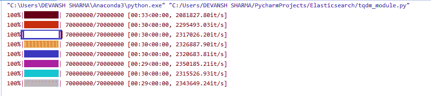

# Python `tqdm`模块，如何创建终端进度条


每当我们安装任何 Python 库、模块或安装软件时，我们都会看到进度条显示在屏幕上，进度条表示估计完成或渲染过程需要多长时间的小进度条。它给我们一种活跃的印象，可以镇定神经。我们都熟悉各种进度条。有些很吸引人，有些很无聊。

在本文中，我们将创建进度条，而不涉及 Python 的代码核心日志库。

进度条根据完成任务的进度百分比来填充。进度可以通过将**已处理的项目数量除以**总输入项目来计算。**各种因素会影响进度条，例如网络速度、延迟，以及是否将数据保存到本地存储以获得更准确的预计到达时间。**

我们可以使用名为 **tqdm** 的 [Python](https://www.javatpoint.com/python-tutorial) 外部库创建简单且没有麻烦的进度条。我们可以把它添加到代码中，让它看起来很可爱。

tqdm 在阿拉伯语中代表 taqadum，意思是进步。Python `tqdm`模块在 Linux、Window、Mac 等各种平台上工作。并且还兼容 IPython/ [Jupyter 笔记本](https://www.javatpoint.com/jupyter-notebook)。

## 进度条的需求

如果我们使用的是较小的数据集，那么在我们的工作流程中就不会有进展。但是，进度条可用于迭代数据集、训练模型或编码大型信息集。

*   进度条为我们提供了一个进程的估计，并给出了可能需要更多时间的近似值。
*   它给我们的信息是进度还在运行，没有被粗暴地终止。

## 先决条件

Python 3 必须安装在系统中，我们也可以创建一个虚拟环境来安装 tqdm 库。

## 装置

打开命令行终端并键入以下内容。

```py

pip install tqdm

```

或者

```py

pip3 install tqdm

```

上述命令将在系统中成功安装。我们可以使用下面的语句来验证它。

```py

import tqdm

```

如果没有错误，则表示此库已成功安装。

## 为循环添加进度条

程序

```py

import time
import sys
from tqdm import trange

def do_something():
    time.sleep(1)

def do_another_something():
    time.sleep(1)

for i in trange(10, file=sys.stdout, desc='outer loop'):
    do_something()

    for j in trange(100,file=sys.stdout, leave=False, unit_scale=True, desc='inner loop'):
        do_another_something()

```

**输出:**

```py
outer loop:   0%|          | 0/10 [00:00<?, ?it/s]
inner loop:   0%|          | 0.00/100 [00:00<?, ?it/s]
inner loop:   1%|          | 1.00/100 [00:01<01:40, 1.02s/it]
inner loop:   2%|▏         | 2.00/100 [00:02<01:39, 1.02s/it]
inner loop:   3%|▎         | 3.00/100 [00:03<01:38, 1.01s/it]
inner loop:   4%|▍         | 4.00/100 [00:04<01:37, 1.01s/it]
inner loop:   5%|▌         | 5.00/100 [00:05<01:35, 1.01s/it]
inner loop:   6%|▌         | 6.00/100 [00:06<01:34, 1.01s/it]
inner loop:   7%|▋         | 7.00/100 [00:07<01:34, 1.01s/it]
inner loop:   8%|▊         | 8.00/100 [00:08<01:33, 1.02s/it]
inner loop:   9%|▉         | 9.00/100 [00:09<01:32, 1.02s/it]
inner loop:  10%|█         | 10.0/100 [00:10<01:31, 1.02s/it]
inner loop:  11%|█         | 11.0/100 [00:11<01:30, 1.01s/it]
inner loop:  12%|█▏        | 12.0/100 [00:12<01:29, 1.01s/it]
inner loop:  13%|█▎        | 13.0/100 [00:13<01:28, 1.01s/it]
inner loop:  14%|█▍        | 14.0/100 [00:14<01:29, 1.04s/it]
inner loop:  15%|█▌        | 15.0/100 [00:15<01:27, 1.03s/it]
inner loop:  16%|█▌        | 16.0/100 [00:16<01:26, 1.02s/it]
inner loop:  17%|█▋        | 17.0/100 [00:17<01:24, 1.02s/it]
inner loop:  18%|█▊        | 18.0/100 [00:18<01:23, 1.02s/it]
inner loop:  19%|█▉        | 19.0/100 [00:19<01:22, 1.02s/it]
…………………………………………………………………………………………….
……………………………………………………………………………………………..
It will go till it reached at 100%.

```

让我们理解另一个例子。

示例- 1

```py

# importing modules
from tqdm import trange
from time import sleep

# creating loop
for i in trange(10, desc="loop "):
    # slowing the for loop
    sleep(0.1) 

```

**输出:**

```py
环路:100%|██████████| 10/10[00:01 < 00:00，9.08it/s]

```

**示例-**

```py

# importing modules
from tqdm import tnrange
from time import sleep

# creating loop
for i in tnrange(2, dec="loop 1"):

    # creating nested loop
    for j in tnrange(5, dec="loop 2"):
        # slowing the for loop
        sleep(0.3)

```

**输出:**

```py
outer loop:   0%|          | 0/10 [00:00<?, ?it/s]
inner loop:   0%|          | 0.00/100 [00:00<?, ?it/s]
inner loop:   1%|          | 1.00/100 [00:01<01:39, 1.00s/it]
inner loop:   2%|▏         | 2.00/100 [00:02<01:38, 1.00s/it]
inner loop:   3%|▎         | 3.00/100 [00:03<01:37, 1.00s/it]
inner loop:   4%|▍         | 4.00/100 [00:04<01:36, 1.00s/it]
inner loop:   5%|▌         | 5.00/100 [00:05<01:35, 1.00s/it]
inner loop:   6%|▌         | 6.00/100 [00:06<01:34, 1.01s/it]
inner loop:   7%|▋         | 7.00/100 [00:07<01:33, 1.01s/it]
inner loop:   8%|▊         | 8.00/100 [00:08<01:32, 1.01s/it]
inner loop:   9%|▉         | 9.00/100 [00:09<01:31, 1.00s/it]
inner loop:  10%|█         | 10.0/100 [00:10<01:30, 1.01s/it]

```

**示例-3**

```py

# importing modules
import time
import sys
from tqdm import trange

# creating random function
def random_function():
    time.sleep(0.5)

# another random function
def another_random_function():
    time.sleep(0.2)

# defining outer loop
for i in trange(3, file=sys.stdout, desc='Outer loop'):
    random_function()

    # inner loop
    for j in trange(5, file=sys.stdout, desc='Inner loop'):
        another_random_function()

```

**输出:**

```py
Outer loop:   0%|          | 0/3 [00:00<?, ?it/s]
Inner loop:   0%|          | 0/5 [00:00<?, ?it/s]
Inner loop:  20%|██        | 1/5 [00:00<00:00,  4.62it/s]
Inner loop:  40%|████      | 2/5 [00:00<00:00,  4.64it/s]
Inner loop:  60%|██████    | 3/5 [00:00<00:00,  4.63it/s]
Inner loop:  80%|████████  | 4/5 [00:00<00:00,  4.65it/s]
Outer loop:  33%|███▎      | 1/3 [00:01<00:03,  1.58s/it]
Inner loop:   0%|          | 0/5 [00:00<?, ?it/s]
Inner loop:  20%|██        | 1/5 [00:00<00:00,  4.91it/s]
Inner loop:  40%|████      | 2/5 [00:00<00:00,  4.85it/s]
Inner loop:  60%|██████    | 3/5 [00:00<00:00,  4.79it/s]
Inner loop:  80%|████████  | 4/5 [00:00<00:00,  4.77it/s]
Outer loop:  67%|██████▋   | 2/3 [00:03<00:01,  1.58s/it]
Inner loop:   0%|          | 0/5 [00:00<?, ?it/s]
Inner loop:  20%|██        | 1/5 [00:00<00:00,  4.43it/s]
Inner loop:  40%|████      | 2/5 [00:00<00:00,  4.56it/s]
Inner loop:  60%|██████    | 3/5 [00:00<00:00,  4.65it/s]
Inner loop:  80%|████████  | 4/5 [00:00<00:00,  4.72it/s]
Outer loop: 100%|██████████| 3/3 [00:04<00:00,  1.57s/it]

```

## 进度条的预测性手动更新

`tqdm`模块提供了一种在特定时间间隔手动更新进度条的工具。当我们以块或流数据下载多部分文件时，我们可以手动更新进程栏功能。让我们理解下面的例子。

**示例-**

```py

# importing modules
import time
import sys
from tqdm import tqdm

def task():
    time.sleep(1)

with tqdm(total=100, file=sys.stdout) as pbar:
    for i in range(10):
        task()
        # Here we are updating progress bar manually, useful for streams such as reading files.
        pbar.update(10)
        # Updates in increments of 10 stops at 100

```

**输出:**

```py
100%|██████████| 100/100 [00:10<00:00, 9.93it/s]

```

**解释-**

在上面的代码中，我们将属性设置为 100。被调用的函数在每次迭代中递增 10，直到达到 100%。我们可以将任何值传递给 update()方法。

## 螺纹进度条

我们还可以将 Python tqdm 包捕获到 Python 线程中。多进程是使用内核总数的最佳方式。tqdm 位置参数允许我们指定打印该条的行偏移量。在没有脚本的情况下，默认设置为自动。让我们理解下面的例子。必须指定该值才能同时管理多个条。如果我们忽略这个参数，我们的条将被不同的线程覆盖。

**示例-**

```py

import time

from random import randrange
from multiprocessing.pool import ThreadPool

from tqdm import tqdm

def func_call(position, total):
    text = 'progressbar #{position}'.format(position=position)
    with  tqdm(total=total, position=position, desc=text) as progress:
        for _ in range(0, total, 5):
            progress.update(5)
            time.sleep(randrange(3))

pool = ThreadPool(10)
tasks = range(5)
for i, url in enumerate(tasks, 1):
    pool.apply_async(func_call, args=(i, 100))
pool.close()
pool.join()

```

**输出:**

```py
progressbar #5:   0%|          | 0/100 [00:00<?, ?it/s]
progressbar #2:   0%|          | 0/100 [00:00<?, ?it/s]
progressbar #1:   0%|          | 0/100 [00:00<?, ?it/s]
progressbar #4:   0%|          | 0/100 [00:00<?, ?it/s]
progressbar #3:   0%|          | 0/100 [00:00<?, ?it/s]
progressbar #3:  10%|█         | 10/100 [00:01<00:09,  9.91it/s]
progressbar #5:  10%|█         | 10/100 [00:01<00:09,  9.91it/s]
progressbar #1:  10%|█         | 10/100 [00:02<00:18,  4.97it/s]
progressbar #2:  10%|█         | 10/100 [00:02<00:18,  4.96it/s]
progressbar #4:  10%|█         | 10/100 [00:02<00:18,  4.96it/s]
progressbar #5:  15%|█▌        | 15/100 [00:02<00:11,  7.64it/s]
progressbar #3:  15%|█▌        | 15/100 [00:02<00:11,  7.64it/s]
progressbar #4:  15%|█▌        | 15/100 [00:03<00:17,  4.96it/s]
progressbar #2:  15%|█▌        | 15/100 [00:03<00:17,  4.95it/s]
progressbar #3:  20%|██        | 20/100 [00:04<00:16,  4.71it/s]
progressbar #5:  25%|██▌       | 25/100 [00:04<00:11,  6.58it/s]
progressbar #1:  20%|██        | 20/100 [00:04<00:16,  4.97it/s]
progressbar #2:  20%|██        | 20/100 [00:04<00:16,  4.96it/s]

```

## 在 Tqdm 进度条中添加颜色

颜色可以使进度条非常吸引人。然而，它并没有给酒吧的工作增加任何新的功能。tqdm 可以和 Colorama 一起工作，Colorama 是 Python 中一种简单的跨平台彩色终端文本。让我们理解下面的例子。

**示例-**

```py

from tqdm import trange
from colorama import Fore

# Cross-platform colored terminal text.
color_bars = [Fore.BLACK,
    Fore.RED,
    Fore.GREEN,
    Fore.YELLOW,
    Fore.BLUE,
    Fore.MAGENTA,
    Fore.CYAN,
    Fore.WHITE]

for color in color_bars:
    for i in trange(int(7e7),
                    bar_format="{l_bar}%s{bar}%s{r_bar}" % (color, Fore.RESET)):
        pass

```

**输出:**



## 结论

我们已经讨论了与进度条相关的所有基本概念。Python 附带了 `tqdm`模块，可以帮助我们手动设计。我们已经为可以在 `tqdm`模块中执行的重要操作定义了合适的示例。`tqdm`模块可以与子流程和线程协作，在这里我们可以同时运行多个流程条。

* * *