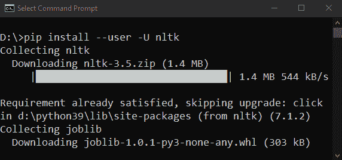

# Python 中的分词器

> 原文：<https://www.javatpoint.com/tokenizer-in-python>

众所周知，互联网上有大量的文本数据。但是，我们大多数人可能不熟悉开始处理这些文本数据的方法。此外，我们还知道，在机器学习中导航我们语言的字母是一个棘手的部分，因为机器可以识别数字，而不是字母。

那么，如何进行文本数据操作和清理来创建模型呢？为了回答这个问题，让我们探索一下 [**【自然语言处理(NLP)**](https://www.javatpoint.com/nlp) 下面的一些奇妙的概念。

解决自然语言处理问题是一个分为多个阶段的过程。首先，我们必须在进入建模阶段之前清理非结构化文本数据。数据清理包括一些关键步骤。这些步骤如下:

1.  单词分词
2.  每个标记的词性预测
3.  文本引理化
4.  停止单词识别和删除，等等。

在接下来的教程中，我们将学习更多关于被称为**分词**的非常初级的步骤。我们将了解什么是分词，为什么它对自然语言处理是必要的。此外，我们还将在 [Python](https://www.javatpoint.com/python-tutorial) 中发现一些执行分词的独特方法。

### 理解分词

**分词**据说是将大量文本分割成更小的片段，称为**标记**。这些片段或标记对于找到模式非常有用，并且被认为是词干化和引理化的基础步骤。分词还支持用非敏感数据元素替换敏感数据元素。

**自然语言处理(NLP)** 用于创建文本分类、情感分析、智能聊天机器人、语言翻译等应用。因此，理解文本模式以达到上述目的变得很重要。

但是现在，考虑词干化和词条化作为在自然语言处理的帮助下清理文本数据的主要步骤。像文本分类或垃圾邮件过滤这样的任务使用自然语言处理以及像[](https://www.javatpoint.com/keras)**和 [**Tensorflow**](https://www.javatpoint.com/tensorflow) 这样的深度学习库。**

 **### 理解分词在自然语言处理中的意义

为了理解分词的意义，让我们以英语为例。让我们在理解下一节时，选择任何一个句子并牢记在心。

在处理自然语言之前，我们必须识别构成字符串的单词。因此，分词似乎是进行自然语言处理的最基本步骤

这一步是必要的，因为文本的实际含义可以通过分析文本中出现的每个单词来解释。

现在，让我们以下面的字符串为例:

> 我叫杰米·克拉克。

对上述字符串执行分词后，我们将获得如下所示的输出:

**['我的'，'名字'，'是'，'杰米'，'克拉克']**

执行该操作有多种用途。我们可以利用分词的形式来:

*   数数课文中的单词总数。
*   计算单词出现的频率，即特定单词出现的总次数，还有更多。

现在，让我们了解在 Python 自然语言处理中执行分词的几种方法。

### Python 中执行分词的一些方法

对文本数据执行分词有各种独特的方法。下面描述了其中一些独特的方法:

### 在 Python 中使用 split()函数进行分词

**split()** 函数是分割字符串的基本方法之一。此函数在通过特定分隔符拆分提供的字符串后返回字符串列表。默认情况下， **split()** 函数在每个空格处断开一个字符串。但是，我们可以根据需要指定分隔符。

让我们考虑以下例子:

**示例 1.1:使用 split()函数的单词分词**

```py

my_text = """Let's play a game, Would You Rather! It's simple, you have to pick one or the other. Let's get started. Would you rather try Vanilla Ice Cream or Chocolate one? Would you rather be a bird or a bat? Would you rather explore space or the ocean? Would you rather live on Mars or on the Moon? Would you rather have many good friends or one very best friend? Isn't it easy though? When we have less choices, it's easier to decide. But what if the options would be complicated? I guess, you pretty much not understand my point, neither did I, at first place and that led me to a Bad Decision."""

print(my_text.split())

```

**输出:**

```py
['Let's', 'play', 'a', 'game,', 'Would', 'You', 'Rather!', 'It's', 'simple,', 'you', 'have', 'to', 'pick', 'one', 'or', 'the', 'other.', 'Let's', 'get', 'started.', 'Would', 'you', 'rather', 'try', 'Vanilla', 'Ice', 'Cream', 'or', 'Chocolate', 'one?', 'Would', 'you', 'rather', 'be', 'a', 'bird', 'or', 'a', 'bat?', 'Would', 'you', 'rather', 'explore', 'space', 'or', 'the', 'ocean?', 'Would', 'you', 'rather', 'live', 'on', 'Mars', 'or', 'on', 'the', 'Moon?', 'Would', 'you', 'rather', 'have', 'many', 'good', 'friends', 'or', 'one', 'very', 'best', 'friend?', 'Isn't', 'it', 'easy', 'though?', 'When', 'we', 'have', 'less', 'choices,', 'it's', 'easier', 'to', 'decide.', 'But', 'what', 'if', 'the', 'options', 'would', 'be', 'complicated?', 'I', 'guess,', 'you', 'pretty', 'much', 'not', 'understand', 'my', 'point,', 'neither', 'did', 'I,', 'at', 'first', 'place', 'and', 'that', 'led', 'me', 'to', 'a', 'Bad', 'Decision.']

```

**说明:**

在上面的例子中，我们使用了 **split()** 方法，以便将段落分成更小的片段或说出单词。同样，我们也可以通过指定分隔符作为 **split()** 函数的参数来将段落分成句子。正如我们所知，一个句子通常以**句号结尾**；这意味着我们可以利用**。”**作为拆分字符串的分隔符。

让我们在下面的例子中考虑同样的情况:

**示例 1.2:使用 split()函数的句子分词**

```py

my_text = """Dreams. Desires. Reality. There is a fine line between dream to become a desire and a desire to become a reality but expectations are way far then the reality. Nevertheless, we live in a world of mirrors, where we always want to reflect the best of us. We all see a dream, a dream of no wonder what; a dream that we want to be accomplished no matter how much efforts it needed but we try."""

print(my_text.split('. '))

```

**输出:**

```py
['Dreams', 'Desires', 'Reality', 'There is a fine line between dream to become a desire and a desire to become a reality but expectations are way far then the reality', 'Nevertheless, we live in a world of mirrors, where we always want to reflect the best of us', 'We all see a dream, a dream of no wonder what; a dream that we want to be accomplished no matter how much efforts it needed but we try.']

```

**说明:**

在上面的例子中，我们使用了**句号(。)**作为其参数，以便在句号处中断段落。使用 **split()** 函数的一个主要缺点是，该函数一次只取一个参数。因此，我们只能使用分隔符来拆分字符串。此外， **split()** 函数不将标点符号视为单独的片段。

### Python 中使用正则表达式的分词

在进入下一个方法之前，让我们简单地了解一下正则表达式。一个**正则表达式**，也被称为**正则表达式**，是一个特殊的字符序列，允许用户在该序列的帮助下找到或匹配其他字符串或字符串集作为模式。

为了开始使用**正则表达式**，Python 提供了名为 **re** 的库。 **re** 库是 Python 中预先安装的库之一。

让我们考虑以下基于使用 Python 中 **RegEx** 方法的单词分词和句子分词的示例。

**示例 2.1:使用 Python 中的 RegEx 方法进行单词分词**

```py

import re

my_text = """Joseph Arthur was a young businessman. He was one of the shareholders at Ryan Cloud's Start-Up with James Foster and George Wilson. The Start-Up took its flight in the mid-90s and became one of the biggest firms in the United States of America. The business was expanded in all major sectors of livelihood, starting from Personal Care to Transportation by the end of 2000\. Joseph was used to be a good friend of Ryan."""

my_tokens = re.findall

```

**输出:**

```py
['Joseph', 'Arthur', 'was', 'a', 'young', 'businessman', 'He', 'was', 'one', 'of', 'the', 'shareholders', 'at', 'Ryan', 'Cloud', 's', 'Start', 'Up', 'with', 'James', 'Foster', 'and', 'George', 'Wilson', 'The', 'Start', 'Up', 'took', 'its', 'flight', 'in', 'the', 'mid', '90s', 'and', 'became', 'one', 'of', 'the', 'biggest', 'firms', 'in', 'the', 'United', 'States', 'of', 'America', 'The', 'business', 'was', 'expanded', 'in', 'all', 'major', 'sectors', 'of', 'livelihood', 'starting', 'from', 'Personal', 'Care', 'to', 'Transportation', 'by', 'the', 'end', 'of', '2000', 'Joseph', 'was', 'used', 'to', 'be', 'a', 'good', 'friend', 'of', 'Ryan']

```

**说明:**

在上面的例子中，我们已经导入了 **re** 库，以便使用它的功能。然后我们使用了 **re** 库的 **findall()** 功能。该函数帮助用户找到与参数中的模式匹配的所有单词，并将它们存储在列表中。

此外，**“\ w”**用于表示任何单词字符，指**字母数字(包括字母、数字)和下划线（`_`）** 。**“+”表示任意频率**。因此，我们遵循了 **[\w']+** 模式，这样程序应该查找并找到所有字母数字字符，直到遇到任何其他字符。

现在，让我们看一下使用 RegEx 方法的句子分词。

**示例 2.2:使用 Python 中的 RegEx 方法进行句子分词**

```py

import re

my_text = """The Advertisement was telecasted nationwide, and the product was sold in around 30 states of America. The product became so successful among the people that the production was increased. Two new plant sites were finalized, and the construction was started. Now, The Cloud Enterprise became one of America's biggest firms and the mass producer in all major sectors, from transportation to personal care. Director of The Cloud Enterprise, Ryan Cloud, was now started getting interviewed over his success stories. Many popular magazines were started publishing Critiques about him."""

my_sentences = re.compile('[.!?] ').split(my_text)
print(my_sentences)

```

**输出:**

```py
['The Advertisement was telecasted nationwide, and the product was sold in around 30 states of America', 'The product became so successful among the people that the production was increased', 'Two new plant sites were finalized, and the construction was started', "Now, The Cloud Enterprise became one of America's biggest firms and the mass producer in all major sectors, from transportation to personal care", 'Director of The Cloud Enterprise, Ryan Cloud, was now started getting interviewed over his success stories', 'Many popular magazines were started publishing Critiques about him.']

```

**说明:**

在上面的例子中，我们使用了参数为“[”的 **re** 库的 **compile()** 函数。？！]，并使用 **split()** 方法从指定的分隔符中分离字符串。因此，一旦遇到这些字符，程序就会拆分句子。

## Python 中使用自然语言工具包的分词

**自然语言工具包**，又名 **NLTK** ，是一个用 Python 编写的库。 **NLTK** 库一般用于符号和统计自然语言处理，与文本数据配合良好。

**自然语言工具包(NLTK)** 是一个第三方库，可以在命令Shell或终端中使用以下语法安装:

```py

$ pip install --user -U nltk

```



为了验证安装，可以在程序中导入 **nltk** 库并执行，如下所示:

```py

import nltk

```

如果程序没有产生错误，那么库已经成功安装。否则，建议再次遵循上述安装程序，并阅读官方文档了解更多详细信息。

**自然语言工具包(NLTK)** 有一个名为 **tokenize()** 的模块。本模块进一步分为两个子类别:**单词分词和句子分词**

1.  **单词 token ize:****单词 _tokenize()** 方法用于将字符串拆分为标记或说出单词。
2.  **句子 Tokenize:** 使用**send _ token ize()**方法将字符串或段落拆分成句子。

让我们考虑一些基于这两种方法的例子:

**示例 3.1:使用 Python 中的 NLTK 库进行单词分词**

```py

from nltk.tokenize import word_tokenize

my_text = """The Advertisement was telecasted nationwide, and the product was sold in around 30 states of America. The product became so successful among the people that the production was increased. Two new plant sites were finalized, and the construction was started. Now, The Cloud Enterprise became one of America's biggest firms and the mass producer in all major sectors, from transportation to personal care. Director of The Cloud Enterprise, Ryan Cloud, was now started getting interviewed over his success stories. Many popular magazines were started publishing Critiques about him."""

print(word_tokenize(my_text))

```

**输出:**

```py
['The', 'Advertisement', 'was', 'telecasted', 'nationwide', ',', 'and', 'the', 'product', 'was', 'sold', 'in', 'around', '30', 'states', 'of', 'America', '.', 'The', 'product', 'became', 'so', 'successful', 'among', 'the', 'people', 'that', 'the', 'production', 'was', 'increased', '.', 'Two', 'new', 'plant', 'sites', 'were', 'finalized', ',', 'and', 'the', 'construction', 'was', 'started', '.', 'Now', ',', 'The', 'Cloud', 'Enterprise', 'became', 'one', 'of', 'America', "'s", 'biggest', 'firms', 'and', 'the', 'mass', 'producer', 'in', 'all', 'major', 'sectors', ',', 'from', 'transportation', 'to', 'personal', 'care', '.', 'Director', 'of', 'The', 'Cloud', 'Enterprise', ',', 'Ryan', 'Cloud', ',', 'was', 'now', 'started', 'getting', 'interviewed', 'over', 'his', 'success', 'stories', '.', 'Many', 'popular', 'magazines', 'were', 'started', 'publishing', 'Critiques', 'about', 'him', '.']

```

**说明:**

在上面的程序中，我们已经从 **NLTK** 库的 **tokenize** 模块导入了 **word_tokenize()** 方法。因此，该方法将字符串分解成不同的标记，并将其存储在列表中。最后，我们打印了清单。此外，该方法还包括 ***句号和其他标点符号*** 作为单独的标记。

**示例 3.1:使用 Python 中的 NLTK 库进行句子分词**

```py

from nltk.tokenize import sent_tokenize

my_text = """The Advertisement was telecasted nationwide, and the product was sold in around 30 states of America. The product became so successful among the people that the production was increased. Two new plant sites were finalized, and the construction was started. Now, The Cloud Enterprise became one of America's biggest firms and the mass producer in all major sectors, from transportation to personal care. Director of The Cloud Enterprise, Ryan Cloud, was now started getting interviewed over his success stories. Many popular magazines were started publishing Critiques about him."""

print(sent_tokenize(my_text))

```

**输出:**

```py
['The Advertisement was telecasted nationwide, and the product was sold in around 30 states of America.', 'The product became so successful among the people that the production was increased.', 'Two new plant sites were finalized, and the construction was started.', "Now, The Cloud Enterprise became one of America's biggest firms and the mass producer in all major sectors, from transportation to personal care.", 'Director of The Cloud Enterprise, Ryan Cloud, was now started getting interviewed over his success stories.', 'Many popular magazines were started publishing Critiques about him.']

```

**说明:**

在上面的程序中，我们已经从 **NLTK** 库的 **tokenize** 模块导入了**send _ token ize()**方法。因此，该方法将段落分成不同的句子，并将其存储在列表中。最后，我们打印了清单。

### 结论

在上面的教程中，我们已经发现了**分词**的概念及其在整个**自然语言处理(NLP)** 管道中的作用。我们还讨论了 Python 中从特定文本或字符串进行分词的几种方法(包括**单词分词和句子分词**)。

* * ***