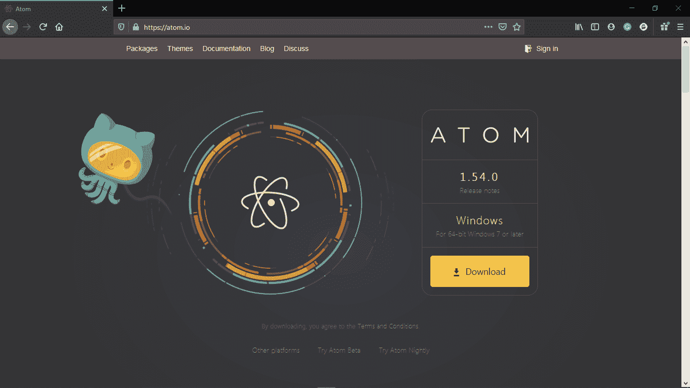
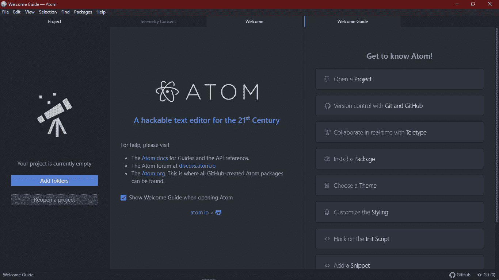
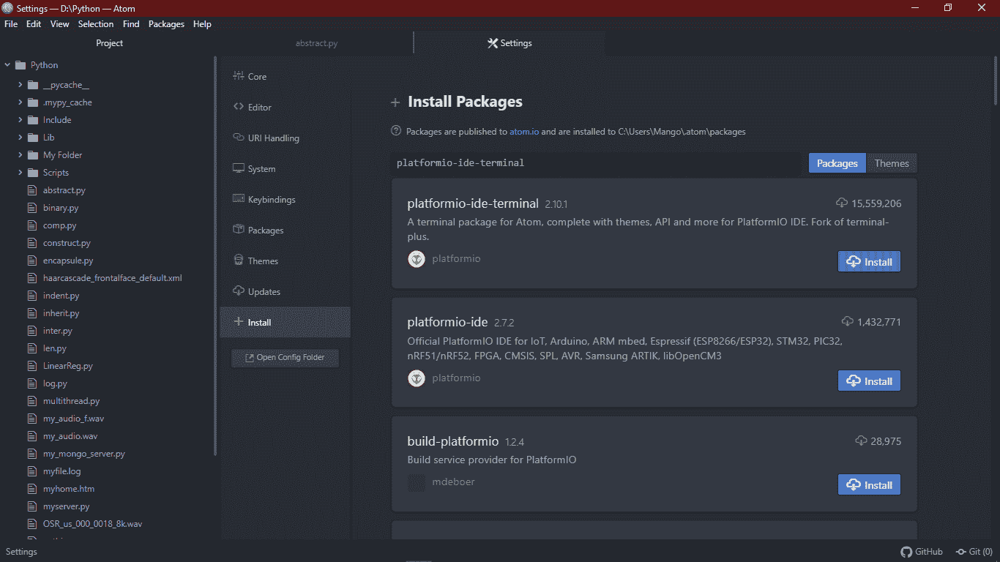
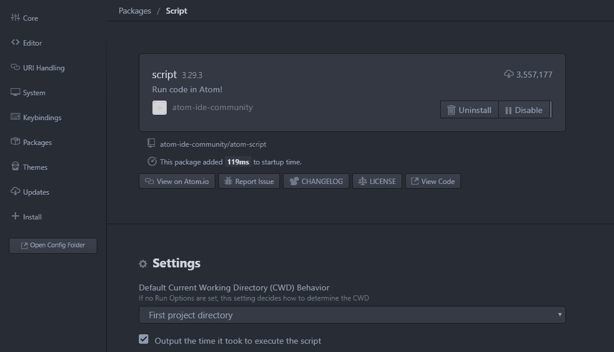
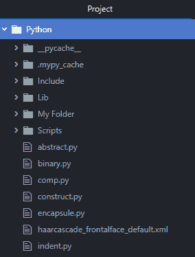
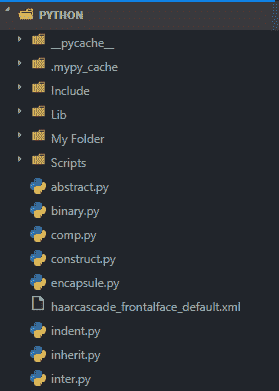
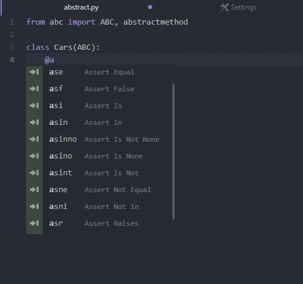
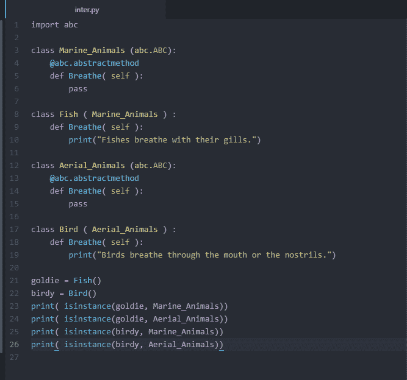
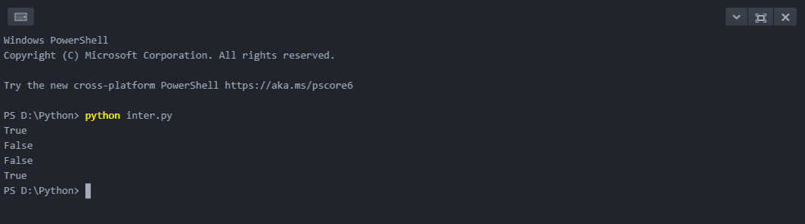

# Atom Python

> 原文：<https://www.javatpoint.com/atom-python>

### 原子导论

时间不会为任何人停顿，这是一个普遍的事实，为了跟上这个飞速发展的时代，我们必须不断升级工具。软件开发是主要职业之一，它需要最有资源的环境来让程序员编写代码和高效地生产软件。因此，它需要一个有效的文本编辑器和集成开发环境。关于 [Python 编程语言](https://www.javatpoint.com/python-tutorial)，Atom 在 [IDE](https://www.javatpoint.com/python-ides) 方面服务最好。 **Atom** 是一个免费的开源集成开发环境，专门为致力于开发的 **Python** 开发人员而设计。

但是，在深入了解这个概念之前，让我们先快速了解一下我们将在本教程中介绍的主题:

1.  了解对 Atom Python 的需求
2.  理解原子文本编辑器
3.  下载和安装 Atom Python
4.  原子 Python 中的代码执行
5.  原子 Python 主题化
6.  原子 Python 实验
7.  Python 特定的配置

让我们从了解 [Python Atom IDE](https://www.javatpoint.com/python-ides#Atom) 的实际重要性开始。

### 了解对 Atom Python 的需求

创建和执行 Python 程序的最基本方法是使用代表 Python 的. py 扩展名创建一个空文件。之后，我们必须使用命令行外壳或终端，以便使用以下语法指向该文件:

```py

$ python file_name.py

```

另一方面，我们可以利用**Python 的 IDLE 集成开发学习环境)**，一个默认执行 Python 代码的应用。然而，为了获得一些有成效的东西，这两个主要选项似乎不是一个好的选择。我们将需要更有成效和更可靠的东西。因此，当 Atom Python IDE 派上用场时。Atom 不包含传统意义上的任何特殊功能；相反，它构建包来存储它的可黑客核心。这些包包括代码行、自动完成和代码高亮等功能。

现在，让我们开始了解出色的 Atom 文本编辑器。

### 理解原子文本编辑器

**Atom** 是一个免费的、开源的、多平台的文本编辑器或 IDE，支持 [NodeJS](https://www.javatpoint.com/nodejs-tutorial) 开发包和嵌入式 Git 控件。大多数扩展包都是免费提供的，由开源社区开发。Atom IDE 基于电子框架(以前称为 Atom Shell)。电子框架允许开发人员在 NodeJS 和 Chromium 的帮助下，在 [Linux](https://www.javatpoint.com/linux-tutorial) 、MacOS、 [Windows](https://www.javatpoint.com/windows) 等多个平台上使用桌面应用。Atom IDE 用 Less 和 CoffeeScript 编写，由 [GitHub](https://www.javatpoint.com/github) 开发维护。

Atom 文本编辑器也被其开发人员称为 21 世纪的可黑客文本编辑器，可在 [HTML](https://www.javatpoint.com/html-tutorial) 、 [JavaScript](https://www.javatpoint.com/javascript-tutorial) 和 [CSS](https://www.javatpoint.com/css-tutorial) 中完全定制。

现在，让我们看看如何下载和安装 Atom 文本编辑器。

### 下载和安装 Atom Python 文本编辑器

我们可以从官网下载 Atom Python 文本编辑器:[https://atom.io/](https://atom.io/)。它会自动检测当前的操作系统配置，并显示相应的安装文件供下载。



要下载安装文件，请单击下载。下载过程完成后，打开安装文件，以便在系统中安装应用。由于安装过程是自动的，因此不需要任何手动操作。一旦安装成功，Atom 将在默认目录中自动打开，并且还将在开始菜单中创建一个应用快捷方式。

现在，为了执行 Python 代码，我们必须安装所需的插件和包。

现在让我们理解 Atom Python 的配置，以标准方法从用户偏好的目录中访问它。Atom 还在欢迎指南的帮助下提供了主题或软件包安装等功能。我们现在关闭欢迎指南，并取消选中“ ***【打开 Atom*** 时显示欢迎指南”选项。因此，欢迎指南不会在我们下次启动 atom 应用时出现。



我们现在可以进入目录，右键点击文件夹或文件，选择“**用 Atom** 打开”选项。

如果该选项在上下文菜单中不可用，我们可以从程序中启动它。我们所要做的就是进入 Atom 中的**文件**菜单。转到**设置**。我们也可以使用快捷键: **Ctrl +逗号(Ctrl +，)**来打开 Atom 中的设置。

在设置中，我们必须单击系统选项卡，并按如下方式检查选项:

1.  在文件上下文菜单中显示
2.  在文件夹上下文菜单中显示

此后，上下文菜单将开始显示“**用原子打开**选项。现在，我们可以直接在 Atom 中打开选定的文件或文件夹。

当我们打开 Atom 应用时，我们可以在左侧看到树形视图。但是，如果树视图不可见，我们可以在菜单栏中进入视图，点击切换**树视图**。我们也可以使用快捷键: **Ctrl + K Ctrl + B** 。这个树形视图包含链接文件夹中的文件，我们可以双击任何 python 文件来查看其内容。

### 原子 Python 中的代码执行

通常，我们使用命令提示符或终端来执行 Python 程序。然而，Atom 提供了一个名为**平台端**的插件来执行 python 代码。我们可以通过导航到菜单栏中的**文件**来设置这个插件。转到**设置**。点击**安装**标签。现在，在搜索栏中，搜索并安装**平台端**插件。我们可以使用上述方法来安装其他包、插件以及主题。



一旦插件成功安装，终端将被集成到 Atom 文本编辑器中。我们可以使用编辑器左下角的+图标来切换这个终端。

**拆分编辑器**

我们可以在 Atom 中打开多个文件，并通过导航到菜单栏中的视图来拆分窗口。转到窗格并选择向右拆分选项，以便将当前文件发送到窗口的右半部分。这将有助于用户在处理多个文件时提高工作效率。

### 原子 Python 主题化

Atom 提供两种类型的主题，称为语法主题和用户界面主题。语法主题用于确定代码的颜色并突出语法中的细节。相比之下，用户界面主题被用来改变下拉菜单、按钮等等的风格。

我们可以通过导航**文件**菜单中的**设置**并点击**主题**选项卡来检查所有已安装的主题。主题选项卡将显示相关输出。我们也可以通过点击设置中的 **+安装**标签，搜索想要的主题，来下载市面上各种各样的新主题。

**格式化**

我们也可以通过再次导航到设置并点击**编辑器**选项卡来更改字体的默认设置。在下面的选项卡中，我们可以找到许多与编辑器样式相关的选项，包括字体大小、字体样式等等。我们可以通过使用字体系列来改变字体，以便根据我们的选择来设计它的样式。

### 原子 Python 实验

我们还可以使用以下选项来尝试各种事情:

**线高:**

行高通常定义为两条线之间的间距。我们也可以通过导航到**编辑器**选项卡并根据需要进行更改来更改行高。

**滚动结束:**

一般来说，我们只能滚动代码，直到它的最后一行，也称为屏幕底部。我们通常不能滚动超过这个限制。但是，如果我们启用“滚动结束”包，我们可以在屏幕顶部查看底线。这个包在底部提供了空白空间，让用户可以舒适地使用他们的代码。

**显示缩进指南:**

缩进向导用于显示垂直线，这表示应该出现缩进。我们可以从**设置**中的**编辑器**选项卡启用显示缩进指南。

我们可以尝试各种其他选择。但是现在，让我们开始理解一些 Python 指定的配置。

### Python 特殊配置

为了提高 Python 的生产力，一些非常有益的插件如下:

**脚本:**

**脚本**包旨在显示与其他包的所有细节相关的文档，如快捷方式、命令等。如果觉得不舒服，我们总是可以通过导航到存储 keymaps 文件夹的 view code 选项卡来更改这些默认快捷方式。然后，我们必须打开**脚本. cson** 文件，并根据喜好进行更新。



比如我们把快捷方式改成了 **Ctrl + R** 。更新处理完成后，关闭所有窗口并重新启动 Atom IDE。重启后，我们可以使用定制的快捷方式使用 Python 脚本，底部还会出现一个输出框。但是我们也可以自定义如下所示的输出框:

进入**文件**菜单中的**设置**，点击 ***主题*** 选项卡。一个自定义 ***样式表*** 的链接在顶部可见。该链接将引导我们找到样式表。样式表打开后，粘贴以下代码片段以增加脚本控制台的字体大小。

```py

.script-view .line{
font-size: 20px;
}

```

**原子文件图标:**

**原子文件图标**包用于在树形视图中插入引导文件的图标，如下图所示:

**安装原子文件图标包前**



**安装完原子文件图标包后**



**自动完成-python:**

**自动完成-python** 包显示了关于当我们在编写代码时到达特定点时会给人什么印象的建议窗口。



**片状:**

**Flake** 充当 Python 的过线器，用于查找脚本中的错误并突出显示所有错误。我们可以通过在命令外壳或终端中使用以下命令安装 flake8 来启用 flake 包:

```py

$ pip install flake8

```

一旦安装完成，我们将在 Atom IDE 的左下角看到一个小图标。该图标将显示写入过程中遇到的错误列表。

**python-autoep 8:**

**python-auto ep8**包用于代码格式化。我们可以通过选择**保存**选项上的**格式**从**自动程序 8 插件设置**中启用它。

现在，让我们了解一下 Atom IDE 中的 python 代码执行。

### 如何在 Atom IDE 中执行 Python 代码？

让我们通过为抽象类编写简单的代码来理解 Atom IDE 中的 Python 代码执行。

**示例:**

**文件:**中间

```py

import abc

class Marine_Animals (abc.ABC):
    @abc.abstractmethod
    def Breathe( self ):
        pass

class Fish ( Marine_Animals ) :
    def Breathe( self ):
        print("Fishes breathe with their gills.")

class Aerial_Animals (abc.ABC):
    @abc.abstractmethod
    def Breathe( self ):
        pass

class Bird ( Aerial_Animals ) :
    def Breathe( self ):
        print("Birds breathe through their mouth or their nostrils.")

goldie = Fish()
birdy = Bird()
print( isinstance(goldie, Marine_Animals))
print( isinstance(goldie, Aerial_Animals))
print( isinstance(birdy, Marine_Animals))
print( isinstance(birdy, Aerial_Animals))

```

**一旦我们写完代码，它将看起来像下面的图像:**



现在让我们使用之前安装的终端继续执行代码。要使用终端，点击位于左下方的 **+图标**。现在，键入以下命令运行程序:

**输出:**

```py
$ python inter.py
True
False
False
True

```

**如下图所示:**



现在，让我们理解代码。

**说明:**

在上例中，我们定义了两个抽象类:**海洋 _ 动物**和**航空 _ 动物**。我们还为这些类定义了一个抽象方法，即**呼吸()**。我们还定义了两个子类，即**鱼**和**鸟**，它们继承了上述抽象类的属性和方法。最后，我们分别使用对象 **goldie** 和 **birdy** 实例化了两个类，并使用 **isinstance()** 函数检查对象是否是类的实例。

* * *