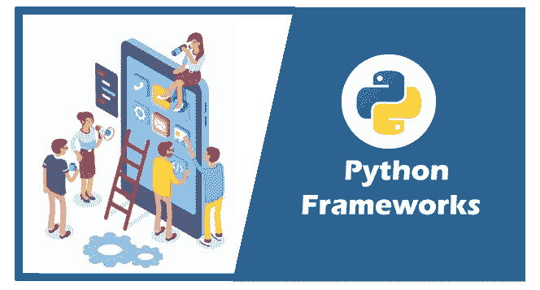
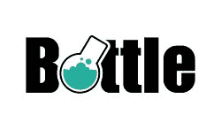
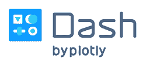
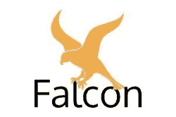
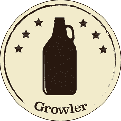
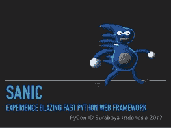
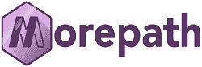

# 顶级 Python 框架，Python 框架列表

> 原文：<https://www.javatpoint.com/python-frameworks>

在本教程中，我们将讨论 Python 的各种重要框架及其基本特性。众所周知，Python 是一种需求很高且非常有效的编程语言，它包含大量的库和框架，几乎适用于每个技术领域。

这些框架为开发人员开发应用(或软件)提供了便利。它们提供了冗余任务的自动实现，减少了开发时间，并且非常关注应用逻辑，而不是公共元素。

[Python](https://www.javatpoint.com/python-tutorial) 自带很多框架，每个框架都有优缺点。

我们需要分析我们的项目需求来选择合适的框架。

我们将讨论以下 Python 框架。

*   [瓶子](#Bottle)
*   [奇瑞皮](#CherryPy)
*   [AIOHTTP](#AIOHTTP)
*   [破折号](#Dash)
*   [猎鹰](#Falcon)
*   [烧瓶](#Flask)
*   [乔托](#Giotto)
*   [姜戈](#Django)
*   [咆哮者](#Growler)
*   uvloop
*   [Sanic](#Sanic)
*   [更多路径](#MorePath)
*   [野餐](#Picnic)
*   [塔架框架](#Pylons)
*   [金字塔](#Pyramid)
*   [涡轮齿轮](#TurboGears)
*   [Web2py](#Web2py)
*   [拥抱](#Hug)
*   [立方体网络](#CubicWeb)

Python 框架主要有三种类型，全栈、微框架和异步。在详细解释每个框架之前，让我们简单介绍一下各种 Python 框架。

## Python 框架的类型

主要有以下三种类型的框架。

**1。全栈框架**

这些框架具有所有的 web 开发需求，例如表单生成器、表单验证和模板布局。这些是典型的全栈框架的核心特性。

**2。微框架**

微框架需要大量的代码和额外的手工需求。这种框架不提供数据抽象层的工具、表单验证以及特定的工具和库。

**3。异步框架**

异步框架最近越来越受欢迎，它允许处理大量并发连接。它使用 **asyncio 库**并发运行进程。

让我们看看下面的 Python 框架。

## 最佳 Python 框架

下面是顶级 Python 框架的列表。

### 1.瓶子

它是一个微框架，为使用它的每个开发的应用创建一个单一的文件源。该框架主要侧重于开发 API，是最好的 Python 网络框架之一。瓶子不需要其他依赖来创建小的网络应用。它允许开发人员与硬件密切合作，是制作小型应用和简单个人应用的最合适框架。

**瓶子的主要特征**

*   它是一个内置的 HTTP 服务器。
*   它为不同的数据库提供插件支持。
*   它提供了请求调度路线。
*   我们可以访问第三方模板引擎和 WSGI/HTTP 服务器。

### 2.奇瑞皮

CherryPy 是一个开源的、面向对象的微框架。它遵循极简主义的方法。这是 2002 年引入的最古老的 Python 框架之一。我们不需要安装 apache 服务器来运行 cherryPy。这个框架允许我们使用任何技术进行数据访问，在等等处做模板。

**奇瑞派的主要特点**

*   CherryPy 应用运行在安卓系统上。
*   它有一个灵活的内置系统。
*   它提供了一个强大的配置系统。
*   它为覆盖、分析和测试提供了内置的支持。
*   为同时运行多个 HTTP 服务器提供了简单性。

### 3.艾奥普

这是一个非常依赖 Python 3.5+特性的异步框架，比如 async & await。Python asyncio 库在这个框架的运行中起着至关重要的作用。作为一个服务器 web 框架，AIOHTTP 也可以作为一个客户端框架。我们可以使用请求对象和路由器重定向查询。

**AIOHTTP 的关键特性**

*   它有可插拔路由。
*   它提供了有效构建视图的工具。
*   信号。
*   它支持服务器**网络套接字**和客户端**网络套接字**，没有回调地狱。
*   它为中间件提供了支持。

### 4.破折号

这是一个基于 Python 的微框架，用于开发分析性网络应用，在数据科学家中很受欢迎。它适合那些对 web 开发机制不太感兴趣的数据科学家。

Dash 的应用还可以运行 Flask 等网络服务器，通过 HTTP 请求与 [JSON](https://www.javatpoint.com/json-tutorial) 包进行通信。

[**ReactJS**](https://www.javatpoint.com/reactjs-tutorial) 用于渲染前端。我们可以使用 Flask 插件扩展 Dash 的功能。使用 Dash 开发的应用在网络浏览器中呈现，并且可以部署到服务器。这些应用是跨平台和移动就绪的。让我们看看 Dash 框架的关键特性。

**破折号的主要功能**

*   有广泛的插件支持。
*   它在网址例程(Dash 开发服务器)上工作。
*   它支持高度定制。
*   它可以有效地处理错误。
*   LDAP 集成(Dash 开发服务器)。
*   创建 Dash 应用所需的代码更少。

### 5.猎鹰

它是一个用于构建 web APIs 的微框架，也是另一个广泛使用的 Python 框架。它需要许多依赖来构建 HTTP APIs，并允许开发人员创建一个允许 HTTP 和 REST 架构的更干净的设计。

猎鹰广泛应用于大型组织，如领英、 [OpenStack](https://www.javatpoint.com/openstack) 和 RackSpace。它可以用相同的硬件处理比同时代的所有产品更多的请求。这个框架专注于拥有 100%的代码覆盖率。

**猎鹰的主要特点**

*   前期异常处理
*   它可以在 Cython 的支持下提供额外的速度。
*   它有一个高度优化的代码库，并且是可扩展的。
*   通过 WSGI 助手和模拟进行单元测试。
*   它的请求类和响应类为头和体提供了方便的访问。
*   本机 HTTP 错误响应。

### 6.瓶

Flask 是另一个流行的 Python 微框架，属于 BSD 许可证。Sinatra [Ruby](https://www.javatpoint.com/ruby-tutorial) 框架激发了它。这个框架需要 Jinja2 模板和 Werzeug WSGI 工具包。

它重量轻，采用模块化设计。烧瓶很容易适应。

使用 Flask，开发人员可以构建一个坚实的网络应用基础，在此基础上可以使用任何所需的扩展。它还与谷歌应用引擎兼容。

**烧瓶的主要特征**

*   它提供内置支持。
*   它支持 jinja2 模板化。
*   它有基于 Unicode 的。
*   HTTP 请求处理。
*   它有一个内置的快速调试器。
*   它有助于插入任何 ORM。
*   它支持安全 cookies 来建立客户端会话。

### 7.乔托

它是一个基于模型视图控制器的全栈框架。Giotto 是一个应用框架，按顺序分离模型、视图和控制器元素。它通过一个 API 和可访问的 RESTful 接口为 [HTML](https://www.javatpoint.com/html-tutorial) 模板提供了一些基本的特性，例如自动 URL 路由和 Jinja2。

它还带有控制器模块，为开发人员提供了一个使用命令行和互联网中继图表(IRC)创建应用的平台。

**乔托的主要特点**

*   它有自动网址路由的功能。
*   功能粗糙模式。
*   有多个可插拔控制器。
*   通用模型和视图。
*   针对 HTML 模板的 Jinja2 的可获取性。
*   极其简洁的代码。
*   使用 SQLAlchemy 的数据库支持。

### 8.Django

Django 是一个全栈 Python 框架。它是开发丰富 web 应用的最著名和最受欢迎的框架。它绕过时间越来越受欢迎。它最终成为 2021 年十大网络开发框架之一。重点是 DRY ( **不要**重复 **Y** 自己)原则。

Django 提供了几个内置的库和优秀的功能，可以免费使用。Django 利用其 ORM 将对象映射到数据库表。

它提供了数据库支持，并且易于从一个数据库迁移到另一个数据库。但是有 [MySQL](https://www.javatpoint.com/mysql-tutorial) 、 [PostgreSQL](https://www.javatpoint.com/postgresql-tutorial) 、 [SQLite](https://www.javatpoint.com/sqlite-tutorial) 、 [Oracle 数据库](https://www.javatpoint.com/oracle-tutorial)的内在支持。我们也可以通过第三方驱动程序使用其他数据库。

**姜戈的主要特点**

*   与其他 web 框架相比，它更加安全。
*   路由 URL。
*   模板引擎。
*   数据库模式迁移。
*   身份验证支持。
*   它有 ORM ( **对象关系模型**)。
*   大量现成的图书馆。

### 9.咆哮者

这是一个建立在异步基础上的异步框架；它的灵感来自 Node JS 和 Express/Connect 框架。在这个框架中，请求不是由框架本身处理的，而是通过中间件技术处理的。它是更直接地实现复杂应用的最佳框架。

**咆哮者的关键特性**

*   支持大量开源包。
*   使用 decorator 编写干净的、可重用的代码。
*   它使用装饰器来降低代码的复杂性，我们可以编写可重用的代码。
*   有一个 **ziapp 模块**，允许将整个应用压缩到一个可执行文件中。

### 10.Uvloop

它是其他框架中可用的超高速 Python 网络框架之一，我们不能忽视这个事实。它被认为是 asyncio 事件循环的替代品；因此，它可以用在基于 asyncio 的应用中，也可以替代现有应用中的 asyncio。一些开发人员声称 Uvloop 的速度是 Node JS、事件和任何 Python 异步框架的两倍。

**Uvloop 的主要特性**

*   照明速度快
*   asyncio 事件循环的替换。

### 索尼克

Sanic 是一个建立在向上循环之上的网络框架。它提供了最好的特性之一，即它通过异步请求处理提供了快速的 HTTP 响应。它提供了提高速度的非阻塞功能。此外，它支持请求处理程序，并将其与 Python 3.5 **等待/异步**函数进行比较。

**声波的主要特性**

*   基于类的视图。
*   封堵支架
*   能够读写饼干。
*   它允许各种类型的日志记录，如错误日志和访问日志。
*   易于申请装饰者支持的处理程序的可用性。

### 12.更多路径

MorePath 是一个 Python WSGI 框架，它主要专注于执行更多的数字用例。此外，它还负责答案集应用编程。它还包括一个标准的 Python 数据结构，引入到[**【RESTful】**网络服务](https://www.javatpoint.com/restful-web-services-tutorial)中。

它提供了一个突出的功能，可以自动将框架中定义的路径转换为链接，用于创建具有最干净网址的应用。

**更多路径的关键特性**

*   它提供简单、灵活和健壮的权限。
*   创建通用用户界面就像子类化一样简单。
*   所有视图都是通用的，在视图中重用视图。
*   它提供了开发 RESTful 网络服务的所有必要工具。
*   它是可扩展的，具有简单、一致和通用的扩展和覆盖机制。

### 13.野餐

它是一个面向对象的微框架，用于开发基于 JSON 的 API。该框架针对基于 JSON 的 API 进行了优化，可以在最好的 Python 框架中占据一席之地，因为它创建了最快的网络 API。

**野餐的主要特点**

*   它支持饼干。
*   处理路由。
*   它有内置的错误处理。
*   它能够处理基于 JSON 的请求。

### 14.塔架框架

Pylons 框架是一个全栈开源框架，旨在快速开发应用。这个框架包含了一些最好的元素和属性 [Perl](https://www.javatpoint.com/perl-tutorial) 、Python 和 Ruby。

它在维护模式下可用，尽管许多开发人员仍然使用 Pylons 框架，因为它提供了高度灵活的 web 开发结构。它提高了可重用性，并利用了 WSGI(网络服务器网关接口)。

**塔架的主要特征**

*   路线。
*   它发送网址。
*   通过网络助手基于路由配置的网址映射。
*   它提供 HTML 表单验证和生成。

### 15.金字塔

金字塔是一个开源的全栈网络框架，旨在尽可能降低复杂性。金字塔最大的优势之一是它可以同样适用于小型和大型应用。金字塔由其开发人员定期更新，并在 Python 3 上运行。金字塔的当前版本是 1.10，这是自 2010 年以来的第十次更新。

**金字塔的主要特征**

*   URL 层代
*   单文件应用
*   它具有灵活的身份验证和授权。
*   视图谓词和许多按路由的视图。
*   渲染。
*   谓词。
*   模板和资产规格。
*   功能装饰者。

### 16.涡轮齿轮

涡轮齿轮是一个全栈、开源、数据驱动的网络应用 Python 框架。它允许开发人员快速开发数据驱动的 web 应用。涡轮齿轮带有可理解的模板，并支持灵活和强大的 ORM。该框架使用石根、Repoze、SQLAlchemy 和 webOp 等组件来快速开发需要数据库连接的应用。

**涡轮齿轮的主要特点**

*   涡轮齿轮的所有特性都是作为功能装饰器来实现的。
*   可用的命令行工具。
*   多数据库支持。
*   MVC 风格的架构。
*   它使用塔架作为网络服务器。
*   粘贴脚本模板。
*   表单编码的验证支持。

### 17.Web2Py

Web2Py 框架是一个开源且可扩展的 Python 框架，允许用户快速流畅地开发 Web 应用。它与平台无关，这意味着它支持所有流行的操作系统。此外，该框架通过基于网络的界面、网络服务器和 [SQL](https://www.javatpoint.com/sql-tutorial) 数据库提供了简化网络应用开发过程的工具。

**web 2py 的主要功能**

*   一致的 API。
*   遵循 MVC 模式。
*   基于角色的访问控制。
*   没有安装和配置要求。
*   它为国际化提供支持。
*   向后兼容。
*   多种协议的可读性。
*   它可以在任何支持 Python 或 Java 和 Python 的网络托管平台上运行。

### 18.紧抱

这个微框架用于开发和构建 web APIs。它在需要时消耗资源，并使用 Cython 进行编译，该框架允许我们非常容易和快速地完成应用开发。

**拥抱的主要功能**

*   支持自动文档。
*   内置版本管理。
*   遵循“一旦实施，就可以在任何地方使用”的原则。

### 19.立方体网站

立方网络是由罗技实验室开发和策划的全栈框架，它是一个免费使用的、语义的、开源的、语义的、开源的、基于 Python 的网络框架。立方体 web 是基于数据模型的，为了开发一个功能应用，需要有相同的定义。立方体 web 使用立方体，而其他应用使用单独的视图和模型。

**立方体网络的主要特征**

*   支持多个数据库。
*   保安。
*   可重用组件。
*   使用 RQL 简化与数据相关的查询。
*   网络本体语言。

## 结论

在本教程中，我们已经提到了属于不同类别的所有基本 python 框架。该框架能够有效地满足业务需求。我们已经介绍了几乎每一个重要的 Python 框架及其有用的特性。开发人员可以根据项目需求选择任何框架。

* * *