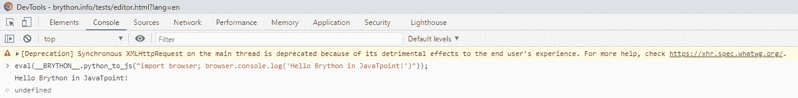

# 布莱顿是如何工作的

> 原文：<https://www.javatpoint.com/how-brython-works>

为了理解 brython 是如何工作的，我们首先必须用我们喜欢的方法安装 Brython，我们在“如何安装 Brython”一文中已经讨论过了。

在讨论 brython 是如何工作的之前，我们应该了解这一点:

*   如何在 JavaScript 中实现 python
*   如何将 Python 翻译成 JavaScript，以及在浏览器中执行运行时。
*   JavaScript 文件的两个主要库:
    *   brython_stdlib.js，是 brython 的标准库
    *   brython.js，它是 brython 语言的核心
*   如何调用 brython()，这将编译存储在脚本标签中的文本/python 类型的 Python 程序。

在本文中，我们将讨论 Brython 核心组件、标准库及其工作原理。

## Brython 核心组件

brython.js 和 brython . min . js(Brython 引擎的最小化版本)包含 Brython 的核心组件。它们都包含以下关键组件:

brython.js 和 brython . min . js(Brython 引擎的最小化版本)包含 Brython 的核心组件。它们都包含以下关键组件:

*   **_BRYTHON_:** 它是 JavaScript 全局对象，保存了运行 Python 脚本应该需要的所有内部对象。当我们编写 BRYTHON 应用时，_BRYTHON_ 并不直接使用。如果我们看看 Brython 程序，Python 和 JavaScript 的兄弟，那么我们会注意到 _BRYTHON_ 的定期出现。我们不需要使用这个对象，但是当我们看到一个错误或者当我们想要在浏览器控制台中调试我们的程序时，我们应该意识到这一点。
*   **Brython():** 它是在 JavaScript 全局命名空间中公开的主 JavaScript 函数。不调用这个函数，我们无法执行任何 Python 程序。这是我们唯一需要显式调用的 JavaScript 函数。
*   **浏览器:**是浏览器的模块，像 Document Object Model 接口用来文档化一样，公开了前端网站应用中常用的 JavaScript 对象，浏览器窗口使用窗口对象。
*   **内置类型:**这些是 Python 内置类型在 JavaScript 中的实现。比如 py_dicts.js、py_string.js、py_int.js 分别是 dict、str、int 的表现。

## 布莱顿标准图书馆

在了解了什么是核心 Brython 文件 brython.js 之后，我们现在将了解它们的配套文件 brython_stdlib.js。

Python 标准库由 brython_stdlib.js 公开，brython_stdlib.js 文件生成后，brython 可以将 Python 标准库编译成 JavaScript，并将结果链接到包 brython_stdlib.js 中。

Brython 应该对 CPython 关闭，这是 Python 的首选实现。由于 Brython 在网站浏览器的上下文中运行，它几乎没有什么限制，比如浏览器不允许直接访问文件系统，所以，os.open()函数无法打开文件。与网站浏览器无关的功能无法实现。

**例如:**

#让我们在 Brython 环境中运行代码:

```py

import os
os.unlink()

```

**输出:**

```py
TypeError                                 Traceback (most recent call last)
<ipython-input-1-85e82a7fc62f> in <module>
      1 import os
----> 2 os.unlink()

TypeError: unlink() missing required argument 'path' (pos 1)

```

在这里，os.unlink()引发了一个异常，因为从浏览器环境中删除本地文件是不安全的，文件和目录条目 API 只是一个默认建议。

Brython 只支持本机 Python 模块。它不支持用 C 语言构建的 Python 模块，除非它们已经用 JavaScript 再次实现。比如 hashlib 模块用 C 语言编写，在 Brython 中用 JavaScript 实现。用户和开发人员也可以参考 Brython 发行版中的模块列表来比较 CPython 实现。

用户需要包含 brython_stdlib.js 和 brython_stdlib.min.js 来从 Python 标准库中导入模块。

## 布莱顿工作

现在，让我们看看 Brython 在浏览器中是如何工作的，浏览器只知道它们的 JavaScript 引擎。我们将借助一个示例和浏览器中可用的工具来理解这一点。我们将了解在浏览器中执行 Python 代码所涉及的过程。

例如:

```py

<!doctype html>
<html>
  <head>
    <script
      src = "https://raw.githack.com/brython-dev/brython/master/www/src/brython.js">
    </script>
  </head>
  <body onload = "brython()">
    <script type = "text/python">
      import browser
      browser.alert("Hello JavaTpoint!")
    </script>
  </body>
</html>

```

加载并解析完 HTML 页面后，brython()将执行以下步骤:

1.  它将读取存储在元素
2.  然后编译 python 程序来等效 JavaScript
3.  之后，它将使用 eval()评估生成的 JavaScript 代码

例如:

#在 HTML 文件中嵌入 Python 代码:

```py

    <script type = "text/python">
      import browser
      browser.alert("Hello JavaTpoint!")
    </script>

```

第二种选择是从单独的文件中下载 Python 程序:

例如:

```py

<head>
    <script src = "https://www.forexample.com/main.py"
            type = "text/python">
    </script>
</head>

```

在上面的例子中，Python 文件看起来像这样:

```py

import browser
browser.alert("Hello JavaTpoint?)

```

将 Python 程序与 HTML 程序分离的过程是一种更干净的方法。这也允许用户利用代码编辑器的功能和优势。一些编辑器支持将 JavaScript 嵌入到 HTML 中，但不支持将 Python 内嵌到 HTML 中。

## 布莱顿的内部

在本文的这一部分，我们将深入介绍如何将 Python 程序转换为 JavaScript 的过程。

为了说明这个过程，并了解 Brython 的内部结构，用户应该使用以下步骤:

*   首先，打开 Brython 的主页
*   然后打开网站控制台，对于 Windows 和 Linux 操作系统，单击 CTrl+shift+I，对于 Mac 操作系统，单击 CMD+ALT+I

在浏览器 JavaScript 的 REPL 中，用户应该键入并执行以下命令:

例如:

```py

eval(__BRYTHON__.python_to_js("import browser; browser.console.log('Hello Brython in JavaTpoint!')"));

```

然后 python_to_js()会将上述程序解析编译成 JavaScript，然后在网站浏览器中执行 JavaScript。用户将获得以下输出:



将 eval()函数应用到 Brython 程序后，它将在 JavaTpoint 中打印“你好 Brython！”在浏览器的控制台中。JavaScript 的函数将返回 undefined，这是 JavaScript 中函数的默认返回值。

每当用户构建一个 Brython 应用时，他们应该不需要在 _BRYTHON_ JavaScript 模块中显式调用该函数。上面的这个例子仅用于解释 Brython 是如何在后台运行的。

JavaScript _BRYTHON_ 对象在 JavaScript 全局范围内也是可用的，用户可以通过浏览器 JavaScript 的控制台进行访问。

## 结论

在本文中，我们讨论并解释了 Brython 的核心组件和标准库，以及 Brython 如何在浏览器上工作。我们也谈到了布赖顿的内部结构，以及它是如何在后台操作网站的。

* * *