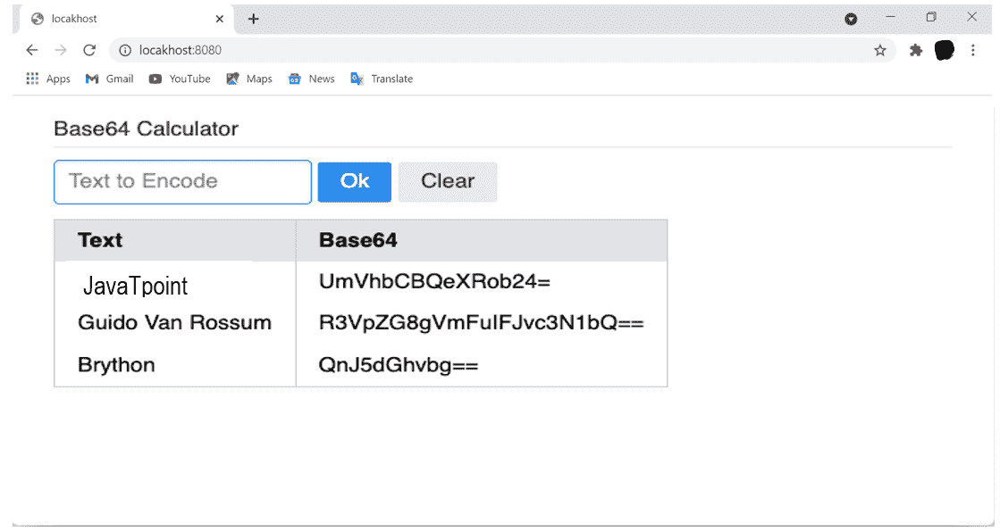
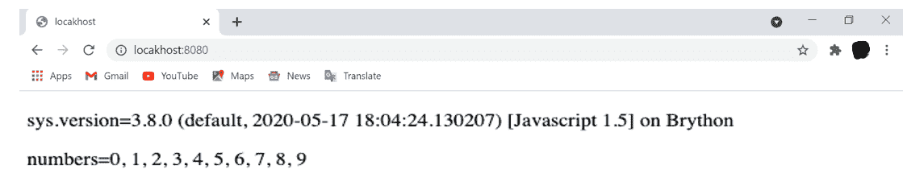

# 如何在浏览器中使用 Brython

> 原文：<https://www.javatpoint.com/how-to-use-brython-in-the-browser>

在本文中，我们将讨论如何在浏览器中使用 Brython，方法是实现一个 Base64 计算器，在浏览器中尝试文档对象模型应用程序接口和其他功能，这些功能只能从 [JavaScript](https://www.javatpoint.com/javascript-tutorial) 中获得。

## 布莱顿的 DOM 应用程序接口

为了试验 Brython 中可用的文档对象模型操作，我们将构建一个表单，用于将字符串编码为 Base64。最终的输出表单如下所示:


让我们创建一个 [HTML](https://www.javatpoint.com/html-tutorial) 文件，并将其命名为 index.html:

例如:

```py

<!DOCTYPE html >
<html>
  <head>
    <meta charset = "utf-8"/>
    <link
      rel = "stylesheet"
      href = "https://cdnjs.cloudflare.com /ajax/libs/pure/2.0.3/pure-min.min.css"
      integrity = "sha256-jYujp4Kf07YDuUF9i1MHo4AnpXUKuHxIUXH7CrHxdKw="
      crossorigin = "anonymous" />
    <script
      src = "https://cdnjs.cloudflare.com /ajax/libs/brython/3.8.9/brython.min.js"
      integrity = "sha256-U56d9Sn/Gtf1meSBXazW81LM1bUeyc1jFuoY3CBu6A8="
      crossorigin = "anonymous">
    </script>
    <script
      src = "https://cdnjs.cloudflare.com /ajax/libs/brython
/3.8.9/brython_stdlib.min.js"
      integrity = "sha256 twMHOlRBOpBkpyGFeXIBWoJqTpqf76Zp8HExOelwyRc="
      crossorigin = "anonymous"
      defer>
    </script>
    <script src = "main.py" type="text/python" defer>
</script>
    <style>
      body { padding: 30px; }
    </style>
  </head>
  <body onload="brython()">
    <form class="pure-form" onsubmit="return false;">
      <fieldset>
        <legend>Base64 Calculator</legend>
        <input type = "text" id = "text-src" placeholder = "Text to Encode" autocomplete="off"/>
        <button type = "submit" id = "submit" class = "pure-button pure-button-primary">Ok
</button>
        <button id = "clear-btn" class = "pure-button">Clear
</button>
      </fieldset>
    </form>
    <div id="b64-display">
</div>
  </body>
</html>

```

上面的 html 代码加载了静态资源，定义了 UI 布局，也启动了 Python 的编译:

*   第 7 行:将加载 PureCSS 样式表来改进默认的 HTML 样式
*   第 9 行:将加载 Brython 引擎的最小化版本。
*   第 12 行:将加载 Brython 标准库的最小化版本。
*   第 14 行:将加载 main.py，它将处理这个静态 HTML 页面的动态逻辑。
*   第 21 行:将描述输入字段。该字段将把用于编码的字符串作为参数。
*   第 22 行到第 25 行:将定义触发页面主要逻辑的默认按钮。用户可以在 main.py 中看到这个逻辑的实现。
*   第 26 行:将定义清除页面上的数据和元素的按钮。这将在 main.py 中实现。
*   第 29 行:将声明 div 是表的占位符。

与之关联的 Python 代码

例如:

```py

from browser import document, html, alert
import base64

b64_map = {}

def base64_compute(evt):
    value = document[" text-src "].value
    if not value:
        alert(" You need to enter a value ")
        return
    if value in b64_map:
        alert(
            f" The base64 value of '{value}' already exists: '{b64_map[value]}' "
        )
        return
    b64data = base64.b64encode(value.encode()).decode()
    b64_map[value] = b64data
    display_map()

def clear_map(evt):
    b64_map.clear()
    document[" b64-display "].clear()

def display_map():
    table = html.TABLE(Class = "pure-table")
    table <= html.THEAD(html.TR(html.TH(" Text ") + html.TH(" Base64 ")))
    table <= (html.TR(html.TD(key) + html.TD(b64_map[key])) for key in b64_map)
    base64_display = document[" b64-display "]
    base64_display.clear()
    base64_display <= table
    document[" text-src "].value = ""

document[" submit "].bind("click", base64_compute)
document[" clear-btn "].bind("click", clear_map)

```

[Python](https://www.javatpoint.com/python-tutorial) 程序展示了回调函数的定义和操纵 DOM 的机制:

*   第 1 行:将导入用户用来与文档对象模型和浏览器应用编程接口代码交互的模块
*   第 2 行:将导入 Brython 标准库中可用的 base64，即 brython_stdlib.min.js。
*   第 4 行:将声明用户在 HTML 页面运行期间用于存储数据的字典。
*   第 6 行将定义事件处理程序，即 base64_compute()，它将用 ID text-src 对输入字段中输入的文本的 base54 值进行编码。
*   第 7 行:将检索用 text-src 标识的 DOM 元素的值。
*   第 18 行:将定义事件处理程序，即 clear_map()，它将清除该页面上的数据和数据的表示。
*   第 22 行:将定义 display_map()，它将获取 b64_map 中包含的数据，并以页面的形式显示。
*   第 26 行:将检索带有标识文本的 DOM 元素。
*   第 29 行:将清除带有标识文本的 DOM 元素的值。
*   第 31 行:将提交按钮的 onclick 事件绑定到 base64_compute()。
*   第 32 行:将 clear-btn 按钮的 onclick 事件绑定到 clear_map()。

为了操作 DOM，Brython 将使用两个操作符:

1.  < =是一个新的运算符，主要针对 Brython。这将向节点添加一个子节点。我们在第 22 行定义的 display_map()中使用了它。
2.  +是 element . insertadjacmenthtml(' afterend ')和添加同级节点的替代。

我们可以在 display_map()的上述语句之一中看到这两个操作符在起作用:

```py

table <= html.THEAD(html.TR( html.TH(" Text ") + html.TH(" Base64 ")))

```

上面的命令可以翻译为“添加到包含由两个相邻的表数据单元元素组成的表行元素的表元素和表头元素。它在浏览器中呈现为下面的 HTML 程序。

例如:

```py

<table>
<thead>
<tr><th>Text</th><th>Base64</th></tr>
</thead>
</table>

```

上面的 HTML 代码显示了表格元素标题行的嵌套结构。我们也可以用更易读的方式编写这段代码。

例如:

```py

<table>
  <thead>
    <tr>
      <th>
Text
      </th>
      <th>
Base64
      </th>
    </tr>
  </thead>
</table>

```

为了观察 Brython 控制台中的结果，我们可以输入以下代码块:

```py

from browser import html
table = html.TABLE()
table <= html.THEAD(html.TR( html.TH(" Text ") + html.TH(" Base64 ")))
table.outerHTML

```

输出:

```py
'<table> <thead> <tr> <th> Text </th> <th> Base64 </th> </tr> </thead> </table>'

```

为了执行整个代码，我们需要启动网站服务器。如前所述，我们已经在 main.html 和 index.html 这两个文件所在的目录中启动了内置的 Python 网站服务器。

例如:

```py

$ python3 -m http.server

```

输出:

```py
Serving HTTP on :: port 8080 (http://[::]:8080/) ...

```

启动网站服务器后，将浏览器指向 http://localhost:8080。该页面如下所示:

图像:



## 在 Brython 中导入文件

用户可以使用导入将 Python 或 Brython 模块和库访问到 JavaScript。

Python 模块和库是其项目根文件夹中扩展名为. py 的文件，或者是包含 _init_ 的子文件夹中的 Python 包。py 文件。为了在 Brython 程序中导入 Python 模块，他们必须启动网站服务器。

如果用户想进一步了解如何将 Python 模块导入到 Brython 代码中，他们可以查看“如何安装 Brython”一文中的“使用 PyPI 安装”部分。他们必须创建和激活 Python 虚拟环境，安装 Brython，然后修改 index.html。

例如:

```py

 <!doctype html>
<html>

<head>
<meta charset = " utf-8 ">
<script type = " text/javascript " src = " brython.js ">
</script>
<script type = " text/javascript " src = " brython_stdlib.js ">
</script>
</head>

<body onload = " brython() ">

<script type = " text/python ">
from browser import document, html, window
import sys
import functional

selection = functional.take(10, range(10000))
numbers = ', '.join([ str(x) for x in selection ])

document <= html.P(f"{sys.version=}")
document <= html.P(f"{numbers=}")
</script>

</body>

</html>

```

上面的 HTML 文件将公开从浏览器的核心引擎、sys 的标准库和本地 Python 模块导入的模块，这些模块是功能性的。functional.py 的内容如下:

```py

import itertools

def take(n, iterable):
    "Return first n items of the iterable as a list"
    return list(itertools.islice(iterable, n))

```

这个模块将实现 take()，这是 itertools receipts.take()中的一个，它将返回给定 iterable 的前 n 个元素。它将依赖 itertools.slice()。

如果用户尝试使用浏览器从文件系统打开 index.html，他们将在浏览器控制台中看到以下错误:

```py

Traceback (most recent call last):
         File file:///Users/User Name/brython/code /import/index.html/__main__
----> 3 in import functional
ModuleNotFoundError: functional 
```

导入 Python 模块后，这是启动本地网站服务器所必需的。首先，启动本地网站服务器，然后在浏览器中打开 http://localhost:8080。用户将看到以下网页:



如果有一个正在运行的网站服务器，那么浏览器将能够在导入函数后获取 functional.py 模块。number 和 sys.version 值的结果在最后两个 Python 脚本的帮助下插入到 HTML 文件中，这两个脚本由浏览器嵌入和呈现。

## 减小导入大小

在前面示例项目的目录中，为了减小导入的 JavaScript 库和模块的大小，用户可以将 Brython-cli 与 option -module 一起使用。这个方法也可以用于将 Python 模块预编译成 JavaScript。

例如:

```py

$ brython-cli -modules

```

输出:

```py
Create brython_modules.js with all the modules used by the application
searching brython_stdlib.js...
finding packages...
script in html index.html

```

这将用于生成 brython_modules.js，然后用户可以修改 index.html 文件的 head 元素。

例如:

```py

<head>
 <meta charset="utf-8">
 <script type="text/javascript" src="brython.js">
</script>
 <script type="text/javascript" src="brython_modules.js">
</script>
 </head>

```

第 5 行将把原始形式的脚本源从 brython_stdlib.js 更改为 brython_modules.js。

用户可以用他们的浏览器打开 index.html，或者他们可以将浏览器指向简化为相同 HTML 页面的本地服务器。用户可以注意到以下几点:

1.  他们可以在浏览器中减少 HTML 页面，即使不运行网站服务器。
2.  他们不需要分发 functional.py 文件，因为程序现在被转换成 JavaScript，然后捆绑在 brython_modules.js 中。
3.  用户不需要加载 brython_stdlib.js。

brython-cli -modules 命令行工具将提供从标准库中删除不必要代码的解决方案。然后它会将 Python 模块编译成一个 JavaScript 程序。这将有助于用户应用程序的页面，并减少资源下载量。

## 结论

在本文中，我们讨论了用户如何借助 Base64 计算器在浏览器中使用 Brython，该计算器是为在浏览器中使用文档对象模型应用程序接口进行实验而实现的。我们还解释了用户如何在 Brython 中导入 Python 文件，以及用户如何减小导入文件的大小。

* * *