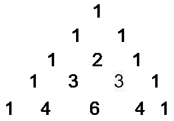

# Python 程序：打印帕斯卡三角形

> 原文：<https://www.javatpoint.com/python-program-to-print-pascal-triangle>

在本教程中，我们将讨论如何使用 Python 程序打印帕斯卡三角形。但是首先，让我们了解一下帕斯卡三角形是什么。

### 介绍

帕斯卡三角形是一个激动人心的数学概念，其中三角形数组是通过对前一行中的相邻元素求和而形成的。简单来说，每个数字都是通过取相邻行的和来生成的，三角形的外边缘总是 1。它是以法国著名数学家布莱士·帕斯卡的名字命名的。下面是帕斯卡三角形的表示。



在上图中，第一行是 1。第二行包含 2 个 1，第三行有 1 个 2 个 1，是取上一行之和形成的。所以它遵循整个三角形的交替模式，以此类推。

## 用 Python 打印帕斯卡三角形的算法

下面是用来打印帕斯卡三角形的步骤。

**步骤- 1:** 从用户处获取输入以获得行数。

**步骤 2:** 声明一个将存储值的空列表。

**步骤 3:** 使用 `for`循环，循环将迭代 0 到 n - 1，将子列表追加到列表中。

**第 4 步:**现在在列表中添加 1。

**步骤- 5:** 现在，使用 `for`循环定义三角形相邻行内的数值。

**第 6 步:**按照格式打印帕斯卡三角形。

**第 7 步:**出口

下面我们来了解一下算法在 [Python](https://www.javatpoint.com/python-tutorial) 程序中的实现。

**程序**

```py

num = int(input("Enter the number: "))
list1 = [] #an empty list
for i in range(num):
  list1.append([])
  list1[i].append(1)
  for j in range(1, i):
    list1[i].append(list1[i - 1][j - 1] + list1[i - 1][j])
  if(num != 0):
    list1[i].append(1)
for i in range(num):
  print(" " * (num - i), end = " ", sep = " ")
  for j in range(0, i + 1):
    print('{0:6}'.format(list1[i][j]), end = " ", sep = " ")
  print()

```

**输出:**

**案例- 1**

```py
Enter the number: 4
          1 
      1      1 
  1      2      1 
1      3      3      1

```

我们再运行一次程序。

**病例- 2:**

```py
Enter the number: 10
                1 
            1      1 
        1      2      1 
    1      3      3      1 
1      4      6      4     
1      5     10     10      5      1 
 1      6     15     20     15      6      1 
 1      7     21     35     35     21      7      1 
 1      8     28     56     70     56     28      8      1 
 1      9     36     84    126    126     84     36      9      1

```

**解释-**

在上面的程序中，我们从用户那里获取了几行作为输入。我们已经声明了一个空列表。然后我们使用 `for`循环，将子列表追加到一个空列表中。下一个将附加到所有子列表中。定义三角形内部数字的内部 `for`循环是上面相邻行的总和。最后，我们使用 `for`循环按照一种格式打印帕斯卡三角形。

**方法- 2:**

我们可以通过下面的二项式系数使用另一种方法，所有行都以 1 开始，行号行中的第 i <sup>个</sup>条目是二项式系数 C(行，I)。公式如下。

```py

C(line, i) = C(line, i-1) * (line - i + 1) / i

```

**示例-**

```py

# input n
n = int(input("Enter the number of rows:"))

for i in range(1, n+1):
   for j in range(0, n-i+1):
      print(' ', end='')

   # first element is always 1
   C = 1
   for j in range(1, i+1):

      # first value in a line is always 1
      print(' ', C, sep='', end='')

      # using Binomial Coefficient
      C = C * (i - j) // j
   print()

```

上述方法的时间复杂度为 0(N <sup>2</sup> )。

**方法- 3**

该方法是印刷帕斯卡三角形的优化方法。这个方法是基于 11 的幂。

```py

11**0 = 1
11**1 = 11
11**2 = 121
11**3 = 1331

```

**示例-**

```py

# input n
n = int(input("Enter the number of rows:"))

# iterarte upto n
for i in range(n):
   # adjust space
   print(' '*(n-i), end='')

   # compute power of 11
   print(' '.join(map(str, str(11**i))))

```

**输出:**

**病例- 1:**

```py
Enter the number of rows: 5
     1
    1 1
   1 2 1
  1 3 3 1
 1 4 6 4 1

```

**病例- 2:**

```py
Enter the number of rows: 6  
       1
      1 1
     1 2 1
    1 3 3 1
   1 4 6 4 1
  1 6 1 0 5 1

```

正如我们在上面的代码中看到的，当我们输入第五行的数量时。它给出了错误的输出。这意味着它只能工作到 n< = 5。执行 0(N)花费的时间更少。

* * *