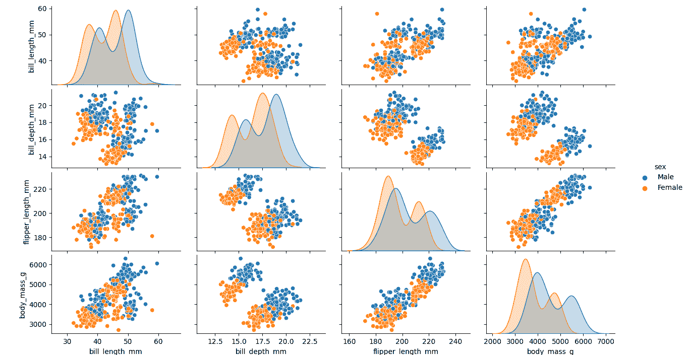
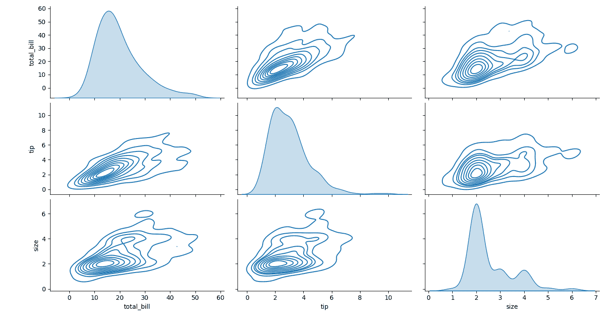

# Python 中的成对图

> 原文：<https://www.javatpoint.com/pair-plot-in-python>

## 海伯恩配对剧情介绍

在本教程中，我们将借助 [Python 编程语言](https://www.javatpoint.com/python-tutorial)中的 **pairplot()** 函数来理解 **Seaborn Pairplot** 。该功能可以极大地帮助分析机器学习项目的探索性数据。我们还将发现 Seaborn 库的 **pairplot()** 函数的语法，并执行它的一些示例。

但是在开始之前，让我们简单了解一下 Seaborn 图书馆。

## Python 中的 Seaborn 库是什么？

Python 社区提供了一个为数据可视化而设计的开源库，被称为 **Seaborn。** Seaborn 库是在 matplotlib 库的基础上开发的，与 Python 中 Pandas 的数据结构紧密结合。可视化是 Seaborn 图书馆的核心概念，帮助用户探索和理解数据。

由于 Seaborn 库合并和集成了不同的库，因此学习者有必要熟悉 [NumPy](https://www.javatpoint.com/numpy-tutorial) 、 [Matplotlib](https://www.javatpoint.com/matplotlib) 和 [Pandas](https://www.javatpoint.com/python-pandas) 库。

Seaborn 库提供了各种功能。其中一些列举如下:

1.  Seaborn 提供了一个面向数据集的 API，以确定变量之间的关系。
2.  Seaborn 还提供线性回归图的自动估算和绘图功能。
3.  Seaborn 还支持多绘图网格的高级抽象。
4.  Seaborn 还提供了单变量和双变量的可视化分布。

现在，让我们了解如何下载和安装 Seaborn 库。

## 如何安装 Seaborn 库？

在下一节中，我们将讨论安装 Seaborn Library 过程中的步骤。

**使用画中画安装程序**

我们可以在 **pip** 安装程序的帮助下安装最新版本的 Seaborn 库。我们所要做的就是在命令 Shell 或终端中键入以下命令。

```py

$ pip install seaborn

```

**使用康达安装工具**

[Anaconda](https://www.javatpoint.com/anaconda) 是一个面向 [SciPy](https://www.javatpoint.com/python-scipy) 栈的多平台免费 Python 发行版，可用于 Windows、Linux 和 Mac。

我们可以使用如下所示的命令，使用 **conda** 安装程序安装最新版本的 Seaborn 库:

```py

$ conda install seaborn

```

除了这两个，我们可以安装 Seaborn 库的开发版本。

**使用 GitHub 安装开发版本**

为了安装开发版本，我们可以访问下面给出的链接:

[https://github.com/mwaskom/seaborn](https://github.com/mwaskom/seaborn)

**一些依赖关系**

在下载和安装 Seaborn 库时，几乎没有什么依赖项需要处理。这些依赖关系如下:

1.  Python 或 3.4+版本
2.  数字图书馆
3.  Matplotlib 程式库
4.  SciPy 库
5.  Pandas 图书馆

**初始化 Seaborn 库**

下载并安装完 Seaborn 库后，让我们创建一个空的 Python 文件，并使用以下语法来初始化库

```py

import seaborn

```

或者

```py

import seaborn as sbn

```

保存程序并执行文件。如果程序没有返回导入错误，则库已成功安装。否则，考虑如上所述重新安装库。

Seaborn 库为用户提供了多种绘图，例如:

1.  饼图
2.  坦克酒吧
3.  分布图
4.  散点图
5.  热图
6.  配对图

在本教程中，我们将只讨论 Seaborn Pair Plots 和 **pairplot()** 函数。那么，让我们开始吧。

## 理解海伯恩配对图函数

**Seaborn Pairplot** 功能允许用户创建一个轴网格，通过该网格，存储在数据中的每个数值变量以列和行的结构跨 X 轴和 Y 轴共享。我们可以创建散点图，以便显示成对关系，此外还可以创建分布图，以对角方式显示列中的数据分布。

**pairplot()** 函数也可以用来展示变量的子集，或者我们可以在行和列上绘制不同类型的变量。

让我们看一下 **Seaborn Pairplot** 函数的语法，如下所示:

**海伯恩配对图函数的语法**

```py

seaborn.pairplot(
    data,
    hue = None,
    hue_order = None,
    palette = None,
    vars = None,
    x_vars = None,
    y_vars = None,
    kind = 'scatter',
    diag_kind = 'auto',
    markers = None,
    height = 2.5,
    aspect = 1,
    corner = False,
    dropna = False,
    plot_kws = None,
    diag_kws = None,
    grid_kws = None,
    size = None
    )

```

**配对图函数参数:**

1.  **数据:****数据**参数根据要绘制的可视化接受数据。这些值可以是**数据帧、数组、**或**数组列表。**
2.  **色相 _ 顺序，顺序:****色相 _ 顺序**或简称为**顺序**参数是图中使用的分类变量的顺序。该参数的值可以是字符串列表。
3.  **比例:****比例**参数用于缩放地块。该参数取值大于使用值，如**面积、计数、**或**宽度。**
4.  **比例 _ 色调:****比例 _ 色调**参数取**布尔值**，以确定比例是在**真**的主要分组变量的每个级别内估计的，还是在**假的绘图上的所有小提琴之间估计的。**
5.  **网格尺寸:****网格尺寸**参数取**整数值**计算地块的核密度。
6.  **内部:****内部**参数允许用户定义小提琴剧情的内部点。该参数取值如**框、点、四分位数、棒、**或**无。**
7.  **方向:****方向**参数允许用户确定地块的方向。方位可以是垂直的，分别用“ **v** 表示，也可以是水平的，分别用“ **h** 表示。
8.  **线宽:****线宽**参数以**浮点整数**为其值，以确定地块内使用的灰色线条的宽度。
9.  **颜色:****颜色**参数允许用户为绘图的所有数据元素指定颜色范围。该参数的值可以是 **matplotlib 颜色。**
10.  **调色板:****调色板**参数用于定义具有各种色调的地块的每个级别所使用的颜色。
11.  **ax:****ax**参数用于定义构建地块的轴。该参数的值可以是 **matplotlib 坐标轴。**

让我们考虑一些例子来理解 **pairplot()** 函数的工作原理:

**例 1:**

```py

# importing the required libraries
import seaborn as sbn
import matplotlib.pyplot as plt
# loading the dataset using the seaborn library
mydata = sbn.load_dataset('penguins')
# pairplot with the hue = gender parameter
sbn.pairplot(mydata, hue = 'gender')
# displaying the plot
plt.show()

```

**输出:**



**说明:**

在上面的例子中，我们已经导入了所需的库，并使用 Seaborn **load_dataset()** 函数加载了要处理的**企鹅**的数据集。然后，我们使用 **pairplot()** 功能来可视化带有设置为值“**性别**的**色调**参数的图。最后，我们使用了 Matplotlib **show()** 功能向用户显示该图。因此，配对图已成功生成。

**例 2:**

```py

# importing the required libraries
import seaborn as sbn
import matplotlib.pyplot as plt
# loading the dataset using the seaborn library
mydata = sbn.load_dataset('tips')
# pairplot with the kind = kde parameter
sbn.pairplot(mydata, kind = 'kde')
# displaying the plot
plt.show()

```

**输出:**



**说明:**

在上面的例子中，我们已经导入了所需的库，并使用 Seaborn **load_dataset()** 函数加载了要处理的**提示**的数据集。然后，我们使用 **pairplot()** 函数可视化绘图，将**种类**参数设置为值“ **kde** ”。最后，我们使用了 Matplotlib **show()** 功能向用户显示该图。因此，配对图已成功生成。

* * *