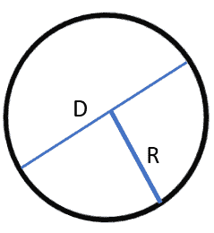

# 如何用 Python 计算圆的面积

> 原文：<https://www.javatpoint.com/how-to-calculate-area-of-circle-using-python>

在本教程中，我们将展示用户如何使用 Python 在给定圆半径的情况下计算圆的面积。

为了理解代码输入输出的格式，用户必须注意以下几点:

**输入格式:**

代码的输入由整数“R”组成，代表圆的半径。

**输出格式:**

代码的输出将打印圆的面积。

### 给定圆面积的计算算法

下面是我们将用于计算给定圆的面积的步骤:

*   **步骤 1:** 我们必须使用 input()函数传递输入。输入将对应于给定圆的半径。
*   **第二步:**用面积= πR2 的公式计算圆的面积。

### 圆的面积= π * R * R



其中， **π (PI)** = 3.14

**R** =圆半径。

**D 或(2R)** =圆的直径，(R + R)。

*   **第三步:**打印代码的输出，即给定圆的面积。

## 用 Python 查找给定圆面积的方法

**方法 1:用`math`模块求给定圆的面积。**

```py

import math as M
Radius = float (input ("Please enter the radius of the given circle: "))
area_of_the_circle = M.pi* Radius * Radius
print (" The area of the given circle is: ", area_of_the_circle)

```

**输出:**

```py
Please enter the radius of the given circle:  3
 The area of the given circle is:  28.274333882308138

```

**方法二:用π** 计算给定圆的面积

```py

π = 3.14
Radius = float (input ("Please enter the radius of the given circle: "))
area_of_the_circle = π * Radius * Radius
print (" The area of the given circle is: ", area_of_the_circle)

```

**输出:**

```py
Please enter the radius of the given circle:  3
 The area of the given circle is:  28.259999999999998

```

**方法三:利用函数**计算给定圆的面积

```py

import math

def area_of_the_circle (Radius): 
    area = Radius** 2 * math.pi
    return area

Radius = float (input ("Please enter the radius of the given circle: "))
print (" The area of the given circle is: ", area_of_the_circle (Radius))

```

**输出:**

```py
Please enter the radius of the given circle:  3
 The area of the given circle is:  28.274333882308138

```

## 结论

在本教程中，我们展示了三种计算给定圆面积的方法。要计算给定圆的面积，用户必须知道圆的半径或直径。三种方法中，第一种是最简单直接的方法。

* * *