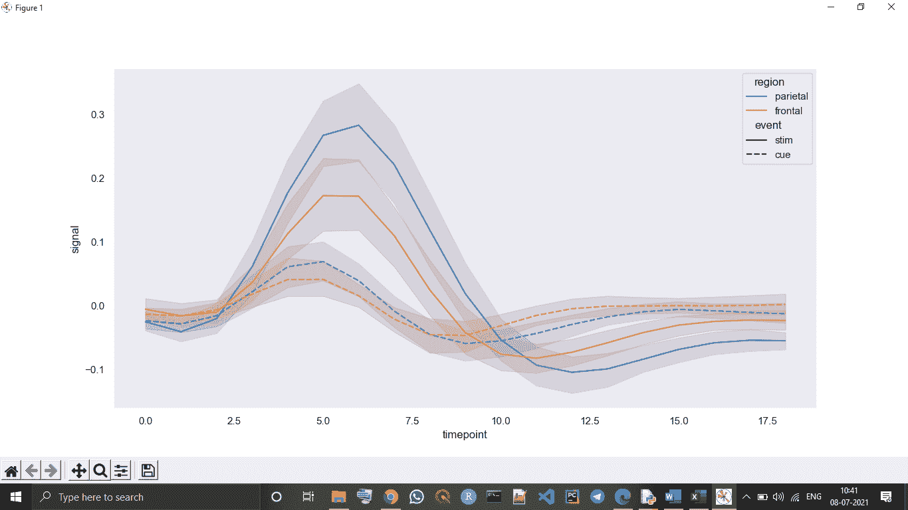
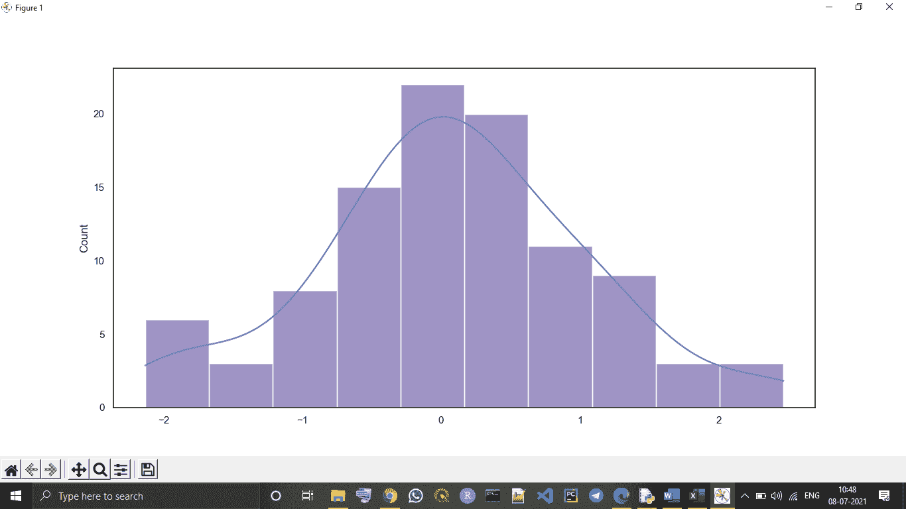
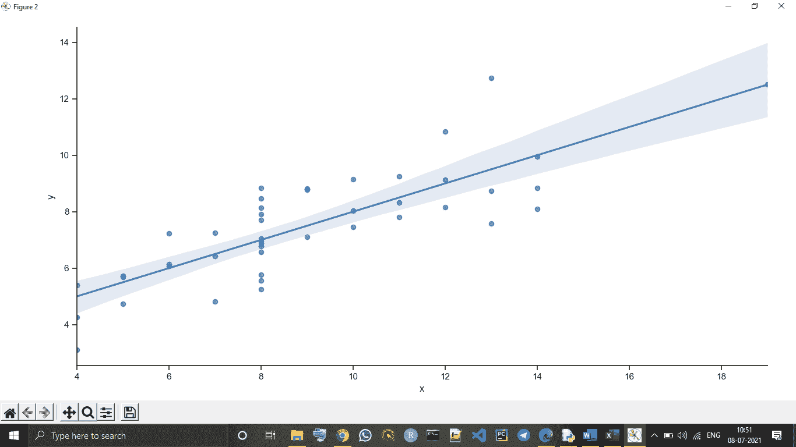

# Python Seaborn 库

> 原文：<https://www.javatpoint.com/python-seaborn-library>

Seaborn 是 Python 中图形统计绘图可视化的惊人库之一。Seaborn 提供了许多调色板和默认的漂亮样式，使 Python 中许多统计图的创建更具吸引力。

## Python Seaborn 库的目标

Seaborn library 旨在使理解和探索数据的中心部分更具吸引力。它建立在 [matplotlib](https://www.javatpoint.com/matplotlib) 库的核心之上，还提供面向数据集的 API。

Seaborn 还与 Panda 的数据结构紧密集成，这样，我们可以轻松地在给定变量的各种不同视觉表示之间跳转，以更好地理解所提供的数据集。

## Python 的 Seaborn 库中地块的类别

图通常用于可视化给定变量之间的关系。这些变量可以是一个类别，如组、部门或类，也可以完全是数字变量。我们可以使用 Seaborn 库创建各种不同类别的地块。

在 Seaborn 库中，我们创建的情节分为以下不同类别:

*   **分布图:**这种类型的图用于检查两种类型的分布，即单变量和双变量分布。
*   **关系图:**这种类型的图用于理解两个给定变量之间的关系。
*   **回归图:**Seaborn 库中的回归图主要是为了增加一个额外的视觉指南，有助于在分析探索性数据时强调数据集模式。
*   **分类图:**分类图用于处理变量的类别以及我们如何可视化它们。
*   **多图格网:**多图格网也是一种类型的图，一种有用的方法是用单个数据集的不同子集为同一图绘制多个实例。
*   **矩阵图:**矩阵图是散点图的一种阵列。

## 为 Python 安装 Seaborn 库

在这里，我们将学习如何为 Python 安装 Seaborn 库。安装完 Seaborn 库之后，我们可以将其导入到我们的 [Python 程序](https://www.javatpoint.com/python-programs)中，并在 [Python](https://www.javatpoint.com/python-tutorial) 中使用。

```py

pip install seaborn

```

**海底生物库所需的依赖项或先决条件:**

我们一定有，

*   Python 安装了最新版本(3.6+)。
*   Numpy 必须安装 1.13.3 版或更高版本。
*   SciPy 必须安装 1.0.1 或更高版本。
*   必须有 0.22.0 或更高版本的 panda 库。
*   statsmodel 库必须安装 0.8.0 或更高版本。
*   并且应该在 2.1.2 或更高版本中安装 matplotlib。

现在，我们将了解一些基本的绘图示例，我们可以使用 Seaborn 库在 Python 中绘制这些示例。

## 使用海底库绘制图表

### 1.线图:

海伯恩线是海伯恩图书馆里展示的最基本的地块之一。我们使用海底线图主要是为了以某种时间序列的形式可视化给定的数据，即以相对于时间的连续方式。

**示例-**

```py

# Importing seaborn library in program
import seaborn as sns
# Importing mataplotlib library to show graph in output
import matplotlib.pyplot as plt
# Setting style with set() function
sns.set(style="dark")
# Using dataset() function to declare data type
FMR = sns.load_dataset("fmri")
# Plotting various responses for different\
# Regions and events
sns.lineplot(x="timepoint",
             y="signal",
             hue="region",
             style="event",
             data=FMR) # using lineplot() function to create line plot
plt.show() # using show() function

```

**输出:**



**说明:**在上面的代码中，将数据集设置为 fmri 类型并设置了线图的样式后，我们使用 **lineplot()** 函数在输出中绘制线图。

### 2\. 区块图：

我们使用海底**距离图**绘制直方图，结果是给定的变量和数据。我们可以使用距离图绘制直方图和其他变化，例如 rugplot 和 kdeplot。

**示例-**

```py

# importing numpy as np library module
import numpy as np
# Importing seaborn library in program
import seaborn as sns
# Importing mataplotlib library to show graph in output
import matplotlib.pyplot as plt
# Selecting style for boxplot with set() function
sns.set(style="white")
# Generate a random univariate type distribution
ru = np.random.RandomState(10)
d = ru.normal(size=100)
# Plotting a simple histogram with kdeplot variation
sns.histplot(d, kde=True, color="m")
plot = sns.histplot(d, kde=True, color="m")
print(plot)
plt.show() # using show() function

```

**输出:**



### 3.Lmplot:

**Lmplot** 是海伯恩图书馆的另一个基本地块。Lmplot 显示了一条线，代表一个线性回归模型，数据点位于给定的二维(2-D)空间中。在这个二维空间中，我们可以将 x 和 y 变量分别设置为垂直和水平标签。

**示例-**

```py

# Importing seaborn library in program
import seaborn as sns
# Importing matplotlib library to show graph in output
import matplotlib.pyplot as plt
# Using set() function to set style
sns.set(style="ticks")
# Using dataset() function
ds = sns.load_dataset("anscombe")
# Showing results in the form of linear regression
sns.lmplot(x="x", y="y", data=ds)

plot = sns.lmplot(x="x", y="y", data=ds)
print(plot)
plt.show() # using show() function

```

**输出:**

```py
<seaborn.axisgrid.FacetGrid object at 0x000002182DC89070>

```



* * *