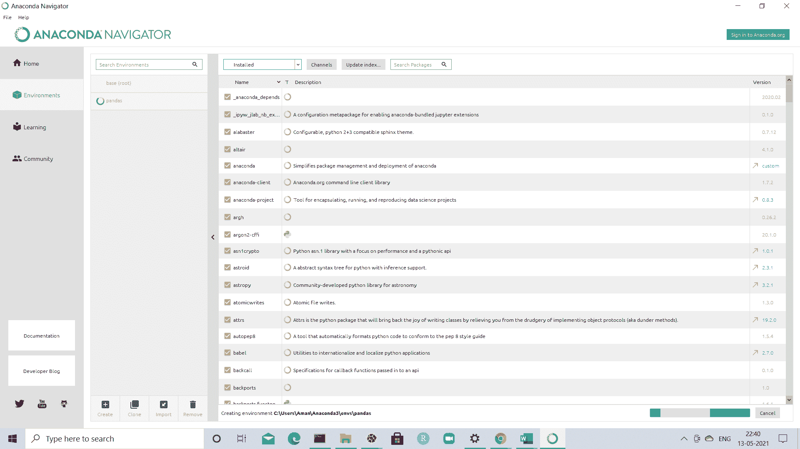
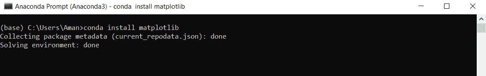
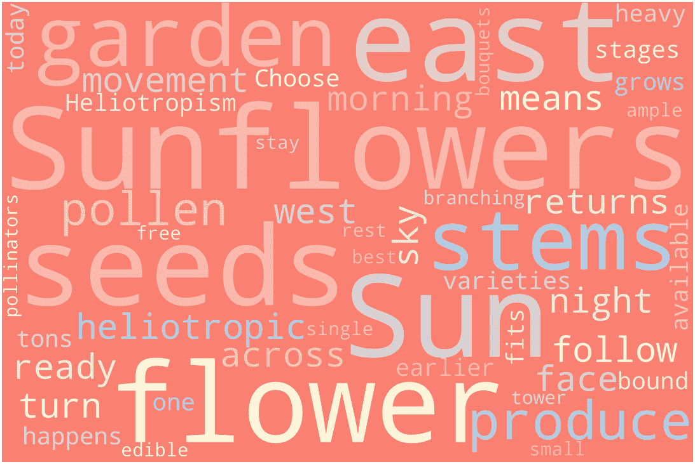

# Python 中的 WordCloud 包

> 原文：<https://www.javatpoint.com/wordcloud-package-in-python>

WordCloud 包帮助我们使用可视化了解文本内容中单词的出现频率。

为了实现这一点，我们需要首先安装一些包，比如 pandas、matplotlib 和 Wordcloud。

让我们来看看每个的安装步骤-

### Pandas装置

Pandas是在 Jupyter 笔记本中实现数据分析和可视化的一个很好的工具。它可以通过以下方式导入到我们的源代码中-

```py

import pandas as pd 

```

pd 指的是混叠过程，借助这一过程可以创建数据帧，并使代码的可读性更容易。

Pandas可以通过两种方式安装-

### 1.使用命令提示符

首先，让我们看看如何使用命令提示符来实现我们的目标。

1.  打开命令提示符
2.  键入给定的命令-
    ***皮普安装Pandas*T4】**
3.  单击“输入”后，软件包将开始在我们的系统中下载。

同样的命令可以在终端的 Linux 中使用，在我们的系统中安装Pandas。

### 2.使用Python导航器

在我们的系统中安装Pandas的第二种方法是使用 Anaconda Navigator

1.  打开Python导航器。
2.  单击“环境”选项卡，转到创建选项，在您的系统中设置Pandas。
3.  点击创建Pandas环境按钮。
4.  在包列表中，选择“全部”以获取过滤器。
5.  去搜索栏找“Pandas”，选择“Pandas套餐”。
6.  右键单击复选框，然后转到“标记特定版本安装”。
7.  选择我们要安装的版本，然后单击“应用”按钮安装软件包。



## 安装 Matplotlib

Matplotlib 是一个巨大而有趣的库，适合热衷于从数据中推断结果的人，它有散点图、直方图、箱线图等等，这让我们很容易理解。

Matplotlib 可以按照给定的步骤安装-

*   **使用命令提示符**

Matplotlib 可以通过使用命令提示符中给定的命令安装在我们的系统中

```py

pip install matplotlib

```

*   **使用Python**

我们可以通过在 Anaconda 提示符下键入以下命令来使用 Anaconda 安装 matplotlib

```py

conda install matplotlib 

```



## 验证安装

我们可以通过在终端键入给定的程序来验证 matplotlib 是否已经成功安装在我们的系统中-

```py

import matplotlib
matplotlib.__version__

```

## Wordcloud 的安装

如前所述，它让我们在视觉的帮助下了解文本中出现最多的单词。

让我们看看安装的步骤-

可以按照给定的步骤安装 WordCloud

*   **使用命令提示符**

通过使用命令提示符中给定的命令，可以在我们的系统中安装 WordCloud。

```py

pip install wordcloud

```

*   **使用Python**

我们可以通过在 **Anaconda 提示符**中键入以下命令来使用 Anaconda 安装 wordcloud。

```py

conda install -c conda-forge wordcloud

```

现在让我们看看这个简单的程序，它展示了如何在 [Python](https://www.javatpoint.com/python-tutorial) 中使用**单词云**。

我们从一个网站上获取了这段文字，并保存为 **sunflowers1.txt** 文件。

**向日葵 1.txt**

```py

"Sunflowers are heliotropic, which means that they turn their flowers to follow the movement of the Sun across the sky east to west, and then returns at night to face the east, ready again for the morning sun. Heliotropism happens during the earlier stages before the flower grows heavy with seeds.
There are tons of varieties of sunflowers available today, so there's bound to be one that fits your garden. Choose between those with branching stems or single stems, those that produce ample pollen for pollinators or are pollen-free (best for bouquets), those that stay small or tower above the rest of the garden, or those that produce edible seeds! "

```

**代码实现**

```py

import re
import matplotlib.pyplot as plt
from wordcloud import WordCloud, STOPWORDS
text = open("/content/sunflowers1.txt", "r").read()
# Clean text
text = re.sub(r'==.*?==+', '', text)
text = text.replace('\n', '')
# Define a function to plot word cloud
def plot_cloud(wordcloud):
    # Set figure size
    plt.figure(figsize=(40, 30))
    # Display image
    plt.imshow(wordcloud) 
    # No axis details
    plt.axis("off")
# Generate word cloud
wordcloud = WordCloud(width = 3000, height = 2000, random_state=1, background_color='salmon', colormap='Pastel1', collocations=False, stopwords = STOPWORDS).generate(text)
plot_cloud(wordcloud)

```

**输出:**



* * *