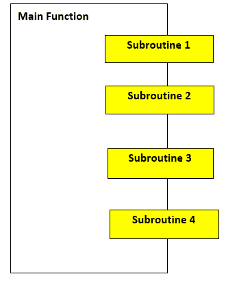
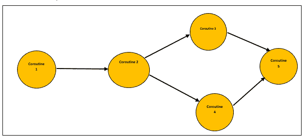

# Python coroutine

> 原文：<https://www.javatpoint.com/python-coroutines>

在本教程中，我们将学习 Python 中的 coroutine。我们将详细讨论 Python 中的协同程序、子程序、协同程序的执行和协同程序的关闭。

在开始学习 coroutine 之前，我们必须对 Python 中的子程序有一个基本的了解。因此，我们将从本教程中的 Python 子例程开始。

## Python 子程序

众所周知，Python 中的函数，我们可能知道也可能不知道这些 Python 函数也被称为过程、子过程或子程序。

通常，Python 中的函数是一个打包的指令序列，作为一个单元来执行代码中的某项任务。当我们把复杂函数的逻辑分成几个独立的步骤，像一个独特的函数(嵌套函数等)一样工作时。)，那么这些助手或者主函数中的嵌套函数在 Python 中被称为子程序。

我们通过 Python 中负责协调的主函数调用子程序，同时在函数中使用子程序。Python 中的所有子程序只有一个入口点，即启动主函数。

**主要功能**



看到上面给出的图，我们很容易得出结论，在使用子程序的时候需要主函数来协调子程序之间的关系，主函数也是 Python 中子程序的唯一入口点。

## 什么是科罗廷？

现在，在这一节中，我们将讨论基本上是子程序一般化的协程。

协同通常用于在一段时间内(周期性地)主动放弃(让步)控制的进程的协同多任务处理。当空闲时，也可以使用协同程序来同时运行多个应用。



在花冠中，花冠不同于线；决定何时切换协同程序的是程序员和编程语言，而在线程的情况下，操作系统安排线程之间的切换。

### 协同程序和子程序的区别

| 协同程序 | 子程序 |
| 与子程序不同，Coroutines 有多个入口点。 | 子程序只有一个入口点，即主函数。 |
| 我们只能从单点暂停和恢复 Python 子程序的执行，只能从起点恢复。 | 我们可以从函数中的多个点暂停和恢复 Python 中 coroutines 的执行，也可以从上次暂停的地方恢复执行。 |
| 与子程序不同，我们没有任何主要的 Python 协同函数来命令和协调它们的执行。 | 在 Python 子程序中，主函数协调多个子程序并控制它们的执行。 |
| 协同程序是合作的，因为当我们执行它们时，它们一起形成了一个管道结构。 | 子程序形成线性执行结构。 |
| 在 coroutine 中，我们有一个显示输入数据结果的 coroutine。 | 对于子程序，子程序中给出的数据处理结果由主函数显示。 |

## Python 中的协同程序

coroutine 与 Python 中的生成器非常相似，但是 coroutine 在 yield(放弃)语句中做了一些修改，并提供了一些额外的方法。Python coroutines 也能够使用输入数据，而生成器只能产生用于函数迭代的数据。

在版本高于 2.5 的 Python 中，我们可以观察到 coroutines 的 yield 语句中引入了一个微小的变化，在这个变化之后，yield 语句可以作为一个表达式使用。

**例:**右侧收益率赋值，即 **LineOfCode =(收益率)**

我们在程序中发送给 coroutine 的任何值都将被 coroutine 捕获，并且只通过 yield 表达式返回。我们只能通过 send()函数向 coroutine 发送一个值。

考虑下面程序中的给定协同程序，该程序将只打印前缀中有“官员”的姓名，我们将使用 **send()** 函数将姓名发送给协同程序。

**示例:**

```py

# Default function to search prefix
def print_name(prfx): 
    print("Coroutine object searching for the prefix: {}".format(prfx)) # Searching for prefix
    while True: 
        GivenName = (yield) 
        if prfx in GivenName: # If required prefix match
            print(GivenName) # Print  given name
CorouteObject = print_name("Officer") # Taking prefix = Officer for coroutine object
# Taking names as input from user
Name1 = input("Enter first name: ")
Name2 = input("Enter second name: ")
Name3 = input("Enter third name: ")
CorouteObject.__next__() # using _next_() method to call coroutine
# sending input data to coroutine with send() method
CorouteObject.send(Name1)
CorouteObject.send(Name2)
CorouteObject.send(Name3)

```

**输出:**

```py
Enter first name: Alex
Enter second name: Officer Steve Rogers
Enter third name: Officer Natasha Widow
Coroutine object searching for the prefix: Officer
Officer Steve Rogers
Officer Natasha Widow

```

**解释-**

所以，在上面的程序中我们可以看到，我们已经从用户那里取了三个名字作为输入数据，我们已经通过 **send()** 方法将用户输入数据发送到函数中定义的 coroutine。我们在 coroutine 中使用了“officer”关键字来搜索名字中有 Officer 前缀的名字，coroutine 将只打印这些匹配的名字，正如我们在输出中看到的那样。

### 执行共同诉讼

在 Python 中，coroutine 的执行与生成器非常相似。当我们在程序中调用 coroutine 时，什么也不会发生；它将只运行以下两个响应:send()和 next()函数。

我们可以在上面的例子中清楚地观察到；只有在我们调用了程序中的 _next_()方法之后，coroutine 才会开始执行。调用 coroutine 后，执行前进到产生第一个表达式。

之后，coroutine 的执行暂停，等待值发送到 coroutine 对象。在第一个值被发送到 coroutine 对象后，它检查所需的前缀是否存在，如果存在，那么对象将打印带有前缀的名称。在打印名称后，它会经历一个连续的循环，直到再次遇到 name = (yield)表达式。

### 结案陈词

要关闭协同程序，我们必须在程序中使用 **close()** 函数。当我们关闭协同程序时，它会产生一个异常，即 GeneratorExit 异常，我们可以用捕获异常的正常方式来捕获它。

**示例-**

```py

# Default function to search prefix
def print_name(prfx): 
    print("Coroutine object searching for the prefix: {}".format(prfx)) # Searching for prefix
    # Using excption handling by try and except
    try:
        while True:
            GivenName = (yield)
            if prfx in GivenName: # If required prefix match
                print(GivenName) # Print given name
    except GeneratorExit: # Handling GeneratorExit exception
            print("Now we have closed the coroutine!!")
CorouteObject = print_name("Officer") # Taking preifx = Officer for coroutine object
CorouteObject.__next__() # using _next_() method
# sending input data to coroutine with send() method
CorouteObject.send("Alexa")
CorouteObject.send("Officer Tony Stark")
CorouteObject.send("Officer Steve Rogers")
# closing the coroutine
CorouteObject.close()

```

**输出:**

```py
Coroutine object searching for the prefix: Officer
Officer Tony Stark
Officer Steve Rogers
Now we have closed the coroutine!!

```

我们必须记住，如果我们试图在关闭协同对象后向协同对象发送值，程序将在输出中引发一个 StopIteration 异常。

## 通过链接协同创建管道结构

我们可以使用 coroutine 创建一个管道结构。在我们将 coroutine 链接在一起之后，我们可以使用 push()方法通过创建的管道结构推送给定的数据。要在带有 coroutines 的程序中创建管道结构，我们必须注意以下事项:

我们必须给出一个初始源，即生产者，它将导出完整的管道结构。一般来说，生产者本身并不是一个附属品，他们只是一个简单的方法。

我们必须在管道的末端创建一个接收器，该接收器将充当管道的端点。接收器是协同管道中的一个点，它可以收集所有的输入数据并显示出来。

了解以下流水线结构的协同程序。

**示例:**

```py

# Defining producer for the pipeline
def producer(GivenSentence, NextCoroutine): 
    tokens = GivenSentence.split(" ") # splitting sentence
    for token in tokens: # iterating over tokens
        NextCoroutine.send(token) 
    NextCoroutine.close() # closing coroutine
# Defining pattern filter for the pipeline structure
def pattern_filter(SearchPattern = "ing", NextCoroutine = None):
    print("In the input sentence, we are searching for words that end with{}".format(SearchPattern)) # Searching for pattern
    try: 
        while True: 
            token = (yield) # yielding tokens
            if SearchPattern in token: 
                NextCoroutine.send(token) # Sending tokens
    except GeneratorExit: # Exception handling for GeneratorExit exception
        print("We are done with filtering the given input sentence!!")
# Defining sink for the pipeline
def print_token(): 
    print("I'm sink in the pipeline and I am used to print the tokens given.") 
    try: 
        while True: 
            token = (yield) # yielding tokens
            print(token) # printing the tokens from sink
    except GeneratorExit: 
        print("Now we are done with printing!")
# Taking sink variable
PrintToken = print_token() 
PrintToken.__next__() # calling sink
# Taking Pattern filter variable
PatternFilter = pattern_filter(NextCoroutine = PrintToken) 
PatternFilter.__next__() # calling pattern filter
# Taking a sentence for the producer in the pipeline
GivenSentence = "Steve rogers is running very fast to chase down a train moving with high speed"
producer(GivenSentence, PatternFilter) # calling producer

```

**输出:**

```py
I'm sink in the pipeline, and I am used to printing the tokens given.
In the input sentence, we are searching for words that end with ing
running
moving
We are done with filtering the given input sentence!!

```

**解释-**

这就是我们如何使用用多个协同创建的管道并过滤输入数据。过滤或合成的数据将显示在管道的接收器上，正如我们在上面的输出中看到的。

* * *