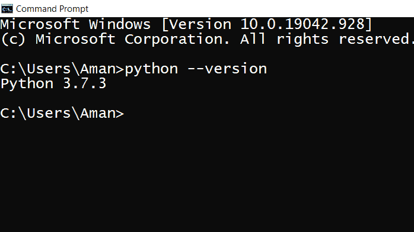
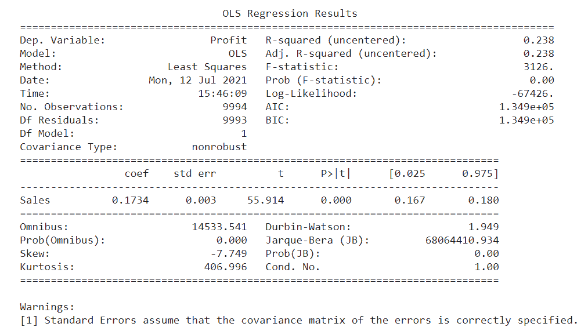

# 如何在 Python 中安装 StatsModels？

> 原文：<https://www.javatpoint.com/how-to-install-statsmodels-in-python>

如果你渴望在机器学习领域有一个繁荣的职业生涯，让我们给你介绍一个更有趣的包，它的功能会让你敬畏。

那么，让我们看看什么是 statsmodels，它有什么特点？

Statsmodels 是 Python 中一个流行的库，它使我们能够估计和分析各种统计模型。它建立在像 NumPy 和 SciPy 这样的数字和科学图书馆上。

这个包的一些基本特征是-

1.  它包括各种线性回归模型，如普通最小二乘法、广义最小二乘法、加权最小二乘法等。
2.  它为时间序列分析提供了一些有效的函数。
3.  它还有一些用于示例和测试的数据集。
4.  基于生存分析的模型也是可用的。
5.  我们可以想象的大规模数据的所有统计测试都存在。

### 安装 statsmodels

让我们看看用 Python 安装 statsmodels 的步骤——

1.  检查安装在我们电脑上的 Python 版本，我们在之前的文章中已经讨论过这个问题，但是让我们再次讨论这个问题-
    有两种方法可以检查 Windows 中的 Python 版本-

*   *使用 Powershell*
*   *使用命令提示符*

### 使用 PowerShell

按照以下步骤使用 PowerShell 检查 Python 版本。

1.  单击“Win+R”或在任务栏的搜索窗格中键入“Run”。
2.  键入“Powershell”
3.  屏幕上将出现一个名为“Windows Powershell”的窗口
4.  点击“输入”
5.  键入 *python 版本*，点击“输入”
6.  版本将显示在下一行。

### 使用命令提示符

在任务栏的搜索窗格中键入“命令提示符”，您会看到它的图标。点击它打开命令提示符。

另外，如果它被固定在任务栏上，你可以直接点击它的图标。

1.  一旦“命令提示符”屏幕在您的屏幕上可见。
2.  键入 *python 版本*，点击“输入”。
3.  您系统中安装的版本将显示在下一行。



### 在 Linux 中检查 Python 的版本

在 Linux 中，我们有一个*Shell*，在这里我们键入我们的命令，这些命令被解释并告诉操作系统用户想要什么。

检查 Linux 中 Python 版本的步骤是-

*   启动你的系统，打开 Linux 操作系统(你可能会发现它的名字是 *Ubuntu* )。
*   一旦 Linux 的桌面屏幕出现，点击“终端”打开它。
*   在终端窗口中，输入 *python 版本*，点击“输入”。

在下一行中，它将显示系统中安装的 python 的当前版本。

## statsmodels 的安装

现在让我们讨论一下在我们的系统中安装 **statsmodels** 的步骤。我们将研究两种安装方法

1.  使用 Python 提示
2.  使用命令提示符

在第一种方法中，我们将打开 Anaconda 提示符，并键入以下命令-

```py

conda install -c conda-forge statsmodels

```

在第二种方法中，我们将打开命令提示符，键入以下命令并点击**“回车”。**

```py

pip install statsmodels

```

是时候寻找一个程序来导入 statsmodels-

这里，我们将执行 OLS(普通最小二乘)回归，在这种技术中，我们将尝试最小化计算值和观测值之间的差值的平方和。

**示例-**

```py

import pandas as pd
import statsmodels.api as sm
df=pd.read_csv("/content/SampleSuperstore.csv")
df.head()
x=df['Sales']
y=df['Profit']
model=sm.OLS(y,x).fit()
model_summary=model.summary()
print(model_summary)

```

**输出-**



在本教程中，我们讨论了安装 statsmodels 所涉及的步骤，以及如何在它的帮助下获得数据集的详细统计摘要。

* * *