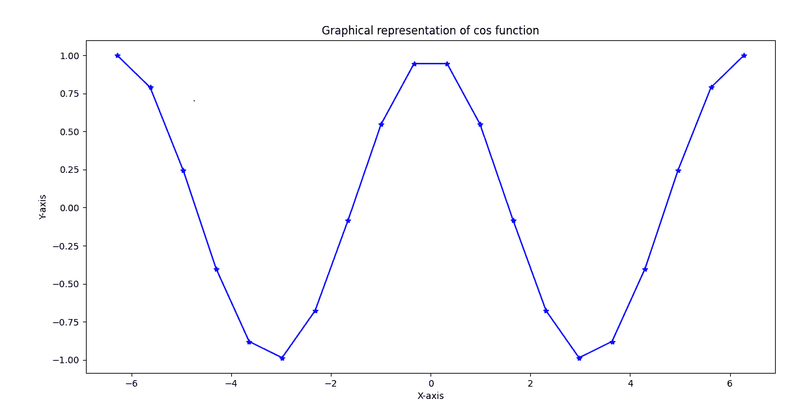
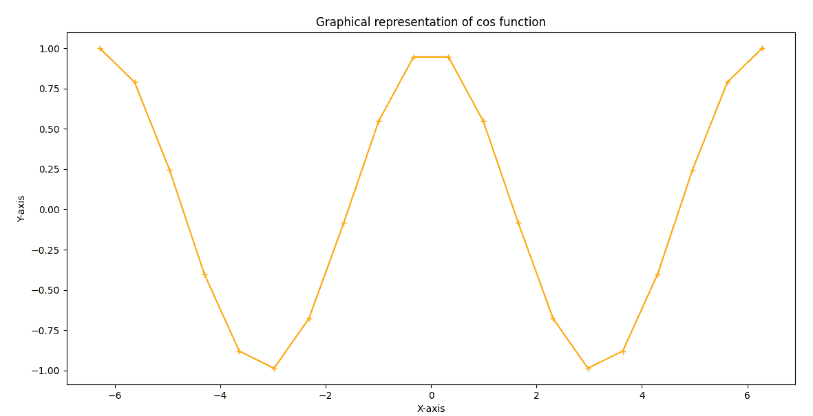

# Python 中的 Cos

> 原文：<https://www.javatpoint.com/cos-in-python>

在本教程中，我们将讨论 Python 中的三角**余弦(cos)** 函数。我们将讨论我们可以用来在 Python 程序中实现 cos 函数的模块。我们还将学习在程序中使用 cos 函数绘制图形。所以，让我们从我们可以导入到程序中使用 cos 函数的模块开始。

## cos 函数的 Python 模块

在 Python 中，我们有一个数学模块，可以用来导入和实现 cos 函数以及程序中其他重要的数学运算。除了数学模块，我们还可以使用 Python 的 numpy 模块来实现程序中的 cos 函数。我们将一个接一个地学习使用两个模块，即数学模块和 numpy 模块，分别在程序中实现 cos 函数。

### 方法 1:数学模块中的 cos()函数

Python 的数学模块附带了许多重要的数学值和运算，cos()函数就是其中之一。我们可以使用数学模块的 cos()函数在程序中实现三角 cos 值。 **math.cos()** 函数返回我们在函数内部给出的自变量的三角余弦值，即余弦值。我们在函数中作为参数给出的值应该是弧度。

**语法-**

下面是在 Python 程序中使用 math.cos()函数的语法:

```py

math.cos(a)

```

**参数:**这里参数 **a =弧度值**。

**返回值:****math . cos()**函数返回我们在函数中给定的以弧度表示的参数‘a’的余弦值。

让我们通过下面的示例程序来了解数学模块的 **cos()** 函数在 Python 中的使用:

**示例-**

```py

# Import math module
import math
# Define an input radian value
x = math.pi / 12
# Printing cosine value for respective input value
print ("The cosine value of pi / 12 value as given is : ", end ="")  

print (math.cos(x))

```

**输出:**

```py
The cosine value of pi / 12 value as given is: 0.9659258262890683

```

### 方法 2:在 Numpy 模块中使用 cos()函数

除了数学模块，我们还可以使用 numpy 模块在程序中实现三角余弦值。为此，我们在 numpy 模块中提供了一个 cos()函数，它在输出中给出了数学余弦值。和 math.cos()函数一样，在使用 numpy 模块的 cos()函数时，我们必须在函数内部给出以弧度为单位的参数值。

以下是在 Python 程序中使用 numpy.cos()函数的语法:

```py

numpy.cos(a)

```

**参数:**我们可以在 numpy.cos()函数中给出‘a’作为以下参数类型:

*   我们可以在函数中给出一个以弧度表示的单值参数。
*   我们还可以在函数中给出一个包含多个弧度值的数组作为参数。

**返回类型:**numpy . cos()函数将返回给定数字的余弦值。

让我们通过下面的示例程序来了解 numpy 模块的 cos()函数在 Python 中的使用:

**示例-**

```py

# importing numpy module as jtp in program
import numpy as jtp
# defining multiple input values in a single array
ValArray = [0, jtp.pi / 4, jtp.pi / 7, jtp.pi/9, jtp.pi/12, jtp.pi/5]
# printing input array in output
print ("Values given in the input array: \n", ValArray)
# using cos() function to get cosine values
CosArray = jtp.cos(ValArray)
# printing cos values in output
print ("\nRespective Cosine values for input array values: \n", CosArray)

```

**输出:**

```py
Values given in the input array: 
 [0, 0.7853981633974483, 0.4487989505128276, 0.3490658503988659, 0.2617993877991494, 0.6283185307179586]

Respective Cosine values for input array values: 
 [1\.         0.70710678 0.90096887 0.93969262 0.96592583 0.80901699]

```

### 绘制输出中余弦值的图形表示

到目前为止，我们已经学习了在 Python 程序中使用 numpy 和数学模块的 cos()函数。现在，我们将同时使用 numpy 和数学模块，同时，我们还将使用 cos()函数绘制余弦值的图形表示。我们可以通过以下两种方式进行图形化表示:

*   直接导入并实现 cos()函数和 numpy & math 模块
*   用 numpy 和数学模块迭代 cos()函数

让我们通过在 Python 程序中使用这两种方法并在输出中用它们绘制图表来了解这两种方法的实现。

**示例- 1:直接导入并实现 cos()函数和 numpy &数学模块**

```py

# importing numpy module as jtp
import numpy as jtp
# importing matplotlib module as mlt
import matplotlib.pyplot as mlt

# Defining an array containing radian values
RadValArray = jtp.linspace(-(2*jtp.pi), 2*jtp.pi, 20)
# cosine values for respective array value
CosValArray = jtp.cos(RadValArray)

# printing values in output
print("Radian values in the array: ", RadValArray)
print("\nRespective cos values of array: ", CosValArray)

# using plot() function with variables
mlt.plot(RadValArray, CosValArray, color = 'blue', marker = "*")
mlt.title("Graphical representation of cos function")
mlt.xlabel("X-axis")
mlt.ylabel("Y-axis")

# plotting graph in output
mlt.show()

```

**输出:**

```py
Radian values in the array:  [-6.28318531 -5.62179738 -4.96040945 -4.29902153 -3.6376336  -2.97624567
 -2.31485774 -1.65346982 -0.99208189 -0.33069396  0.33069396  0.99208189
  1.65346982  2.31485774  2.97624567  3.6376336   4.29902153  4.96040945
  5.62179738  6.28318531]

Respective cos values of array:  [ 1\.          0.78914051  0.24548549 -0.40169542 -0.87947375 -0.9863613
 -0.67728157 -0.08257935  0.54694816  0.94581724  0.94581724  0.54694816
 -0.08257935 -0.67728157 -0.9863613  -0.87947375 -0.40169542  0.24548549
  0.78914051  1\.        ]

```



**示例- 2:用 numpy 和数学模块迭代 cos()函数**

```py

# importing math module
import math
# importing numpy module as jtp
import numpy as jtp
# importing matplotlib module as mlt
import matplotlib.pyplot as mlt

# Defining an array containing radian values
RadValArray = jtp.linspace(-(2*jtp.pi), 2*jtp.pi, 20)
# Empty array for cosine values
CosValArray = []

#Iterating over the cos values array
for j in range(len(RadValArray)): 
    CosValArray.append(math.cos(RadValArray[j])) 
    j += 1

# printing respective values in output
print("Radian values in the array: ", RadValArray)
print("\nRespective cos values of array: ", CosValArray)

# using plot() function with variables
mlt.plot(RadValArray, CosValArray, color = 'orange', marker = "+")
mlt.title("Graphical representation of cos function")
mlt.xlabel("X-axis")
mlt.ylabel("Y-axis")

# plotting graph in output
mlt.show()

```

**输出:**

```py
Radian values in the array:  [-6.28318531 -5.62179738 -4.96040945 -4.29902153 -3.6376336  -2.97624567
 -2.31485774 -1.65346982 -0.99208189 -0.33069396  0.33069396  0.99208189
  1.65346982  2.31485774  2.97624567  3.6376336   4.29902153  4.96040945
  5.62179738  6.28318531]

Respective cos values of array:  [1.0, 0.7891405093963934, 0.2454854871407988, -0.40169542465296987, -0.8794737512064891, -0.9863613034027223, -0.6772815716257412, -0.08257934547233249, 0.5469481581224268, 0.9458172417006346, 0.9458172417006346, 0.5469481581224268, -0.0825793454723316, -0.6772815716257405, -0.9863613034027223, -0.8794737512064893, -0.40169542465296987, 0.2454854871407988, 0.7891405093963934, 1.0]

```



* * *