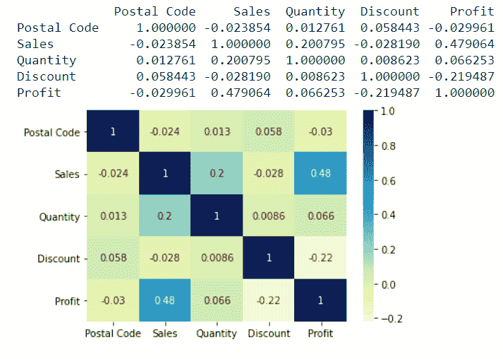
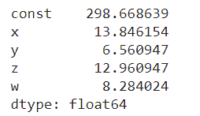

# Python 中的 vif


在讨论 **vif 之前，**首先要了解什么是线性回归中的多重共线性？

当两个独立变量具有很强的相关性时，就会出现多重共线性的情况。

每当我们进行探索性数据分析时，目标都是获得影响目标变量的重要参数。

因此，相关性是帮助我们理解两个变量之间存在的线性关系的主要步骤。

## 什么是相关性？

相关性衡量两个变量相互依赖的范围。

检查两个变量之间存在何种相关性的直观想法。我们可以绘制一个图表，并解释一个属性的值的增加如何影响另一个属性。

关于统计，我们可以使用**皮尔逊相关**获得相关性。它给出了相关系数和 P 值。

让我们看看标准-

| 相关系数 | 关系 |
| 1.接近+1 | 大正 |
| 2.接近-1 | 大底片 |
| 3.接近 0 | 不存在任何关系 |

| p 值 | 确定性 |
| p 值< 0.001 | 强烈的 |
| p 值< 0.05 | 温和的 |
| p 值< 0.1 | 无力的 |
| p 值> 0.1 | 不 |

由于现在我们对相关性有了详细的了解，我们现在理解了如果数据集的两个独立变量之间存在强相关性，就会导致多重共线性。

让我们讨论一下多重共线性会导致什么样的问题-

1.  因为有很强的关系，确定重要的变量将是一项艰巨的任务。
2.  我们将获得的变量系数可能是不稳定的，因此，解释模型将是一项乏味的工作。
3.  可能会出现过度拟合，模型的精度会随着数据集而变化。

## 检查多重共线性

检查多重共线性的两种方法是-

*   绘制热图以理解相关性
*   使用差异通货膨胀系数

### 绘制热图以理解相关性

获取数据集并绘制热图将有助于我们推断哪个属性具有最显著的相关性值。这个值会告诉我们因变量和自变量之间的影响程度。

让我们来看一个展示如何实现它的程序。

**示例-**

```py

import matplotlib.pyplot as plt
import pandas as pd
import seaborn as sns

# importing the data
df = pd.read_csv("/content/SampleSuperstore.csv")

print(df.corr())

# plotting the correlation heatmap
df_plot = sns.heatmap(df.corr(), cmap="YlGnBu", annot=True)

# displaying the heatmap
plt.show()

```

**输出:**



### 使用差异通货膨胀系数

方差膨胀因子是多元回归中变量集合中存在的多重共线性的度量。

一般来说，vif 值高于 10 表明与其他自变量有很高的相关性。

让我们来看一个展示如何实现它的程序。

**示例-**

```py

from statsmodels.stats.outliers_influence import variance_inflation_factor
from statsmodels.tools.tools import add_constant
import pandas as pd

df = pd.DataFrame(
    {'x': [2, 2, 4, 1, 3],
     'y': [1, 1, 2, 3, 2],
     'z': [7, 4, 8, 6, 9],
     'w': [5, 4, 3, 4, 5]}
)

X = add_constant(df)
ds=pd.Series([variance_inflation_factor(X.values, i) 
               for i in range(X.shape[1])], 
              index=X.columns)
print(ds)

```

**输出:**



## 解决多重共线性问题的不同方法-

*   **变量选择**

选择变量的方式应该是去掉高度相关的变量，并且我们只使用重要的变量。

*   **变量变换**

变量的转换是一个完整的步骤，这里的动机是保持特征，但是执行转换可以给我们一个不会产生偏差结果的范围。

*   **主成分分析**

主成分分析是降维技术，通过它我们可以获得对我们的目标变量有强烈影响的数据集的重要特征。

在实施 PCA 时，我们必须注意的一件事是，我们不应该丢失基本特征，并试图通过收集尽可能多的信息来减少它们。

* * *