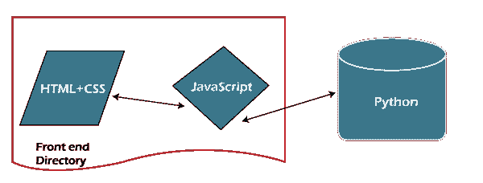
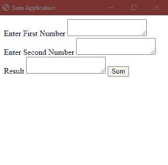

# Python EEL

> 原文：<https://www.javatpoint.com/eel-in-python>

在本教程中，我们将讨论在 Python 编程语言中使用 Eel 库，以便在 HTML、CSS 和 JavaScript 的帮助下为 Python 程序设计用户界面。

我们把教程分成了两个部分。第一部分基于EEL库的基本理论。相比之下，我们在另一部分通过创建一个简单的应用展示了该库的实现，该应用接受两个整数作为用户的输入并返回它们的总和。

## 了解Python鳗库

Eel 是 [Python 编程语言](https://www.javatpoint.com/python-tutorial)中的一个小库，允许程序员基于 [HTML](https://www.javatpoint.com/html-tutorial) 和 [JavaScript](https://www.javatpoint.com/javascript-tutorial) 创建简单的类似电子的离线图形用户界面(GUI)应用，完全可以访问 Python 的功能和库。

Eel 能够托管一个本地网络服务器，然后允许程序员用 Python 注释方法和函数，这样我们就可以从 JavaScript 调用它们，反之亦然。这个库是为了消除编写简单而简短的 [GUI](https://www.javatpoint.com/gui-full-form) 应用的干扰而设计的。

让我们考虑一个描绘EEL概念的图形。



HTML、 [CSS、](https://www.javatpoint.com/css-tutorial)和 JavaScript 的文件存储在同一个目录中，并在 python 程序的帮助下进行初始化。JS 文件使用由 HTML 页面中的 onclick 事件激活的函数来实现 HTML 页面和 Python 之间的连接。

## EEL库的实现

下一节将讨论如何在 Eel 库的帮助下制作一个简单的应用，用于演示目的。应用背后的想法是，程序从 HTML 页面中接受两个数字，用 Python 添加它们，并向用户显示输出。

但是在我们开始创建应用之前，让我们安装 Eel 库。

我们将使用 pip 安装程序来安装所需的库。其语法如下所示:

**语法:**

```py

$pip install eel

```

接下来，我们将使用 Visual Studio 代码来创建这个项目。我们创建了一个名为“Web_test”的文件夹。在该文件夹中，我们创建了另一个名为“我的网站”的文件夹。该文件夹将存储以下文件:

1.  超文本标记语言
2.  js-file.js
3.  巴拉圭

对于 HML 页面，我们将创建三个文本区域和一个按钮。让我们考虑下面的代码片段。

**文件:myWebpage.html**

```py

<html>
    <head>
        <title>
            Sum Application
        </title>
        <script type = "text/javascript" src = "js-file.js"></script>
        <script type = "text/javascript" src = "/eel.js"></script>
    </head>
    <body>
        <label>Enter First Number
        <textarea id = "int1"></textarea>
        <label>Enter Second Number
        <textarea id = "int2"></textarea>
        <label>Result
        <textarea id = "res"></textarea>

        <button type = "button" id = "add" onclick = "summation()">
            Sum
        </button>

    </body>
</html>

```

**说明:**

在上面的代码片段中，我们创建了一个 HTML 页面，其中定义了三个具有不同标识的文本区域。****获取用户输入，**RES‘**文本区显示结果。id =**‘sum’**的按钮附带了一个在 JS 文件中定义的 onclick 函数。****

 ****现在，让我们考虑 JS 文件的代码片段。

**文件:js-file.js**

```py

document.querySelector("button").onclick = function summation(){
    var data_1 = document.getElementById("int1").value
    var data_2 = document.getElementById("int2").value
    eel.add(data_1, data_2)(call_Back)
}

function call_Back(output){
    document.getElementById("res").value = output
}

```

**说明:**

在上面的代码片段中，我们定义了一个通过 onclick 事件激活的函数**summary()**。在该函数中，我们已经获取了**“int 1”**和**“int 2”**的值，并将它们传递给**“sum”**函数，该函数将在 Python 文件中定义。名为 **call_Back()** 的函数接受**‘output’**作为名为“ **sum** 的 Python 方法返回的参数。该**“输出”**在文本区返回，id 为**“RES”**。

现在，让我们考虑 Python 文件的代码片段。

**文件:my_sum.py**

```py

# importing the eel library
import eel
# initializing the application
eel.init("myWeb")

# using the eel.expose command
@eel.expose
# defining the function for addition of two numbers
def add(data_1, data_2):
    int1 = int(data_1)
    int2 = int(data_2)
    output = int1 + int2
    return output

# starting the application
eel.start("myWebpage.html")

```

**说明:**

在上面的代码片段中，我们导入了 **eel** 库，并在 **eel.init(“文件夹名”)**命令的帮助下初始化了应用，其中我们将“ **myweb** ”指定为文件夹的名称。

然后我们使用了 **eel.expose** 命令，在该命令下我们定义了“ **add** 函数，该函数将把**‘data _ 1’**与**‘data _ 2’**相加，并将结果值返回为“**输出**”。存储在“输出”中的值由 JS 文件中的“ **call_Back** ”函数获取，并放置在 HTML 网页中。

然后，我们在**eel . start(“html 文件名”)**命令的帮助下初始化了应用，将文件名指定为“**myWebpage.html**”。

现在让我们保存 python 文件，并使用以下语法执行它，以便查看结果

**语法:**

```py

$ python my_sum.py

```

下图显示了设计的用户界面。

**输出:**



**说明:**

默认情况下，Python Eel 库利用谷歌 Chrome 网络浏览器来运行应用；不过，我们也可以借助**‘模式’**选项来提及浏览器。除了**【模式】**之外，很少有其他可用的应用选择，如**【位置】【尺寸】【几何】**等等，这些都在 **eel.start()** 命令中传递。

## 结论

在上面的教程中，我们已经讨论了 Eel 库及其在 Python 中的用法。我们了解到这个库帮助程序员创建一个基于 HTML 和 JavaScript 的离线应用。在 Eel 库的帮助下，我们获得了 Python 的功能，包括使用 HTML 和 CSS 设计用户界面的自由。虽然根据知名度，EEL低于其主要竞争对手，电子；然而，为了创建简单的图形用户界面(GUI)应用，有许多程序员的首选是 Eel。

* * *****