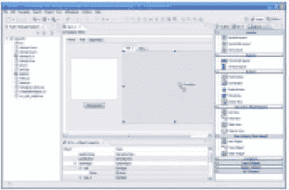
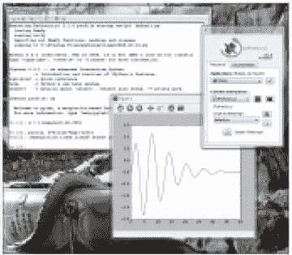
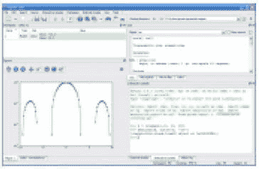
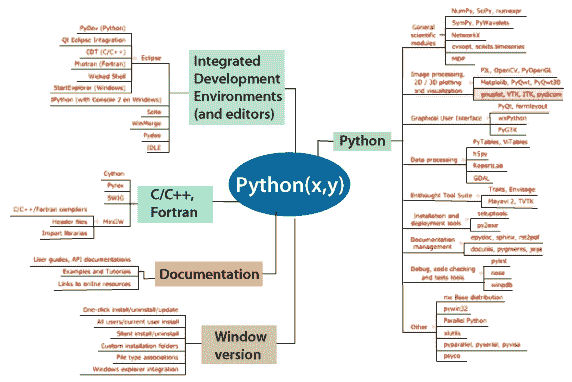

# PythonXY 软件

> 原文：<https://www.javatpoint.com/python-x-y-software>

PythonXY是一个绝对免费使用的工程和科学开发软件。PythonXY软件用于数据分析、数据可视化和数值计算。PythonXY基于 Spyder 交互式科学开发环境，Python 编程语言，基于 Qt 的 GUI(图形用户界面)。

## 一个人能用 PythonXY做什么？

借助 PythonXY软件，我们可以完成以下任务和分析:

*   我们可以借助 PythonXY软件执行简单的函数式编程任务(编程语言有类似 MATLAB 的语法)以及强大的面向对象编程任务。
*   我们甚至可以在使用 PythonXY的同时使用并行 Python 进行集群。
*   从最简单的 Python 脚本到最复杂的应用，我们可以使用 PythonXY软件为所有人进行科学的项目开发。
*   由于其 Qt 的图形用户界面和 Spyder 科学开发环境，我们可以轻松地用它进行科学项目开发。
*   使用 PythonXY软件，我们可以进行各种交互式计算，包括符号数学和二维以及三维图形绘制。
*   我们甚至可以使用 PythonXY在多进程器或多核计算机上进行并行计算。
*   除了上面提到的所有任务，我们甚至可以用 PythonXY软件做更多的事情...
    
    
    

## Python 历史(x，y)

Pierre Raybaut 自 2008 年以来一直在维护、构思和开发 PythonXY软件，并制定了所有与未来性能相关的目标(我们将在本文后面讨论)。2011 年，Gabi Davar 与 Pierre Raybaut 一起加入了 PythonXY项目，并从那以后一直作为维护者从事该项目的工作。2013 年晚些时候，皮埃尔·雷博退出了这个项目，从事其他各种项目。自 2013 年以来，Gabi Davar 一直是 PythonXY项目的主要维护者。

## 什么是 PythonXY

PythonXY软件的最初和主要目的是帮助所有使用编译语言或解释语言的科学程序员和项目开发人员转向 Python。PythonXY是面向科学发展的 Python 分发软件，基于 Spyder 和 Qt 接口。在 PythonXY中，所有使用编译编程语言的程序员也喜欢通过将代码包装在软件中来“原样”重用他们的代码，这样我们就可以在 Python 脚本中直接调用它们。

以下是我们应该记住的一些要点。

*   IDL 是 ITT 视觉信息解决方案的注册商标，MATLAB 是 MathWorks 的注册商标。
*   我们可以在软件的插件页面直接看到 PythonXY软件中 Spyder 和 Qt GUI 的界面。
*   要下载 PythonXY软件并查看其插件，我们可以直接访问 GitHub 上给出的其官方网站，或者使用以下链接下载:
    https://python-xy.github.io/downloads.html

## Python 的主要特性(x，y)

PythonXY软件有很多特性，但是我们将描述一些重要的特性。

*   想要安装或卸载设备中存在的许多 Python 包的用户只需点击 PythonXY软件提供的单个按钮即可。
*   PythonXY还提供了关于如何开始使用 Python、Spyder 和 Qt 接口的快速用户指南。
*   PythonXY可以收集开发环境工具以及面向科学的 Python 库。
*   借助 PythonXY软件，我们几乎可以收集到所有免费的相关文档。
*   PythonXY软件为我们提供了一体化的设置程序，使所有用户都可以轻松地在他们的设备上进行设置。

## 为什么要创建 PythonXY？

我们都必须意识到测试所有的库，获取互联网上的所有免费文档并选择正确的文档(库和文档)需要花费大量时间。此外，我们还需要一些深入的视角来阐述其自身的一致开发框架，即 Python 开发环境及其库。这就是科学发展中出现对 PythonXY需求的地方。

以下是 PythonXY出现的一些原因:

*   使用 IPython(增强的 Python Shell)进行快速原型制作
*   使用 Spyder IDE(集成开发环境)提供的环境开发大小项目(类似应用的项目)。
*   用于许多科学发展目的，例如:
    1.  数值模拟，
    2.  图像处理物理(实验和建模)，
    3.  信号处理，
    4.  科学计算，
    5.  科学工程开发等。

### 为什么是 Python？

与任何其他编程语言相比，Python 被认为是更优越的科学语言，原因如下:

*   Python 是一种开源的免费科学语言。
*   Python 易于嵌入、扩展和移植。
*   Python 是一种基本面向对象的编程语言。
*   它也是一种通用语言，例如，I/O (Input & output)功能丰富，有许多数据库库，在互联网上很容易获得，有非常强大的 GUI，等等。

但是 Python 唯一遭受或缺乏的是缺少大量的文档，尽管日益增长的 Python 社区每天都在为它做贡献，在每个主题上都有许多很棒的解释教程。

### 为什么是 Qt？

PyQt 是一个非常易于使用的库，功能非常强大，因此我们强烈建议将其用于 GUI(图形用户界面)开发。许多科学项目和发展，如 2D·马特洛特利图形等。，可以很容易地嵌入到 PyQt 应用窗口中，而且它和 MATLAB 一样非常容易。

* * *