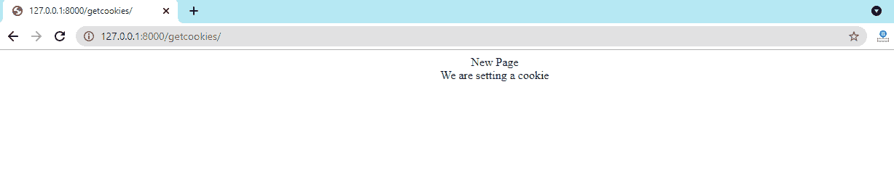
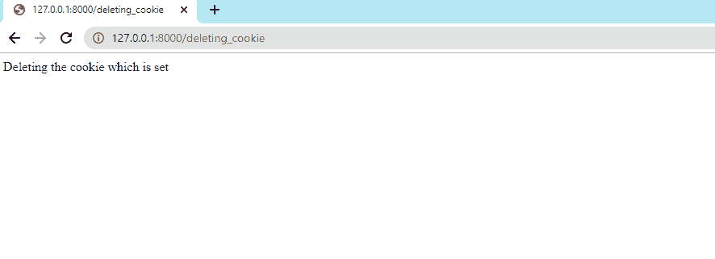
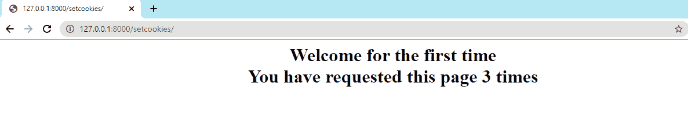
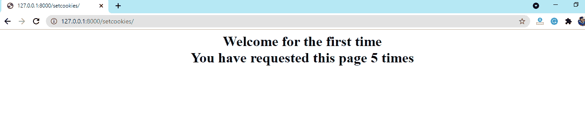

# 如何在Django处理Cookie——设置Cookie的方法

> 原文：<https://www.javatpoint.com/how-to-handle-cookies-in-django>

处理 cookies 是 web 应用的重要概念。Django 提供了一种与 cookies 交互的简单方法。Cookies 允许我们存储和检索会话中保存的数据。会话和 Cookies 彼此不同，我们将在后续教程中讨论。这些 cookies 是有时间限制的；这些将在指定时间后自动删除。

当我们访问任何网站并登录到该页面时，它会要求存储我们的用户 id 和密码，并根据我们之前登录的会话自动填写一些详细信息。所有这些过程都是由Cookie完成的。此外，我们可以将 cookie 存储在客户端计算机上，以使用户交互更容易。

本教程将讨论我们如何管理[Django](https://www.javatpoint.com/django-tutorial)中的 [cookie](https://www.javatpoint.com/django-cookie) ，以及它们为什么在互联网上有用。我们还将讨论如何使用服务器创建 cookies。

让我们来介绍一下Cookie。

## Django有什么Cookie？

cookie 也称为 HTTP cookies。它是一个由网络浏览器创建的小文本文件，并根据特定的网络服务器请求进行维护。文本文件保存在计算机本地，大多数浏览器将显示在隐私和安全设置下生成的 cookies。

请求由用户使用 HTTP 协议发送，但这是无状态的。识别用户是新用户还是以前访问过该网站没有帮助。

cookie 包含用于标识用户的唯一会话 id 和网站上下文的其他相关信息。当我们登录网站时，网站会发送带有唯一用户身份的 cookie。

Cookies 提供了许多 HTTP 无法提供的功能。

## DjangoCookie如何工作？

让我们了解一下 cookie 在互联网上是如何工作的。

*   浏览器向服务器发送请求。
*   服务器向浏览器发送响应以及一个或多个 cookies。
*   浏览器或客户端收到 cookies 并将其保存为文本文件。每次用户发送请求时，浏览器都会将此 cookie 发送到服务器，直到 cookie 过期。
*   cookie 过期后会从浏览器中删除。

Cookies 有多种用途，如登录网站或网上购物。许多公司使用 as 来跟踪用户偏好。不同的网站根据其需求使用不同的 Cookies。

## 为什么我们在Django需要Cookie？

当我们登录到一个**电子商务**网站或脸书而没有注销时，它会在我们下次访问我们的帐户时保持签名状态。Cookies 用于实现这一点(包含用户会话信息)。

Cookies 也用于几个电子商务网站的产品推荐。

## Django的Cookie属性

cookie 属性可以执行两个任务-它可以为用户计算机设置 cookie 并访问这些 cookie。让我们详细了解这些概念。

### 在Django设置Cookie

此属性用于设置服务器发送给用户浏览器以保存数据的 cookies。下面是 cookie()方法的语法。

```py

set_cookie(cookie_name, value, max_age = None, expires = None)

```

**名称-** 指定 cookie 名称。

**值-** 用于指定我们要存储在用户计算机中的特定值。

**max_age -** 用于定义Cookie的时限。如果未指定时间限制，它将一直处于活动状态，直到浏览器关闭。

**Expires -** 是一个格式为“Wdy DD-Mon-YY HH:MM:SS GMT”或日期时间的字符串。如果过期是日期时间对象，将确定**最大年龄**。

### 在Django买Cookie

服务器使用 get cookies 来读取先前发送的 cookies 数据。我们可以使用以下语法。

```py

request.COOKIES['cookie_name']

```

让我们看看如何手动设置 Django cookies。

## Django Cookie 实现

在下面的步骤中，我们将使用 Django 设置 cookie。创建所有需要的配置，并在**视图中包含以下代码**

```py

def setcookie(request):
    html = HttpResponse("<h1>Welcome to Django Website</h1>")
    html.set_cookie('Django', 'We are setting a cookie', max_age = None)
    return html

```

现在，将此视图映射到 urls.py。

```py

path('setcookie', views.setcookie)

```


在这里，我们将为 get cookies 编写视图。

**view.py**

```py

def getcookie(request):
    show = request.COOKIES['Django?]
    html = "<center> New Page <br>{0}</center>".format(show)
    return HttpResponse(html)

```

・T0️ urls.py ・T1️

```py

path('getcookie', views.showcookie),

```

**输出:**



**上述代码的解释-**

在上面的 view.py 中，我们使用了 **HttpResponse** 方法，该方法向屏幕显示任何输出。

我们在单独的函数中定义 cookie-第一个函数将 COOKIE 设置到用户的计算机，第二个函数将变量添加到 **COOKIE** 中，用于显示或接收已经设置的 COOKIE。

现在，使用以下命令运行服务器。

```py

python manage.py runserver

```

## 正在更新 Cookie

我们可以修改已定义的 cookie。让我们看看下面的例子。

```py

def updating_cookie(request):
    html = HttpResponse("We are updating  the cookie which is set before")
    html.set_cookie('JavaTpoint','Updated Successfully')
    return html

```

更新完 cookie 后，我们需要将其附加到 urls.py 文件中。

```py

path('updating_cookie', views.updating_cookie),

```

现在，我们运行服务器并访问下面的页面。

**输出:**


我们可以使用重定向功能来更新 cookie，而不是使用 **Httpresponse** 。然而，这里我们将使用 set cookies 函数。

现在，我们将使用渲染函数添加更新。

## 删除Django的 Cookie

现在，我们将学习如何删除已经放置在用户计算机中的 cookies。

我们知道，有一个可选参数 **max_age** 默认删除了 cookie 会话。

为了删除 cookie，我们在 views.py 文件中添加了以下代码。

```py

def deleting_cookie(request):
    html = HttpResponse("Deleting the cookie which is set")
    html.delete_cookie('JavaTpoint','Updated Successfully')
    return html

```

现在，我们将此视图添加到 urls.py 文件中。

```py

path('delete_cookie',views.deleting_cookie),

```

**输出:**



## 处理 Cookie 的不同方法

“expires”属性可用于处理 cookie 会话的结束。我们可以修改 expire 函数，并知道如何删除 cookie。让我们看看下面的语法。

```py

response.cookies['cookie_name']['expires'] = datetime.today() + timedelta(days= number_of_days)

```

## 从请求中读取 Cookie

Cookies 由网站根据用户请求发送。因此，服务器会为每个请求获取一个 cookie。Django 提供了访问 cookie 的简单方法。

*   **使用请求。COOKIES[]**

我们已经在上面的部分讨论过了。

*   **使用请求。COOKIES.get()**

在请求对象上使用这个方法，我们可以很容易地得到特定的值。下面是这个方法的语法。

```py

COOKIES.get('cookie_name', 'value')

```



我们需要**重定向()，**所以现在导入它。

我们需要**重定向()，**所以现在导入它。

**Cookie代码**

```py

def setcookie(request):
    if request.COOKIES.get('visits') is not None:
        value = request.COOKIES.get('visits')
        text = request.COOKIES.get('JavaTpoint')
        html = HttpResponse("

# {0} 
您已请求此页面{1}次

".format(text, value))
        html.set_cookie('visits', int(value) + 1)
        return html
    else:
        return redirect('/setcookie')

```

**输出**



## Django Cookie 启用和禁用

Python 设置文件定义了启用和禁用哪些 cookies。会话变量在用于处理会话 cookies 的设置中可用。我们可以通过设置、更新和删除 cookie 来手动启用和禁用 cookie。如果需要，可以将会话级 cookies 设置为 true。

默认情况下，它们被设置为 FALSE。Cookies 是加密的，所以这些相当安全。会话 cookie 可用于跟踪用户访问特定网站的次数。

## Cookie的要点

以下是一些你应该记住的要点。

*   Cookies 从不用于存储密码等敏感数据。原因是 cookies 存储在纯文本文件中，任何人都可以读取这些敏感数据。
*   许多浏览器不允许保存超过 4kb 的 cookies 数据。
*   假设一个网站放了 10 个 4kb 大小的 cookies。一旦将 cookie 放入用户的计算机中，它将随每个请求一起发送到服务器。每次用户请求服务器时，它必须额外发送 40kb 的数据。
*   用户可以禁用接受 cookie 的功能，或者完全永久删除 cookie。

## Django Cookie 的安全性问题

Cookie有优点，也有缺点。

*   Cookie 数据可能会被滥用。
*   我们可以轻松跟踪用户。
*   客户端可以删除 cookies。

## DjangoCookie的限制

*   cookie 可以存储 4096 字节的数据。
*   浏览器和服务器都可以存储 cookies。

## 结论

我们已经讨论了 Django cookies 的所有重要概念，以及我们如何在项目中使用它们。我们已经定义了如何设置、获取、更新和删除 cookies。cookies 有助于识别用户和快速检索数据。系统并不总是去数据库，搜索它，将结果返回给用户。

* * *