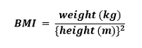

# 使用 Python 创建 BMI 计算器

> 原文：<https://www.javatpoint.com/create-bmi-calculator-using-python>

在下面的教程中，我们将了解如何借助 Python 编程语言创建体重指数(BMI)计算器。但是我们开始创造一个；让我们简单讨论一下什么是体重指数(BMI)。

## 了解体重指数(BMI)

**BMI，**是**体重指数的简称，**是基于个体体重和身高的相对体重的量度。我们通常使用体重指数来根据人们的**身高**和**体重对他们进行分类。**这些类别是**体重不足、健康、超重、**甚至**肥胖。**而且，为了促进健康饮食，各国也在采用。

我们可以考虑用 BMI(BMI)来代替直接测量身体脂肪。此外，BMI 是一种低成本且易于实施的方法，用于筛查可能导致健康相关问题的体重等级。

## 了解 BMI 计算器的工作原理

BMI 计算器接受个人的体重和身高，并计算该人的 BMI(BMI)。

例如，如果一个人的身高和体重分别是 155 厘米和 57 公斤。那个人的 BMI 将是 23.73(大约。)，这意味着这个人是健康的。

BMI(BMI)是分别基于身高和体重的身体脂肪的量度。

根据个人的 BMI 值，计算器返回一个陈述个人整体健康状况的陈述。

下表显示了如何对 BMI 进行分类，以确定一个人的健康状况。

| 南号码 | BMI | 重量状态 |
| **1** | 低于 18.5 | 体重不足 |
| **2** | 18.5 - 24.9 | 标准 |
| **3** | 25.0 - 29.9 | 超重 |
| **4** | 30.0 及以上 | 肥胖的 |

现在，让我们开始编写项目代码。

## 使用 Python 创建 BMI 计算器

作为第一步，我们将创建一个新的 Python 程序文件，并将其命名为**BMI _Calculator.py.** 在这个文件中，我们将从创建一个代码块来询问用户的身高和体重开始。我们可以使用**输入()**功能轻松实现。

**文件:BMI _ 计算器. py**

```py

# asking for input from the users
the_height = float(input("Enter the height in cm: "))
the_weight = float(input("Enter the weight in kg: "))

```

**说明:**

在上面的代码片段中，我们定义了两个变量作为**高度**和**重量**，它们使用**输入()**函数接受用户的输入。我们还将 **float()** 函数包含在 **input()** 函数之外，以便将输入字符串转换为 float 数据类型，这样我们就可以用它来执行计算。

接下来，我们将计算体重指数。

我们将使用以下公式来计算 BMI。



让我们在 Python 程序中实现上面的公式。

**文件:BMI _ 计算器. py**

```py

# defining a function for BMI
the_BMI = the_weight / (the_height/100)**2

```

**说明:**

在上面的代码片段中，我们使用上面的公式为 BMI 定义了一个函数。我们把高度除以 100，把厘米换算成米。

现在，让我们打印 BMI。

**文件:BMI _ 计算器. py**

```py

# printing the BMI
print("Your Body Mass Index is", the_BMI)

```

**说明:**

在上面的代码片段中，我们打印了一份声明，声明此人是 BMI。

现在，我们将根据用户的 BMI 打印声明，说明用户目前的健康状况。为了更好地理解，这段代码将被简化。

我们将使用 **if-elif-else** 条件进行分类。

**文件:BMI _ 计算器. py**

```py

# using the if-elif-else conditions
if the_BMI <= 18.5:
    print("Oops! You are underweight.")
elif the_BMI <= 24.9:
    print("Awesome! You are healthy.")
elif the_BMI <= 29.9:
    the_print("Eee! You are overweight.")
else:
    print("Seesh! You are obese.")

```

**说明:**

在上面的代码片段中，我们使用了变量**在 **if-elif-else** 语句中的 _ BMI**的值来检查该人的 BMI 是否属于其中一个类别。

该程序将在以下基础上打印报表:

1.  如果 BMI 小于或等于 **18.5** ，则程序返回**体重不足的条件。**
2.  如果 BMI 小于或等于 **24.9** ，则程序返回**健康状态。**
3.  如果 BMI 小于或等于 **29.9** ，则程序返回**超重的条件。**
4.  如果以上条件都不是**真**，则程序返回**肥胖的条件。**

于是，程序完成了。

让我们看看程序的完整源代码和输出。

## 源代码

**文件:BMI _ 计算器. py**

```py

# asking for input from the users
the_height = float(input("Enter the height in cm: "))
the_weight = float(input("Enter the weight in kg: "))
# defining a function for BMI
the_BMI = the_weight / (the_height/100)**2
# printing the BMI
print("Your Body Mass Index is", the_BMI)
# using the if-elif-else conditions
if the_BMI <= 18.5:
    print("Oops! You are underweight.")
elif the_BMI <= 24.9:
    print("Awesome! You are healthy.")
elif the_BMI <= 29.9:
    the_print("Eee! You are over weight.")
else:
    print("Seesh! You are obese.")

```

**输出:**

```py
Enter the height in cm: 160
Enter the weight in kg: 61
Your Body Mass Index is 23.828124999999996
Awesome! You are healthy.

```

* * *