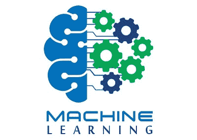
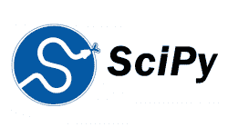
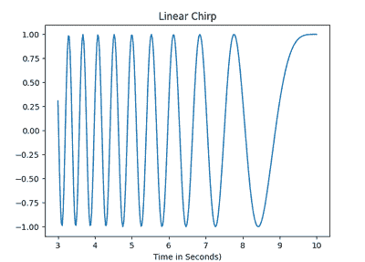
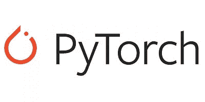
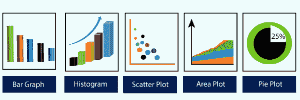
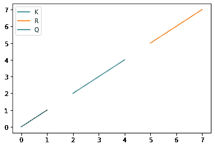
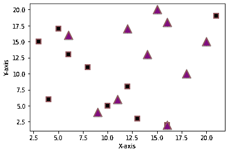

# 机器学习的最佳 Python 库

> 原文：<https://www.javatpoint.com/best-python-libraries-for-machine-learning>

机器学习是一门对计算机进行编程的科学，通过它他们可以从不同类型的数据中学习。根据机器学习对**亚瑟·塞缪尔**的定义——“赋予计算机学习能力而无需明确编程的研究领域”。机器学习的概念基本上用于解决不同类型的生活问题。



在以前，用户通常通过手动编码所有算法并使用数学和统计公式来执行机器学习任务。

与 Python 库、框架和模块相比，这个过程耗时、低效且令人厌倦。但是在当今世界，用户可以使用 Python 语言，这是机器学习中最流行和最有效的语言。Python 已经取代了许多语言，因为它是一个庞大的库集合，它使工作变得更加容易和简单。

在本教程中，我们将讨论用于机器学习的最佳 Python 库:

*   NumPy
*   我的天啊
*   Scikit-learn
*   提亚诺
*   TensorFlow
*   硬
*   PyTorch
*   熊猫
*   Matplotlib

### NumPy


[NumPy](https://www.javatpoint.com/numpy-tutorial) 是 Python 中最流行的库。该库用于通过使用大量高级数学函数和公式来处理大型多维数组和矩阵形成。它主要用于机器学习中基础科学的计算。它广泛用于线性代数、傅立叶变换和随机数功能。还有其他高端库，如张量流，用户将其作为操纵张量的内部功能。

**示例:**

```py

import numpy as nup

# Then, create two arrays of rank 2
K = nup.array([[2, 4], [6, 8]])
R = nup.array([[1, 3], [5, 7]])

# Then, create two arrays of rank 1
P = nup.array([10, 12])
S = nup.array([9, 11])

# Then, we will print the Inner product of vectors
print ("Inner product of vectors: ", nup.dot(P, S), "\n")

# Then, we will print the Matrix and Vector product
print ("Matrix and Vector product: ", nup.dot(K, P), "\n")

# Now, we will print the Matrix and matrix product
print ("Matrix and matrix product: ", nup.dot(K, R))

```

**输出:**

```py
Inner product of vectors: 222 

Matrix and Vector product: [ 68 156] 

Matrix and matrix product: [[22 34]
                                                   [46 74]]

```

### 我的天啊



[SciPy](https://www.javatpoint.com/python-scipy) 是机器学习开发人员中流行的库，因为它包含许多用于执行优化、线性代数、集成和统计的模块。SciPy 库不同于 SciPy 栈，因为 SciPy 库是组成 SciPy 栈的核心包之一。SciPy 库用于图像处理任务。

**例 1:**

```py

from scipy import signal as sg
import numpy as nup
K = nup.arange(45).reshape(9, 5)
domain_1 = nup.identity(3)
print (K, end = 'KK')
print (sg.order_filter (K, domain_1, 1))

```

**输出:**

```py
r (K, domain_1, 1))
Output:
[[ 0  1  2  3  4]
 [ 5  6  7  8  9]
 [10 11 12 13 14]
 [15 16 17 18 19]
 [20 21 22 23 24]
 [25 26 27 28 29]
 [30 31 32 33 34]
 [35 36 37 38 39]
 [40 41 42 43 44]] KK [[ 0\.  1\.  2\.  3\.  0.]
 [ 5\.  6\.  7\.  8\.  3.]
 [10\. 11\. 12\. 13\.  8.]
 [15\. 16\. 17\. 18\. 13.]
 [20\. 21\. 22\. 23\. 18.]
 [25\. 26\. 27\. 28\. 23.]
 [30\. 31\. 32\. 33\. 28.]
 [35\. 36\. 37\. 38\. 33.]
 [ 0\. 35\. 36\. 37\. 38.]]

```

**例 2:**

```py

from scipy.signal import chirp as cp
from scipy.signal import spectrogram as sp
import matplotlib.pyplot as plot
import numpy as nup
t_T = nup.linspace(3, 10, 300)
w_W = cp(t_T, f0 = 4, f1 = 2, t1 = 5, method = 'linear')
plot.plot(t_T, w_W)
plot.title ("Linear Chirp")
plot.xlabel ('Time in Seconds)')
plot.show()

```

**输出:**



### Scikit-learn


Scikit-learn 是一个 Python 库，用于经典的机器学习算法。它建立在 Python 的两个基本库之上，即 NumPy 和 SciPy。Scikit-learn 在机器学习开发人员中很受欢迎，因为它支持有监督和无监督的学习算法。这个库也可以用于数据分析和数据挖掘过程。

**示例:**

```py

from sklearn import datasets as ds
from sklearn import metrics as mt
from sklearn.tree import DecisionTreeClassifier as dtc

# load the iris datasets
dataset_1 = ds.load_iris()

# fit a CART model to the data
model_1 = dtc()
model_1.fit(dataset_1.data, dataset_1.target)
print(model)

# make predictions
expected_1 = dataset_1.target
predicted_1 = model_1.predict(dataset_1.data)

# summarize the fit of the model
print (mt.classification_report(expected_1, predicted_1))
print(mt.confusion_matrix(expected_1, predicted_1))

```

**输出:**

```py
DecisionTreeClassifier()
              precision    recall f1-score   support

           0       1.00      1.00      1.00        50
           1       1.00      1.00      1.00        50
           2       1.00      1.00      1.00        50

    accuracy                           1.00       150
   macro avg       1.00      1.00      1.00       150
weighted avg       1.00      1.00      1.00       150

[[50  0  0]
 [ 0 50  0]
 [ 0  0 50]]

```

### 提亚诺


antao 是著名的 Python 库，用于定义、评估和优化数学表达式，这也高效地涉及多维数组。

它是通过优化 CPU 和 GPU 的利用率来实现的。由于机器学习是关于数学和统计的，所以 Anano 使用户能够轻松地进行数学运算。

它广泛用于单元测试和自我验证，以检测和诊断不同类型的错误。antao 是一个强大的库，可用于大规模计算密集型科学项目。这是一个简单易懂的库，个人可以在他们的项目中使用。

**示例:**

```py

import theano as th
import theano.tensor as Tt
k = Tt.dmatrix('k')
r = 1 / (1 + Tt.exp(-k))
logistic_1 = th.function([k], r)
logistic_1([[0, 1], [-1, -2]])

```

**输出:**

```py
array([[0.5, 0.71135838],
       [0.26594342, 0.11420192]])

```

### TensorFlow


[TensorFlow](https://www.javatpoint.com/tensorflow) 是一个开源的 Python 库，用于高性能的数值计算。这是一个受欢迎的图书馆，由谷歌的大脑团队开发。张量流是一个涉及定义和运行张量计算的框架。TensorFlow 可用于训练和运行深度神经网络，深度神经网络可用于开发多个人工智能应用程序。

**示例:**

```py

import tensorflow as tsf

# Initialize two constants
K_1 = tsf.constant([2, 4, 6, 8])
K_2 = tsf.constant([1, 3, 5, 7])

# Multiply
result = tsf.multiply(K_1, K_2)

# Initialize the Session
sess_1 = tsf.Session()

# Print the result
print (sess_1.run(result))

# Close the session
sess_1.close()

```

**输出:**

```py
[ 2 12 30 56]

```

### 硬


[Keras](https://www.javatpoint.com/keras) 是一个高级神经网络 API，能够运行在 TensorFlow、CNTK 和 antao 库之上。它是机器学习开发人员中非常著名的 Python 库。它可以在中央处理器和图形处理器上无故障运行。它使机器学习初学者和设计神经网络变得非常简单。它也用于快速原型制作。

**示例:**

```py

import numpy as nup
from tensorflow import keras as ks
from tensorflow.keras import layers as ls
number_classes = 10
input_shapes = (28, 28, 1)

# Here, we will import the data, and split it between train and test sets
(x_1_train, y_1_train), (x_2_test, y_2_test) = ks.datasets.mnist.load_data()

# now, we will Scale images to the [0, 1] range
x_1_train = x_1_train.astype("float32") / 255
x_2_test = x_2_test.astype("float32") / 255
# we have to make sure that the images have shape (28, 28, 1)
x_1_train = nup.expand_dims(x_1_train, -1)
x_2_test = nup.expand_dims(x_2_test, -1)
print ("x_train shape:", x_1_train.shape)
print (x_1_train.shape[0], "Training samples")
print (x_2_test.shape[0], "Testing samples")

# Then we will convert class vectors to binary class matrices
y_1_train = ks.utils.to_categorical(y_1_train, number_classes)
y_2_test = ks.utils.to_categorical(y_2_test, number_classes)
model_1 = ks.Sequential(
    [
        ks.Input(shape = input_shapes),
        ls.Conv2D(32, kernel_size = (3, 3), activation = "relu"),
        ls.MaxPooling2D(pool_size = (2, 2)),
        ls.Conv2D(64, kernel_size = (3, 3), activation = "relu"),
        ls.MaxPooling2D(pool_size = (2, 2)),
        ls.Flatten(),
        ls.Dropout(0.5),
        ls.Dense(number_classes, activation = "softmax"),
    ]
)

model_1.summary()

```

**输出:**

```py
x_train shape: (60000, 28, 28, 1)
60000 Training samples
10000 Testing samples
Model: "sequential"
_________________________________________________________________
Layer (type)                 Output Shape              Param #   
=================================================================
conv2d (Conv2D)              (None, 26, 26, 32)        320       
_________________________________________________________________
max_pooling2d (MaxPooling2D) (None, 13, 13, 32)        0         
_________________________________________________________________
conv2d_1 (Conv2D)            (None, 11, 11, 64)        18496     
_________________________________________________________________
max_pooling2d_1 (MaxPooling2 (None, 5, 5, 64)          0         
_________________________________________________________________
flatten (Flatten)            (None, 1600)              0         
_________________________________________________________________
dropout (Dropout)            (None, 1600)              0         
_________________________________________________________________
dense (Dense)                (None, 10)                16010     
=================================================================
Total params: 34,826
Trainable params: 34,826
Non-trainable params: 0
_________________________________________________________________

```

### PyTorch



[PyTorch](https://www.javatpoint.com/pytorch) 也是基于 Torch 的[机器学习](https://www.javatpoint.com/machine-learning)开源 Python 库，用 C 语言实现，用于机器学习。它在计算机版本、[自然语言处理(NLP)](https://www.javatpoint.com/nlp) 和许多其他机器学习程序上支持许多工具和库。该库还允许用户使用 GPU 加速在 Tensor 上执行计算任务。

**示例:**

```py

import torch as tch
d_type = tch.float
device_1 = tch.device("cpu")
# Use device = tch.device("cuda:0") for GPU

# Here, N_1 is batch size; D_in_1 is input dimension;
# H_1 is hidden dimension; D_out_1 is output dimension.
N_1 = 62
D_in_1 = 1000
H_1 = 110
D_out_1 = 11

# Now, we will create random input and output data
K = tch.randn(N_1, D_in_1, device = device_1, dtype = d_type)
R = tch.randn(N_1, D_out_1, device = device_1, dtype = d_type)

# Then, we will Randomly initialize weights
K_1 = tch.randn(D_in_1, H_1, device = device_1, dtype = d_type)
K_2 = tch.randn(H_1, D_out_1, device = device_1, dtype = d_type)

learning_rate_1 = 1e-6
for Q in range(500):
    # Now, we will put Forward pass: compute predicted y
    h_1 = K.mm(K_1)
    h_relu_1 = h_1.clamp(min = 0)
    y_pred_1 = h_relu_1.mm(K_2)

    # Compute and print loss
    loss = (y_pred_1 - R).pow(2).sum().item()
    print (Q, loss)

    # Then we will Backprop to compute gradients of w1 and w2 with respect to loss
    grad_y_pred = 2.0 * (y_pred_1 - R)
    grad_K_2 = h_relu_1.t().mm(grad_y_pred)
    grad_h_relu = grad_y_pred.mm(K_2.t())
    grad_h = grad_h_relu.clone()
    grad_h[h_1 < 0] = 0
    grad_K_1 = K.t().mm(grad_h)

    # Then we will Update the weights by using gradient descent
    K_1 -= learning_rate_1 * grad_K_1
    K_2 -= learning_rate_1 * grad_K_2

```

**输出:**

```py
0 35089116.0
1 33087792.0
2 42227192.0
3 56113208.0
4 61125684.0
5 45541204.0
6 21011108.0
7 6972017.0
8 2523046.5
9 1342124.5
10 950067.5625
11 753290.25
12 620475.875
13 519006.71875
14 437975.9375
15 372063.125
16 317840.8125
17 272874.46875
18 235348.421875
.
.
.
497 7.426088268402964e-05
498 7.348413055296987e-05
499 7.258950790856034e-05

```

### 熊猫


[熊猫](https://www.javatpoint.com/python-pandas)是一个 Python 库，主要用于数据分析。用户必须在使用数据集训练机器学习之前准备数据集。熊猫让开发者很容易，因为它是专门为数据提取而开发的。它有各种各样的工具来详细分析数据，提供高级别的数据结构。

**示例:**

```py

import pandas as pad

data_1 = {"Countries": ["Bhutan", "Cape Verde", "Chad", "Estonia", "Guinea", "Kenya", "Libya", "Mexico"],
       "capital": ["Thimphu", "Praia", "N'Djamena", "Tallinn", "Conakry", "Nairobi", "Tripoli", "Mexico City"],
       "Currency": ["Ngultrum", "Cape Verdean escudo", "CFA Franc", "Estonia Kroon; Euro", "Guinean franc", "Kenya shilling", "Libyan dinar", "Mexican peso"],
       "population": [20.4, 143.5, 12.52, 135.7, 52.98, 76.21, 34.28, 54.32] }

data_1_table = pad.DataFrame(data_1)
print(data_1_table)

```

**输出:**

```py
    Countries      capital             Currency  population
0      Bhutan      Thimphu             Ngultrum       20.40
1  Cape Verde        Praia  Cape Verdean escudo      143.50
2        Chad    N'Djamena            CFA Franc       12.52
3     Estonia      Tallinn  Estonia Kroon; Euro      135.70
4      Guinea      Conakry        Guinean franc       52.98
5       Kenya      Nairobi       Kenya shilling       76.21
6       Libya      Tripoli         Libyan dinar       34.28
7      Mexico  Mexico City         Mexican peso       54.32

```

### Matplotlib



[Matplotlib](https://www.javatpoint.com/matplotlib) 是一个用于数据可视化的 Python 库。当开发人员想要可视化数据及其模式时，就会使用它。这是一个二维绘图库，用于创建二维图形和绘图。

它有一个模块 pyplot，用于绘制图形，并为控制线样式、字体属性、格式化轴等提供不同的功能。Matplotlib 提供了不同类型的图表，如直方图、误差图、条形图等。

**例 1:**

```py

import matplotlib.pyplot as plot
import numpy as nup

# Prepare the data
K = nup.linspace(2, 4, 8)
R = nup.linspace(5, 7, 9)
Q = nup.linspace(0, 1, 3)

# Plot the data
plot.plot(K, K, label = 'K')
plot.plot(R, R, label = 'R')
plot.plot(Q, Q, label = 'Q')

# Add a legend
plot.legend()

# Show the plot
plot.show()

```

**输出:**



### 例 2:

```py

import matplotlib.pyplot as plot

# Creating dataset-1
K_1 = [8, 4, 6, 3, 5, 10, 
      13, 16, 12, 21]

R_1 = [11, 6, 13, 15, 17, 5, 
      3, 2, 8, 19]

# Creating dataset2
K_2 = [6, 9, 18, 14, 16, 15,
      11, 16, 12, 20]

R_2 = [16, 4, 10, 13, 18, 
      20, 6, 2, 17, 15]

plot.scatter(K_1, R_1, c = "Black", 
            linewidths = 2, 
            marker = "s", 
            edgecolor = "Brown", 
            s = 50)

plot.scatter(K_2, R_2, c = "Purple",
            linewidths = 2,
            marker = "^", 
            edgecolor = "Grey", 
            s = 200)

plt.xlabel ("X-axis")
plt.ylabel ("Y-axis")
print ("Scatter Plot")
plt.show()

```

**输出:**



## 结论

在本教程中，我们讨论了用于执行机器学习任务的不同 Python 库。我们还展示了每个库的不同示例。

* * *