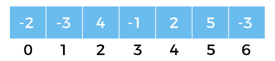
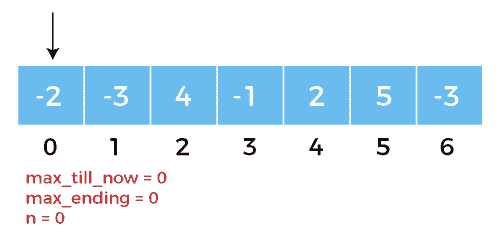
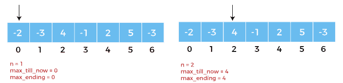
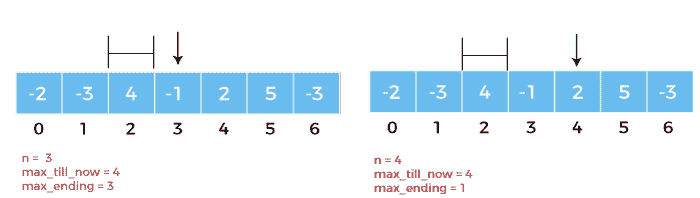
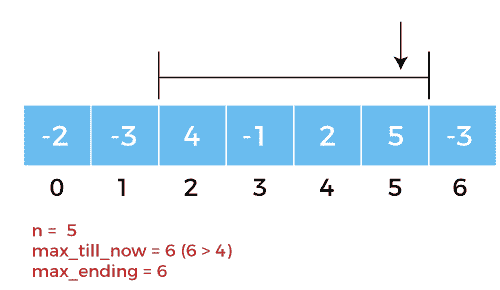
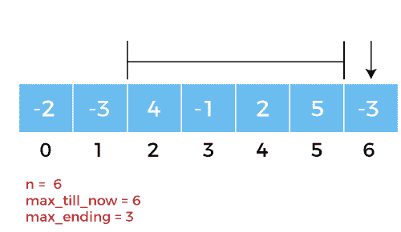

# Python 中的卡丹算法

> 原文：<https://www.javatpoint.com/kadanes-algorithm-in-python>

下面，我们将讨论卡丹算法及其求解“最大子阵和”问题的性质。我们将理解算法的概念，并处理相同的 Python 代码以及示例及其相应的输出。最后，我们将讨论算法的时间复杂度和卡丹算法的实际应用。

因此，让我们开始吧。

## 理解卡丹算法

卡丹算法是在动态规划的帮助下解决问题的流行方法之一。众所周知，最大子阵问题是动态规划领域的热门问题之一。我们一定认为问题看起来很简单，问题的输出将是数组中所有数据元素的总和。然而，这似乎不对。我们还会遇到负整数作为数组中的数据元素，它可以减少整个数组的总和。因此，我们将借助卡丹算法来解决这个问题。

卡丹算法用于寻找一维整数阵列中具有最大可能和的连续子阵列。在理解了问题的陈述之后，每个人的主要方法将是应用暴力方法并解决问题。然而，通过这样做，解决方案的时间复杂度将是 O(n^2)，这一点也不令人印象深刻。因此，我们将使用卡丹算法来解决这个问题，在两个变量的帮助下遍历整个数组，以跟踪迄今为止的总和和最大总和。使用该算法时要注意的最重要的方面是我们将更新两个变量的条件。

## 对最大子阵和算法的理解

现在让我们考虑最大子阵列和算法的基本步骤，如下所示:

**第一步:**我们必须初始化 **max_till_now = 0**

**第二步:**我们必须初始化**max _ end = 0**

**第 3 步:**我们必须为数组中的每个数据元素重复**第 4 步**到**第 6 步**。

**第四步:**我们必须设置**最大结束=最大结束+ a[i]**

**第五步:**如果 **(max_ending < 0)** 那么我们必须设置 **max_ending = 0**

**第六步:**如果**(max _ till _ now<max _ end)**那么我们必须设置**max _ till _ now = max _ end**

**第七步:**我们必须返回**max _ toll _ now**

在算法的上述步骤中，我们使用了 **max_ending** 来查找数组的所有正数据元素，使用了 **max_till_now** 来查找所有正段中数据元素的最大和。因此，每次我们在与 **max_till_now** 比较时得到正和，我们就能够用更大的和来更新它。

因此，每当 **max_ending** 变为负时，我们将它设置为零，并且对于每次迭代，我们将检查 **max_till_now** 小于 **max_ending** 的条件，以便在条件返回 **True** 时更新 **max_till_now** 。

## 用图形表示理解卡丹算法

让我们考虑以下关于整数数组的例子。



**图 1:** 整数数组



**图 2:** 我们将初始化 **max_till_now = 0** 和**max _ end = 0(n = 0)**。



**图 3:** 然后我们会得到**max _ toll _ now = 0**和**max _ end = 0**为**n = 1**；但是对于 **n = 2** ，我们会得到 **max_till_now = 4** 和**max _ end = 4**。



**图 4:** 然后我们赋值 **n = 3** 和 **4** ，分别得到 **max_till_now = 4** 和**max _ end = 3**，以及 **max_till_now = 4** 和**max _ end = 1**。



**图 5:** 我们将得到**max _ toll _ now = 6(6>4)**为**n = 5****max _ end = 6**。



**图 6:** 对于 **n = 6** ，我们还会得到**max _ toll _ now = 6**和**max _ end = 4**。

因此，从上面的例子中，我们将找到从 **n = 2** 到 **n = 5** 的最大子阵列，最大和将是 **6** 。

## 用 Python 代码理解卡丹算法

让我们考虑下面演示卡丹算法工作的代码片段。

**示例:**

```py

# defining the function to find the maximum subarray sum
def max_Subarray_Sum(my_array, array_size):
    # assigning the variables
    maxTillNow = my_array[0]
    maxEnding = 0

    # using the for-loop
    for n in range(0, array_size):
        maxEnding = maxEnding + my_array[n]
        # using the if-elif-else statement
        if maxEnding < 0:
            maxEnding = 0

        elif (maxTillNow < maxEnding):
            maxTillNow = maxEnding

    return maxTillNow
# defining the array
my_array = [-2, -3, 4, -1, -2, 5, -3]
# printing the maximum subarray sum for the users
print("Maximum Subarray Sum:", max_Subarray_Sum(my_array, len(my_array)))

```

**输出:**

```py
Maximum Subarray Sum: 6

```

**说明:**

在上面的代码片段中，我们定义了一个函数为 **max_Subarray_Sum** ，取两个参数分别为 **my_array** 和 **array_sum** 。然后，我们将变量**最大值**赋给数组的第一个索引值，并将**最大值**赋为零。然后我们使用 **for-loop** 遍历整个数组。我们还使用了 **if-elif-else** 条件语句并返回 **maxTillNow** 。最后，我们为用户定义了数组并打印了最大子数组和，在上例中为 **6** 。

## 理解时间复杂性

卡丹对由整数 n 个数据元素组成的数组的算法的时间复杂度被定义为 **O(n)** ，因为在程序中只执行一个 `for`循环。同样，算法的辅助空间复杂度为 **O(1)** 。

## 了解应用

卡丹算法有各种各样的应用，其中一些如下所述:

1.  Kadane 的算法是为提供的整数数组找到最大子数组和。
2.  它被用作图像处理的算法。
3.  它还可以用来解决“有序车站旅行”和“沿海旅馆”等问题。
4.  它也用于商业分析。

## 结论

最后，我们可以得出结论，在解决寻找最大子阵和的问题陈述时，解决方案似乎并不容易和简单。然而，卡丹的算法简化了这类问题的求解，实现了时间复杂度最小的求解。这是可能的，因为卡丹的算法利用该技术来收集达成解决方案所需的信息，避免不必要的数据存储。因此，我们可以把这种算法看作是动态规划方法的一个简单例子，在现实世界中有许多实际应用。

* * *