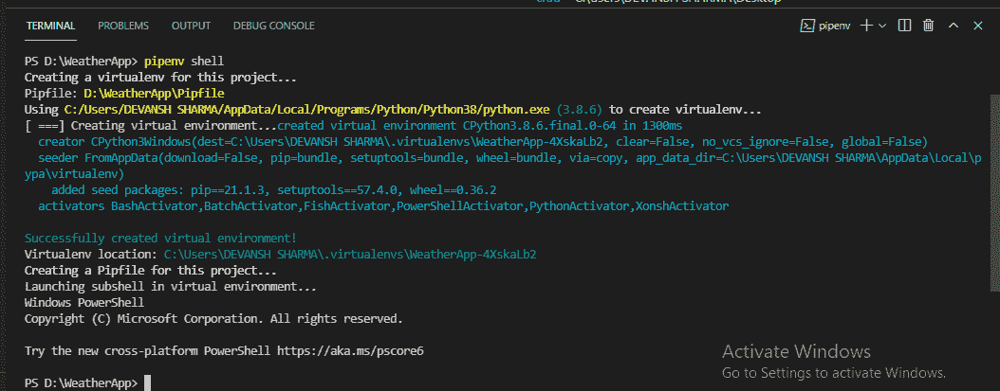
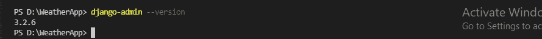
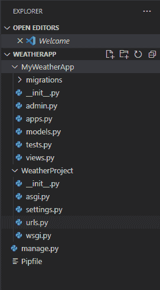
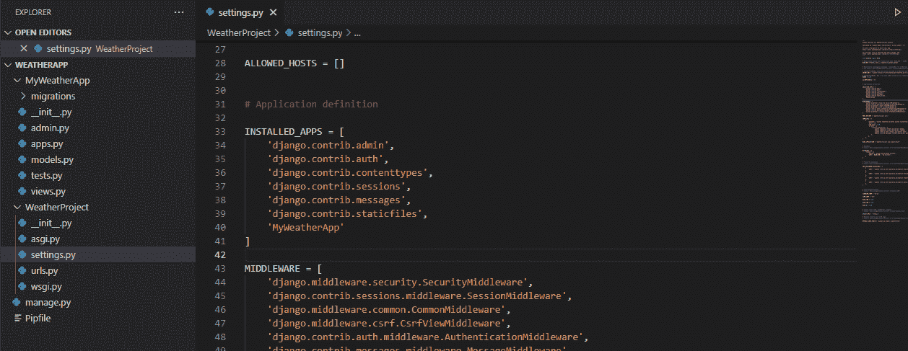
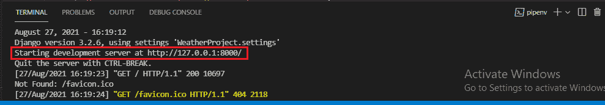
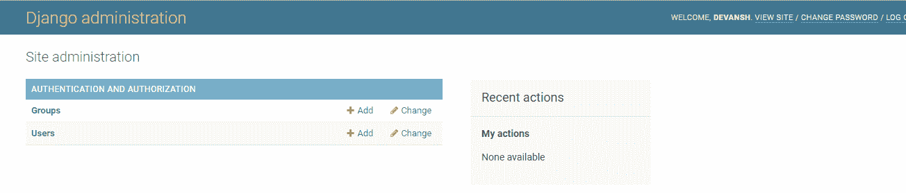
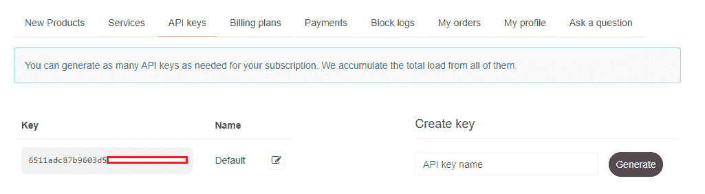
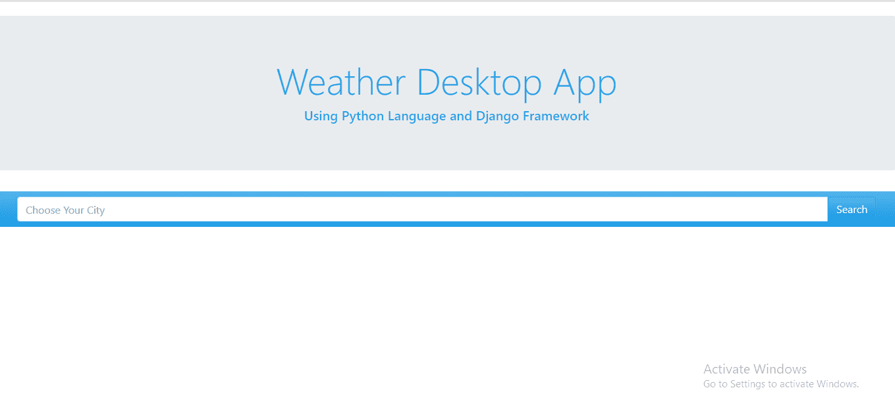
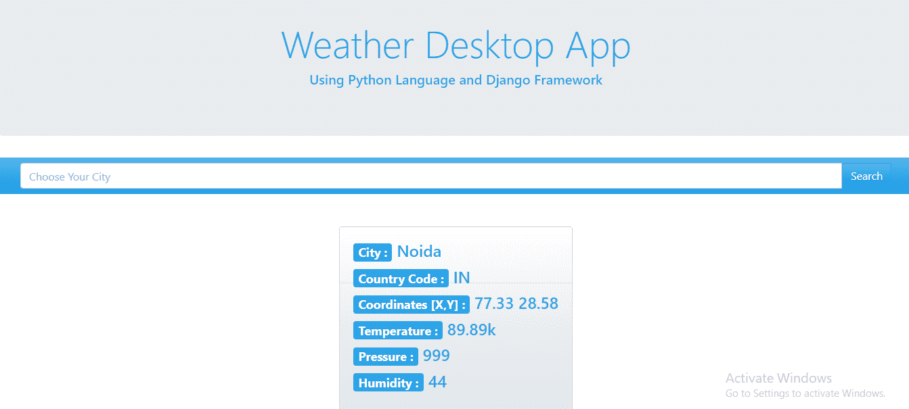

# 姜戈的天气应用|获取城市天气报告

> 原文：<https://www.javatpoint.com/weather-app-in-django>

在本教程中，我们将使用 Django 创建一个天气应用；这个应用将显示搜索到的城市的天气。这是一个简单的 Django 项目，帮助初学者理解 Django 的基本概念。我们还将使用天气应用编程接口来获取数据。

在继续学习本教程之前，请确保您已经安装了 Python 和 Django。如果没有安装 Django，可以使用 pip 命令进行安装。我们建议首先创建虚拟环境，然后安装 Django。

## 先决条件

*   熟悉 Python
*   熟悉姜戈的基础知识
*   系统应该已经安装了 Python
*   安装 IDE (Pycharm、VSCode、Atom、high)

## 安装 Django

首先，打开 IDE 的终端，创建虚拟环境。这里，我们使用的是 visual studio。可以使用以下方式创建虚拟环境。

*   使用 **pipenv shell** 命令
*   使用 **venv**

我们使用**管道外壳**命令创建虚拟命令



使用这个命令，我们不需要激活虚拟环境。它会自动激活。现在，我们将使用 pip 命令安装 Django。

```py

pip install django

```


要检查是否安装了 django，请键入 django-admin -version 并按 enter。



这意味着我们已经安装了最新版本的 Django。

## 创建项目和应用

一个 Django 项目可以由许多应用组成。这里我们使用以下命令创建一个项目。

```py

django-admin startproject project_name

```

我们创建了名为**天气项目**的项目，现在我们将使用**python manage . py startapp my Weather app 创建该应用。**



#### 注意——注意我们已经使用了。运行“创建项目”命令时，在项目名称后面加上(点)。它在目录中创建单独的项目。我们不需要跳转到项目来访问 manage.py 文件。

我们使用下面的命令创建新的应用名称 **MyWeatherApp** 。

```py

python manage.py startapp MyWeatherAPP  

```

它不包含在项目中，因此，为了考虑应用，我们必须在 INSTALLED_APP 中添加应用名称。所以打开 settings.py 文件，添加新创建的 app。



在这一点上，我们向前迈出了一步来创建我们的应用。使用以下命令运行服务器。

```py

python manage.py runserver

```



点击给定的链接，它将显示 Django 应用环境。

## 登录到管理面板

接下来，我们将登录内置的 Django 仪表板。为此，我们需要迁移我们的数据库，这意味着 Django 将创建默认应用所需的预定义表。

在终端中键入以下命令，然后按回车键。

```py

python manage.py migrate

```

这将为我们的项目创建 **SQLite 数据库**。这是 django 提供的默认数据库，它向数据库中添加了几个表。

在管理面板中会有一个用户表，它会将用户存储在我们的应用中。

要登录到管理面板，我们需要使用下面的命令创建管理。

```py

python manage.py createsuperuser

```

运行该命令后，它将询问用户信息，如用户名、电子邮件地址和密码。完成后，再次启动服务器。



```py

python manage.py runserver

```

打开给定的链接并访问 http://127.0.0.1:8000/admin 页面，因为 admin 是在 urls.py 中设置的。

## 添加模板和视图

现在，我们将添加模板来制作我们的应用的布局。模板是一个 HTML 文件，允许我们添加 Jinja 语法来使模板动态化。为天气项目目录创建一个名为模板的新文件夹。

```py

<!DOCTYPE html>
<html lang="en">


<head>
  <meta charset="UTF-8" />
  <meta name="viewport" content="width=device-width, initial-scale=1.0" />
  <link rel="stylesheet" href="https://cdnjs.cloudflare.com/ajax/libs/bootswatch/4.5.3/cerulean/bootstrap.min.css"
    integrity="sha512-dQLT/B7byn2LjN/DN4zeBKpwGV6qbidV0XiMRWQOL7TGrV7FkZFldkGG+DGMU+CQnMTcRZlUI7GMWt1j6akNew=="
    crossorigin="anonymous" />
  <title>Weather App </title>
</head>

<body>

  <br /><br /> <br>
  <div id="jumbotron" class="jumbotron" style="text-align: center; margin-top:-50px">
    <h1 class="display-4">Weather Desktop App </h1>
    <h5>Using Python Language and Django Framework</h5>
  </div>

  <nav class="navbar navbar-expand-lg navbar-dark bg-primary">
    <form method="post" class="col-md"">
      
      <div class=" input-group">

      <input type="text" class="form-control" name="city" placeholder="Choose Your City">
      <div class="input-group-btn">
        <button type="submit" class="btn btn-primary">Search</button>
      </div>
      </div>
      <form>
  </nav>
  <br> <br>
  <div class="row">
  
                <div class="col d-flex justify-content-center" ">
        <div class=" card text-white bg-light mb-6">
        <div class=" card-body">
        <h4><span class="badge badge-primary">City :</span> </h4>
            <h4><span class="badge badge-primary">Country Code :</span> </h4>
            <h4><span class="badge badge-primary">Coordinates [X,Y] :</span> </h4>
            <h4><span class="badge badge-primary">Temperature :</span> {{temp}}</h4>
            <h4><span class="badge badge-primary">Pressure :</span> </h4>
            <h4><span class="badge badge-primary">Humidity : </span> </h4>
        </div>
        
 </div>
</body>

</html>

```

我们创建了**index.html**文件。我们将从天气应用编程接口获取数据，并将其渲染到模板中，但现在我们将创建视图并映射到网址。在视图中添加下面的函数。

**View.py**

```py

from django.shortcuts import render

# Create your views here.

def home(request):
    return render(request, 'index.html')

```

・T0️ urls.py ・T1️

```py

from django.urls import path
from .views import home
urlpatterns = [
    path('', home, name = 'home')
]

```

Django 将匹配没有端点的 URL，并将其路由到我们创建的视图函数。

## 使用天气应用编程接口

要获取实时天气报告，我们需要注册**开放天气地图 API** 。它将返回我们在应用中输入的任何城市的实时天气。

访问网站并创建一个帐户，然后转到他们的仪表板上的应用编程接口键。



#### 注意-应用编程接口密钥应该是秘密的，以防止它们被其他方使用。

添加城市、city_weather，并导入请求模块。

**视图. py**

```py

import json
from django.shortcuts import render
import urllib.request
import json

# Create your views here.

def home(request):
    if request.method == 'POST':
        # Get the city name from the user api = http://api.openweathermap.org/data/2.5/weather
        city = request.POST.get('city', 'True')

        # retreive the information using api
        source = urllib.request.urlopen('http://api.openweathermap.org/data/2.5/weather?q=' + city + '&units=imperial&appid=164fec96a27b97680ee442e489ce3f06').read()

        # convert json data file into python dictionary
        list_of_data = json.loads(source)

        # create dictionary and convert value in string
        context = {
            'city': city,
            "country_code": str(list_of_data['sys']['country']),
            "coordinate": str(list_of_data['coord']['lon']) + ' '
                            + str(list_of_data['coord']['lat']),
            "temp": str(list_of_data['main']['temp']) + 'k',
            "pressure": str(list_of_data['main']['pressure']),
            "humidity": str(list_of_data['main']['humidity']),
        }
    else:
        context = {}

    # send dictionary to the index.html
    return render(request, 'index.html', context)

```

**解释-**

在上面的视图中，我们检查方法是否是 POST，然后从表单中获取城市名称。然后我们使用 **urllib.request.urlopen()读取特定城市的数据。**我们将源变量传递给 **json.loads()** ，后者将数据转换成 Python 字典。

使用这个，我们可以轻松地访问所需的数据并保存到上下文字典中。当用户进入城市时，它将显示我们存储在上下文字典中的所有属性。

#### 注意-该应用编程接口将需要一些时间来激活。如果没有激活，请在几分钟后尝试。

现在我们将对 html 文件进行修改。

```py

<div class="row">
        
        <div class="col d-flex justify-content-center" ">
        <div class=" card text-white bg-light mb-6">
        <div class=" card-body">
        <h4><span class="badge badge-primary">City :</span> {{city}}</h4>
            <h4><span class="badge badge-primary">Country Code :</span> {{country_code}}</h4>
            <h4><span class="badge badge-primary">Coordinates [X,Y] :</span> {{coordinate}}</h4>
            <h4><span class="badge badge-primary">Temperature :</span> {{temp}}</h4>
            <h4><span class="badge badge-primary">Pressure :</span> {{pressure}} </h4>
            <h4><span class="badge badge-primary">Humidity : </span> {{humidity}}</h4>
        </div>
        
 </div>

```

现在我们运行服务器并点击给定的链接。如下图所示。



在搜索框中输入城市名称，点击搜索按钮，获取天气数据。我们进入 **Noida** 获取天气数据。



正如我们在上面的快照中看到的，我们已经成功地使用 Django 框架创建了一个天气应用。到目前为止，我们已经了解了一些命令，创建虚拟环境，最重要的是了解了应用编程接口。我们还讨论了调用 API 和获取不同天气字段的国家代码、湿度、温度等。

你可以让它成为这个项目更有吸引力的 UI。我们已经使用了引导类和 HTML。

* * *