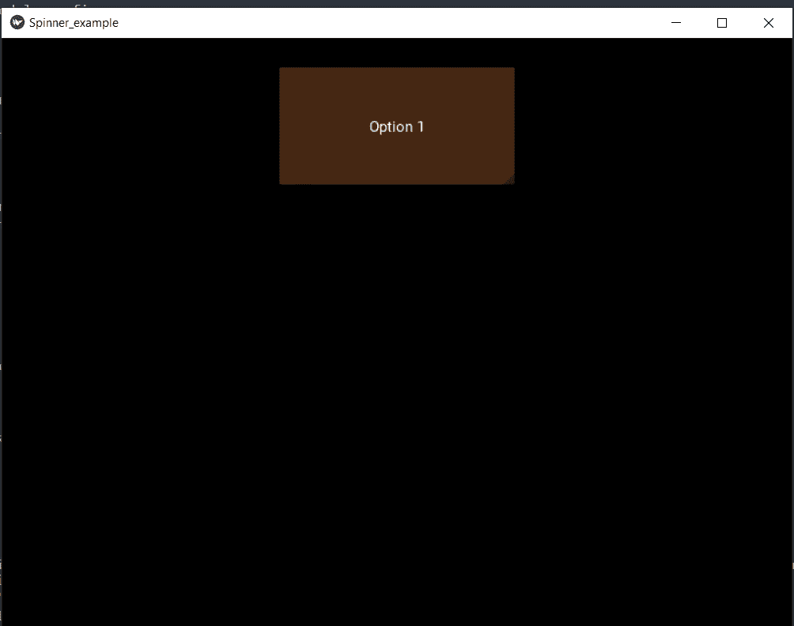
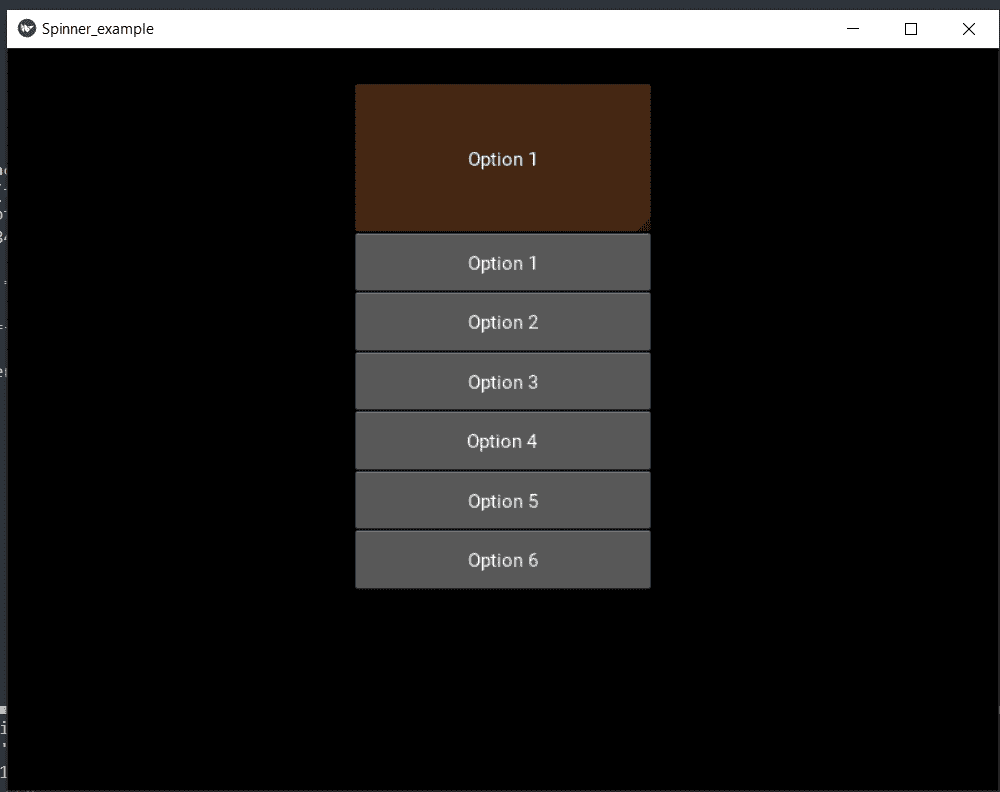
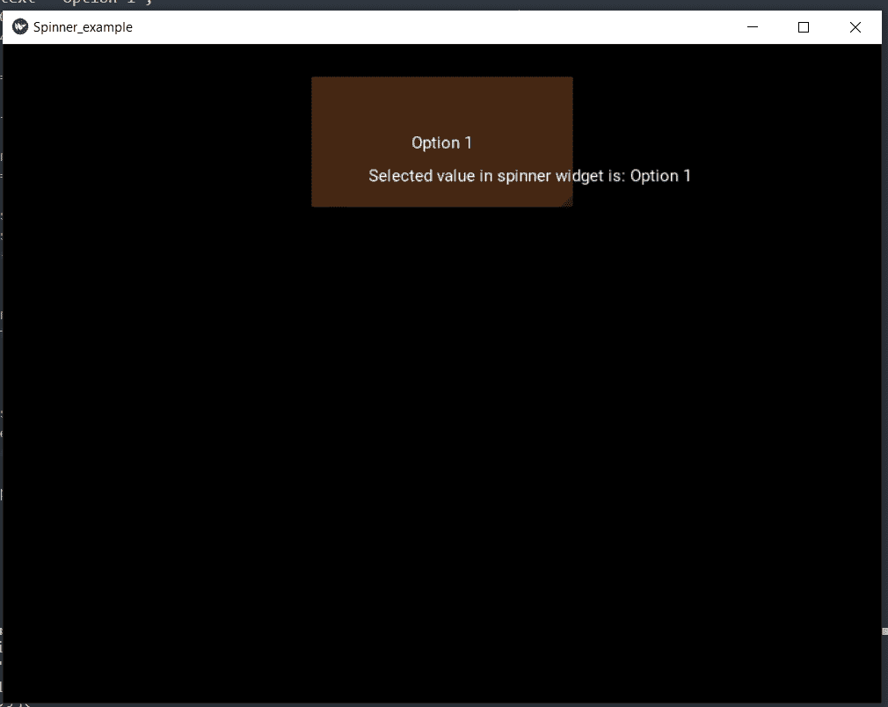
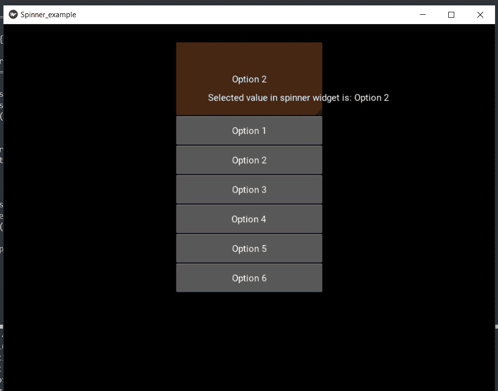

# Python 库的微调器小部件

> 原文：<https://www.javatpoint.com/spinner-widget-in-kivy-library-of-python>

Kivy 是 Python 中的图形用户界面工具，与平台无关。使用 Kivy 开发的应用程序可以在 IOS、Windows、Linux 和 Android 操作系统上使用。Kivy 工具在为 Android 操作系统开发应用程序时的基本用途，但它也可以用于开发桌面应用程序。

### 微调器小部件:

用户可以使用以下命令导入 kivy 库中的微调器小部件:

```py

from kivy.uix.spinner import Spinner

```

微调器小部件用于从集合中选择一个值。在默认状态下，微调器显示其当前选定的值。当用户单击微调器时，它会显示一个下拉菜单，显示用户可以从中选择的所有其他可用值。

像组合框一样，微调器小部件也用于向用户提供多项选择选项，以选择其菜单中的任何一项。用户还可以向微调器小部件附加一个回调，用于接收关于从小部件菜单中选择值的通知。

### 方法:

*   **步骤 1:** 我们将导入 kivy
*   **步骤 2:** 我们将导入 kivyApp
*   **步骤 3:** 我们将导入标签
*   **第 4 步:**我们将导入微调器
*   **步骤 5:** 我们将导入浮动布局
*   **第 6 步:**我们将设置最低版本(此步骤可选)
*   **第 7 步:**我们将创建一个 App 类:
    *   首先，我们将创建微调器
    *   然后，我们将标签贴在旋转器上
    *   然后，我们将附加一个回调
*   **第八步:**我们将返回布局/小部件/类(根据需求)
*   **第 9 步:**我们将运行类的实例。

### 示例:

```py

from kivy.config import Config

# In this code:
# 0 means off 
# 1 means ON 
# Here, we can also use 0 or 1 && True or False
Config.set('graphics', 'resizable', True)

# Here, we are writing a program for Showing how to create a switch
# first, we will import the kivy module   
import kivy 

# the, base Class of our Application is inherited from the App class.   
# app will refers to the instance of our application  
from kivy.app import App as app1

# this will limit the kivy version that means 
# below this kivy version we cannot 
# use the application or software 
kivy.require('1.9.0')

# The Label widget is for rendering text. 
from kivy.uix.label import Label as lab

# Now, we will import the spinner widget
from kivy.uix.spinner import Spinner as spin

# This module consist the float layout 
# for working with FloatLayout 
# we have to import it first 
from kivy.uix.floatlayout import FloatLayout as fl

# Now, we will create an Application by deriving from the App class
class Spinner_example(app1):

    # now we will define build 
    def build_1(self):

        # here, we will create floatlayout
        layout = fl()

        # then, we will create the spinner
        # first, we will configure spinner object and then add it to the layout
        self.spinnerObject = spin(text = "Option 1",
             values = ("Option 1", "Option 2", "Option 3", "Option 4", "Option 5", "Option 6"),
             background_color =(0.784, 0.443, 0.216, 1)) 

        self.spinnerObject.size_hint = (0.3, 0.2)

        self.spinnerObject.pos_hint ={'x': .35, 'y':.75}

        layout.add_widget(self.spinnerObject)

        # return the layout
        return layout;

# for, Running the application
if __name__ == '__main__':
    Spinner_example().run()      

```

**输出:**

**图像 1:**



**图像 2:**



现在，我们必须显示菜单列表中当前选择了哪个选项。我们可以在微调器小部件旁边显示标签。

### 例 2:

```py

from kivy.config import Config

# In this code:
# 0 means off 
# 1 means ON 
# Here, we can also use 0 or 1 && True or False
Config.set('graphics', 'resizable', True)

# Here, we are writing a program for Showing how to create a switch
# first, we will import the kivy module   
import kivy 

# the, base Class of our Application is inherited from the App class.   
# app will refers to the instance of our application  
from kivy.app import App as app1

# this will limit the kivy version that means 
# below this kivy version we cannot 
# use the application or software 
kivy.require('1.9.0')

# The Label widget is for rendering text. 
from kivy.uix.label import Label as lab

# Now, we will import the spinner widget
from kivy.uix.spinner import Spinner as spin

# This module consist the float layout 
# for working with FloatLayout 
# we have to import it first 
from kivy.uix.floatlayout import FloatLayout as fl

# Now, we will create an Application by deriving from the App class
class Spinner_example(app1):

    # now we will define build 
    def build_1(self):

        # here, we will create floatlayout
        layout = fl()

        # then, we will create the spinner
        # first, we will configure spinner object and then add it to the layout
        self.spinObject = spin(text = "Option 1",
             values = ("Option 1", "Option 2", "Option 3", "Option 4", "Option 5", "Option 6"),
             background_color =(0.784, 0.443, 0.216, 1)) 

        self.spinObject.size_hint = (0.3, 0.2)

        self.spinObject.pos_hint ={'x': .35, 'y':.75}

        layout.add_widget(self.spinObject)
        self.spinObject.bind(text = self.on_spinner_select)

        # It will change the label information as well
        # It will add a label displaying the selection from the spinner
        self.spinSelection = Label(text = "Selected value in spinner widegt is: %s" 
                                                     %self.spinObject.text)

        layout.add_widget(self.spinSelection)
        self.spinSelection.pos_hint ={'x': .1, 'y':.3}

        return layout;

    # call back for the selection in spinner object
    def on_spinner_select(self, spin, text):
        self.spinSelection.text = ("Selected value in spinner widget is: %s" %self.spinObject.text)

        print('The spinner widget', spin, 'have text', text)

# Run the app
if __name__ == '__main__':
    Spinner_example().run()

```

**输出:**

**图像 1:**



**图像 2:**



## 结论

在本教程中，我们已经讨论了在 Python 应用程序中实现 kivy 库的微调器小部件，为用户提供从菜单中选择元素的选项。

* * *