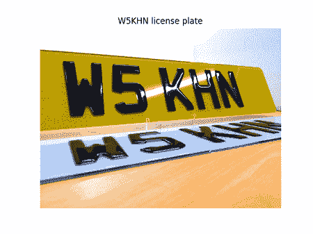

# 基于 Python 的车牌识别

> 原文：<https://www.javatpoint.com/number-plate-recognition-using-python>

在下面的教程中，我们将了解如何使用 Python 编程语言识别车牌。我们将在本项目中使用 **OpenCV** 来识别车牌，并使用 python**python**从车牌中提取字符和数字。在本教程结束之前，我们将构建一个自动识别车牌的 Python 程序。

## 了解自动车牌识别系统

自动车牌识别系统有各种形状和尺寸:

1.  在可预测车牌类型的测量照明情况下执行的 ANPR 可以利用图像处理的基本技术。
2.  更先进的 ANPR 系统使用专用的物体检测器，如 HOG +线性 SVM、固态硬盘、YOLO 和 fast R-CNN 来定位图像中的车牌。
3.  最先进的 ANPR 软件使用递归神经网络(RNNs)和长短期记忆网络(LSTMs)，以帮助更好地从车牌本身识别文本。
4.  更先进的 ANPR 系统利用专门的神经网络结构，在图像被光学字符识别之前对其进行预处理和清洁，从而提高了 ANPR 的准确性。

使自动车牌识别更加复杂的事实可能需要实时操作。

例如，让我们考虑安装在收费公路上的 ANPR 系统。它必须能够检测经过的每辆车的车牌，对车牌上的字符进行光学字符识别，然后将这些数据存储在数据库中，这样车主就可以为通行费付费。

很少有复合因素使 ANPR 极具挑战性，包括找到一组我们可以利用的数据，以便为 ANPR 训练定制模型。用于训练最先进模型的大型、健壮的 ANPR 数据集受到严密保护，并且很少(如果有的话)公开发布:

1.  这些数据集包括与车辆、驾驶员和位置相关的敏感识别细节。
2.  ANPR 的数据集是乏味的策划，需要难以置信的时间投资和工作人员的时间来解释。
3.  ANPR 与地方和联邦政府的合同往往极其合理。往往不是训练好的模型有价值；但是，不是指定公司策划的数据集。
4.  出于同样的原因，我们将观察到 ANPR 工业收购不是为了他们的 ANPR 系统，而是为了数据本身。

## 项目的先决条件

我们将使用 Python **OpenCV** 库。这是一个机器学习的开源库，为计算机视觉提供了一个通用的基础设施。我们还将在项目中使用**侏儒怪**。**宇宙魔方**是一个宇宙魔方-光学字符识别引擎，用于读取图像类型并提取图像中可用的细节。

### **安装**

借助以下语法，我们可以使用 pip 安装程序安装 **OpenCV** 库:

**语法:**

```py

$ pip install opencv-python

```

为了安装**pytesserpact**发动机，将遵循相同的程序。其语法如下所示:

**语法:**

```py

$ pip install pytesseract

```

### OpenCV 的特点

1.  在下面的 Python 项目中，我们将利用 **OpenCV** 的以下特性来识别输入图像中的车牌:
2.  **高斯模糊:**这里，我们将使用高斯核进行图像平滑。这种技术对于去除高斯噪声非常有效。 **OpenCV** 为该任务提供了一个名为**Gaussian bulr()**的函数。
3.  **形态变换:**这些是基于图像形状的运算，在二值图像上进行处理。基本的形态学操作包括打开、关闭、侵蚀、扩张等等。 **OpenCV** 中提供的一些功能如下:
    1.  **cv2.erode()**
    2.  **cv2 . exploit()**
    3.  **cv2 .形态学()**
4.  **Sobel:** 这里，我们将根据图像计算导数。这个特征对于基于计算机视觉的各种任务来说是重要的。在这些导数的帮助下，我们可以计算梯度，梯度的较高变化表示图像中值得注意的变化。 **OpenCV** 提供**索贝尔()**函数来计算索贝尔算子。
5.  **等高线:**等高线是由所有强度相同的连续点组成的曲线。这些曲线对于物体的识别非常有用。 **OpenCV** 为该功能提供了**查找轮廓()**功能。

## 理解 Python 代码

既然我们已经讨论了项目的理论部分，让我们进入编码部分。为了更好的理解和清晰，我们将项目的整个源代码分成了不同的步骤。

### 步骤 1:导入所需的模块

首先，我们要导入 **OpenCV** 和**pytessarct**以及 **matplotlib、glob** 和 **OS** 。

**档案:test . py**

```py

# importing the required modules
import pytesseract
import matplotlib.pyplot as plt
import cv2
import glob
import os

```

#### 注意:文件的名称必须是车牌图像中的准确数字。例如，如果车牌号码是“FTY348U”，那么图像文件的名称将是“FTY348U.jpg”。

### 步骤 2:在车牌上使用镶嵌引擎执行光学字符识别

对于下一步，我们必须在车牌的镶嵌引擎的帮助下执行光学字符识别。在下面的代码片段中可以观察到同样的情况。

**档案:test . py**

```py

# specifying the path to the number plate images folder as shown below
file_path = os.getcwd() + "/license_plates/**/*.jpg"
NP_list = []
predicted_NP = []

for file_path in glob.glob(file_path, recursive = True):

    NP_file = file_path.split("/")[-1]
    number_plate, _ = os.path.splitext(NP_file)
    '''
    Here we will append the actual number plate to a list
    '''
    NP_list.append(number_plate)

    '''
    Reading each number plate image file using openCV
    '''
    NP_img = cv2.imread(file_path)

    '''
    We will then pass each number plate image file
    to the Tesseract OCR engine utilizing the Python library
    wrapper for it. We get back predicted_res for
    number plate. We append the predicted_res in a
    list and compare it with the original number plate
    '''
    predicted_res = pytesseract.image_to_string(NP_img, lang ='eng',
    config ='--oem 3 --psm 6 -c tessedit_char_whitelist = ABCDEFGHIJKLMNOPQRSTUVWXYZ0123456789')

    filter_predicted_res = "".join(predicted_res.split()).replace(":", "").replace("-", "")
    predicted_NP.append(filter_predicted_res)

```

**说明:**

在上面的代码片段中，我们已经使用**操作系统**模块指定了车牌图像文件的路径。我们还将两个空列表定义为 **NP_list** 和 **predicted_NP** 。然后，我们使用 **append()** 功能将实际的车牌号添加到列表中。然后我们使用 OpenCV 模块读取每个车牌图像文件，并将它们存储在 **NP_img** 变量中。然后，我们在 Python 库包装器的帮助下，将每个车牌图像文件传递给 Tesseract OCR 引擎。然后我们得到了车牌号的 **predicted_res** ，并将它添加到一个列表中，并与真品进行比较。

现在，因为我们已经预测了板块，但是我们不知道预测。因此，为了查看数据和预测，我们将执行一点可视化，如下所示。我们还将在没有任何核心函数帮助的情况下估计预测的准确性。

**档案:test . py**

```py

print("Original Number Plate", "\t", "Predicted Number Plate", "\t", "Accuracy")
print("--------------------", "\t", "-----------------------", "\t", "--------")

def estimate_predicted_accuracy(ori_list, pre_list):
    for ori_plate, pre_plate in zip(ori_list, pre_list):
        acc = "0 %"
        number_matches = 0
        if ori_plate == pre_plate:
            acc = "100 %"
        else:
            if len(ori_plate) == len(pre_plate):
                for o, p in zip(ori_plate, pre_plate):
                    if o == p:
                        number_matches += 1
                acc = str(round((number_matches / len(ori_plate)), 2) * 100)
                acc += "%"
        print(ori_plate, "\t", pre_plate, "\t", acc)

estimate_predicted_accuracy(NP_list, predicted_NP)

```

**输出:**

```py
Original Number Plate    Predicted Number Plate      Accuracy
--------------------     -----------------------     --------
DL3CAM0857               DL3CAM0857                  100 %
MD06NYW                  MDOGNNS                     40 %
TN21TC706                TN21TC706                   100 %
TN63DB5481               TN63DB5481                  100 %
UP14DR4070               UP14DR4070                  100 %
W5KHN                    WSKHN                       80 %

```

**说明:**

在上面的代码片段中，我们定义了一个计算预测精度的函数。在该函数中，我们使用 **for-loop** 来遍历原始车牌和预测车牌的列表，并检查它们是否匹配。为了获得更好更合适的结果，我们还根据数字的长度检查了准确性。

我们可以观察到，Tesseract OCR 引擎大多以 100%的准确率正确预测所有的车牌。宇宙魔方光学字符识别引擎对车牌的预测不正确，我们将对这些车牌文件应用图像处理技术，并将它们再次传递给宇宙魔方光学字符识别。我们可以通过应用图像处理技术来提高镶嵌引擎对错误预测的车牌的准确率。

### 步骤 3:图像处理技术

让我们考虑下面的代码片段来理解图像处理技术。

**档案:test . py**

```py

import matplotlib.image as mpimg
for img in os.listdir("D://Python//License_Plate"): 
    test_NP = mpimg.imread("W5KHN.jpg")

plt.imshow(test_NP)
plt.axis('off')
plt.title('W5KHN license plate')
plt.show()

```

**输出:**



**说明:**

在上面的代码片段中，我们从 **matplotlib** 库中导入了**图像**模块，并使用 **for-loop** 从指定的文件夹中提取图像。然后，我们使用 **imread()** 功能读取提取的图像。然后我们使用 **matplotlib** 库中的**绘图**模块为用户显示图像。

1.  **图像调整大小:**我们可以借助**调整**的大小，在水平和垂直方向将图像文件的大小调整为 2 倍。
2.  **转换为灰度:**然后，我们可以将调整后的图像文件转换为灰度，以优化检测并大幅减少图像中可用的颜色数量，这将使我们能够轻松检测车牌。
3.  **图像去噪:**我们可以使用高斯模糊技术对图像去噪。它使图像的边缘更加清晰和平滑，使字符更易读。

让我们考虑下面的例子来理解同样的事情。

**档案:test . py**

```py

    # image resizing
    resize_test_NP = cv2.resize(
        test_NP, None, fx = 2, fy = 2, 
        interpolation = cv2.INTER_CUBIC)

    # converting image to grayscale
    grayscale_resize_test_NP = cv2.cvtColor(
        resize_test_NP, cv2.COLOR_BGR2GRAY)

    # denoising the image
    gaussian_blur_NP = cv2.GaussianBlur(
        grayscale_resize_test_NP, (5, 5), 0)

```

**说明:**

在上面的代码片段中，我们有一些 **OpenCV** 模块的工具来调整图像的大小，将其转换为灰度，并对图像进行去噪。

一旦完成以上步骤，我们就可以将转换后的车牌文件传递给 Tesseract OCR 引擎，并查看预测结果。

在下面的代码片段中可以观察到同样的情况。

**档案:anby . py**

```py

new_pre_res_W5KHN = pytesseract.image_to_string(gaussian_blur_NP, lang ='eng')
filter_new_pre_res_W5KHN = "".join(new_pre_res_W5KHN.split()).replace(":", "").replace("-", "")
print(filter_new_pre_res_W5KHN)

```

**输出:**

```py
W5KHN

```

**说明:**

在上面的代码片段中，我们将最终处理的图像传递给 Tesseract OCR 引擎，以从车牌中提取号码。

同样，我们可以对所有其他车牌进行这种图像处理，但准确率不是 100%。这样，车牌识别模型就准备好了。

* * *