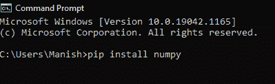
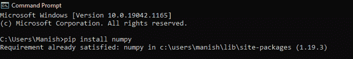
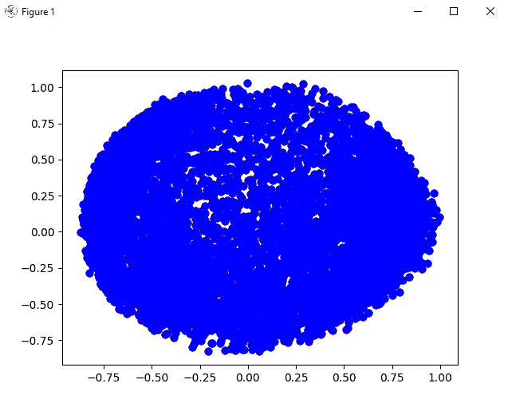
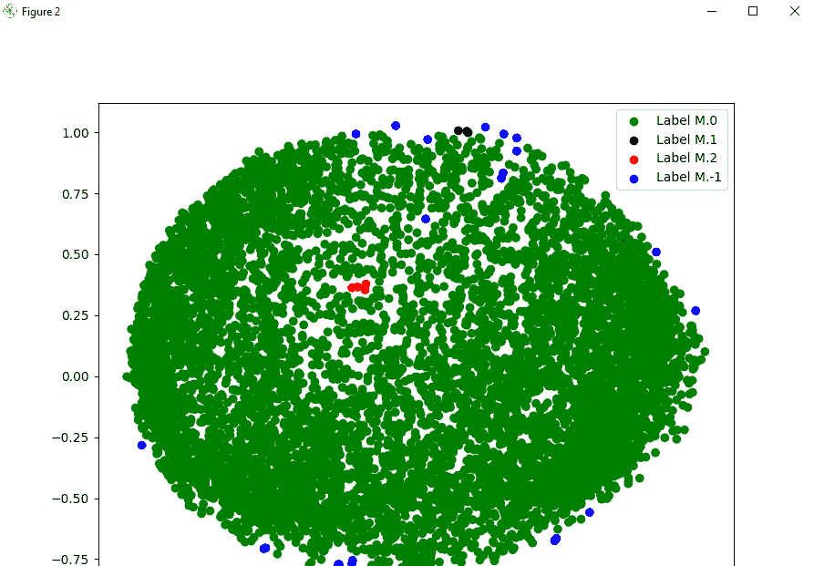
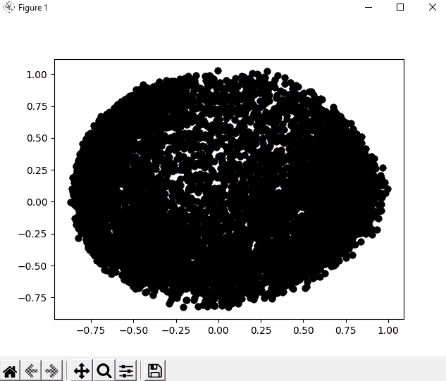
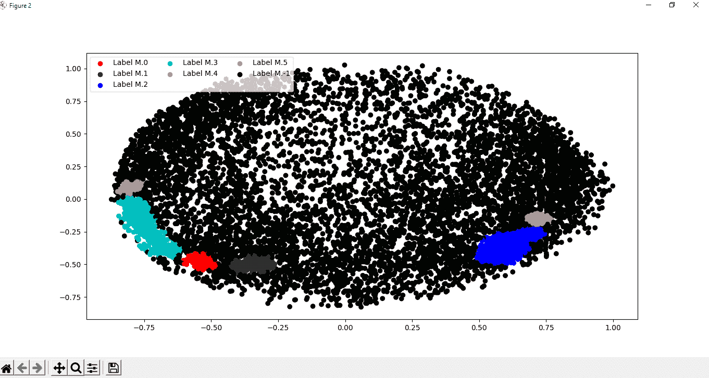

# Python 中的DBSCAN算法

> 原文：<https://www.javatpoint.com/dbscan-algorithm-in-python>

在本教程中，我们将学习如何在 Python 中实现和使用 DBSCAN 算法。

1996 年，一种聚类算法——基于密度的噪声应用空间聚类首次被提出，并于 2014 年获得“时间测试”奖。在 KDD 举行的数据挖掘大会上，DBSCAN 获得了“时间的考验”奖项。我们在这里不学习 DBSCAN 算法，只讨论 DBSCAN 算法在 Python 中的实现。但是如果我们必须了解 DBSCAN 算法的实现，我们至少应该对它有一个基本的了解。因此，如果你不知道什么是 DBSCAN 算法或者它是如何工作的，那么你应该首先了解 DBSCAN 算法及其工作原理。

## DBSCAN算法在 Python 中的实现

我们将在本节中执行 DBSCAN 算法的实现操作，我们将分步骤进行，以便于理解和学习。我们将在这个实现过程中使用数据集来对其执行各种操作(包括我们在 DBSCAN 算法中所做的操作)。在开始实现过程之前，我们应该满足在 Python 程序中实现 DBSCAN 算法的先决条件。

### 实施DBSCAN算法的先决条件:

在继续本节中的 DBSCAN 算法的实现部分之前，我们必须满足以下先决条件:

**1。Numpy 库:**我们应该确保 numpy 库安装在我们的系统中，并且是最新版本，因为我们将在实现过程中使用数据集上的 numpy 库上的函数。如果 numpy 库不在我们的系统中，或者我们以前没有安装过它，那么我们可以使用设备中的命令提示符终端中的以下命令来安装它:

```py

pip install numpy

```



当我们按回车键时，numpy 库开始安装在我们的系统中。



一段时间后，我们将看到 numpy 库成功安装在我们的系统中(这里，我们的系统中已经有了 numpy 库)。

**2。Panda library:** 和 numpy library 一样，Panda library 也是我们系统中应该存在的必选库，如果我们系统中不存在，我们可以在命令提示终端中使用以下命令，用 pip installer 进行安装:

```py

pip install pandas

```

**3。matplotlib 库:**它也是 DBSCAN 算法实现过程中的一个重要库，因为这个库的函数将帮助我们显示来自数据集的结果。如果 matplotlib 库不在我们的系统中，那么我们可以使用命令提示符终端中的以下命令，用 pip installer 安装它:

```py

pip install matplotlib

```

**4。Sklearn 库:**在执行 DBSCAN 算法的实现操作时，Sklearn 库将是主要需求之一，因为我们必须在程序中从 Sklearn 库本身导入各种模块，例如预处理分解等。因此，我们应该确保 Sklearn 库是否存在于我们的系统中，如果不存在于我们的系统中，那么我们可以使用命令提示符终端中的以下命令来安装 pip installer:

```py

pip install matplotlib

```

5.最后但同样重要的是，我们还应该了解 DBSCAN 算法(它是什么以及它是如何工作的)，正如我们已经讨论过的，这样我们就可以很容易地理解它在 Python 中的实现。

在我们前进之前，我们应该确保我们已经满足了上面列出的所有先决条件，这样我们就不必在执行实施步骤时面临任何问题。

### DBSCAN 算法的实现步骤:

现在，我们将在 Python 中执行 DBSCAN 算法的实现。尽管如此，我们将按照前面提到的步骤进行，这样实现部分就不会变得复杂，并且我们可以非常容易地理解它。为了在 Python 程序中实现 DBSCAN 算法及其逻辑，我们必须遵循以下步骤:

**第一步:导入所有需要的库:**

首先，我们必须导入我们在先决条件部分安装的所有必需的库，以便我们可以在实现 DBSCAN 算法时使用它们的功能。

**这里我们首先导入了程序内部所有需要的库或者库的模块:**

```py

# Importing numpy library as nmp
import numpy as nmp
# Importing pandas library as pds
import pandas as pds
# Importing matplotlib library as pplt
import matplotlib.pyplot as pplt
# Importing DBSCAN from cluster module of Sklearn library
from sklearn.cluster import DBSCAN
# Importing StandardSclaer and normalize from preprocessing module of Sklearn library
from sklearn.preprocessing import StandardScaler
from sklearn.preprocessing import normalize
# Importing PCA from decomposition module of Sklearn
from sklearn.decomposition import PCA

```

**第二步:加载数据:**

在这一步中，我们必须加载这些数据，我们可以通过在程序中导入或加载数据集(这是 DBSCAN 算法处理数据集所必需的)来实现这一点。为了在程序中加载数据集，我们将使用 panda 库的 **read.csv()** 函数，并打印来自数据集的信息，如下所示:

```py

# Loading the data inside an initialized variable
M = pds.read_csv('sampleDataset.csv') # Path of dataset file
# Dropping the CUST_ID column from the dataset with drop() function
M = M.drop('CUST_ID', axis = 1)
# Using fillna() function to handle missing values
M.fillna(method ='ffill', inplace = True)
# Printing dataset head in output
print(M.head())

```

**输出:**

```py
       BALANCE  BALANCE_FREQUENCY  ...  PRC_FULL_PAYMENT  TENURE
0    40.900749           0.818182  ...          0.000000      12
1  3202.467416           0.909091  ...          0.222222      12
2  2495.148862           1.000000  ...          0.000000      12
3  1666.670542           0.636364  ...          0.000000      12
4   817.714335           1.000000  ...          0.000000      12

[5 rows x 17 columns]

```

上面输出中给出的数据将在我们运行程序时打印出来，我们将从加载的数据集文件中处理这些数据。

**第三步:数据预处理:**

现在，我们将利用 Sklearn 库预处理模块的功能开始对这一步的数据集数据进行预处理。我们必须使用以下技术，同时用 Sklearn 库函数预处理数据:

```py

# Initializing a variable with the StandardSclaer() function
scalerFD = StandardScaler()
# Transforming the data of dataset with Scaler
M_scaled = scalerFD.fit_transform(M)
# To make sure that data will follow gaussian distribution
# We will normalize the scaled data with normalize() function
M_normalized = normalize(M_scaled)
# Now we will convert numpy arrays in the dataset into dataframes of panda
M_normalized = pds.DataFrame(M_normalized)

```

**第四步:数据降维:**

在这一步中，我们将降低缩放和标准化数据的维度，以便数据可以在程序中轻松可视化。为了转换数据并降低其维数，我们必须以下列方式使用主成分分析函数:

```py

# Initializing a variable with the PCA() function
pcaFD = PCA(n_components = 2) # components of data
# Transforming the normalized data with PCA
M_principal = pcaFD.fit_transform(M_normalized)
# Making dataframes from the transformed data
M_principal = pds.DataFrame(M_principal)
# Creating two columns in the transformed data
M_principal.columns = ['C1', 'C2']
# Printing the head of the transformed data
print(M_principal.head())

```

**输出:**

```py
         C1        C2
0 -0.489949 -0.679976
1 -0.519099  0.544828
2  0.330633  0.268877
3 -0.481656 -0.097610
4 -0.563512 -0.482506

```

正如我们在输出中看到的，我们已经使用主成分分析将归一化数据转换为两个分量，即两列(我们可以在输出中看到它们)。之后，我们使用 panda library **dataframe()** 函数从转换后的数据制作数据帧。

**第五步:建立聚类模型:**

现在，这是实现的最重要的一步，因为在这里我们必须构建数据的聚类模型(我们正在对其执行操作)，我们可以通过使用 Sklearn 库的 DBSCAN 函数来实现这一点，如下所述:

```py

# Creating clustering model of the data using the DBSCAN function and providing parameters in it
db_default = DBSCAN(eps = 0.0375, min_samples = 3).fit(M_principal)
# Labelling the clusters we have created in the dataset
labeling = db_default.labels_

```

**步骤 6:可视化聚类模型:**

```py

# Visualization of clustering model by giving different colours
colours = {}
# First colour in visualization is green
colours[0] = 'g'
# Second colour in visualization is black
colours[1] = 'k'
# Third colour in visualization is red
colours[2] = 'r'
# Last colour in visualization is blue
colours[-1] = 'b'
# Creating a colour vector for each data point in the dataset cluster
cvec = [colours[label] for label in labeling]
# Construction of the legend
# Scattering of green colour
g = pplt.scatter(M_principal['C1'], M_principal['C2'], color ='g');
# Scattering of black colour
k = pplt.scatter(M_principal['C1'], M_principal['C2'], color ='k');
# Scattering of red colour
r = pplt.scatter(M_principal['C1'], M_principal['C2'], color ='r');
# Scattering of green colour
b = pplt.scatter(M_principal['C1'], M_principal['C2'], color ='b'); 
# Plotting C1 column on the X-Axis and C2 on the Y-Axis
# Fitting the size of the figure with figure function
pplt.figure(figsize =(9, 9))
# Scattering the data points in the Visualization graph
pplt.scatter(M_principal['C1'], M_principal['C2'], c = cvec)
# Building the legend with the coloured data points and labelled
pplt.legend((g, k, r, b), ('Label M.0', 'Label M.1', 'Label M.2', 'Label M.-1'))
# Showing Visualization in the output
pplt.show()

```

**输出:**




正如我们在输出中看到的，我们使用数据集的数据点绘制了图表，并通过用不同的颜色标记数据点来可视化聚类。

**步骤 7:调整参数:**

在这一步中，我们将通过更改先前在 DBSCAN 函数中给出的参数来调整模块的参数，如下所示:

```py

# Tuning the parameters of the model inside the DBSCAN function
dts = DBSCAN(eps = 0.0375, min_samples = 50).fit(M_principal)
# Labelling the clusters of data points
labeling = dts.labels_

```

**步骤 8:变化的可视化:**

现在，在调整我们创建的集群模型的参数之后，我们将通过用不同的颜色标记数据集中的数据点来可视化集群中发生的变化，就像我们之前所做的那样。

```py

# Labelling with different colours
colours1 = {}
# labelling with Red colour
colours1[0] = 'r'
# labelling with Green colour
colours1[1] = 'g'
# labelling with Blue colour
colours1[2] = 'b'
colours1[3] = 'c'
# labelling with Yellow colour
colours1[4] = 'y'
# Magenta colour
colours1[5] = 'm'
# labelling with Black colour
colours1[-1] = 'k'
# Labelling the data points with the colour variable we have defined
cvec = [colours1[label] for label in labeling]
# Defining all colour that we will use
colors = ['r', 'g', 'b', 'c', 'y', 'm', 'k' ]
# Scattering the colours onto the data points
r = pplt.scatter(
        M_principal['C1'], M_principal['C2'], marker ='o', color = colors[0])
g = pplt.scatter(
        M_principal['C1'], M_principal['C2'], marker ='o', color = colors[1])
b = pplt.scatter(
        M_principal['C1'], M_principal['C2'], marker ='o', color = colors[2])
c = pplt.scatter(
        M_principal['C1'], M_principal['C2'], marker ='o', color = colors[3])
y = pplt.scatter(
        M_principal['C1'], M_principal['C2'], marker ='o', color = colors[4])
m = pplt.scatter(
        M_principal['C1'], M_principal['C2'], marker ='o', color = colors[5])
k = pplt.scatter(
        M_principal['C1'], M_principal['C2'], marker ='o', color = colors[6])
# Fitting the size of the figure with figure function
pplt.figure(figsize =(9, 9))
# Scattering column 1 into X-axis and column 2 into y-axis
pplt.scatter(M_principal['C1'], M_principal['C2'], c = cvec)
# Constructing a legend with the colours we have defined
pplt.legend((r, g, b, c, y, m, k),
           ('Label M.0', 'Label M.1', 'Label M.2', 'Label M.3', 'Label M.4','Label M.5', 'Label M.-1'), # Using different labels for data points
           scatterpoints = 1, # Defining the scatter point
           loc ='upper left', # Location of cluster scattering
           ncol = 3, # Number of columns
           fontsize = 10) # Size of the font
# Displaying the visualisation of changes in cluster scattering
pplt.show()

```

**输出:**




我们可以通过查看输出来调整 DBSCAN 函数的参数，从而清楚地观察到数据点的集群分散所带来的变化。当我们观察这些变化时，我们也可以理解 DBSCAN 算法是如何工作的，以及它如何有助于数据集中数据点的集群分散的可视化。

* * *