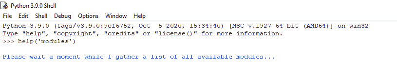
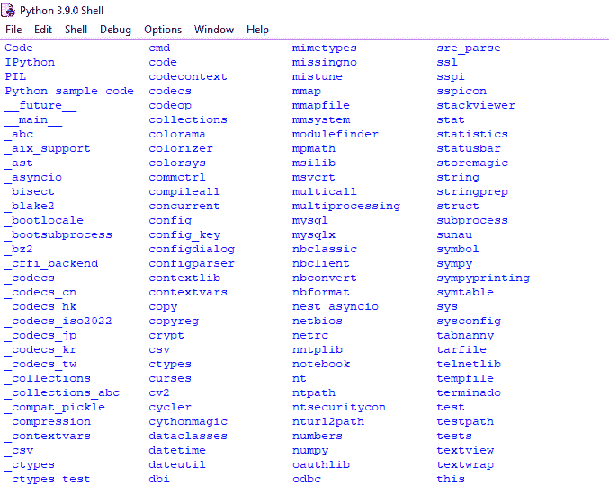
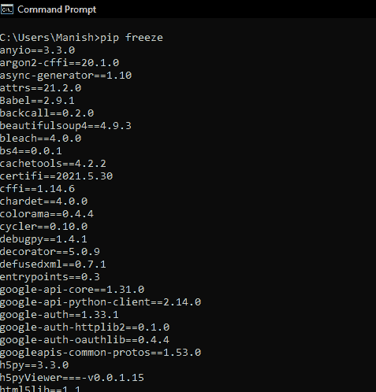
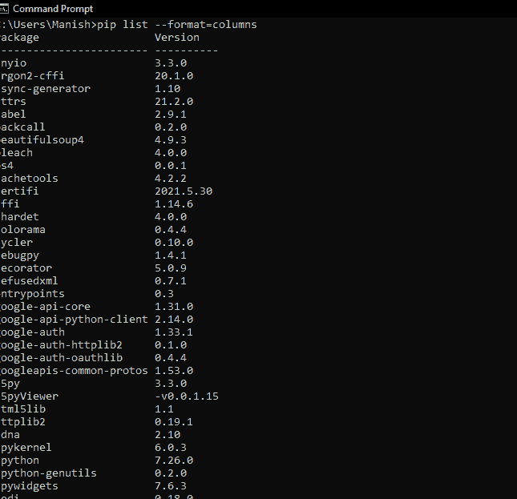

# 检查 Python 中已安装的模块

> 原文：<https://www.javatpoint.com/check-installed-modules-in-python>

很多时候，当我们在别人的系统上工作时，我们必须在那里完成我们的项目。当我们必须在那个系统中安装所有需要的模块时，它变得更加忙碌。事实上，当我们在项目进行到一半时，必须从头开始时，情况会更混乱。这也意味着当其他人为他们自己的项目在我们的系统上工作时。

因此，在这种情况下或许多其他情况下，我们希望我们已经知道系统中已经存在哪些模块，这样我们就不会再为它们使用安装命令而浪费宝贵的时间。当我们想要在程序中执行特定的操作时，这也是有帮助的，我们知道我们的系统中有这些模块，我们可以使用这些功能来完成特定的任务。

在本教程中，我们将学习如何检查系统中已安装的 Python 模块，并获得所有已安装模块的列表，这样我们就不必浪费更多时间。

## 检查所有已安装的 Python 模块

正如我们已经讨论过的，为什么我们需要检查系统中所有已安装 Python 模块的列表，以及当我们有这个列表时，它会有多大帮助。

现在，我们将学习检查系统中所有已安装 Python 模块的方法，并获得它们的完整列表。我们甚至可以使用 pip 安装程序从命令终端检查系统中本地存在的 Python 模块以及我们已经安装在系统中的 Python 模块。

在本节中，我们将使用以下两种方法来检查系统中安装的所有 Python 模块，并获取它们的列表:

1.  检查所有本地安装的 Python 模块
2.  检查所有安装的 Python 模块

让我们通过使用这两种方法并获得所有已安装 Python 模块的列表来理解它们的实现。

### 方法 1:检查所有本地安装的 Python 模块:

如果我们只想检查所有本地安装的 Python 模块，那么就非常简单了。我们必须打开我们的 Python Shell(输出显示的地方)，或者我们甚至可以在 Jupyter 笔记本和 Jupyter 实验室中执行这个任务。

在 Python shell 中(或者在 Jupyter 笔记本和 Jupyter 实验室中)，我们必须在 shell 中编写以下命令:

```py

>> help('modules')

```

当我们写完上面给出的命令后按回车键，Python shell 将开始加载我们系统中所有本地安装的 Python 模块的名称，我们可以在屏幕上看到下面的状态窗口:



我们可以看到，所有本地安装的 Python 模块的列表正在加载，Python shell 需要一些时间才能获得所有本地安装的 Python 模块的名称。我们必须等待一段时间，之后，它将显示我们系统中所有本地安装的 Python 模块，如下面的输出屏幕所示:



在这里，我们可以看到系统中所有本地安装的 Python 模块的名称，我们还可以保存它们以供将来参考。

### 方法 2:检查所有安装的 Python 模块:

要检查所有安装的 Python 模块，我们可以使用以下两个带“pip”的命令:

1.  使用“pip 冻结”命令
2.  使用“画中画列表”命令

让我们使用这两个命令，以便更好地理解它们的实现。

**(i)使用“pip 冻结”命令:**我们必须在设备的命令提示终端内使用“pip 冻结”命令。首先要打开命令提示终端，然后要在里面写 pip 命令’，之后还要按回车键。当我们按回车键时，pip 安装程序将开始收集所有已安装 Python 模块的列表，过一会儿，它将向我们显示所有已安装 Python 模块的列表，如下所示:



**(ii)使用‘pip list’命令:**如果我们系统中存在的 pip 安装程序是 1.3 或更高版本，那么我们也可以使用此方法获取所有已安装 Python 模块的列表。与前面的方法一样，我们只需在设备的命令提示终端中编写“pip list”命令，然后按回车键。当我们按回车键时，pip 安装程序将开始收集所有已安装 Python 模块的列表，过一会儿，它将向我们显示所有已安装 Python 模块的列表，如下所示:



在这里，我们将“pip list”命令修改为:“pip list - format=column”，这样我们就可以以列格式获得系统中所有已安装 Python 模块的列表。

## 结论

在本教程中，我们已经了解到在我们的系统或某人的系统中拥有所有已安装模块的列表是多么重要。然后，我们学习了所有方法，通过这些方法我们可以获得系统中所有已安装 Python 模块的列表。我们了解了本地安装的 Python 模块和系统中安装的所有 Python 模块的不同方法，并使用这些方法来了解它们的实现。

* * *