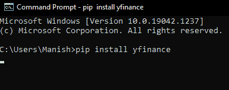
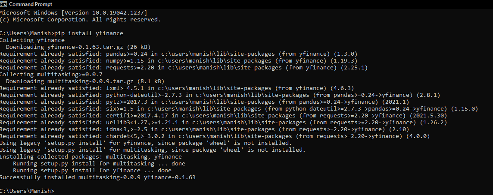

# python 财务模块

> 原文：<https://www.javatpoint.com/python-yfinance-module>

有很多情况下，我们有时不得不获取博客网站甚至浏览器的财务数据或报表。允许我们收集其财务数据的著名浏览器之一是雅虎，实际上，当我们需要执行此任务时，有许多实例。在本教程中，我们将学习 Python 中的 yfinance 模块，我们将学习如何使用该模块从雅虎获取财务数据，以及我们可以从中收集什么样的数据。

## python 中的财务模块

yfinance 是 Python 中著名的模块之一，用于收集在线数据，有了它，我们可以收集雅虎的财务数据。在 yfinance 模块的帮助下，我们检索和收集公司的财务信息(如财务比率等。)以及营销数据的历史。但是，在我们开始学习更多关于这个模块及其实现以及应用之前，我们必须在我们的系统中安装 yfinance 模块(因为它不是 Python 中的内置模块)。安装过程完成后，我们将进入 yfinance 模块的实施部分。

### 装置

在本节中，我们将学习如何在系统中安装 yfinance 模块，以便将它导入程序并使用其功能。我们必须按照以下步骤在设备上安装 yfinance 模块:

**第一步:**打开设备的命令提示终端，找到系统中安装 Python 的目录(使用 mkdir)。

**第二步:**现在在终端写下以下命令，用 pip 安装程序安装 yfinance 模块:

```py

pip install yfinance

```



**第三步:**当我们按回车键时，pip 安装程序将开始在系统中定义的路径上安装 yfinance 模块。



如我们所见，yfinance 模块已成功安装在我们的系统中，现在我们可以通过将其导入 Python 程序来开始使用它。

### 履行

现在，我们将在 Python 程序中使用 yfinance 模块，这样我们就可以使用它从雅虎收集财务数据，并了解它的实现。当我们在程序中使用 yfinance 模块时，我们必须在函数内部将 ticker 作为参数传递(这里，ticker 被称为公司的 Ticker)。

**注:**股票代码基本上是公司名称的股票符号或唯一的一系列字母，它被分配来添加额外的安全层，用于交易目的。请看以下我们将在 yfinance 模块中使用的 tickers 示例:

*   谷歌的股票代码是“GOOGL”
*   脸书的股票代码是“FB”
*   而且，Ticker 对于亚马逊来说是“AMZN”等。

现在，让我们在各种示例程序中使用 yfinance 模块，这样我们就可以很容易地理解它的功能和实现。查看以下示例程序，这些程序使用其中的 yfinance 模块来收集数据:

**例 1:**

看看下面的 Python 程序，我们将从雅虎金融中检索脸书的财务数据:

```py

# Import yfinance module in the program
import yfinance as yahooFin
# Using ticker for the Facebook in yfinance function
retrFBInfo = yahooFin.Ticker("FB")
# Printing Facebook financial information in the output
print(retrFBInfo.info)

```

**输出:**

```py
{'zip': '94025', 'sector': 'Communication Services', 'fullTimeEmployees': 63404, 'longBusinessSummary': "Facebook, Inc. develops products that enable people to connect and share with friends and family through mobile devices, personal computers, virtual reality headsets, and in-home devices worldwide. The company's products include Facebook that enables people to connect, share, discover, and communicate with each other on mobile devices and personal computers; Instagram, a community for sharing photos, videos, and private messages; Messenger, a messaging application for people to connect with friends, family, groups, and businesses across platforms and devices; and WhatsApp, a messaging application that is used by people and businesses to communicate in a private way. It also provides Facebook Reality Labs, an augmented and virtual reality product that help people feel connected, anytime, and anywhere. Facebook, Inc. was founded in 2004 and is headquartered in Menlo Park, California.", 'city': 'Menlo Park', 'phone': '650-543-4800', 'state': 'CA', 'country': 'United States', 'companyOfficers': [], 'website': 'http://investor.fb.com', 'maxAge': 1, 'address1': '1601 Willow Road', 'industry': 'Internet Content & Information', 'ebitdaMargins': 0.49698, 'profitMargins': 0.37175998, 'grossMargins': 0.80977, 'operatingCashflow': 49358000128, 'revenueGrowth': 0.556, 'operatingMargins': 0.42523, 'ebitda': 52079001600, 'targetLowPrice': 225, 'recommendationKey': 'buy', 'grossProfits': 69273000000, 'freeCashflow': 22740000768, 'targetMedianPrice': 425, 'currentPrice': 330.05, 'earningsGrowth': 1.006, 'currentRatio': 5.425, 'returnOnAssets': 0.17950001, 'numberOfAnalystOpinions': 50, 'targetMeanPrice': 417.22, 'debtToEquity': 9.089, 'returnOnEquity': 0.31332, 'targetHighPrice': 500, 'totalCash': 64079998976, 'totalDebt': 12563000320, 'totalRevenue': 104789999616, 'totalCashPerShare': 22.728, 'financialCurrency': 'USD', 'revenuePerShare': 36.82, 'quickRatio': 5.095, 'recommendationMean': 1.9, 'exchange': 'NMS', 'shortName': 'Facebook, Inc.', 'longName': 'Facebook, Inc.', 'exchangeTimezone

```

**说明:**

我们首先在程序中导入了 yfinance 模块作为 yahooFin 来使用它的功能。然后，我们使用带有 FB Ticker 功能的 yahooFin 从雅虎收集了脸书页面的所有财务信息。在从雅虎的脸书页面检索到财务信息后，我们在程序执行时将这些信息打印在输出中。

正如我们在输出中看到的，我们已经将所有的财务数据打印成了一个完整的 Python 字典。

### 从雅虎收集财务关键指标:

除了从雅虎网站检索财务信息(如我们在示例 1 中所做的)，我们甚至可以收集各种财务关键指标。这些财务关键指标可以是市盈率、公司贝塔系数和公司部门等。，来自我们在上面第一个示例中打印的整个 Python 字典。让我们使用 yfinance 模块检索财务关键指标。

**例 2:**

请看下面的 Python 程序，我们将使用 yfinance 模块从雅虎检索财务关键指标:

```py

# Import yfinance module
import yfinance as yahooFin
# Using ticker for the Facebook in yfinance function
retrFBInfo = yahooFin.Ticker("FB")
# Getting Key metrics from the Facebook financial data we retrieved
comSecKey = retrFBInfo.info['sector'] # Company Sector key
keyPER = retrFBInfo.info['trailinPE'] # Price Earning ratio key
comBetaKey = retrFBInfo.info['beta'] # Company Beta key
# Print the Company Sector Information
print("The Company Sector Metric key we collected from the page: ", comSecKey)
# Print the Price Earnings Ratio (PER) from the FB page
print("The Price Earnings Ratio (PER) we got from the financial data of page: ", keyPER)
# Print the Company Beta metric from page
print("The Company Beta key we retrieved from page: ", comBetaKey)

```

**输出:**

```py
The Company Sector Metric key we collected from the page:  Communication Services
The Price Earnings Ratio (PER) we got from the financial data of page:  26.211199
The Company Beta key we retrieved from page:  1.295305

```

**说明:**

我们没有从页面中检索完整的财务数据信息，而是在该计划中检索了一组有限的财务关键指标。我们首先初始化了三个变量(keyPer、comSecKey 和 comBetaKey)，并从我们从脸书页面收集的财务数据中存储了财务关键指标的值。在本例中，我们检索了市盈率、公司 Beta 和公司部门财务指标关键字，并将它们存储在各自的变量中。存储完财务指标键后，我们将它们打印在输出中，正如我们在输出中看到的，详细信息已成功打印。

### 拆分财务指标键:

在第一个和第二个例子中，我们打印了雅虎的财务数据和指标关键字，因为它们是一些字典值。但是我们甚至可以通过键值对来拆分这些值，然后我们可以打印拆分结果。在下面的示例中，我们将通过拆分来打印财务指标键值，并通过循环来拆分它们。

**例 3:**

看看下面的 Python 程序，我们将把财务指标键分成键-值对:

```py

# Import yfinance module
import yfinance as yahooFin
# Using ticker for the Facebook in yfinance function
retrFBInfo = yahooFin.Ticker("FB")
# Looping over items to split them in key-value pair
print("Items from the financial data of the Facebook page in the key-value page: ")
for keyItem, valueItem in retrFBInfo.info.items():
    print(keyItem, ":", valueItem)    

```

**输出:**

```py
Items from the financial data of the Facebook page in the key-value page: 
zip : 94025
sector : Communication Services
fullTimeEmployees : 63404
longBusinessSummary : Facebook, Inc. develops products that enable people to connect and share with friends and family through mobile devices, personal computers, virtual reality headsets, and in-home devices worldwide. The company's products include Facebook that enables people to connect, share, discover, and communicate with each other on mobile devices and personal computers; Instagram, a community for sharing photos, videos, and private messages; Messenger, a messaging application for people to connect with friends, family, groups, and businesses across platforms and devices; and WhatsApp, a messaging application that is used by people and businesses to communicate in a private way. It also provides Facebook Reality Labs, an augmented and virtual reality product that help people feel connected, anytime, and anywhere. Facebook, Inc. was founded in 2004 and is headquartered in Menlo Park, California.
city : Menlo Park
phone : 650-543-4800
state : CA
country : United States
companyOfficers : []
website : http://investor.fb.com
maxAge : 1
address1 : 1601 Willow Road
industry : Internet Content & Information
ebitdaMargins : 0.49698
profitMargins : 0.37175998
grossMargins : 0.80977
operatingCashflow : 49358000128
revenueGrowth : 0.556
operatingMargins : 0.42523
ebitda : 52079001600

```

**说明:**

从雅虎的脸书财务数据中检索信息后，我们使用了 for 循环。在 for 循环的帮助下，我们已经循环了数据，然后我们将数据项分成键值对。最后，作为程序的结果，我们在输出中打印了这些键值对。

### 检索历史市场价格:

我们甚至可以从雅虎的财务数据中检索历史市场价格，然后我们甚至可以在输出中打印这些信息。

**例 4:**

让我们首先看下面的例子，然后我们将了解更多关于检索历史市场价格的信息:

```py

# Import yfinance module
import yfinance as yahooFin
# Using ticker for the Facebook in yfinance function
retrFBInfo = yahooFin.Ticker("FB")
# Initializing variable for retrieving market prices
maxHisMP = retrFBInfo.history(period="max")
# Printing the historical market prices in the output
print("Historical Market Prices data from the Facebook page financial data of Yahoo: ")
print(maxHisMP)

```

**输出:**

```py
Historical Market Prices data from the Facebook page financial data of Yahoo: 
                  Open        High         Low       Close     Volume  \
Date                                                                    
2012-05-18   42.049999   45.000000   38.000000   38.230000  573576400   
2012-05-21   36.529999   36.660000   33.000000   34.029999  168192700   
2012-05-22   32.610001   33.590000   30.940001   31.000000  101786600   
2012-05-23   31.370001   32.500000   31.360001   32.000000   73600000   
2012-05-24   32.950001   33.209999   31.770000   33.029999   50237200   
...                ...         ...         ...         ...        ...   
2021-10-04  335.529999  335.940002  322.700012  326.230011   42885000   
2021-10-05  328.579987  335.179993  326.160004  332.959991   35377900   
2021-10-06  329.739990  334.380005  325.799988  333.640015   26443000   
2021-10-07  337.000000  338.839996  328.980011  329.220001   28307500   
2021-10-08  331.510010  333.399994  328.709991  330.049988   15934300   

            Dividends  Stock Splits  
Date                                 
2012-05-18          0             0  
2012-05-21          0             0  
2012-05-22          0             0  
2012-05-23          0             0  
2012-05-24          0             0  
...               ...           ...  
2021-10-04          0             0  
2021-10-05          0             0  
2021-10-06          0             0  
2021-10-07          0             0  
2021-10-08          0             0  

[2364 rows x 7 columns]

```

**说明:**

在这个例子中，我们从程序中检索到的雅虎页面中导入了脸书金融数据的历史市场价格。我们已经使用带有 FB Ticker 的 history()函数从脸书的金融数据中检索了历史市场价格，然后我们已经将信息存储在我们已经初始化的变量(即 maxHisMP)中。最后，作为程序的结果，我们在输出中打印了这个历史市场价格信息。我们可以在雅虎财务数据中看到最长时期的市场价格历史信息。

#### 注意:我们在历史函数中用 FB 跑马灯定义的“最大值”用于收集雅虎最大时间段的市场价格历史。max 关键字将检索雅虎中脸书每日价格变化的历史。

现在，我们已经了解了如何使用历史()函数从雅虎的财务数据中获取市场价格的历史。但是有一件事我们甚至可以最小化我们从历史中得到的数据来降低它的复杂性。我们可以通过在 history()函数中给出一个固定的时间参数来做到这一点，并且只从 Yahoo 中检索少量数据。

**在这里，我们将通过以下两种方式执行该功能:**

1.收集自上次“1 天”或“5 天”或“1 个月”或“3 个月”以来的固定时间数据。，方法是在历史函数中提供固定时间参数。让我们通过在程序中使用固定时间参数，然后从雅虎检索市场价格来理解这一点。

**例 5:**

请看下面的 Python 程序，我们将在其中检索脸书最近 3 个月的市场价格历史:

```py

# Import yfinance module
import yfinance as yahooFin
# Using ticker for the Facebook in yfinance function
retrFBInfo = yahooFin.Ticker("FB")
# Initializing variable for retrieving market prices
his3MonMP = retrFBInfo.history(period="3mo")
# Printing the historical market prices in the output
print("Historical Market Prices data of last 3 months from the Facebook page of Yahoo: ")
print(his3MonMP)

```

**输出:**

```py
Historical Market Prices data of last 3 months from the Facebook page of Yahoo: 
                  Open        High         Low       Close    Volume  \
Date                                                                   
2021-07-09  345.320007  350.709991  345.269989  350.420013  13018700   
2021-07-12  351.230011  354.190002  349.640015  353.160004  10018600   
2021-07-13  351.500000  358.489990  348.799988  352.089996  11456000   
2021-07-14  354.559998  355.200012  346.730011  347.630005  13894200   
2021-07-15  349.230011  349.230011  340.220001  344.459991  14781600   
...                ...         ...         ...         ...       ...   
2021-10-04  335.529999  335.940002  322.700012  326.230011  42885000   
2021-10-05  328.579987  335.179993  326.160004  332.959991  35377900   
2021-10-06  329.739990  334.380005  325.799988  333.640015  26443000   
2021-10-07  337.000000  338.839996  328.980011  329.220001  28307500   
2021-10-08  331.510010  333.399994  328.709991  330.049988  15934300   

            Dividends  Stock Splits  
Date                                 
2021-07-09          0             0  
2021-07-12          0             0  
2021-07-13          0             0  
2021-07-14          0             0  
2021-07-15          0             0  
...               ...           ...  
2021-10-04          0             0  
2021-10-05          0             0  
2021-10-06          0             0  
2021-10-07          0             0  
2021-10-08          0             0  

[65 rows x 7 columns]

```

**说明:**

我们使用了与前面示例程序相同的逻辑，并从雅虎的脸书页面收集了历史市场价格数据。但是，在这个程序中，我们没有收集最大数据，而是通过在历史函数中给出参数‘3mo’来限制我们的数据，这样它将只检索过去三个月的市场价格历史。然后，我们在输出中打印了过去三个月的市场价格历史。

正如我们在输出中看到的，雅虎脸书页面的市场价格历史仅在过去三个月才被打印出来。

#### 注意:当我们必须从过去的固定时间收集数据时，我们不能在历史函数中给出任何持续时间参数，因为它不是有效的参数。对于 yfinance 模块的历史函数，我们有以下有效的固定时间段参数:max、ytd、10y、5y、2y、1y、6mo、3mo、1mo、5d 和 1d。我们不能在 history()函数中给出任何其他时间段参数，因为它将被视为无效参数，并且不会检索市场价格历史数据。

2.通过给出开始时间和结束时间作为 history()函数的参数，从 history()函数中收集固定数据。我们可以通过定义开始和结束时间变量，然后使用这些变量作为 history()函数的参数，来检索我们想要的时间段的数据。让我们通过在程序中使用这些定义的时间参数，然后从雅虎检索市场价格历史来理解这一点。

**例 6:**

请看下面的 Python 程序，我们将在其中检索用户定义的时间段内脸书的市场价格历史:

```py

# Import yfinance module
import yfinance as yahooFin
# Importing datetime module in the program
import datetime
# Using ticker for the Facebook in yfinance function
retrFBInfo = yahooFin.Ticker("FB")
# Define a start date variable
strtDate = datetime.datetime(2021, 4, 26)
# Define an end date variable
endDate = datetime.datetime(2021, 8, 6)
# Initializing variable for retrieving market prices
fixTimeMP = retrFBInfo.history(start = strtDate, end = endDate)
# Printing the historical market prices in the output
print("Historical Market Prices data of the time period we defined from the financial data of Facebook page: ")
print(fixTimeMP)

```

**输出:**

```py
Historical Market Prices data of the time period we defined from the financial data of Facebook page: 
                  Open        High         Low       Close    Volume  \
Date                                                                   
2021-04-26  303.339996  305.799988  301.559998  303.040009  16172600   
2021-04-27  304.279999  305.339996  301.109985  303.570007  15309300   
2021-04-28  307.359985  310.920013  305.369995  307.100006  33907200   
2021-04-29  330.119995  331.809998  321.609985  329.510010  56526800   
2021-04-30  326.140015  329.820007  324.500000  325.079987  26332400   
...                ...         ...         ...         ...       ...   
2021-07-30  354.000000  360.730011  352.940002  356.299988  15966700   
2021-08-02  358.100006  359.399994  350.739990  351.950012  13180400   
2021-08-03  352.730011  353.769989  347.700012  351.239990  12406100   
2021-08-04  352.420013  360.480011  351.510010  358.920013  14180600   
2021-08-05  359.640015  363.899994  356.899994  362.970001  10247200   

            Dividends  Stock Splits  
Date                                 
2021-04-26          0             0  
2021-04-27          0             0  
2021-04-28          0             0  
2021-04-29          0             0  
2021-04-30          0             0  
...               ...           ...  
2021-07-30          0             0  
2021-08-02          0             0  
2021-08-03          0             0  
2021-08-04          0             0  
2021-08-05          0             0  

[72 rows x 7 columns]

```

**说明:**

我们已经在这个程序中导入了 yfinance 和 datetime 模块，这样我们就可以使用它的 datetime()函数。然后，我们定义了两个变量，使用 datetime 模块的 datetime 函数在其中设置开始和结束日期。然后，我们在 history()函数中使用这些变量作为从 Yahoo 检索数据的开始和结束日期。我们在 history()中使用了 start 和 end 关键字来设置收集数据的开始日期和结束日期。这就是我们如何从雅虎检索用户固定时间的市场价格历史。最后，我们在输出中打印了最小化的数据。

我们可以在输出中看到，我们已经从雅虎获得了市场价格的固定时间(我们在程序中设置的)历史。

## 结论

在本教程中，我们已经讨论了如何在 Python 程序中使用 yfinance 模块，通过使用模块中给出的函数来简单地检索雅虎的财务数据或雅虎财务数据的各个方面，然后我们可以打印这些数据以供进一步使用。

* * *