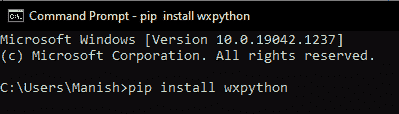
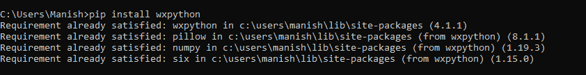
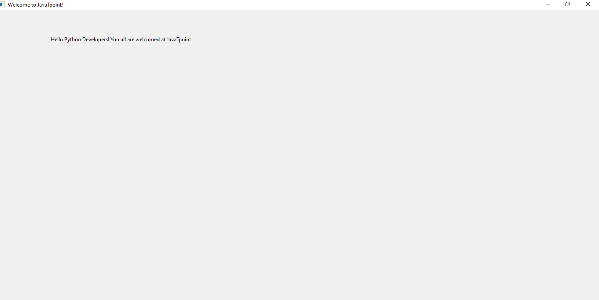
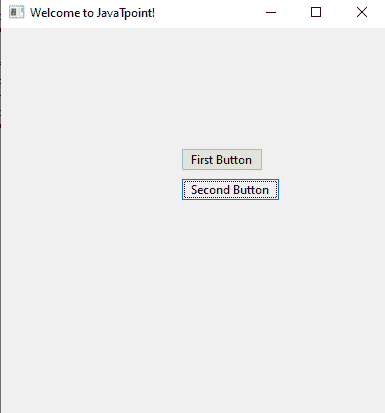
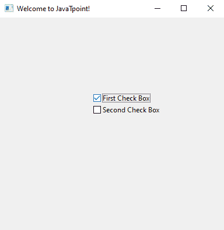
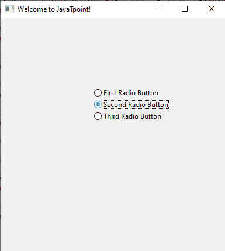

# Python wxPython 模块

> 原文：<https://www.javatpoint.com/python-wxpython-module>

我们都想知道是什么让一个应用与众不同并具有吸引力？如果我们中的任何人在考虑应用的用户界面，是的，我们是对的。应用的用户界面对访问应用的人数产生了巨大的影响。交互式用户界面允许开发人员构建更具吸引力和相关性的应用，这些应用甚至在市场上更加突出。此外，与使用标准用户界面的应用相比，使用交互式用户界面的应用使用户更多地停留在应用上。

现在，我们肯定会想到一个问题:是什么让任何应用的用户界面更具交互性，对用户更具吸引力。因此，很少有重要的一点能让界面对用户更有吸引力和吸引力。以下几点使应用的用户界面对用户更具吸引力:

*   首先，应用的 UI 应该更加动态，并且有高分辨率的图形在里面。
*   应用的用户界面应该与应用的主题相匹配。
*   应用的用户界面也应该为用户提供易用的特性。

我们必须记住上面提到的所有要点，并在为应用创建用户界面时实现它们。

在我们上面提到的一点中，我们谈到了用户界面中的图形，这使得应用的界面更有吸引力。用图形构建的用户界面称为图形用户界面。图形用户界面现在是一个非常受欢迎的话题，因为它已经成为我们周围几乎每个应用的重要组成部分。图形用户界面还提供了图形图标和音频指示器，这使得应用对用户更具吸引力。在本教程中，我们将学习一个 Python 模块，即 wxPython 模块，它为我们提供了为应用创建 GUI 的功能。我们将只介绍 wxPython 模块的介绍部分，并将通过在 Python 程序中使用该模块来创建图形用户界面。

## Python wxPython 模块

### 简介:wxPython 模块

wxPython 模块，顾名思义，是 Python 的一个模块，它可以帮助我们为应用创建功能性很强、交互性很强的 GUI。wxPython 模块是一个开源模块，这意味着它对每个人都是免费可用的，任何人都可以通过修改它来查看和贡献源代码。当我们在 Python 中使用 wxPython 模块时，它被实现为一组扩展模块。这组扩展模块包装了用 C++编写的 wxWidgets 库的 GUI 组件。

wxPython 模块中的 wxWidgets 库就像 Python 中的跨平台 GUI 工具包一样工作，它允许我们使用它的功能来创建高度功能化和交互式的 GUI。带有 Pheonix 版本的 Pheonix 实际上是面向 Python 的 wxPython 模块的下一代升级版本。wxPython 模块的下一代版本主要关注应用的可扩展性、速度和可维护性。

### 安装:wxPython 模块

wxPython 模块没有内置在 Python 中，因此在开始使用它之前，我们必须先安装它。要在我们的系统中安装 wxPython 模块，我们将使用命令提示符下的 pip 安装程序。我们将在设备的命令提示符终端中使用以下 pip 命令在系统中安装 wxPython 模块:

```py

pip install wxPython

```



当我们写完命令后按回车键，pip 安装程序会启动 wxPython 模块的安装过程，过一会儿，它就会成功安装到我们的系统中。



我们可以看到 wxPython 已经成功安装在我们的设备上，现在我们可以开始使用它，并使用它的功能构建 GUI。

### 工作:wxPython 模块

在本节中，我们将通过将 wxPython 模块导入到程序中，借助该模块的功能创建一些基本的图形用户界面。要在 Python 程序中导入 wxPython 模块，我们必须使用以下代码行:

```py

import wx

```

在这里，wx 将从我们的系统中调用 wxPython 模块，这就是我们如何在程序中使用它的功能。现在，我们将看到一些不同的例子，我们将创建一些基本的图形用户界面，如带有按钮的图形用户界面，带有单选按钮的图形用户界面等。

**查看以下示例程序，了解 wxPython 模块的工作方式:**

**示例 1:** 使用 wxPython 模块创建一个标题为“欢迎使用 JavaTpoint”的简单 GUI:

```py

# Importing wxPython module
import wx
# Creating an object for GUI application
appGUI = wx.App()
# Create a frame for application
frmGUI = wx.Frame(None, title ="Welcome to JavaTpoint!")
panelGUI = wx.Panel(frmGUI) # Panel for the frame of the application
# Adding static text inside the frame object of the application
text1 = wx.StaticText(panelGUI, label ="Hello Python Developers! You all are welcomed at JavaTpoint", pos = (120, 60))
# Show the frame object
frmGUI.Show()
# Start Event loop to display application
appGUI.MainLoop()

```

**输出:**



**说明:**

我们首先将 wxPython 模块导入到程序中使用它的功能。然后，我们使用 App()函数为 GUI 应用创建一个对象。之后，我们分别使用 frame()和 panel()函数创建了 GUI 的框架对象和框架对象的面板。在我们创建的框架对象中，我们将图形用户界面应用对象的标题设置为“欢迎来到 JavaTpoint”之后，我们在图形用户界面应用的框架内使用 static text()函数添加了一个静态文本，当在输出中打开图形用户界面应用窗口时，应该显示这个静态文本。在 StaticText()函数内部，我们使用 pos()函数作为参数，它设置静态文本在 GUI 显示中的位置。然后，我们对创建的框架对象使用 show()函数来显示它。最后，我们用 GUI 应用对象启动 MainLoop()函数，以便在执行程序时显示这个 GUI 应用。

我们可以在程序执行时的输出中看到 GUI 应用窗口，里面有静态文本和 title 对象。

**示例 2:** 使用程序中的 wxPython 模块在 GUI 应用中创建按钮:

```py

# Importing wxPython module
import wx
# Creating an object for GUI application
appGUI = wx.App()
# Create a frame for application
frmGUI = wx.Frame(None, title ="Welcome to JavaTpoint!")
panelGUI = wx.Panel(frmGUI) # Panel for frame of application
# Creating two buttons in the application
e = wx.Button(panelGUI, -1, "First Button", pos = (180, 120))
e = wx.Button(panelGUI, -1, "Second Button", pos = (180, 150))
# Show the frame object
frmGUI.Show()
# Start Event loop to display application
appGUI.MainLoop()

```

**输出:**



**说明:**

在创建了图形用户界面应用的框架对象和框架对象的面板之后，我们已经使用 wxPython 模块提供的 Button()函数在我们构建的图形用户界面应用中创建了两个按钮。我们使用 Button()对象中的面板对象作为参数。我们还在按钮()中使用了 pos()函数来设置按钮在图形用户界面应用框架中的位置。之后，我们在输出中显示了图形用户界面应用，我们可以在图形用户界面应用窗口中看到我们创建的按钮。

**示例 3:** 使用程序中的 wxPython 模块在 GUI 应用中创建两个复选框:

```py

# Importing wxPython module
import wx
# Creating an object for GUI application
appGUI = wx.App()
# Create a frame for application
frmGUI = wx.Frame(None, title ="Welcome to JavaTpoint!")
panelGUI = wx.Panel(frmGUI) # Panel for frame of application
# Creating two check boxes inside the frame object of GUI application
e = wx.CheckBox(panelGUI, -1, "First Check Box", pos = (160, 130))
e = wx.CheckBox(panelGUI, -1, "Second Check Box", pos = (160, 150))
# Show the frame object
frmGUI.Show()
# Start Event loop to display application
appGUI.MainLoop()

```

**输出:**



**说明:**

在为框架对象创建图形用户界面应用和面板的框架对象后，我们在框架对象内创建了两个复选框。我们使用 Check Box()函数来创建这两个 CheckBox，并给它们命名为“第一个复选框”和“第二个复选框”我们使用 CheckBox()函数中的位置函数参数来设置复选框在图形用户界面应用框架中的位置。之后，我们在输出中显示了图形用户界面应用，我们可以在图形用户界面应用窗口中看到我们创建的复选框。

**示例 4:** 使用程序中的 wxPython 模块在 GUI 应用中创建单选按钮:

```py

# Importing wxPython module
import wx
# Creating an object for GUI application
appGUI = wx.App()
# Create a frame for application
frmGUI = wx.Frame(None, title ="Welcome to JavaTpoint!")
panelGUI = wx.Panel(frmGUI) # Panel for frame of application
# Creating radio buttons inside the frame object of GUI application
e = wx.RadioButton(panelGUI, -1, "First Radio Button", pos = (160, 120))
e = wx.RadioButton(panelGUI, -1, "Second Radio Button", pos = (160, 140))
e = wx.RadioButton(panelGUI, -1, "Third Radio Button", pos = (160, 160))
# Show the frame object
frmGUI.Show()
# Start Event loop to display application
appGUI.MainLoop()

```

**输出:**



**说明:**

在创建了图形用户界面应用的框架对象和框架对象的面板后，我们在图形用户界面应用的框架内创建了多个单选按钮。我们使用单选按钮()函数来创建这些单选按钮，并将其命名为“第一个单选按钮”、“第二个单选按钮”和“第三个单选按钮”我们使用 RadioButton()函数中的位置函数参数来设置 GUI 应用的框架对象中单选按钮的位置。之后，我们在输出中显示了图形用户界面应用，我们可以在图形用户界面应用窗口中看到我们创建的单选按钮。

* * *