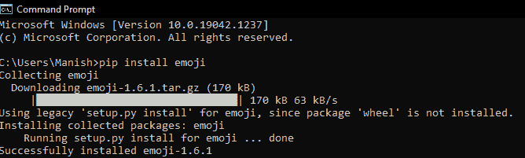

# Python Emoji 模块

> 原文：<https://www.javatpoint.com/python-emoji-module>

在过去的几年里，我们几乎在生活的每个领域和方面都看到了巨大的数字转型。我们可以很容易地观察到，我们现在比以往任何时候都更加依赖技术。我们可以在日常生活的每个部分看到这一点，并在日常生活中观察它。我们生活中可以看到数字转型的巨大影响和技术作用的一部分是通信。技术创造了一座桥梁，或者我们可以说，填补了这个空白，所以现在我们更舒服，发现与任何人交流都更方便。在技术的帮助下，我们可以与来自世界任何地方的任何人交流。

数字化转型后，我们在沟通过程中可以看到的一个重要变化是消息(短信、电子邮件等)的使用。)就增加了这么多。我们现在可以看到，消息已经成为我们生活中的重要组成部分，如果我们必须向某人传达或传递一条信息，或者发布一条重要通知，我们选择的最常见方式是通过消息。它可以是文本消息、特定应用上的消息、电子邮件等。，但有一件事变得非常普遍，那就是在每个消息应用中，甚至在电子邮件中使用表情符号&在短信中也是如此。

**表情符号:**表情符号是非常小的数字图像，用于表达发送者的想法或情感。因此，表情符号非常有助于节省时间，让发件人轻松阐述自己的心情。表情符号对接收者也很有帮助，因为在表情符号的帮助下，他们可以很容易地理解发送者是以什么样的心情发送信息的。

表情符号变得如此重要，以至于它们也被引入到编程语言中，并被开发人员使用了很长时间。我们将在本教程中学习 Python Emoji 模块，我们将学习如何使用该模块通过 Python 程序打印表情。

## Python Emoji 模块

表情符号在 Python 中的使用也变得非常普遍，我们有很多方法可以通过 Python 程序来使用和打印表情符号。我们可以通过 CLDR 名字、Unicode 或使用Emoji 模块来打印表情符号。使用Emoji 模块是所有提到的方式中最常见的，我们将在 Python 程序中使用Emoji 模块来打印表情。但首先，我们将简要了解 Python Emoji 模块及其安装过程。

### Emoji 模块:简介

Emoji 模块是一个 Python 包，允许我们通过 Python 程序使用和打印表情，我们甚至可以使用这个模块在我们使用 Python 创建的应用中使用表情。Python 中的表情库是最常见的，通过它我们可以使用 Python 程序打印表情，我们应该注意到，Emoji 模块不是 Python 中的内置模块。使用Emoji 模块非常简单，我们只需要记住要在输出中打印的表情的名称。

### Emoji 模块:安装

由于Emoji 模块不是 Python 的内置库，因此我们必须首先在系统中安装这个模块，以便在 Python 程序中使用它来打印表情。在我们的设备上安装Emoji 模块有很多方法，但是我们将通过画中画安装程序在我们的系统中安装Emoji 模块。我们将从系统的命令提示符终端使用画中画安装程序，从那里，我们将安装 Python Emoji 模块。

首先我们要在系统中打开命令提示符终端 Shell，然后我们要通过一个 pip 安装程序，使用下面的 pip 命令来安装 Python Emoji Module:

```py

pip install emoji

```

在终端写完上面给出的命令后，我们要按回车键，当我们按回车键时，画中画安装程序将开始在我们的系统中安装Emoji 模块。



我们可以看到，Python Emoji 模块的安装过程现在已经完成，这个模块已经成功安装在我们的系统中。现在，我们可以通过将Emoji 模块导入 Python 程序来使用它的功能，以便在输出中打印表情。

### Emoji 模块:实现

借助Emoji 模块，我们不仅可以在 Python 中实现表情符号，还可以将表情符号转换成它的简称。对于这两个不同的任务，我们在Emoji 模块中有以下两个不同的功能:

1.  emojize()函数
2.  demojize()函数

现在，我们将学习上面给出的这两个函数，并在 Python 程序中使用它们来更好地理解它们的实现和功能。

**表情符号()功能:**

在 Python 程序中使用 emojize()函数时，我们必须将表情符号的 CLDR 短名作为参数传递，然后该函数将 CLDR 短名转换为表情符号。emojize()函数生成的表情符号将打印在程序的输出中。

**示例 1:** 我们将在下面的示例程序中使用带有短 CLDR 名称的表情符号()函数来打印表情符号:

```py

# Import the Emoji Module
import emoji
print("Following are emojis or small digital images of different expressions printed in Python: ")
# Print different type of Emojis 
print("Emoji with grinning faces: ", emoji.emojize(":grinning_face_with_big_eyes:"))
print(emoji.emojize(":grinning_squinting_face:"))
print(emoji.emojize(":grinning_face_with_smiling_eyes:"))
print(emoji.emojize(":grinning_face_with_sweat:"))
print("Emoji with beaming face: ", emoji.emojize(":beaming_face_with_smiling_eyes:"))
# More popular Emojis
print("More Emoji with popular faces: ")
print(emoji.emojize(":grinning_face:"))
print(emoji.emojize(":upside-down_face:"))
print(emoji.emojize(":zany_face:"))
print(emoji.emojize(":shushing_face:"))

```

**输出:**

```py
Following are emojis or small digital images of different expressions printed in Python: 
Emoji with grinning faces:  ?
?
? 
? 
Emoji with beaming face:  ?
More Emoji with popular faces: 
?
?
?
?

```

**说明**:

我们首先将Emoji 模块导入到程序中，这样我们就可以使用Emoji 模块来打印模块。然后，我们在 print 语句中使用了 emojize()模块，并通过在函数中传递表情的 CLDR 短名作为参数，用这个函数打印了多个表情。我们使用了多个表情符号的 CLDR 简称来打印输出中具有不同表情的多个表情符号。

正如我们在输出中看到的，根据我们在 emojize()函数中传递的 CLDR 短名参数，打印了多个具有不同表达式的表情符号。

#### 注意:现在，我们中的许多人想知道如何获得这些表情符号的 CLDR 简称，以便在他们的帮助下用 Python 打印表情符号。如果我们想要表情符号的 CLDR 名字，我们可以参考 Unicode CLDR 名字的官方网站，为了方便起见，我们在这里提供一些著名表情符号的 CLDR 名字。

**以下是一些著名表情符号的 CLDR 简称:**

| 南号码 | CLDR 表情符号的简称 |
| one | 笑容满面的脸和微笑的眼睛 |
| Two | 憔悴的脸 |
| three | 喜极而泣 |
| four | 带光环的笑脸 |
| five | 吹着吻的脸 |
| six | 用微笑的眼睛亲吻脸 |
| seven | 滑稽的脸 |
| eight | 用手捂住嘴 |
| nine | 扬起眉毛的脸 |
| Ten | 傻笑的脸 |
| Eleven | 说谎的脸 |
| Twelve | 流口水的脸 |
| Thirteen | 恶心的脸 |
| Fourteen | 大眼睛的瘦脸 |
| Fifteen | 汗流满面 |
| Sixteen | 颠倒的脸 |
| Seventeen | 三颗心的笑脸 |
| Eighteen | 接吻脸 |
| Nineteen | 品尝食物的脸 |
| Twenty | 用舌头喷脸 |

如果我们想看看这些表情符号是什么样子的，我们可以在 emojize()函数中使用这些 CLDR 短名作为参数，相应的带有那个 CLDR 短名的表情符号将打印在输出中。

**demojize 功能:**

当我们得到一个表情符号，并想找出它的 CLDR 简称时，我们可以使用 demojize 函数来实现。我们必须在 demojize()函数中传递表情符号作为参数，它的 CLDR 短名将打印在输出中，这就是我们如何使用 demojize 函数找到它的短名。

**例 2:**

在 Python 程序的 demojize 函数中，通过使用表情符号作为参数来打印表情符号的 CLDR 简称:

```py

# Import the Emoji Module
import emoji
# Printing CLDR short names of Emojis
print("CLDR short names of various emojis:")
print(emoji.demojize('?'))
print(emoji.demojize('?'))
print(emoji.demojize('?'))
print(emoji.demojize('?'))
print(emoji.demojize('?'))
print(emoji.demojize('?'))
print(emoji.demojize('?'))
print(emoji.demojize('?'))
print(emoji.demojize('?')

```

**输出:**

```py
CLDR short names of various emojis:
:shushing_face:
:zany_face:
:upside-down_face:
:grinning_face:
:beaming_face_with_smiling_eyes:
:grinning_face_with_sweat:
:grinning_face_with_smiling_eyes:
:grinning_squinting_face:
:grinning_face_with_big_eyes:

```

如我们所见，我们在程序的 demojize()函数中使用的表情符号的 CLDR 简称在程序执行后会打印在输出中。

* * *